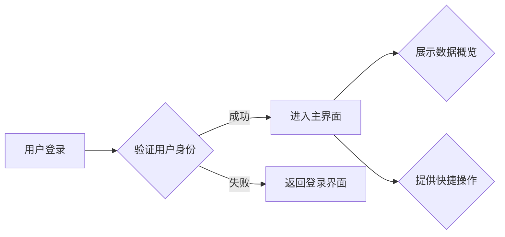

# **应用版本管理中心 - UI 原型框架设计 v.1.0**

## **1. 主界面设计**

#### **功能描述**

系统的主界面为管理后台的入口，展示各模块的快捷访问及关键数据的概览。

#### **界面要素**

1. **顶部导航栏**：
   - 包含系统名称（如“应用更新中心”）、用户信息（用户名、角色）、快捷设置（主题切换、登出按钮）。
2. **侧边菜单栏**：
   - 模块导航：
     - **版本管理**
     - **应用下载页**
     - **灰度发布**
     - **用户反馈**
     - **协议管理**
     - **用户管理**
     - **推送通知**
3. **主面板**：
   - 数据概览卡片：
     - 最新版本号、当前在线人数、更新成功率。
   - 快捷操作：
     - 快速发布新版本。
     - 查看最近的用户反馈。

#### **流程图**



---

## **2. 版本管理模块**

#### **界面设计**

1. **版本列表界面**：
   - 列表字段：
     - 版本号、版本类型（整包/资源包）、发布时间、更新状态。
       - **更新状态**：
         - `已发布`: 版本已成功发布。
         - `灰度中`: 版本正在灰度发布。
         - `已回滚`: 版本已回滚到之前的版本。
   - 操作按钮：
     - 编辑版本 (管理员权限)
     - 查看更新内容 (所有用户)
     - 触发回滚 (管理员权限)
   - **交互细节**：
     - 支持按版本号、发布时间排序。
     - 支持按应用、更新状态筛选。
     - 支持分页显示，每页显示 10 条记录。
   - **无数据状态**：
     - 当没有版本数据时，显示“暂无版本信息”的提示。
   - **加载中状态**：
     - 在加载数据时，显示加载动画。
2. **新增版本界面**：
   - 表单字段：
     - 应用选择（下拉框）
       - **应用选择**：选择需要发布版本的应用。
     - 版本号、版本名称、更新说明。
     - 更新类型（整包/资源包）
     - 上传更新包（文件选择器）
     - 是否启用灰度发布（复选框）。
   - 提交按钮，支持表单验证（如版本号重复检查）。
   - **表单校验**：
     - 版本号：必填，格式为 x.x.x。
     - 版本名称：必填，长度不超过 50 个字符。
     - 更新说明：必填，长度不超过 200 个字符。
   - **错误提示**：
     - 当版本号格式错误时，提示“版本号格式不正确”。
     - 当版本名称为空时，提示“版本名称不能为空”。
     - 当更新说明超过长度限制时，提示“更新说明长度不能超过 200 个字符”。

#### **流程图**

```mermaid
graph LR
    A[进入版本管理模块] --> B{展示版本列表}
    B --> C{新增版本 (管理员权限)}
    B --> D{编辑版本 (管理员权限)}
    B --> E{查看更新内容 (所有用户)}
    B --> F{触发回滚 (管理员权限)}
    C --> G{填写版本信息}
    G --> H{上传更新包}
    H --> I{提交版本}
```

---

## **2.0 项目管理模块**

#### **功能描述**

-   提供项目的新增、编辑、删除功能。
-   支持管理员配置不同用户对项目的访问权限。

#### **UI 设计**

1.  **项目列表页面**

    -   功能：展示已创建的所有项目信息。
    -   栏目字段：
        -   项目名称（`project_name`）
        -   项目描述（`project_description`）
        -   创建时间（`created_at`）
        -   项目状态（`project_status`）：
            *   启用：项目正常运行。
            *   禁用：项目已停止使用。
            *   维护中：项目正在进行维护。
    -   操作按钮：
        -   **查看**：查看项目详细信息。（所有用户）
        -   **编辑**：修改项目内容。（管理员权限）
        -   **删除**：删除项目。（管理员权限）
        -   **权限配置**：配置项目权限。（管理员权限）

2.  **新增/编辑项目页面**

    -   表单字段：
        -   项目名称（`project_name`）：文本框，格式校验，必填。
        -   项目描述（`project_description`）：文本框，可选。
        -   项目负责人（`project_owner`）：下拉框，选择用户，必选。

3.  **权限配置页面**

    -   功能：配置不同用户对项目的访问权限。
    -   列表字段：
        -   用户名（`username`）
        -   角色（`role`）：下拉框，选择角色（管理员/开发者/运营）。
        -   权限（`permissions`）：复选框，选择权限。

#### **流程图**

```mermaid
graph LR
    A[进入项目管理模块] --> B{展示项目列表}
    B --> C{新增项目 (管理员权限)}
    B --> D{编辑项目 (管理员权限)}
    B --> E{删除项目 (管理员权限)}
    B --> F{权限配置 (管理员权限)}
    C --> G{填写项目信息}
    G --> H{提交项目}
```

#### **异常处理**

-   **新增项目失败**：
    *   如果项目名称已存在，系统提示“项目名称已存在”。
    *   如果项目信息填写不完整，系统提示“请填写完整项目信息”。
-   **编辑项目失败**：
    *   如果项目不存在，系统提示“项目不存在”。
    *   如果项目信息填写不完整，系统提示“请填写完整项目信息”。
-   **删除项目失败**：
    *   如果项目不存在，系统提示“项目不存在”。
    *   如果项目下存在版本信息，系统提示“请先删除项目下的版本信息”。
-   **权限配置失败**：
    *   如果用户不存在，系统提示“用户不存在”。
    *   如果权限配置信息不完整，系统提示“请填写完整权限配置信息”。

---

## **3. 应用下载页模块**

#### **功能描述**

允许用户配置下载页的内容和布局，实时预览效果。

#### **界面设计**

1. **下载页模板选择**：
   - 模板列表卡片视图（展示缩略图和模板名称）。
   - 选择模板后进入编辑界面。
2. **内容编辑界面**：
   - 可编辑区域：
     - 应用基本信息（名称、简介）。
     - 下载链接（按钮文字、跳转地址）。
     - 推广内容（支持图片、视频上传）。
   - 实时预览：右侧实时显示页面效果。
3. **发布管理**：
   - 下载页状态（草稿/已发布）。
   - 定时发布选项。

---

## **4. 灰度发布模块**

#### **功能描述**

分组管理用户并逐步发布版本。

#### **界面设计**

1. **分组管理**：
   - 用户分组列表，支持按条件筛选：
     - 地区、设备类型、活跃度等。
   - 分组编辑界面：
     - 添加筛选规则。
     - 预览用户列表。
2. **灰度发布界面**：
   - 灰度范围设置（滑动条选择 10%、20%等）。
   - 实时统计数据：覆盖用户数、成功率、失败率。
   - 发布进度监控：显示实时进展。

---

## **5. 用户反馈模块**

#### **功能描述**

展示用户提交的 Bug 报告、功能建议及评分。

#### **界面设计**

1. **反馈列表**：
   - 字段：用户 ID、反馈类型、反馈内容、提交时间、状态（处理中/已解决）。
   - 操作按钮：
     - 查看详情
     - 更改状态
2. **反馈详情界面**：
   - 展示反馈全文、用户评分、相关截图。
   - 回复功能（供管理员与用户沟通）。

---

## **6. 协议管理模块**

#### **功能描述**

管理隐私协议、服务条款等内容。

#### **界面设计**

1. **协议列表**：
   - 字段：协议类型、版本号、更新时间。
   - 操作按钮：
     - 编辑协议内容。
     - 查看历史版本。
2. **协议编辑界面**：
   - 在线文本编辑器，支持富文本功能。
   - 协议预览与保存。

---

## **7. 用户管理模块**

#### **功能描述**

支持多角色、多权限管理。

#### **界面设计**

1. **用户列表**：
   - 字段：用户名、角色、所属项目、状态。
   - 操作按钮：
     - 编辑用户
     - 禁用/启用用户
2. **角色与权限配置界面**：
   - 可选角色：管理员、开发者、运营。
   - 功能权限树，支持勾选配置。

---

## **8. 推送通知模块**

#### **功能描述**

向用户发送更新提示或运营消息。

#### **界面设计**

1. **推送消息创建界面**：
   - 表单字段：
     - 推送标题、内容、消息类型（更新提示/运营活动）。
     - 推送范围（全量用户/分组用户）。
   - 实时预览推送效果。
2. **推送列表界面**：
   - 字段：消息标题、发送时间、状态（已发送/待发送）。
   - 操作按钮：
     - 重新发送
     - 查看接收统计。

---

## **交互流程说明**

1. **版本更新流程**：
   - 管理员在后台发布新版本。
   - 客户端检测更新，触发更新逻辑（整包或资源包）。
   - 更新完成后反馈状态至服务端。

   **异常处理**：
     - 如果更新失败，客户端显示错误信息，并提供重试选项。
     - 如果更新过程中出现网络错误，客户端支持断点续传。
   - **权限控制**：
     - 只有管理员才能发布新版本。

2. **灰度发布流程**：
   - 管理员配置用户分组和发布范围。
   - 服务端实时监控发布状态，调整发布范围。

   **异常处理**：
     - 如果灰度发布过程中出现大量崩溃，管理员可以暂停发布或回滚版本。
   - **权限控制**：
     - 只有管理员才能配置灰度发布策略。

3. **用户反馈处理流程**：
   - 用户提交反馈，服务端存储并展示给管理员。
   - 管理员处理反馈后，更新状态。

   **异常处理**：
     - 如果用户提交的反馈信息不完整，客户端提示用户补充信息。
   - **权限控制**：
     - 所有用户都可以提交反馈。
     - 只有管理员才能处理反馈。

---

## **下一步工作**

1. 将以上框架交付给设计团队，生成高保真 UI 设计稿。
2. 确认设计稿后，与开发团队对接，完成开发任务分解。
3. 针对原型进行用户测试，收集反馈并优化。
