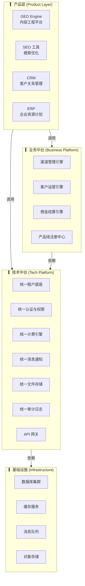
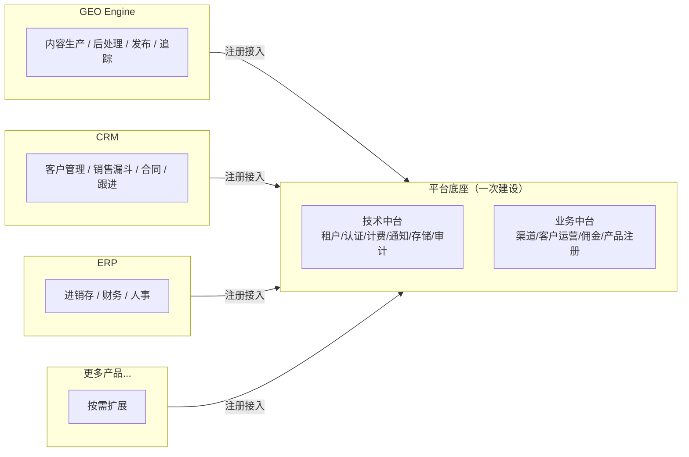
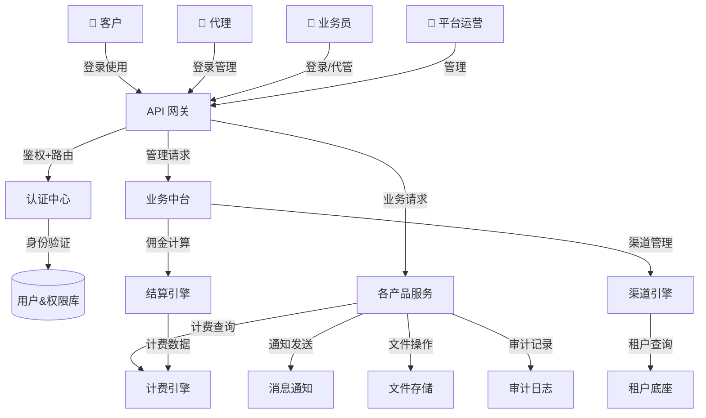
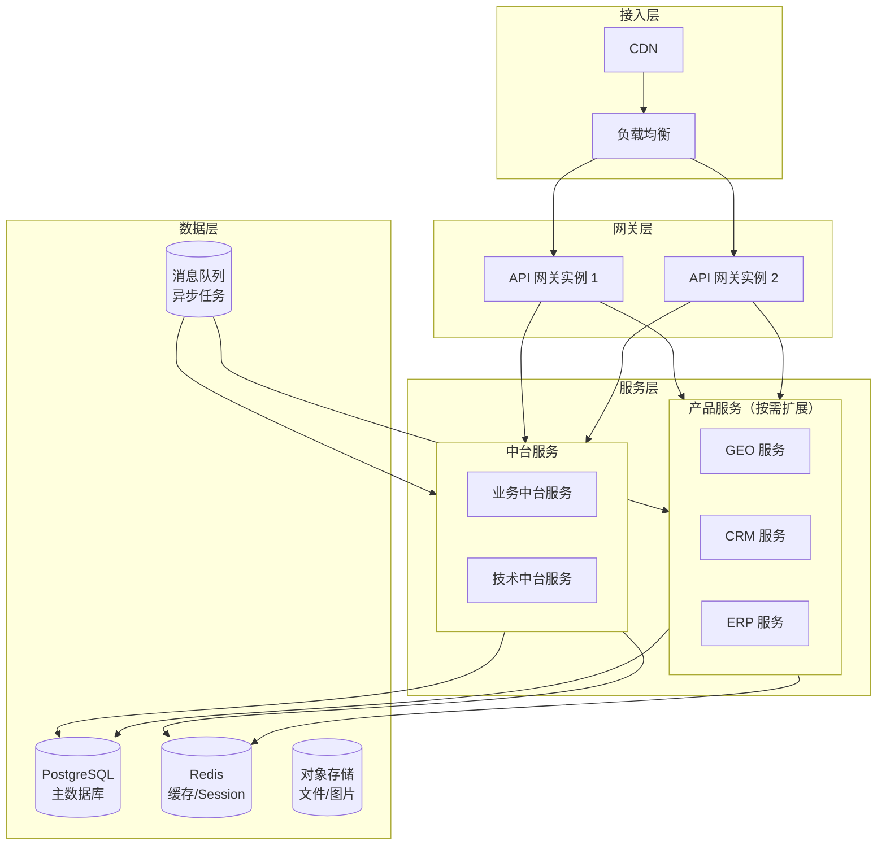

# 01 · 系统架构总览

> Ark Engine（方舟引擎）平台底座的整体架构设计。平台孵化和承载多个产品线，提供统一的技术中台和业务中台能力。

---

## 一、四层架构全景

---

## 二、平台与产品的关系

**核心原则**：新产品上线时，只需在平台注册产品线信息，复用中台全部能力。业务功能从零开发。

---

## 三、模块全景地图

> 技术中台共 14 个模块，分 4 个阶段交付。P0（MVP）9 模块 → P1（完整中台）11 模块 → P2（规模化）14 模块。详见 [02 · 技术中台设计](./02-tech-platform-design.md)。

| 层级 | 模块 | 阶段 | 核心职责 | 服务对象 |
|------|------|:---:|---------|---------|
| **产品层** | GEO / SEO / CRM / ERP | — | 各自领域的业务功能 | 最终客户 |
| **业务中台** | 渠道管理引擎 | P0 | 代理生命周期、业务员管理、产品授权 | 平台运营 |
| | 客户运营引擎 | P0 | 开通审核、代客管理、客户健康度 | 代理/业务员 |
| | 佣金结算引擎 | P0 | 多产品分佣计算、结算单生成 | 平台财务/代理 |
| | 产品线注册中心 | P0 | 产品线接入、菜单注册、定价注册 | 产品开发团队 |
| **技术中台** | 统一租户底座 | 🟢 P0 | 多租户+多产品线叠加、数据隔离、生命周期 | 所有产品 |
| | 统一认证与权限 | 🟢 P0 | SSO/RBAC/ABAC、跨租户身份切换、MFA | 所有用户 |
| | 统一计费引擎 | 🟢 P0 | 订阅支付、配额管理、优惠引擎、账单发票 | 所有产品 |
| | 统一消息通知 | 🟢 P0 | 模板管理、偏好中心、多渠道分发、聚合摘要 | 所有模块 |
| | 统一文件存储 | 🟢 P0 | 上传下载/CDN、图片处理、安全扫描 | 所有产品 |
| | 统一审计日志 | 🟢 P0 | 操作记录、异常检测、合规报表、变更对比 | 平台运营/合规 |
| | API 网关 | 🟢 P0 | 统一入口、鉴权限流、路由、熔断降级 | 所有请求 |
| | **统一配置中心** 🆕 | 🟢 P0 | Feature Flags、动态配置、灰度发布 | 所有产品 |
| | **统一审批引擎** 🆕 | 🔵 P1 | 多级审批流、超时策略、审批代理 | 所有产品 |
| | **统一任务调度** 🆕 | 🔵 P1 | 定时/延迟任务、异步编排、重试机制 | 所有产品 |
| | **统一搜索服务** 🆕 | 🟠 P2 | 全文检索、租户隔离、中文分词 | 所有产品 |
| | **统一国际化引擎** 🆕 | 🟠 P2 | 多语言资源、时区/货币格式化 | 所有产品 |
| | **统一可观测性** 🆕 | 🟠 P2 | 链路追踪、集中日志、告警规则 | 平台运维 |
| | **统一开发者平台** 🆕 | 🟠 P2 | SDK 生成、API 文档门户、沙箱环境 | 产品开发团队 |

---

## 四、核心数据流转全景

---

## 五、部署拓扑

**初期可单机部署**，后期按服务拆分。产品服务独立部署，互不影响。

---

## 六、架构决策记录

| 决策 | 内容 | 理由 |
|------|------|------|
| **ADR-001** | 中台与产品层物理分离 | 产品间不直接访问对方数据库，通过 API 通信 |
| **ADR-002** | 统一租户底座 | 一个客户一个租户，可开通多个产品线。不按产品线分拆租户 |
| **ADR-003** | 计费引擎与产品解耦 | 各产品注册配额维度，引擎做通用计算。不硬编码产品特有逻辑 |
| **ADR-004** | 产品线注册制 | 新产品上线走注册中心，不改中台代码 |
| **ADR-005** | 代客管理用身份模拟 | 业务员以目标租户上下文操作，数据归属客户租户 |
| **ADR-006** | 初期单机部署，后期拆分 | 不用微服务起步，保持架构可拆分能力 |

---

## 七、核心设计约束

| 约束 | 说明 |
|------|------|
| **产品间数据隔离** | 产品 A 不能直接访问产品 B 的数据库表。跨产品数据交换走 API |
| **中台不包含业务逻辑** | 中台只提供通用能力，不包含任何产品特有的业务规则 |
| **租户数据强隔离** | 不同租户的数据在应用层和数据库层双重隔离 |
| **审计全覆盖** | 所有数据变更操作必须记录审计日志（谁、何时、做了什么、结果） |
| **向后兼容** | 中台 API 变更必须版本化，旧版本保留至少一个大版本周期 |
