# 02 · 技术中台详细设计

> 所有产品线共用的技术底座。一次建设，多次复用。
> 技术中台不包含任何业务逻辑，只提供通用技术能力。
>
> **设计范围**：14 个模块，分 4 个阶段交付。P0（MVP）9 模块 → P1（完整中台）11 模块 → P2（规模化）14 模块 → P3（按需扩展）。

---

## 一、模块全景（14 模块）

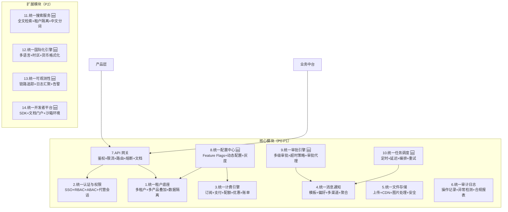
```mermaid
graph TB
    subgraph 核心中台["核心模块（P0-P1）"]
        direction TB
        TENANT["1.统一租户底座<br/>多租户+多产品叠加+数据隔离"]
        AUTH["2.统一认证与权限<br/>SSO+RBAC+ABAC+代管会话"]
        BILLING["3.统一计费引擎<br/>订阅+支付+配额+优惠+账单"]
        NOTIFY["4.统一消息通知<br/>模板+偏好+多渠道+聚合"]
        STORAGE["5.统一文件存储<br/>上传+CDN+图片处理+安全"]
        AUDIT["6.统一审计日志<br/>操作记录+异常检测+合规报表"]
        GATEWAY["7.API 网关<br/>鉴权+限流+路由+熔断+文档"]
        CONFIG["8.统一配置中心 🆕<br/>Feature Flags+动态配置+灰度"]
        APPROVAL["9.统一审批引擎 🆕<br/>多级审批+超时策略+审批代理"]
        SCHEDULER["10.统一任务调度 🆕<br/>定时+延迟+编排+重试"]
    end

    subgraph 扩展模块["扩展模块（P2）"]
        SEARCH["11.统一搜索服务 🆕<br/>全文检索+租户隔离+中文分词"]
        I18N["12.统一国际化引擎 🆕<br/>多语言+时区+货币格式化"]
        OBSERVABILITY["13.统一可观测性 🆕<br/>链路追踪+日志汇聚+告警"]
        DEV_PORTAL["14.统一开发者平台 🆕<br/>SDK+文档门户+沙箱环境"]
    end

    GATEWAY --> AUTH
    GATEWAY --> TENANT
    CONFIG --> TENANT
    CONFIG --> BILLING
    APPROVAL --> NOTIFY
    SCHEDULER --> NOTIFY
    产品层 --> GATEWAY
    业务中台 --> GATEWAY
```

### 模块与交付阶段

| # | 模块 | 阶段 | 当前设计深度 | 核心职责 |
|:---:|------|:---:|:---:|---------|
| 1 | 统一租户底座 | 🟢 P0 | 详细 | 多租户+多产品叠加、数据隔离、生命周期 |
| 2 | 统一认证与权限 | 🟢 P0 | 详细 | SSO/OAuth、RBAC+ABAC、代管会话、MFA |
| 3 | 统一计费引擎 | 🟢 P0 | 详细 | 订阅支付、配额管理、优惠引擎、账单发票 |
| 4 | 统一消息通知 | 🟢 P0 | 详细 | 模板管理、偏好中心、多渠道、聚合摘要 |
| 5 | 统一文件存储 | 🟢 P0 | 详细 | 上传下载、CDN、图片处理、安全扫描 |
| 6 | 统一审计日志 | 🟢 P0 | 详细 | 操作记录、异常检测、合规报表 |
| 7 | API 网关 | 🟢 P0 | 详细 | 鉴权限流、路由转发、熔断降级、文档 |
| 8 | 统一配置中心 | 🟢 P0 | 新增 | Feature Flags、动态配置、灰度发布 |
| 9 | 统一审批引擎 | 🔵 P1 | 新增 | 多级审批流、超时策略、审批代理 |
| 10 | 统一任务调度 | 🔵 P1 | 新增 | 定时/延迟任务、异步编排、重试机制 |
| 11 | 统一搜索服务 | 🟠 P2 | 新增 | 全文检索、租户隔离、中文分词 |
| 12 | 统一国际化引擎 | 🟠 P2 | 新增 | 多语言资源、时区货币、翻译管理 |
| 13 | 统一可观测性 | 🟠 P2 | 新增 | 链路追踪、集中日志、告警规则 |
| 14 | 统一开发者平台 | 🟠 P2 | 新增 | SDK 生成、API 文档门户、沙箱环境 |

---

## 二、分阶段交付计划

### 2.1 阶段定义

```
P0 · MVP      必须要有，否则多产品线平台跑不起来
P1 · 完整中台   有了才算真正的中台，显著降低产品接入成本
P2 · 规模化     支撑 50+ 租户、5+ 产品线时的必要能力
P3 · 按需      等有明确客户需求或业务场景时启动
```

### 2.2 P0 · MVP（9 模块，预计 3-4 个月）

| 模块 | P0 交付范围 | 暂缓到 P1+ |
|------|-----------|-----------|
| 租户底座 | 租户 CRUD、生命周期状态机、多产品线开通/关闭、RLS 数据隔离 | 白标个性化、组织架构、数据迁移 |
| 认证权限 | 手机号+密码登录、RBAC、代管会话、**SSO（企业微信/飞书/钉钉）** | MFA、ABAC 细粒度权限、API Key 管理 |
| 计费引擎 | 订阅管理、配额计量（soft/hard）、**微信/支付宝支付**、账单生成、续费管理 | 灵活定价模型、优惠引擎、发票、退款 |
| 消息通知 | 短信+邮件+站内信+Webhook、**模板管理**、**用户偏好中心** | 聚合摘要、移动推送、送达追踪 |
| 文件存储 | 上传下载、CDN、租户隔离、**图片处理管道（缩略图/格式转换）** | 安全扫描、分片上传、版本管理 |
| 审计日志 | 全量操作记录、基础查询、热/温/冷分层存储 | 异常检测、合规报表、变更对比 |
| API 网关 | 鉴权、限流、路由、租户上下文注入 | 熔断降级、自动文档、请求转换 |
| **配置中心** 🆕 | 集中 KV 配置、Feature Flags 开关、配置优先级继承 | 灰度按比例发布、配置版本回滚 |
| **审批引擎** 🆕 | —（P0 暂不包含，审批走业务代码硬编码） | P1 实现 |
| **任务调度** 🆕 | —（P0 暂用 BullMQ 简单队列） | P1 实现 |

> **P0 核心原则**：让 GEO 产品能跑通完整商业闭环（客户开通→付费→使用→续费），CRM/ERP 能接入。不强求通用化，可接受部分硬编码。

### 2.3 P1 · 完整中台（11 模块，预计 2-3 个月）

| 新增/增强 | 内容 |
|----------|------|
| **审批引擎** 🆕 | 审批流定义、多级串行/并行、超时自动处理、审批代理、审批历史 |
| **任务调度** 🆕 | Cron 定时任务、延迟任务、异步编排（DAG）、失败重试+死信队列、任务监控 |
| 计费增强 | 灵活定价（阶梯/用量/混合）、优惠券/折扣码、Proration 按比例计费、发票管理 |
| 认证增强 | MFA 多因素认证、API Key 管理、ABAC 数据级权限 |
| 租户增强 | 白标（自定义域名/Logo/主题色）、组织架构（部门/团队）、租户健康度评分 |
| 通知增强 | 通知聚合摘要（每日/每周）、App Push 移动推送、送达/已读追踪 |
| 文件增强 | 上传安全扫描、大文件分片续传、文件版本管理 |
| 审计增强 | 异常行为检测告警、合规报告自动生成、数据变更 Diff 视图 |

> **P1 核心原则**：中台能力从"够用"到"好用"。新产品接入只需注册+调用 API，不需要业务代码硬编码审批/调度逻辑。

### 2.4 P2 · 规模化（14 模块，预计 2-3 个月）

| 新增 | 内容 |
|------|------|
| **搜索服务** 🆕 | Elasticsearch 托管、中文分词、租户级索引隔离、搜索分析 |
| **国际化引擎** 🆕 | 多语言资源管理、租户级翻译覆盖、时区/货币/数字自动格式化 |
| **可观测性** 🆕 | OpenTelemetry 分布式追踪、集中日志（Loki/ELK）、Grafana 仪表盘、告警规则引擎 |
| **开发者平台** 🆕 | OpenAPI → 多语言 SDK 自动生成、在线调试 API 文档、沙箱环境 |

> **P2 核心原则**：租户和产品线数量上来后，没有这些能力运营成本会线性增长。此时投入换取运营效率。

### 2.5 P3 · 按需扩展

| 能力 | 触发条件 |
|------|---------|
| 租户数据迁移（试用→正式、合并、导出） | 企业客户有明确需求 |
| 跨租户协作（如代理-客户共享看板） | 业务场景需要 |
| 计费模拟器（客户选购前估价） | 产品线 ≥ 3、套餐复杂度高 |
| 自定义报表引擎 | 客户对数据分析有个性化需求 |
| SCIM 用户目录同步 | 企业客户有统一身份管理需求 |

---

## 三、统一租户底座

### 3.1 租户模型（🟢 P0）

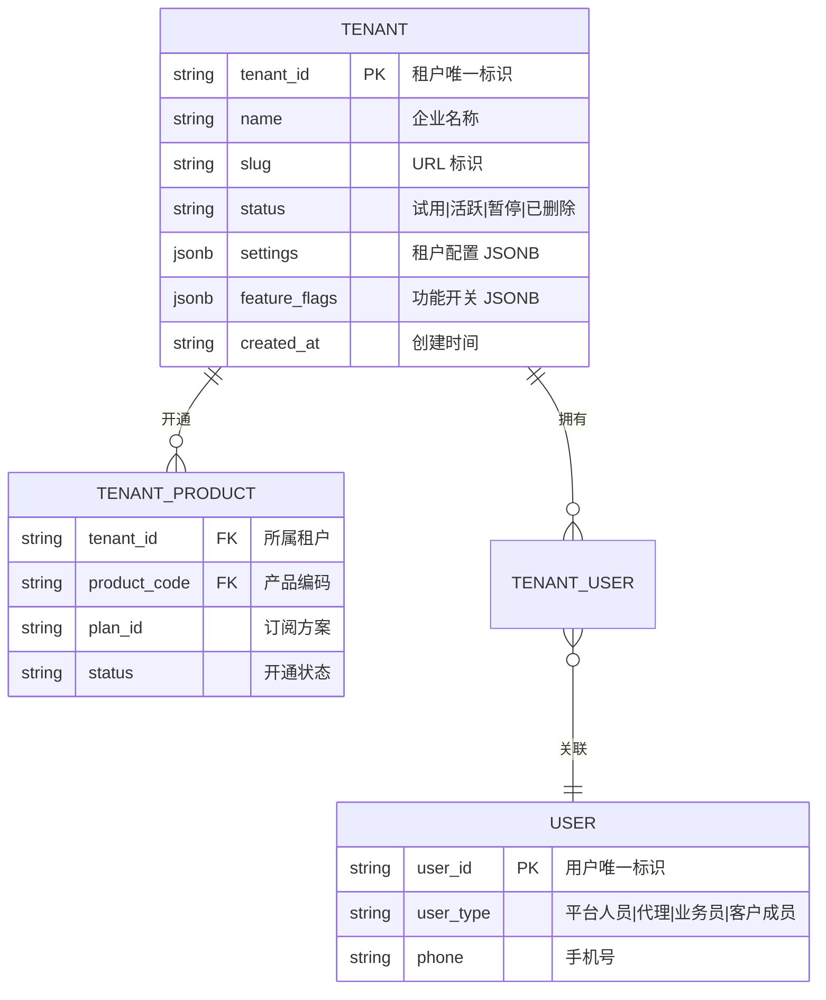
```mermaid
erDiagram
    TENANT ||--o{ TENANT_PRODUCT : "开通"
    TENANT ||--o{ TENANT_USER : "拥有"
    TENANT_USER }o--|| USER : "关联"

    TENANT {
        string tenant_id PK "租户唯一标识"
        string name "企业名称"
        string slug "URL 标识"
        string status "试用|活跃|暂停|已删除"
        jsonb settings "租户配置 JSONB"
        jsonb feature_flags "功能开关 JSONB"
        string created_at "创建时间"
    }

    TENANT_PRODUCT {
        string tenant_id FK "所属租户"
        string product_code FK "产品编码"
        string plan_id "订阅方案"
        string status "开通状态"
    }

    USER {
        string user_id PK "用户唯一标识"
        string user_type "平台人员|代理|业务员|客户成员"
        string phone "手机号"
    }
```

**核心规则**：
- 一个租户可以开通多个产品线（如同时开通 GEO + CRM）
- 产品线之间数据在租户内隔离——GEO 的文章和 CRM 的客户数据互不可见
- 租户状态变更（暂停/删除）影响其下所有产品线

### 3.2 租户生命周期（🟢 P0）

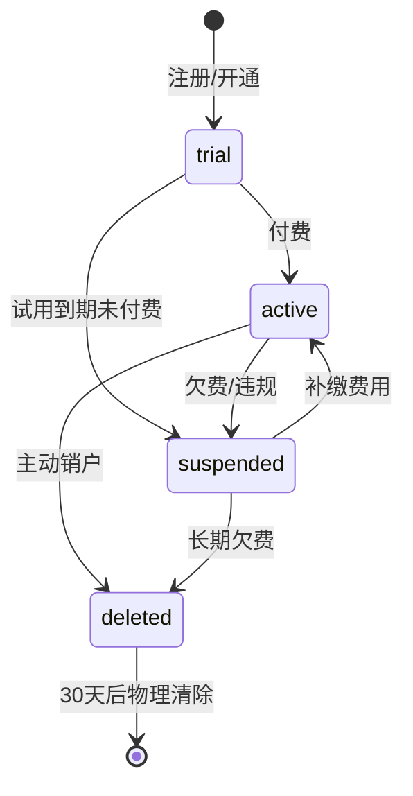
```mermaid
stateDiagram-v2
    [*] --> trial: 注册/开通
    trial --> active: 付费
    trial --> suspended: 试用到期未付费
    active --> suspended: 欠费/违规
    suspended --> active: 补缴费用
    active --> deleted: 主动销户
    suspended --> deleted: 长期欠费
    deleted --> [*]: 30天后物理清除
```

### 3.3 多产品线叠加（🟢 P0）

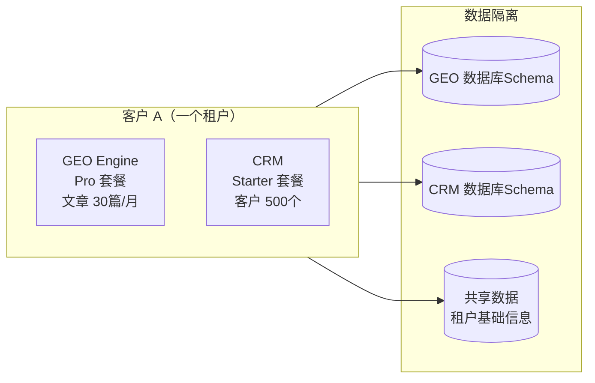
```mermaid
flowchart LR
    subgraph 客户A["客户 A（一个租户）"]
        direction TB
        GEO_A["GEO Engine<br/>Pro 套餐<br/>文章 30篇/月"]
        CRM_A["CRM<br/>Starter 套餐<br/>客户 500个"]
    end

    subgraph 隔离["数据隔离"]
        GEO_DB[("GEO 数据库Schema")]
        CRM_DB[("CRM 数据库Schema")]
        SHARED[("共享数据<br/>租户基础信息")]
    end

    客户A --> GEO_DB
    客户A --> CRM_DB
    客户A --> SHARED
```

### 🗓 增强规划

| 能力 | 阶段 | 说明 |
|------|:---:|------|
| 租户白标（自定义域名/Logo/主题色） | 🔵 P1 | 企业客户强需求，需配合前端主题系统 |
| 租户组织架构（部门/团队树） | 🔵 P1 | 中大型客户需要按部门隔离数据和权限 |
| 租户健康度评分（活跃度+用量+续费预测） | 🔵 P1 | 为客户运营引擎提供数据输入 |
| 租户配置版本管理（变更历史+回滚） | 🔵 P1 | 配置中心模块统一实现 |
| 租户数据迁移（试用→正式、合并、导出） | ⚪ P3 | 有明确企业客户需求时启动 |
| 租户初始化行业模板 | ⚪ P3 | 餐饮/制造/零售等预设配置 |

---

## 四、统一认证与权限

### 4.1 认证流程（🟢 P0）

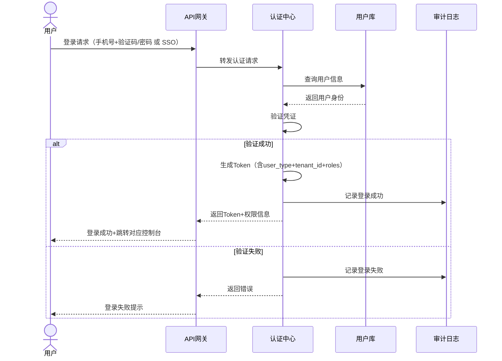
```mermaid
sequenceDiagram
    actor User as 用户
    participant GW as API网关
    participant Auth as 认证中心
    participant DB as 用户库
    participant Audit as 审计日志

    User->>GW: 登录请求（手机号+验证码/密码 或 SSO）
    GW->>Auth: 转发认证请求
    Auth->>DB: 查询用户信息
    DB-->>Auth: 返回用户身份
    Auth->>Auth: 验证凭证
    alt 验证成功
        Auth->>Auth: 生成Token（含user_type+tenant_id+roles）
        Auth->>Audit: 记录登录成功
        Auth-->>GW: 返回Token+权限信息
        GW-->>User: 登录成功+跳转对应控制台
    else 验证失败
        Auth->>Audit: 记录登录失败
        Auth-->>GW: 返回错误
        GW-->>User: 登录失败提示
    end
```

### 4.2 跨租户身份切换 / 代客管理（🟢 P0）

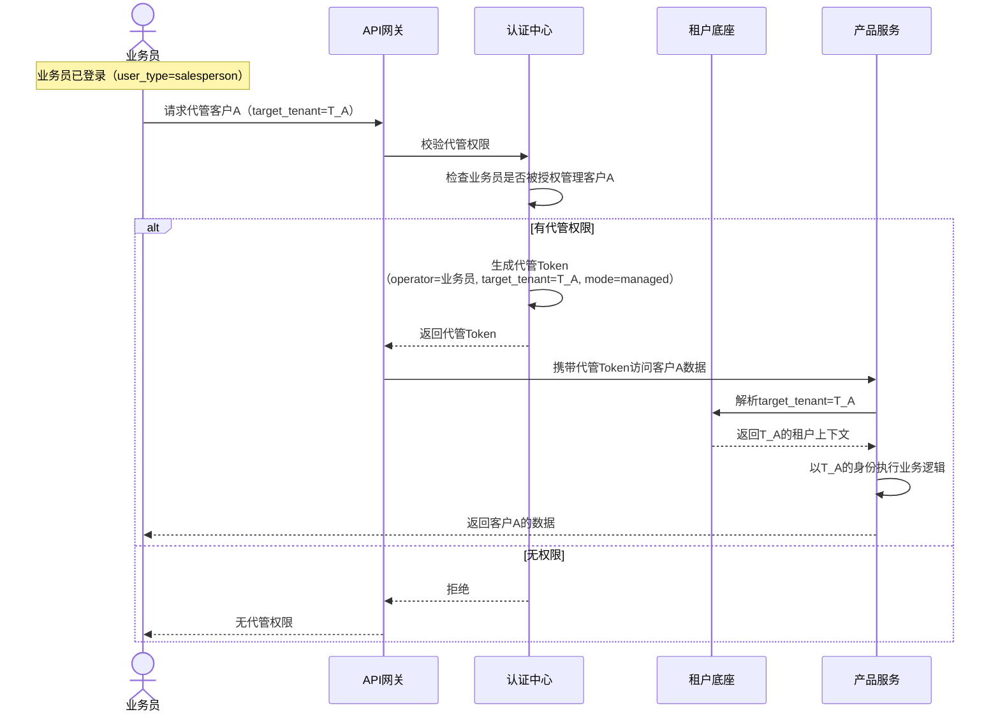
```mermaid
sequenceDiagram
    actor Sales as 业务员
    participant GW as API网关
    participant Auth as 认证中心
    participant Tenant as 租户底座
    participant Product as 产品服务

    Note over Sales: 业务员已登录（user_type=salesperson）

    Sales->>GW: 请求代管客户A（target_tenant=T_A）
    GW->>Auth: 校验代管权限
    Auth->>Auth: 检查业务员是否被授权管理客户A
    alt 有代管权限
        Auth->>Auth: 生成代管Token<br/>（operator=业务员, target_tenant=T_A, mode=managed）
        Auth-->>GW: 返回代管Token
        GW->>Product: 携带代管Token访问客户A数据
        Product->>Tenant: 解析target_tenant=T_A
        Tenant-->>Product: 返回T_A的租户上下文
        Product->>Product: 以T_A的身份执行业务逻辑
        Product-->>Sales: 返回客户A的数据
    else 无权限
        Auth-->>GW: 拒绝
        GW-->>Sales: 无代管权限
    end
```

### 4.3 权限模型 RBAC + ABAC（🟢 P0 RBAC / 🔵 P1 ABAC）

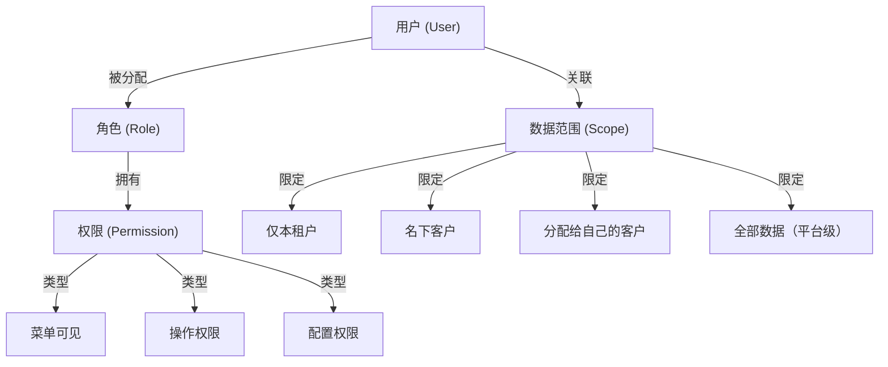
```mermaid
graph TB
    ROLE["角色 (Role)"] -->|"拥有"| PERM["权限 (Permission)"]
    USER["用户 (User)"] -->|"被分配"| ROLE
    USER -->|"关联"| SCOPE["数据范围 (Scope)"]

    PERM -->|"类型"| MENU["菜单可见"]
    PERM -->|"类型"| ACTION["操作权限"]
    PERM -->|"类型"| CONFIG["配置权限"]

    SCOPE -->|"限定"| TENANT_SCOPE["仅本租户"]
    SCOPE -->|"限定"| AGENT_SCOPE["名下客户"]
    SCOPE -->|"限定"| MY_CUSTOMER["分配给自己的客户"]
    SCOPE -->|"限定"| ALL["全部数据（平台级）"]
```

### 🗓 增强规划

| 能力 | 阶段 | 说明 |
|------|:---:|------|
| SSO 企业登录（企业微信/飞书/钉钉/OIDC） | 🟢 P0 | B2B SaaS 标配，客户用已有企业账号登录 |
| 登录安全策略（失败锁定、IP 白名单、异地告警） | 🟢 P0 | 生产环境安全基线 |
| MFA 多因素认证（TOTP + 短信） | 🔵 P1 | Owner/Admin 角色强制开启 |
| API Key / Access Token 管理 | 🔵 P1 | 产品服务间 M2M 调用、开放 API 给客户 |
| ABAC 细粒度数据权限 | 🔵 P1 | 如"业务员只能看自己名下客户"的属性级过滤 |
| Session 管理（在线列表、强制下线、设备管理） | 🔵 P1 | 安全运维和用户自助需求 |
| 隐私协议/同意管理 | 🔵 P1 | 合规需要，版本变更时可要求重新确认 |

---

## 五、统一计费引擎

### 5.1 计费模型（🟢 P0）

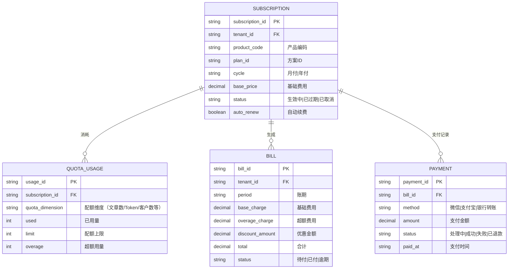
```mermaid
erDiagram
    SUBSCRIPTION ||--o{ QUOTA_USAGE : "消耗"
    SUBSCRIPTION ||--o{ BILL : "生成"
    SUBSCRIPTION ||--o{ PAYMENT : "支付记录"
    SUBSCRIPTION {
        string subscription_id PK
        string tenant_id FK
        string product_code "产品编码"
        string plan_id "方案ID"
        string cycle "月付|年付"
        decimal base_price "基础费用"
        string status "生效中|已过期|已取消"
        boolean auto_renew "自动续费"
    }

    QUOTA_USAGE {
        string usage_id PK
        string subscription_id FK
        string quota_dimension "配额维度（文章数/Token/客户数等）"
        int used "已用量"
        int limit "配额上限"
        int overage "超额用量"
    }

    BILL {
        string bill_id PK
        string tenant_id FK
        string period "账期"
        decimal base_charge "基础费用"
        decimal overage_charge "超额费用"
        decimal discount_amount "优惠金额"
        decimal total "合计"
        string status "待付|已付|逾期"
    }

    PAYMENT {
        string payment_id PK
        string bill_id FK
        string method "微信|支付宝|银行转账"
        decimal amount "支付金额"
        string status "处理中|成功|失败|已退款"
        string paid_at "支付时间"
    }
```

### 5.2 计费流程（🟢 P0）

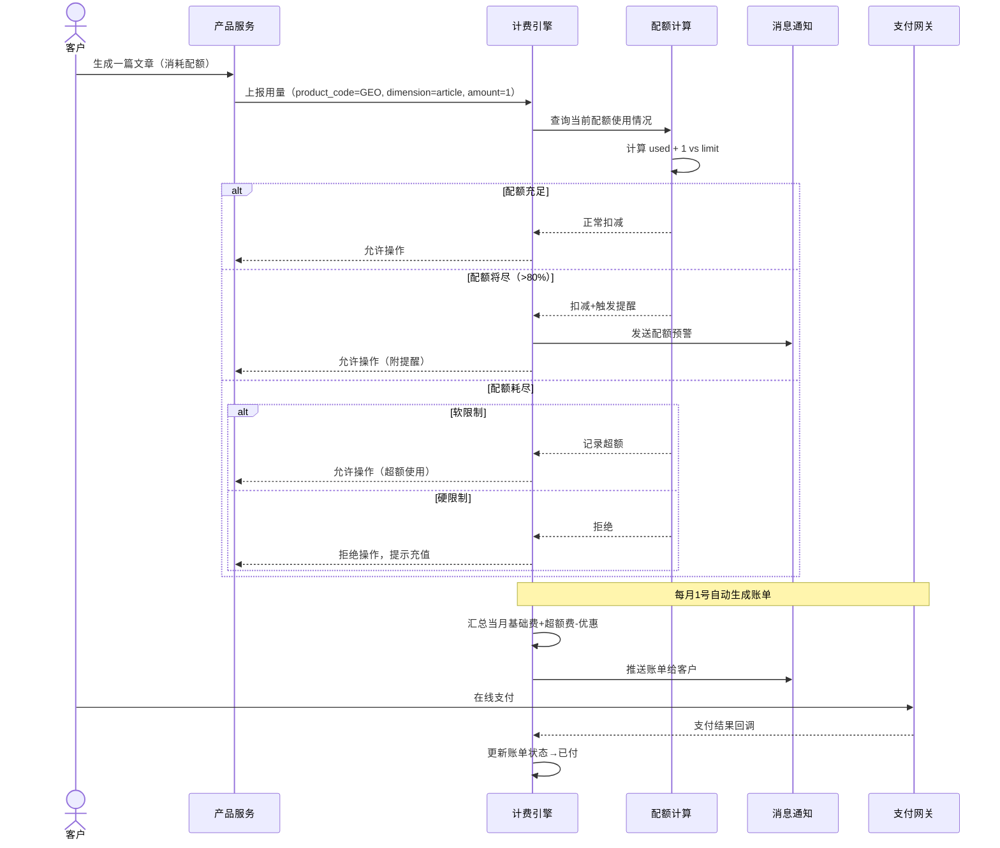
```mermaid
sequenceDiagram
    actor Customer as 客户
    participant Product as 产品服务
    participant Billing as 计费引擎
    participant Quota as 配额计算
    participant Notify as 消息通知
    participant Payment as 支付网关

    Customer->>Product: 生成一篇文章（消耗配额）
    Product->>Billing: 上报用量（product_code=GEO, dimension=article, amount=1）
    Billing->>Quota: 查询当前配额使用情况
    Quota->>Quota: 计算 used + 1 vs limit
    alt 配额充足
        Quota-->>Billing: 正常扣减
        Billing-->>Product: 允许操作
    else 配额将尽（>80%）
        Quota-->>Billing: 扣减+触发提醒
        Billing->>Notify: 发送配额预警
        Billing-->>Product: 允许操作（附提醒）
    else 配额耗尽
        alt 软限制
            Quota-->>Billing: 记录超额
            Billing-->>Product: 允许操作（超额使用）
        else 硬限制
            Quota-->>Billing: 拒绝
            Billing-->>Product: 拒绝操作，提示充值
        end
    end

    Note over Billing,Payment: 每月1号自动生成账单
    Billing->>Billing: 汇总当月基础费+超额费-优惠
    Billing->>Notify: 推送账单给客户
    Customer->>Payment: 在线支付
    Payment-->>Billing: 支付结果回调
    Billing->>Billing: 更新账单状态→已付
```

### 5.3 多产品线独立计费（🟢 P0）

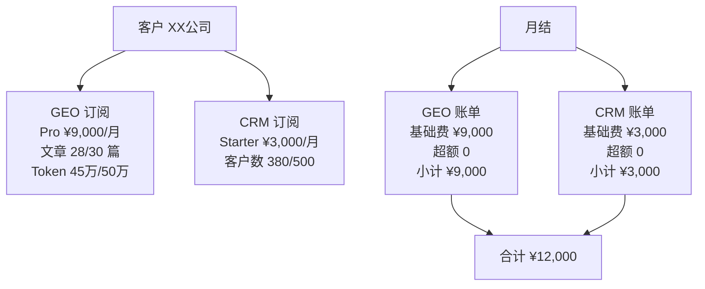
```mermaid
flowchart TB
    CUSTOMER["客户 XX公司"] --> GEO_SUB["GEO 订阅<br/>Pro ¥9,000/月<br/>文章 28/30 篇<br/>Token 45万/50万"]
    CUSTOMER --> CRM_SUB["CRM 订阅<br/>Starter ¥3,000/月<br/>客户数 380/500"]

    月结 --> GEO_BILL["GEO 账单<br/>基础费 ¥9,000<br/>超额 0<br/>小计 ¥9,000"]
    月结 --> CRM_BILL["CRM 账单<br/>基础费 ¥3,000<br/>超额 0<br/>小计 ¥3,000"]

    GEO_BILL --> TOTAL["合计 ¥12,000"]
    CRM_BILL --> TOTAL
```

### 🗓 增强规划

| 能力 | 阶段 | 说明 |
|------|:---:|------|
| **支付网关集成**（微信/支付宝） | 🟢 P0 | 在线支付是商业闭环必需的 |
| 续费管理（自动续费开关、扣款失败重试、到期宽限期） | 🟢 P0 | 减少被动流失 |
| 灵活定价模型（阶梯定价、用量计费、混合计费、一次性费用） | 🔵 P1 | 不同产品不同定价策略 |
| Proration 按比例计费（月中升级/降级） | 🔵 P1 | 套餐变更不坑客户 |
| **优惠引擎**（优惠券、折扣码、满减、新客首月） | 🔵 P1 | 渠道推广的核心工具 |
| 发票管理（电子发票开具、历史查询） | 🔵 P1 | 企业客户刚需 |
| 预充值/钱包余额 | 🔵 P1 | Token 类消耗型产品需要 |
| 退款审批与处理 | 🔵 P1 | 争议处理必备 |
| 计费模拟器（客户选购前估价） | ⚪ P3 | 产品线≥3时考虑 |

---

## 六、统一消息通知

### 6.1 通知架构（🟢 P0）

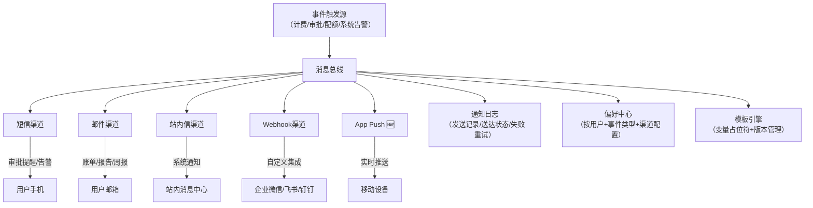
```mermaid
graph TB
    EVENT["事件触发源<br/>（计费/审批/配额/系统告警）"] --> BUS["消息总线"]

    BUS --> SMS["短信渠道"]
    BUS --> EMAIL["邮件渠道"]
    BUS --> IN_APP["站内信渠道"]
    BUS --> WEBHOOK["Webhook渠道"]
    BUS --> PUSH["App Push 🆕"]

    SMS -->|"审批提醒/告警"| USER_SMS["用户手机"]
    EMAIL -->|"账单/报告/周报"| USER_EMAIL["用户邮箱"]
    IN_APP -->|"系统通知"| USER_APP["站内消息中心"]
    WEBHOOK -->|"自定义集成"| EXT["企业微信/飞书/钉钉"]
    PUSH -->|"实时推送"| USER_DEVICE["移动设备"]

    BUS --> LOG["通知日志<br/>（发送记录/送达状态/失败重试）"]
    BUS --> PREF["偏好中心<br/>（按用户+事件类型+渠道配置）"]
    BUS --> TEMPLATE["模板引擎<br/>（变量占位符+版本管理）"]
```

### 6.2 通知事件注册表（各产品线可注册自己的事件）

| 事件编码 | 来源 | 默认渠道 | 默认严重度 |
|---------|------|---------|:----------:|
| `approval.required` | 审批引擎 | 短信+站内信 | 🟡 警告 |
| `quota.warning` | 计费引擎 | 站内信 | 🟡 警告 |
| `quota.exceeded` | 计费引擎 | 短信+站内信 | 🔴 严重 |
| `pipeline.failed` | 产品（GEO） | 站内信 | 🔴 严重 |
| `article.published` | 产品（GEO） | 站内信 | 🟢 成功 |
| `subscription.expiring` | 计费引擎 | 短信+邮件 | 🟡 警告 |
| `subscription.renewal_failed` | 计费引擎 | 短信+站内信 | 🔴 严重 |
| `commission.monthly` | 业务中台 | 邮件 | ℹ️ 信息 |
| `task.failed` | 任务调度 | 站内信 | 🔴 严重 |
| ... | 可扩展 | 可配置 | 可配置 |

### 🗓 增强规划

| 能力 | 阶段 | 说明 |
|------|:---:|------|
| **模板管理**（可视化编辑、变量占位符、版本管理） | 🟢 P0 | 运营人员自助修改通知内容，不走开发 |
| **用户偏好中心**（按事件类型选渠道、免打扰时段） | 🟢 P0 | 避免通知轰炸导致客户流失 |
| 通知聚合/摘要（每日/每周摘要邮件合并多条通知） | 🔵 P1 | 高频事件聚合，减少骚扰 |
| App Push 移动推送（APNs/FCM） | 🔵 P1 | 移动端场景需要 |
| 送达/已读追踪 + 失败自动切换备用渠道 | 🔵 P1 | 关键通知（审批/付费）确保送达 |
| 通知发送策略（分级：紧急立即/普通排队、重复去重） | 🔵 P1 | 避免同一事件重复通知 |

---

## 七、统一文件存储

### 7.1 存储架构（🟢 P0）

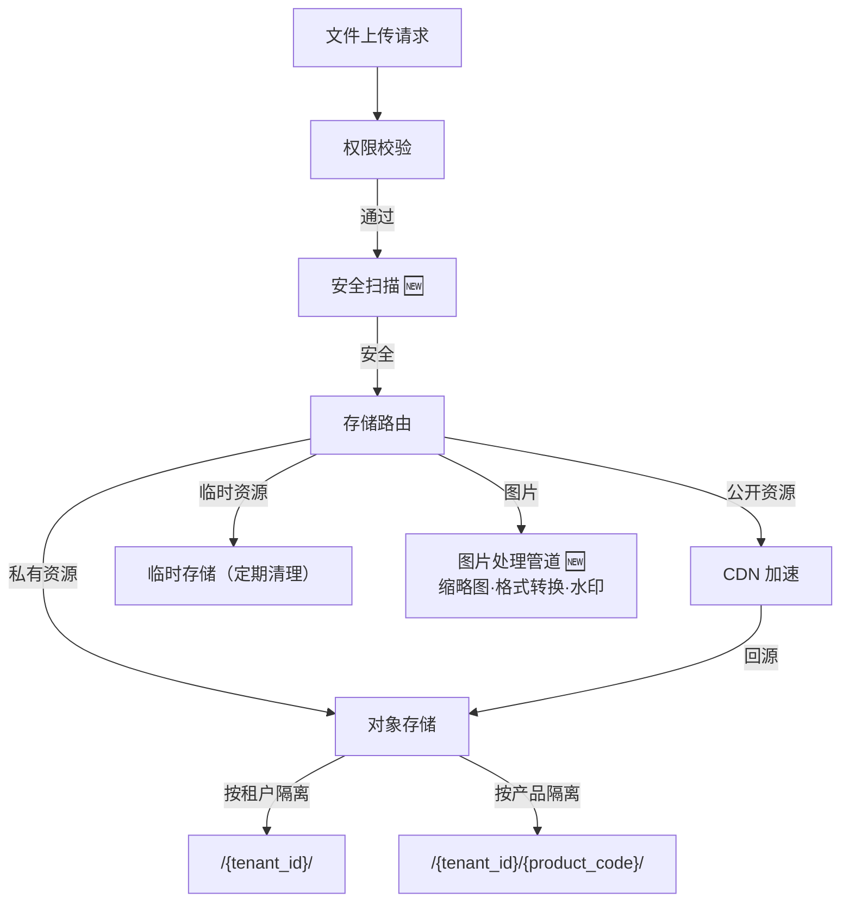
```mermaid
graph TB
    UPLOAD["文件上传请求"] --> AUTH_CHECK["权限校验"]
    AUTH_CHECK -->|"通过"| SCAN["安全扫描 🆕"]
    SCAN -->|"安全"| ROUTE["存储路由"]

    ROUTE -->|"公开资源"| CDN["CDN 加速"]
    ROUTE -->|"私有资源"| OSS["对象存储"]
    ROUTE -->|"临时资源"| TEMP["临时存储（定期清理）"]

    CDN -->|"回源"| OSS
    ROUTE -->|"图片"| IMG_PIPE["图片处理管道 🆕<br/>缩略图·格式转换·水印"]

    OSS -->|"按租户隔离"| DIR_TENANT["/{tenant_id}/"]
    OSS -->|"按产品隔离"| DIR_PRODUCT["/{tenant_id}/{product_code}/"]
```

### 7.2 存储权限

| 资源类型 | 权限 | 示例 |
|---------|------|------|
| 客户上传的品牌图片 | 租户内读写 | `/{tenant_id}/geo/images/logo.png` |
| 文章生成封面 | 租户内读写 + 公开可访问 | `/{tenant_id}/geo/covers/cover-142.png` |
| 代理/业务员头像 | 用户私有 | `/avatars/{user_id}.png` |
| 平台级资源 | 平台管理员读写 | `/platform/templates/` |

### 🗓 增强规划

| 能力 | 阶段 | 说明 |
|------|:---:|------|
| **图片处理管道**（缩略图、WebP 转换、智能裁剪、水印） | 🟢 P0 | 文章封面、头像等场景必须有 |
| 上传安全扫描（病毒检测、敏感内容检测） | 🔵 P1 | 防止恶意文件上传 |
| 大文件分片上传 + 断点续传 | 🔵 P1 | 视频、数据集场景 |
| 文件版本管理（覆盖时保留历史版本） | 🔵 P1 | 品牌素材等频繁更新的场景 |
| 访问链接管理（临时签名 URL、访问次数限制、密码保护） | 🔵 P1 | 敏感文件分享 |
| 文件生命周期自动管理（临时文件过期清理、冷归档） | 🔵 P1 | 存储成本控制 |

---

## 八、统一审计日志

### 8.1 审计模型（🟢 P0）

所有数据变更操作统一记录：

| 字段 | 说明 | 示例 |
|------|------|------|
| 操作人 | 谁操作的（user_id + user_type） | 张三（业务员，华东代理） |
| 操作模式 | 直接操作还是代管操作 | 代管模式（target_tenant=T_A） |
| 操作类型 | 创建/更新/删除/导出 | 更新 |
| 目标对象 | 操作了什么资源 | 案例「XX公司成功案例」 |
| 变更内容 | 旧值 → 新值（可配置脱敏） | name: "旧名" → "新名" |
| 操作时间 | 精确时间戳 | 2026-07-19 14:30:00 |
| 来源 IP | 请求来源 | 192.168.1.1 |

### 8.2 审计日志生命周期（🟢 P0）

```
实时写入 → 热数据（30天，可实时查询）
         → 温数据（90天，异步查询）
         → 冷归档（1年+，导出后可清理）
         → 合规保留（按法规要求，不可删除）
```

### 🗓 增强规划

| 能力 | 阶段 | 说明 |
|------|:---:|------|
| 异常行为检测规则引擎（如短时间大量删除、异地登录后操作） | 🔵 P1 | 安全运维刚需 |
| 合规报告自动生成（SOC 2 / 等保审计轨迹） | 🔵 P1 | 企业客户招标需要 |
| 数据变更 Diff 视图（变更前后对比） | 🔵 P1 | 排查问题和客户纠纷 |
| 可视化审计时间线（对某个资源的完整操作历史） | 🔵 P1 | 排查问题时直观高效 |

---

## 九、API 网关

### 9.1 网关职责（🟢 P0）

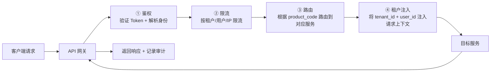
```mermaid
flowchart LR
    REQUEST["客户端请求"] --> GATEWAY["API 网关"]

    GATEWAY --> STEP1["① 鉴权<br/>验证 Token + 解析身份"]
    STEP1 --> STEP2["② 限流<br/>按租户/用户/IP 限流"]
    STEP2 --> STEP3["③ 路由<br/>根据 product_code 路由到对应服务"]
    STEP3 --> STEP4["④ 租户注入<br/>将 tenant_id + user_id 注入请求上下文"]
    STEP4 --> SERVICE["目标服务"]

    SERVICE --> GATEWAY
    GATEWAY --> RESPONSE["返回响应 + 记录审计"]
```

### 9.2 鉴权流程（🟢 P0）

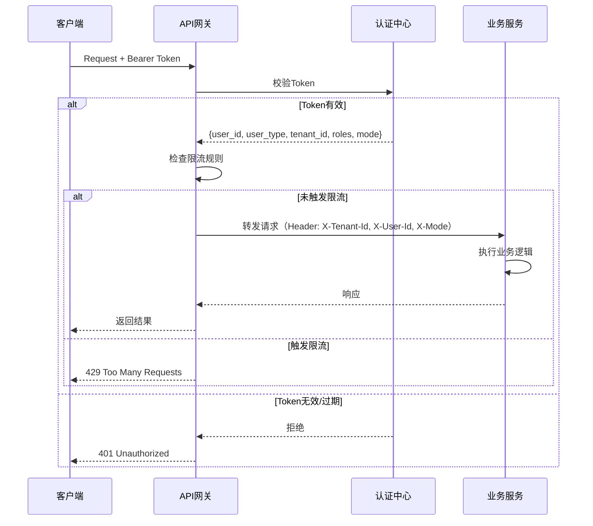
```mermaid
sequenceDiagram
    participant Client as 客户端
    participant GW as API网关
    participant Auth as 认证中心
    participant Service as 业务服务

    Client->>GW: Request + Bearer Token
    GW->>Auth: 校验Token
    alt Token有效
        Auth-->>GW: {user_id, user_type, tenant_id, roles, mode}
        GW->>GW: 检查限流规则
        alt 未触发限流
            GW->>Service: 转发请求（Header: X-Tenant-Id, X-User-Id, X-Mode）
            Service->>Service: 执行业务逻辑
            Service-->>GW: 响应
            GW-->>Client: 返回结果
        else 触发限流
            GW-->>Client: 429 Too Many Requests
        end
    else Token无效/过期
        Auth-->>GW: 拒绝
        GW-->>Client: 401 Unauthorized
    end
```

### 🗓 增强规划

| 能力 | 阶段 | 说明 |
|------|:---:|------|
| 熔断/降级（下游服务故障时自动熔断，返回降级响应） | 🔵 P1 | 防止级联故障 |
| 自动生成 API 文档（OpenAPI → 在线文档门户） | 🔵 P1 | 开发者平台模块统一建设 |
| 请求/响应转换（网关层做字段映射、旧版适配） | 🔵 P1 | API 版本兼容 |
| API 调用分析（每端点 QPS/延迟/错误率看板） | 🟠 P2 | 可观测性模块统一建设 |

---

## 十、统一配置中心 🆕

> **交付阶段**：🟢 P0（核心功能）/ 🔵 P1（高级功能）
>
> **为什么需要**：当前设计反复提到"平台默认 + 租户可覆盖"的配置优先级，但没有实现这个能力的模块。配置中心就是做这个的——集中管理所有产品线的配置、Feature Flags、灰度策略。

### 10.1 配置模型

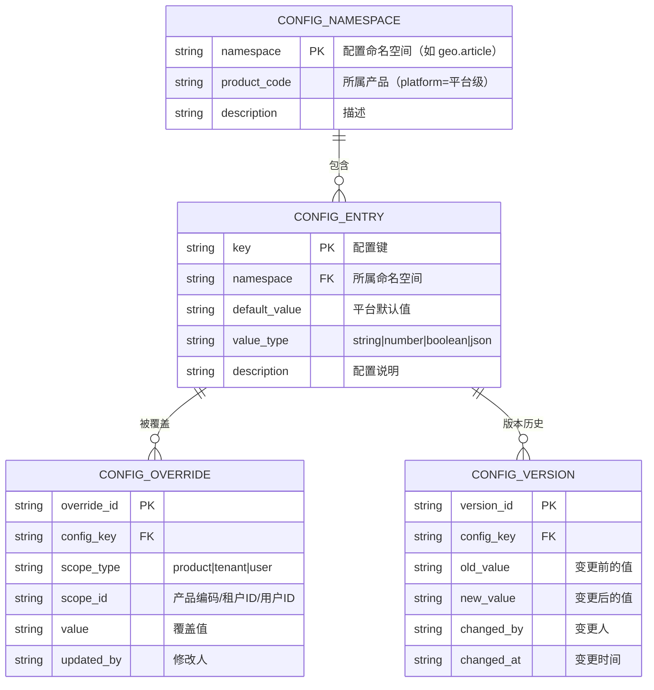
```mermaid
erDiagram
    CONFIG_NAMESPACE ||--o{ CONFIG_ENTRY : "包含"
    CONFIG_ENTRY ||--o{ CONFIG_OVERRIDE : "被覆盖"
    CONFIG_ENTRY ||--o{ CONFIG_VERSION : "版本历史"

    CONFIG_NAMESPACE {
        string namespace PK "配置命名空间（如 geo.article）"
        string product_code "所属产品（platform=平台级）"
        string description "描述"
    }

    CONFIG_ENTRY {
        string key PK "配置键"
        string namespace FK "所属命名空间"
        string default_value "平台默认值"
        string value_type "string|number|boolean|json"
        string description "配置说明"
    }

    CONFIG_OVERRIDE {
        string override_id PK
        string config_key FK
        string scope_type "product|tenant|user"
        string scope_id "产品编码/租户ID/用户ID"
        string value "覆盖值"
        string updated_by "修改人"
    }

    CONFIG_VERSION {
        string version_id PK
        string config_key FK
        string old_value "变更前的值"
        string new_value "变更后的值"
        string changed_by "变更人"
        string changed_at "变更时间"
    }
```

### 10.2 配置优先级继承

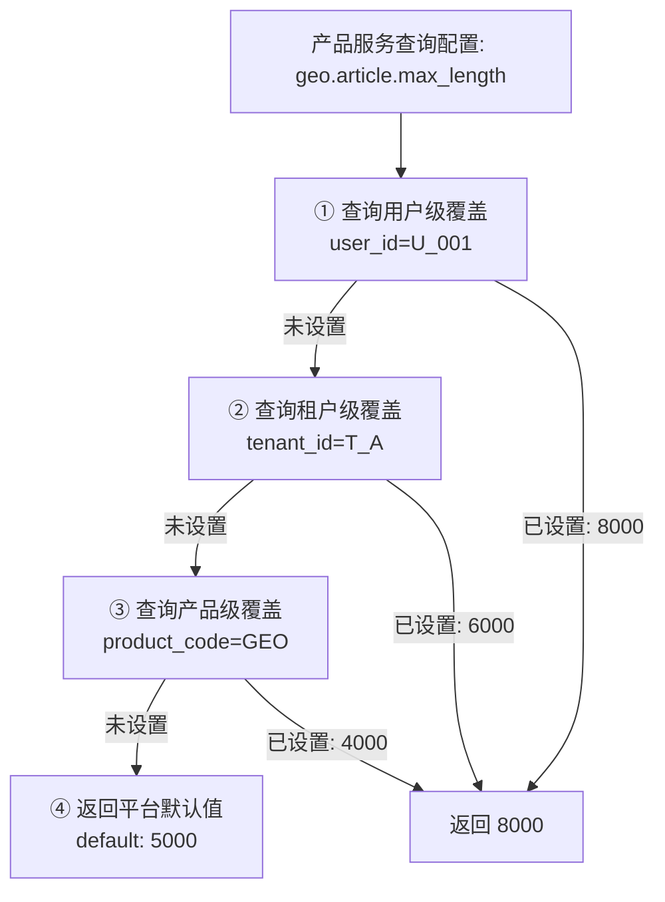
```mermaid
flowchart TB
    REQUEST["产品服务查询配置: geo.article.max_length"] --> L1["① 查询用户级覆盖<br/>user_id=U_001"]
    L1 -->|"未设置"| L2["② 查询租户级覆盖<br/>tenant_id=T_A"]
    L2 -->|"未设置"| L3["③ 查询产品级覆盖<br/>product_code=GEO"]
    L3 -->|"未设置"| L4["④ 返回平台默认值<br/>default: 5000"]

    L1 -->|"已设置: 8000"| RESULT["返回 8000"]
    L2 -->|"已设置: 6000"| RESULT
    L3 -->|"已设置: 4000"| RESULT
```

**配置优先级**：用户自定义 > 租户自定义 > 产品覆盖 > 平台默认

### 10.3 Feature Flags 设计（🟢 P0 基础开关 / 🔵 P1 高级灰度）

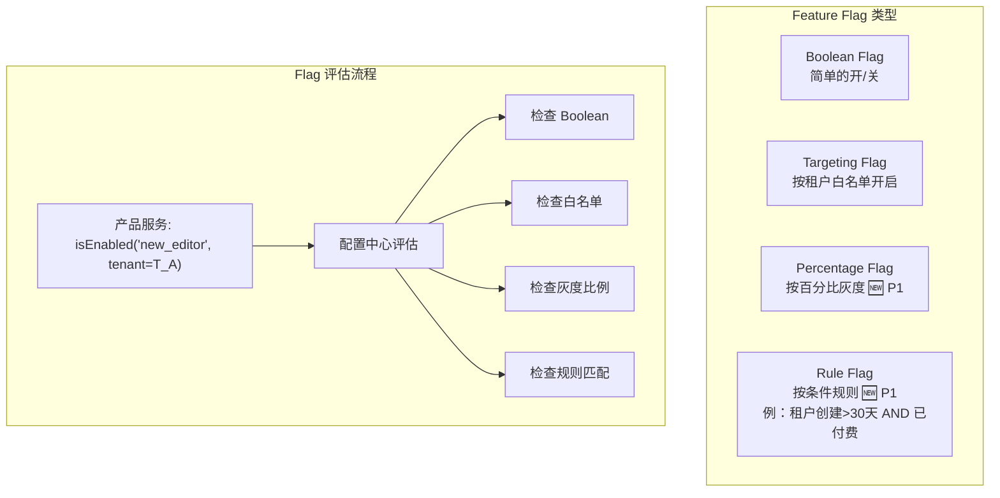
```mermaid
graph TB
    subgraph Flag类型["Feature Flag 类型"]
        BOOL["Boolean Flag<br/>简单的开/关"]
        TARGET["Targeting Flag<br/>按租户白名单开启"]
        PERCENT["Percentage Flag<br/>按百分比灰度 🆕 P1"]
        RULE["Rule Flag<br/>按条件规则 🆕 P1<br/>例：租户创建>30天 AND 已付费"]
    end

    subgraph 评估流程["Flag 评估流程"]
        CHECK["产品服务: isEnabled('new_editor', tenant=T_A)"] --> EVAL["配置中心评估"]
        EVAL --> BOOL_EVAL["检查 Boolean"]
        EVAL --> TARGET_EVAL["检查白名单"]
        EVAL --> PERCENT_EVAL["检查灰度比例"]
        EVAL --> RULE_EVAL["检查规则匹配"]
    end
```

### 10.4 P0 交付范围

| 能力 | 说明 |
|------|------|
| 集中 KV 配置管理 | 所有产品线的配置在一个后台管理 |
| 配置优先级继承 | 用户 > 租户 > 产品 > 平台默认 |
| Boolean Feature Flags | 简单的功能开关 |
| Targeting Flags | 按租户白名单开启功能 |
| 配置变更审计 | 谁在什么时间改了什么值 |
| 管理后台 | 平台 Admin 可管理所有配置 |

### 🗓 P1 增强

| 能力 | 说明 |
|------|------|
| 百分比灰度发布 | 按租户 ID hash 实现一致性灰度 |
| 条件规则 Flag | 按租户属性（创建时长/付费状态/区域）决定开关 |
| 配置版本回滚 | 变更历史 + 一键回滚到任意历史版本 |
| 配置热更新通知 | 配置变更后实时推送给各产品服务 |

---

## 十一、统一审批引擎 🆕

> **交付阶段**：🔵 P1
>
> **P0 替代方案**：审批逻辑硬编码在各产品/业务中台中。如 GEO 的内容审阅审批直接在 GEO 服务里实现，代理审核直接在渠道引擎里实现。
>
> **为什么需要**：当前文档中至少出现了 3 个审批节点（选题确认、内容审阅、发布确认），加上业务中台的代理审核、客户开通审核，至少 5 个审批场景。如果每个都硬编码，审批逻辑会散落各处，很难统一管理和调整。

### 11.1 审批流模型

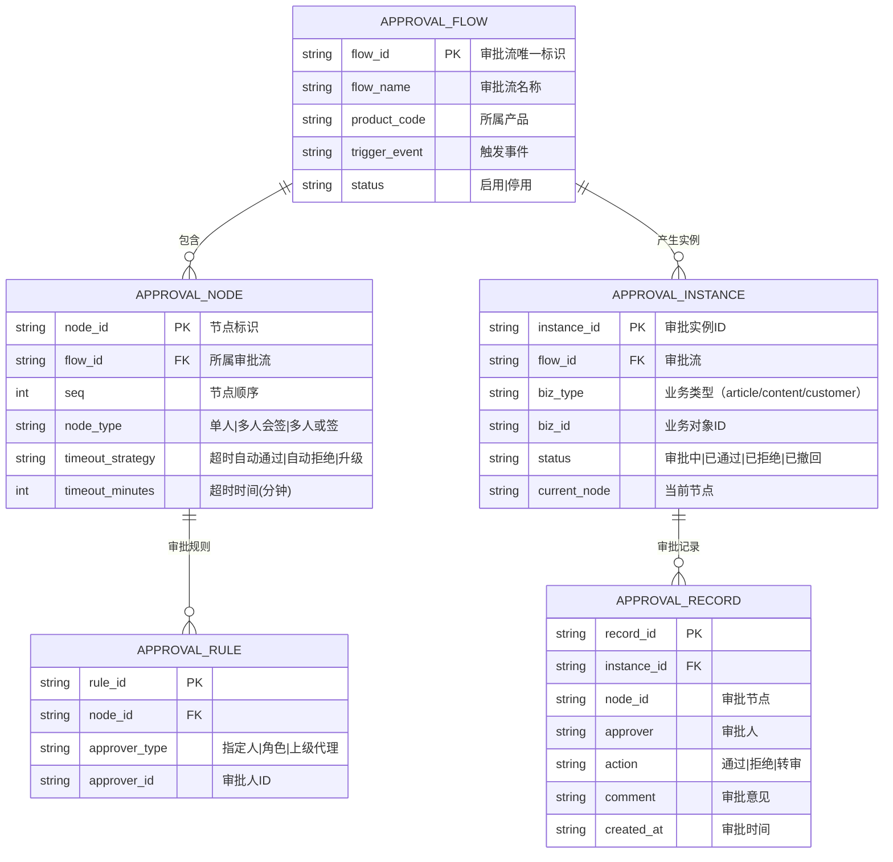
```mermaid
erDiagram
    APPROVAL_FLOW ||--o{ APPROVAL_NODE : "包含"
    APPROVAL_NODE ||--o{ APPROVAL_RULE : "审批规则"
    APPROVAL_FLOW ||--o{ APPROVAL_INSTANCE : "产生实例"
    APPROVAL_INSTANCE ||--o{ APPROVAL_RECORD : "审批记录"

    APPROVAL_FLOW {
        string flow_id PK "审批流唯一标识"
        string flow_name "审批流名称"
        string product_code "所属产品"
        string trigger_event "触发事件"
        string status "启用|停用"
    }

    APPROVAL_NODE {
        string node_id PK "节点标识"
        string flow_id FK "所属审批流"
        int seq "节点顺序"
        string node_type "单人|多人会签|多人或签"
        string timeout_strategy "超时自动通过|自动拒绝|升级"
        int timeout_minutes "超时时间(分钟)"
    }

    APPROVAL_RULE {
        string rule_id PK
        string node_id FK
        string approver_type "指定人|角色|上级代理"
        string approver_id "审批人ID"
    }

    APPROVAL_INSTANCE {
        string instance_id PK "审批实例ID"
        string flow_id FK "审批流"
        string biz_type "业务类型（article/content/customer）"
        string biz_id "业务对象ID"
        string status "审批中|已通过|已拒绝|已撤回"
        string current_node "当前节点"
    }

    APPROVAL_RECORD {
        string record_id PK
        string instance_id FK
        string node_id "审批节点"
        string approver "审批人"
        string action "通过|拒绝|转审"
        string comment "审批意见"
        string created_at "审批时间"
    }
```

### 11.2 审批流示例

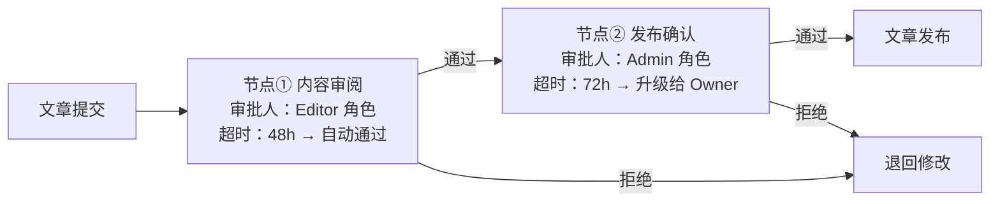
```mermaid
flowchart LR
    START["文章提交"] --> N1["节点① 内容审阅<br/>审批人：Editor 角色<br/>超时：48h → 自动通过"]

    N1 -->|"通过"| N2["节点② 发布确认<br/>审批人：Admin 角色<br/>超时：72h → 升级给 Owner"]

    N2 -->|"通过"| PUBLISH["文章发布"]
    N1 -->|"拒绝"| REJECT["退回修改"]
    N2 -->|"拒绝"| REJECT
```

### 11.3 审批超时策略

| 策略 | 说明 | 适用场景 |
|------|------|---------|
| 自动通过 | 超时后视为审批通过 | 低风险操作、有后续质检兜底 |
| 自动拒绝 | 超时后视为审批拒绝 | 高风险操作、如代理开通审核 |
| 升级审批 | 超时后转给上级审批人 | 关键流程、如发布确认 |
| 仅提醒 | 不改变状态，持续催办 | 需要审批人明确表态的场景 |

### 11.4 审批引擎对外接口

| 应用场景 | 审批流 | 审批节点 |
|---------|--------|---------|
| GEO 内容审阅 | article_review | ① Editor 审阅 → ② Admin 发布确认 |
| 客户开通审核 | customer_activation | ① 代理审核 |
| 代理入驻审核 | agent_onboarding | ① 平台运营审核 |
| 退款审批 | refund_approval | ① 代理确认 → ② 平台财务审批 |
| 产品上线审核 | product_launch | ① 平台运营审核 → ② 平台 Admin 确认 |

---

## 十二、统一任务调度 🆕

> **交付阶段**：🔵 P1
>
> **P0 替代方案**：使用 BullMQ + Redis 实现简单的异步队列和定时任务，硬编码在各产品服务中。不做统一调度面板和编排能力。
>
> **为什么需要**：所有产品都有异步任务需求。GEO 的 AI 文章生成是异步的、CRM 的催款提醒是延迟的、ERP 的月底结账是定时的、通知的摘要合并是定时的。统一调度避免每个产品自建一套。

### 12.1 任务模型

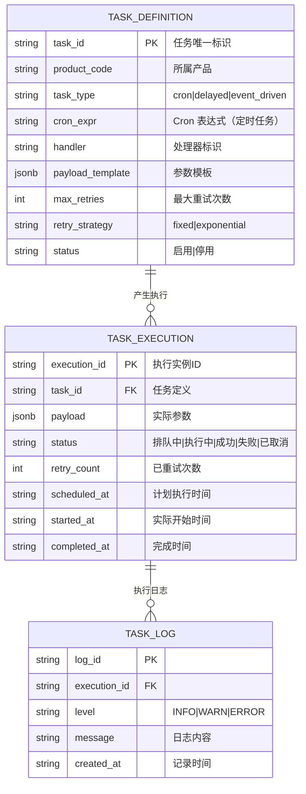
```mermaid
erDiagram
    TASK_DEFINITION ||--o{ TASK_EXECUTION : "产生执行"
    TASK_EXECUTION ||--o{ TASK_LOG : "执行日志"

    TASK_DEFINITION {
        string task_id PK "任务唯一标识"
        string product_code "所属产品"
        string task_type "cron|delayed|event_driven"
        string cron_expr "Cron 表达式（定时任务）"
        string handler "处理器标识"
        jsonb payload_template "参数模板"
        int max_retries "最大重试次数"
        string retry_strategy "fixed|exponential"
        string status "启用|停用"
    }

    TASK_EXECUTION {
        string execution_id PK "执行实例ID"
        string task_id FK "任务定义"
        jsonb payload "实际参数"
        string status "排队中|执行中|成功|失败|已取消"
        int retry_count "已重试次数"
        string scheduled_at "计划执行时间"
        string started_at "实际开始时间"
        string completed_at "完成时间"
    }

    TASK_LOG {
        string log_id PK
        string execution_id FK
        string level "INFO|WARN|ERROR"
        string message "日志内容"
        string created_at "记录时间"
    }
```

### 12.2 任务类型

```mermaid
graph TB
    subgraph 定时任务["Cron 定时任务"]
        CRON1["每月1号 00:00 → 佣金结算"]
        CRON2["每日 10:00 → 通知摘要合并"]
        CRON3["每日 02:00 → 临时文件清理"]
    end

    subgraph 延迟任务["延迟任务"]
        DELAY1["审批创建后 48h → 超时自动处理"]
        DELAY2["续费提醒：到期前15天/7天/3天"]
        DELAY3["数据软删除 30天后 → 物理清除"]
    end

    subgraph 异步编排["异步编排（DAG）"]
        DAG1["GEO 文章生成：<br/>知识库检索 → LLM生成 → 后处理 → 质量扫描"]
        DAG2["客户开通：<br/>创建租户 → 开通产品线 → 创建订阅 → 发通知"]
    end
```

### 12.3 重试与死信处理

```mermaid
flowchart LR
    EXEC["任务执行"] -->|"失败"| RETRY{"重试次数 < max?"}
    RETRY -->|"是"| DELAY["等待退避时间<br/>fixed: 1min/5min/15min<br/>exponential: 1min/2min/4min/8min"]
    DELAY --> EXEC
    RETRY -->|"否"| DLQ["进入死信队列"]
    DLQ --> ALERT["发送告警通知"]
    DLQ --> MANUAL["人工处理"]
```

### 12.4 任务调度对外接口

各产品线通过统一接口注册和执行任务：

| 接口 | 说明 | 示例 |
|------|------|------|
| 注册定时任务 | 声明 Cron + Handler | 每月1号执行佣金结算 |
| 投递延迟任务 | 指定延迟时长后执行 | 48h 后检查审批是否超时 |
| 提交异步任务链 | DAG 定义步骤和依赖 | AI 生成 → 后处理 → 质量扫描 |
| 查询任务状态 | 轮询或回调 | 前端显示"文章生成中 80%" |
| 取消任务 | 取消排队中的任务 | 用户取消文章生成 |

---

## 十三、统一搜索服务 🆕

> **交付阶段**：🟠 P2
>
> **P0-P1 替代方案**：各产品自己用 PostgreSQL 的 `LIKE`/`ILIKE` 或 `tsvector` 做简单搜索。GEO 搜文章标题，CRM 搜客户名称——数据量小时够用。
>
> **触发条件**：单个租户数据量 > 10 万条，或需要中文分词和相关性排序时启动。

### 13.1 搜索架构

```mermaid
graph TB
    PRODUCT["产品服务"] -->|"数据变更"| INDEXER["搜索索引器"]
    INDEXER -->|"写入"| ES["Elasticsearch 集群"]

    SEARCH_REQ["搜索请求"] --> SEARCH_API["搜索服务 API"]
    SEARCH_API -->|"自动注入 tenant_id 过滤"| ES
    SEARCH_API -->|"中文分词+权重计算"| ES
    ES --> SEARCH_API --> SEARCH_REQ
```

### 13.2 核心能力

| 能力 | 说明 |
|------|------|
| 全文检索 | 多字段（标题/内容/标签）联合搜索 |
| 租户隔离 | 搜索时自动按 `tenant_id` 过滤，不可跨租户 |
| 中文分词 | jieba/ik 分词器，中文语义搜索 |
| 搜索权重 | 标题匹配权重 > 内容匹配权重，可配置 |
| 搜索建议 | 输入时自动补全（Autocomplete） |
| 搜索分析 | 热门搜索词、零结果查询，优化搜索体验 |

---

## 十四、统一国际化引擎 🆕

> **交付阶段**：🟠 P2
>
> **P0-P1 替代方案**：前端硬编码中文，通过前端 i18n 库（如 vue-i18n）管理翻译文件。不支持租户级翻译覆盖。
>
> **触发条件**：有海外代理/海外客户，或 GTM 出海场景。

### 14.1 核心能力

| 能力 | 说明 |
|------|------|
| 多语言资源管理 | 翻译 Key-Value 集中管理，支持导入导出（JSON/CSV） |
| 租户级翻译覆盖 | 租户可覆盖特定文案（如把"客户"改成"会员"） |
| 产品级翻译隔离 | 每个产品线独立管理自己的翻译资源 |
| 时区/货币/数字格式化 | 按租户设置自动格式化日期、金额、数字 |
| 翻译版本管理 | 跟随产品版本发布翻译更新，标记未翻译/待审核 |

### 14.2 资源模型

```
命名空间: geo (产品级) / platform (平台级)

翻译 Key 格式: {namespace}.{module}.{key}
  例: geo.article.create_button = "创建文章" / "Create Article"

查询优先级（同配置中心）:
  用户语言偏好 > 租户默认语言 > 产品默认 > 平台 fallback (zh_CN)
```

---

## 十五、统一可观测性 🆕

> **交付阶段**：🟠 P2
>
> **P0-P1 替代方案**：各服务写结构化日志到 stdout，用简单的日志收集工具。基础健康检查端点（/health, /health/ready）。
>
> **触发条件**：服务数量 ≥ 5 个，或线上故障排查时间超过业务容忍度。

### 15.1 可观测性三大支柱

```mermaid
graph TB
    subgraph 日志["Logs · 集中日志"]
        LOG_SRC["各服务 → stdout/file"] --> LOG_COL["Loki / ELK"]
        LOG_COL --> LOG_UI["日志检索面板"]
    end

    subgraph 指标["Metrics · 指标"]
        METRIC_SRC["应用埋点 → Prometheus"] --> METRIC_DB["Prometheus TSDB"]
        METRIC_DB --> GRAFANA["Grafana 仪表盘"]
    end

    subgraph 追踪["Traces · 链路追踪"]
        TRACE_SRC["OpenTelemetry SDK"] --> TRACE_BACK["Jaeger / Tempo"]
        TRACE_BACK --> TRACE_UI["调用链可视化"]
    end

    subgraph 告警["Alerting · 告警"]
        METRIC_DB --> ALERT_RULE["告警规则引擎"]
        LOG_COL --> ALERT_RULE
        ALERT_RULE --> NOTIFY_CH["通知模块（短信/邮件/IM）"]
    end
```

### 15.2 核心指标

| 维度 | 指标 | 告警阈值 |
|------|------|:---:|
| 应用 | 错误率 | > 1% |
| 应用 | API P95 延迟 | > 2s |
| 应用 | LLM 调用失败率 | > 5% |
| 基础设施 | CPU / 内存 / 磁盘 | > 80% |
| 业务 | 客户开通成功率 | < 95% |
| 业务 | 支付成功率 | < 98% |
| 安全 | 登录失败率异常 | 5min > 20次 |

---

## 十六、统一开发者平台 🆕

> **交付阶段**：🟠 P2
>
> **P0-P1 替代方案**：靠文档手动接入。产品开发团队阅读 [04 · 产品层接入规范](./04-product-layer-spec.md) 后开发代码接入中台。
>
> **触发条件**：产品线 ≥ 3 个，或外部 ISV 接入需求。

### 16.1 核心能力

| 能力 | 说明 |
|------|------|
| **API 文档门户** | OpenAPI 规范自动生成在线文档，支持在线调试（"Try it"） |
| **SDK 自动生成** | OpenAPI → TypeScript/Go/Python/Java SDK，托管到各语言包仓库 |
| **沙箱环境** | 独立隔离的测试环境，产品开发者可自由测试不污染生产数据 |
| **开发者 Console** | 产品开发者自助管理注册信息、查看 API 调用量/延迟/错误日志 |
| **变更通知** | API 版本变更/废弃通过邮件和 Webhook 通知接入方 |
| **接入状态看板** | 展示各产品接入进度（注册/认证/计费/通知/存储/审计 接入状态） |

### 16.2 开发者体验

```mermaid
flowchart LR
    DEV["产品开发者"] --> PORTAL["开发者门户<br/>developer.ark-engine.com"]

    PORTAL --> DOCS["📖 API 文档<br/>在线调试"]
    PORTAL --> SDK["📦 下载 SDK<br/>npm/pip/go get"]
    PORTAL --> SANDBOX["🔧 沙箱环境<br/>独立隔离"]
    PORTAL --> CONSOLE["📊 开发者控制台<br/>调用量/错误日志"]
    PORTAL --> STATUS["✅ 接入状态<br/>认证✅ 计费✅ 通知⏳"]
```

---

## 十七、模块间依赖关系

```mermaid
graph TB
    GATEWAY["API 网关"] --> AUTH["认证中心"]
    GATEWAY --> TENANT["租户底座"]

    CONFIG["配置中心"] --> TENANT
    CONFIG --> BILLING["计费引擎"]

    BILLING --> NOTIFY["消息通知"]

    APPROVAL["审批引擎"] --> NOTIFY
    APPROVAL --> AUDIT["审计日志"]
    APPROVAL --> SCHEDULER["任务调度"]

    SCHEDULER --> NOTIFY
    SCHEDULER --> AUDIT

    STORAGE["文件存储"] -.-> AUDIT

    SEARCH["搜索服务"] -.-> TENANT

    OBSERVABILITY["可观测性"] -.-> GATEWAY
    OBSERVABILITY -.-> ALL["所有服务"]

    DEV_PORTAL["开发者平台"] --> GATEWAY

    I18N["国际化"] -.-> CONFIG
```

**关键依赖说明**：
- **配置中心**被计费引擎、租户底座依赖——P0 必须一起做
- **审批引擎**依赖通知和任务调度——P1 一起交付
- **任务调度**是审批超时、定时结算、通知摘要的基础设施——P1 启动
- **可观测性**横切所有服务——P2 统一接入

---

## 十八、与业务中台的协作

```mermaid
flowchart LR
    subgraph 典型场景["典型运营场景：客户开通（P0 链路）"]
        S1["业务员提交申请<br/>（业务中台·客户运营）"]
        S2["代理审核<br/>（业务中台·渠道管理）"]
        S3["创建租户+产品线<br/>（技术中台·租户底座）"]
        S4["设置配额<br/>（技术中台·计费引擎）"]
        S5["发激活短信<br/>（技术中台·消息通知）"]
        S6["建立代管关系<br/>（业务中台·客户运营）"]
        S7["记录审计<br/>（技术中台·审计日志）"]
    end

    S1 --> S2 --> S3 --> S4 --> S5 --> S6 --> S7

    S2 -.-> N1["🔵 P1 升级<br/>代理审核走统一审批引擎"]
    S4 -.-> N2["🔵 P1 升级<br/>试用客户的免费配额走配置中心"]
```

---

## 十九、技术选型建议

| 模块 | 推荐方案 | 备选 |
|------|---------|------|
| API 网关 | Nginx + Kong / APISIX | Traefik |
| 认证中心 | 自建（JWT + OAuth 2.0） | Keycloak / Auth0 |
| 数据库 | PostgreSQL 16 + PGVector | — |
| 缓存/队列 | Redis 7（缓存 + BullMQ 队列） | — |
| 对象存储 | MinIO（自部署） / 阿里云 OSS | AWS S3 |
| 搜索引擎 | Elasticsearch 8 / Meilisearch | Typesense |
| 配置中心 | 自建（基于 PostgreSQL） | LaunchDarkly（P2+） |
| 任务调度 | BullMQ + 自建调度面板 | Temporal（P2+） |
| 链路追踪 | OpenTelemetry + Jaeger | Grafana Tempo |
| 集中日志 | Loki + Promtail | ELK |
| 指标监控 | Prometheus + Grafana | — |
