# 03 · 业务中台详细设计

> 渠道管理、客户运营、佣金结算、产品线注册。
> 所有产品线共用的"管生意"能力。

---

## 一、模块总览

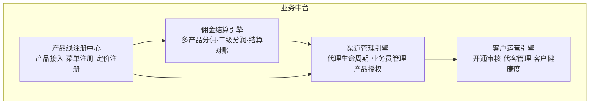

---

## 二、渠道管理引擎

### 2.1 代理生命周期

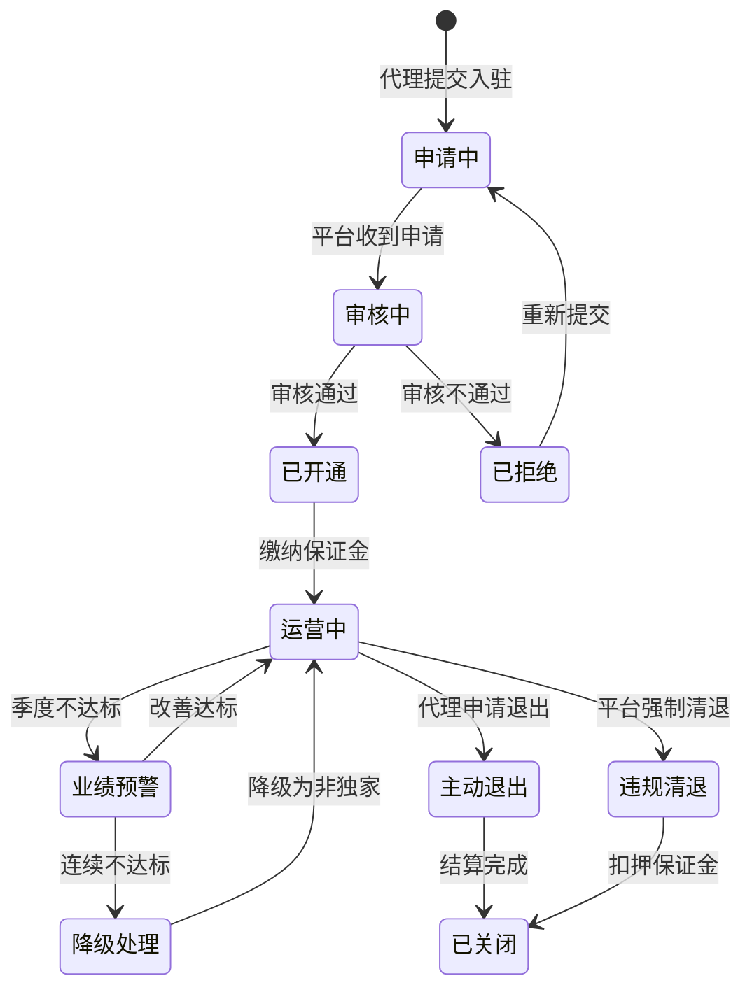

### 2.2 产品授权矩阵

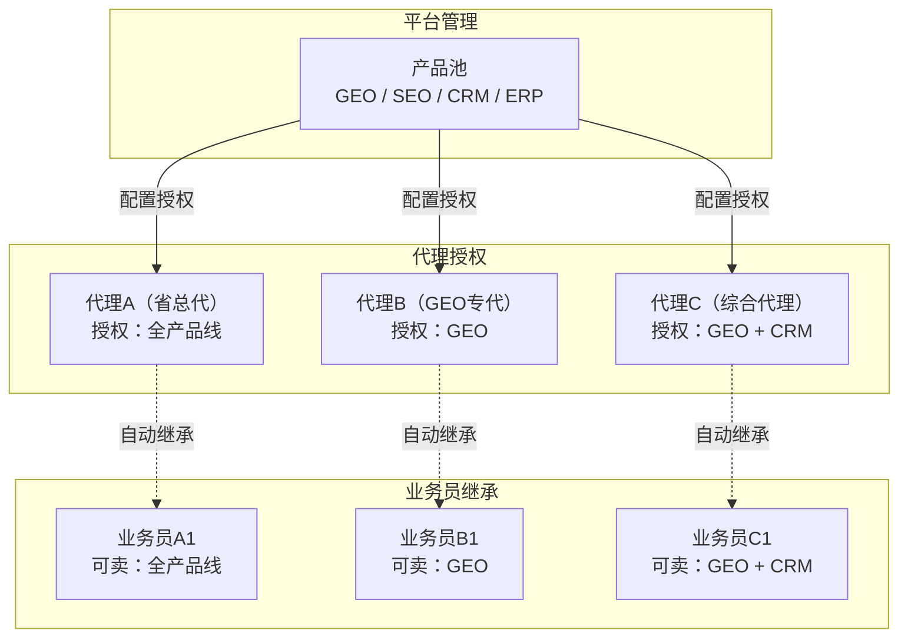

### 2.3 业务员离职交接

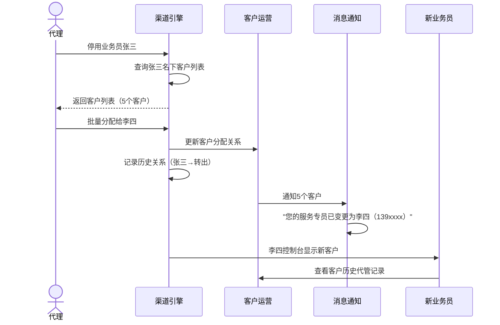

---

## 三、客户运营引擎

### 3.1 客户开通审核流程

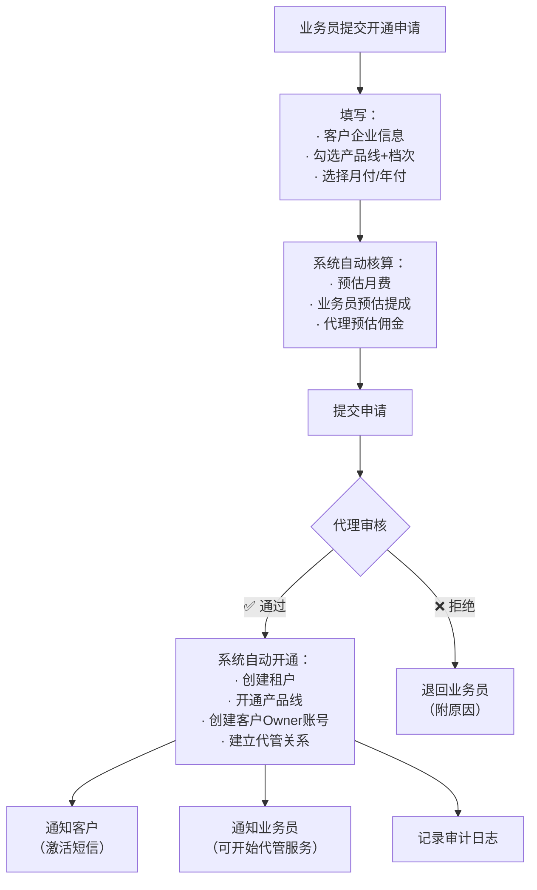

### 3.2 代客管理会话

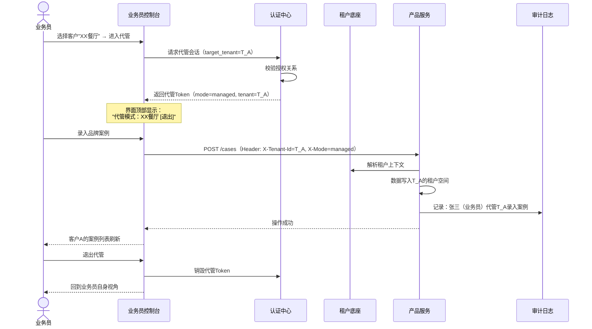

### 3.3 客户健康度分层

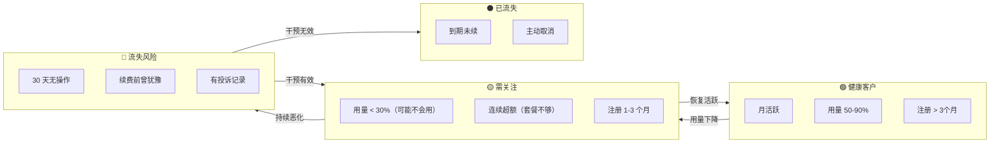

---

## 四、佣金结算引擎

### 4.1 多产品线分佣模型

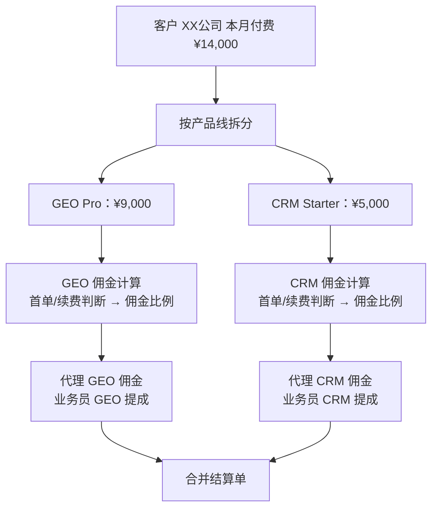

### 4.2 月度结算流程

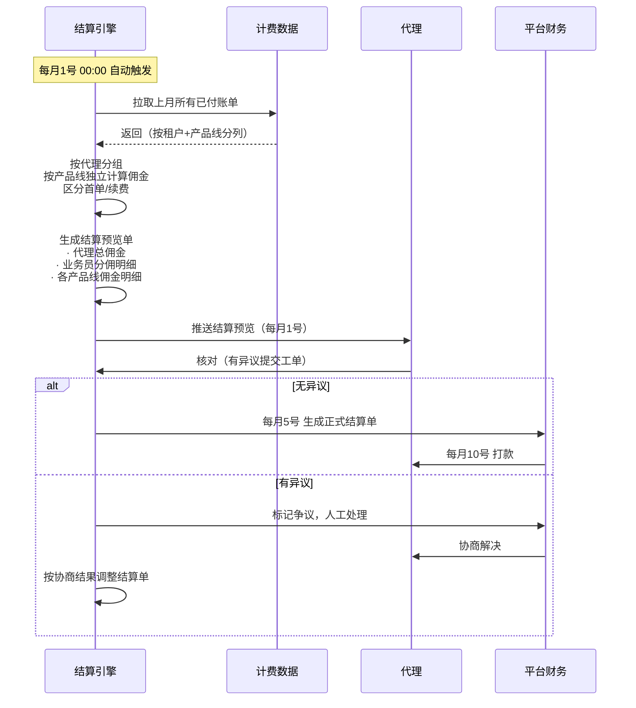

### 4.3 佣金比例配置（按产品线差异化）

| 产品线 | 代理类型 | 首单佣金比例 | 续费佣金比例 | 业务员建议提成 |
|--------|:------:|:----------:|:----------:|:------------:|
| GEO | 独家 | 50% | 20% | 佣金的 50-70% |
| GEO | 非独家 | 40% | 15% | 佣金的 50-70% |
| SEO | 通用 | 40% | 15% | 佣金的 50% |
| CRM | 通用 | 60% | 25% | 佣金的 60% |
| ERP | 通用 | 30% | 10% | 佣金的 50% |

> CRM 佣金比例最高——作为新推产品用高佣金激励渠道推广。这是业务运营的杠杆。

---

## 五、产品线注册中心

### 5.1 新产品上线接入流程

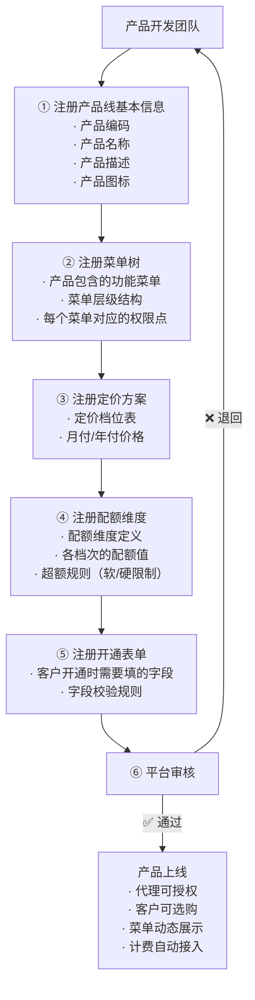

### 5.2 产品线注册数据契约

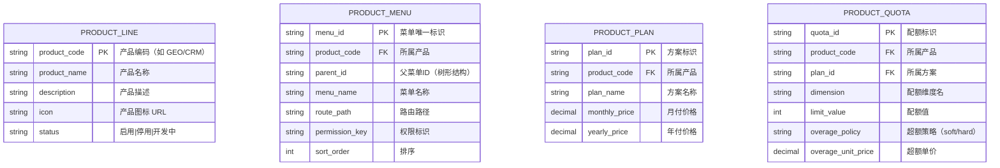

---

## 六、业务中台与技术中台的协作

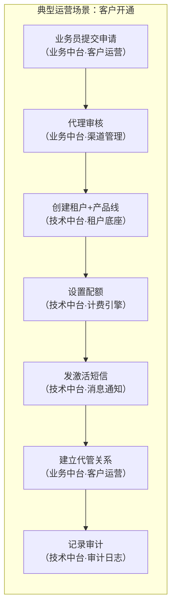
