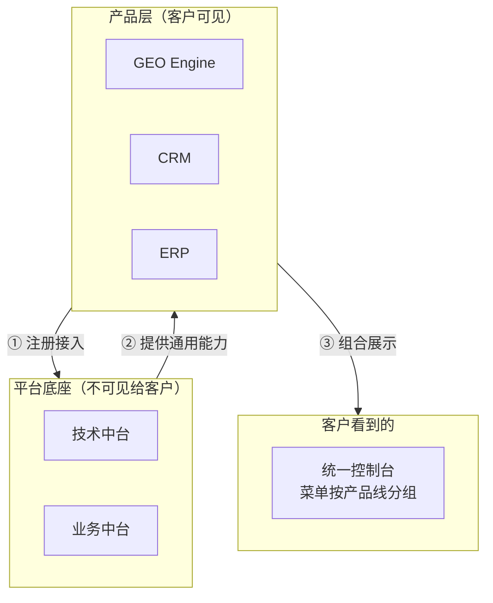
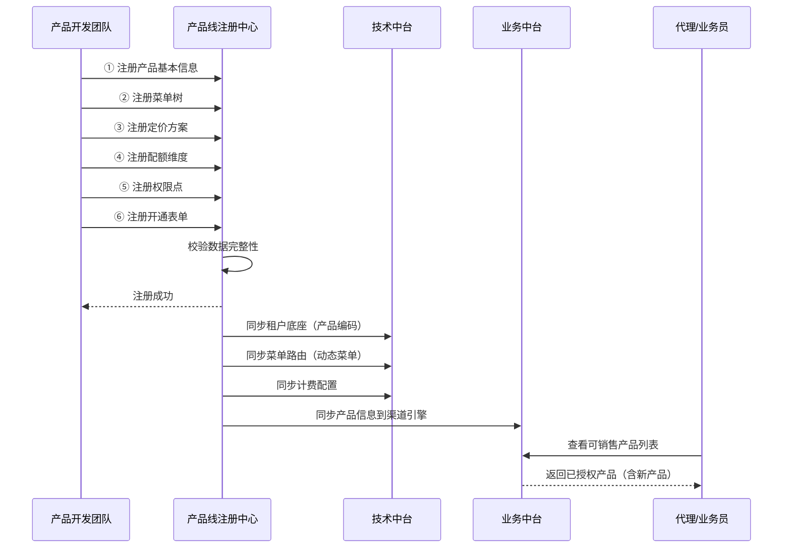
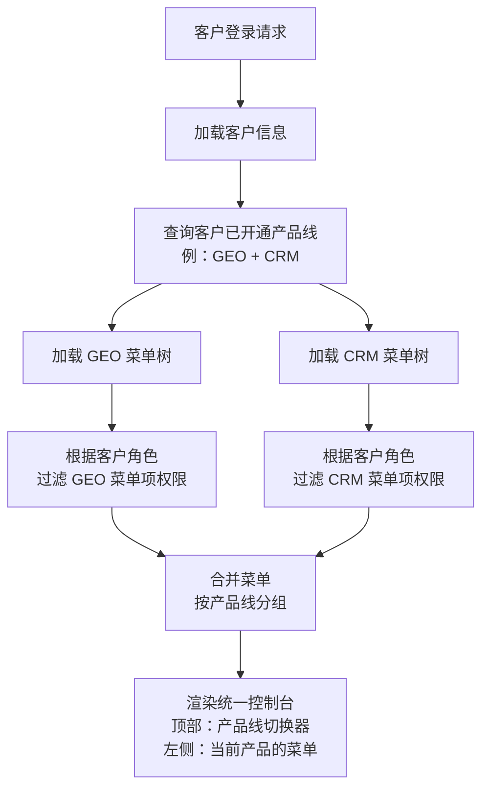
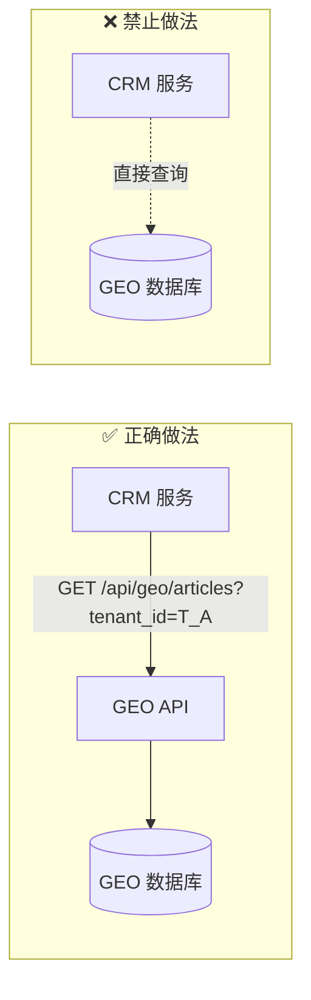

# 04 · 产品层接入规范

> 各产品线如何接入平台底座。定义产品与中台之间的契约和边界。

---

## 一、产品与中台的关系



**核心约束**：
- 产品只能通过中台 API 获取通用能力
- 产品不允许直接访问其他产品的数据库
- 产品不允许绕过中台自行计费、自行认证

---

## 二、产品线注册接口

### 2.1 产品上线需要注册的内容

| 注册项 | 说明 | 示例 |
|--------|------|------|
| 产品基本信息 | 编码、名称、描述、图标 | `{code: "GEO", name: "GEO Engine"}` |
| 菜单树 | 产品包含的功能菜单和路由 | 选题策略 → 内容生成 → 后处理... |
| 定价方案 | 各档次的名称和价格 | 基础 ¥6,000 / 标准 ¥9,000 / 专业 ¥12,000 |
| 配额维度 | 需要管控哪些资源 | 文章数 / Token数 / 关键词数 |
| 各档次配额值 | 每个档次的配额上限 | Pro: 30篇文章/月, 300万Token/月 |
| 超额规则 | 超出配额后的策略 | 软限制（提示）/ 硬限制（阻断）/ 超额单价 |
| 开通表单字段 | 客户开通时需要填什么 | 企业名称、行业、是否需要代管 |
| 权限点列表 | 产品内有哪些操作权限 | 创建文章、发布文章、查看文章 |

### 2.2 接入时序



---

## 三、菜单注册与动态路由

### 3.1 菜单树注册格式

```
产品: GEO Engine (product_code=GEO)

菜单树:
  GEO Engine
  ├── 📊 仪表盘
  │     └── 权限: geo:dashboard:view
  │
  ├── 📝 选题策略
  │     ├── 选题池         权限: geo:topic:view
  │     ├── 关键词覆盖矩阵  权限: geo:keyword:view
  │     └── 撞车检测       权限: geo:collision:check
  │
  ├── ✍️ 内容生成
  │     ├── 新建文章       权限: geo:article:create
  │     ├── 文章列表       权限: geo:article:view
  │     └── Prompt 模板    权限: geo:prompt:manage
  │
  ├── 🔧 后处理
  │     └── 质量报告       权限: geo:quality:view
  │
  ├── 🚀 发布管理
  │     ├── 发布队列       权限: geo:publish:view
  │     └── 平台适配       权限: geo:platform:manage
  │
  └── 📊 效果追踪
        ├── 引用率看板     权限: geo:citation:view
        └── 追踪报告       权限: geo:report:view
```

### 3.2 客户菜单动态拼装



### 3.3 不同角色看到的菜单不同

同一个产品，不同角色看到的菜单不同：

| 菜单项 | Owner | Admin | Editor | Viewer |
|--------|:---:|:---:|:---:|:---:|
| 仪表盘 | ✅ | ✅ | ✅ | ✅ |
| 选题池 | ✅ | ✅ | ✅ | ❌ |
| 新建文章 | ✅ | ✅ | ✅ | ❌ |
| 发布管理 | ✅ | ✅ | ❌ | ❌ |
| Prompt 模板配置 | ✅ | ✅ | ❌ | ❌ |
| 效果报告 | ✅ | ✅ | ✅ | ✅ |
| 团队管理 | ✅ | ✅ | ❌ | ❌ |
| 订阅与账单 | ✅ | ❌ | ❌ | ❌ |

---

## 四、定价与配额维度注册

### 4.1 产品注册自己的计费模型

```
产品 GEO Engine 的计费注册：

  定价档位:
    basic:   基础版 ¥6,000/月  (年付 ¥4,800/月)
    standard: 标准版 ¥9,000/月  (年付 ¥7,200/月)
    pro:     专业版 ¥12,000/月 (年付 ¥9,600/月)

  配额维度:
    dimension_1: 文章数 (article_count)
      basic: 10篇/月  standard: 20篇/月  pro: 30篇/月
      超额策略: soft（提示但不断阻，超额 ¥120/篇）

    dimension_2: Token用量 (token_usage)
      basic: 10万/月  standard: 50万/月  pro: 300万/月
      超额策略: hard（断阻，需充值增量包）

    dimension_3: 关键词数 (keyword_count)
      basic: 20个  standard: 50个  pro: 200个
      超额策略: soft

    dimension_4: 案例数 (case_count)
      basic: 10个  standard: 30个  pro: 100个
      超额策略: soft
```

### 4.2 不同产品不同配额维度

```
GEO:  文章数 + Token数 + 关键词数 + 案例数
CRM:  客户数 + 合同数 + 存储空间
ERP:  单据量 + 用户数 + 报表数
SEO:  关键词数 + 分析域名数 + 报告数
```

计费引擎不关心"文章数"和"客户数"的业务含义，只关心：
- 维度编码（用于追踪用量）
- 各档次限额（用于判断是否超额）
- 超额策略（soft/hard）
- 超额单价（用于账单计算）

---

## 五、产品间通信规范

### 5.1 产品间不允许直连数据库



### 5.2 产品提供的 API 必须版本化

```
GET /api/v1/geo/articles          ← v1 版本
GET /api/v2/geo/articles          ← v2 版本（不兼容变更时发新版）

v1 版本废弃流程：
  ① 发布 v2
  ② v1 标记为 deprecated（返回 Deprecation Warning Header）
  ③ v1 保留至少一个大版本周期（3-6个月）
  ④ 确认无调用方后下线 v1
```

---

## 六、产品开发清单

新产品接入平台时，开发团队需要完成：

| # | 任务 | 依赖方 |
|---|------|--------|
| 1 | 在注册中心注册产品线信息 | 业务中台-产品注册中心 |
| 2 | 注册菜单树和权限点 | 业务中台-产品注册中心 |
| 3 | 注册定价方案和配额维度 | 技术中台-计费引擎 |
| 4 | 实现产品业务逻辑 | 产品开发团队 |
| 5 | 接入认证中心（Token 校验） | 技术中台-认证中心 |
| 6 | 接入计费引擎（用量上报） | 技术中台-计费引擎 |
| 7 | 接入消息通知（事件触发） | 技术中台-消息通知 |
| 8 | 接入文件存储（资源上传） | 技术中台-文件存储 |
| 9 | 接入审计日志（操作记录） | 技术中台-审计日志 |
| 10 | 通过 API 网关注册路由 | 技术中台-API网关 |

**前 3 项是注册制（配置完成即生效），后 7 项是开发接入（需写代码调用中台 API）。**
