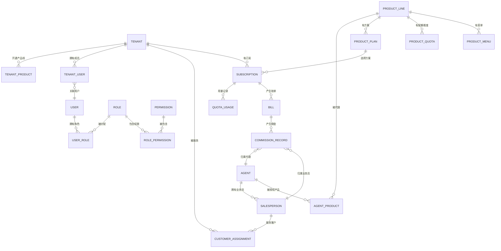
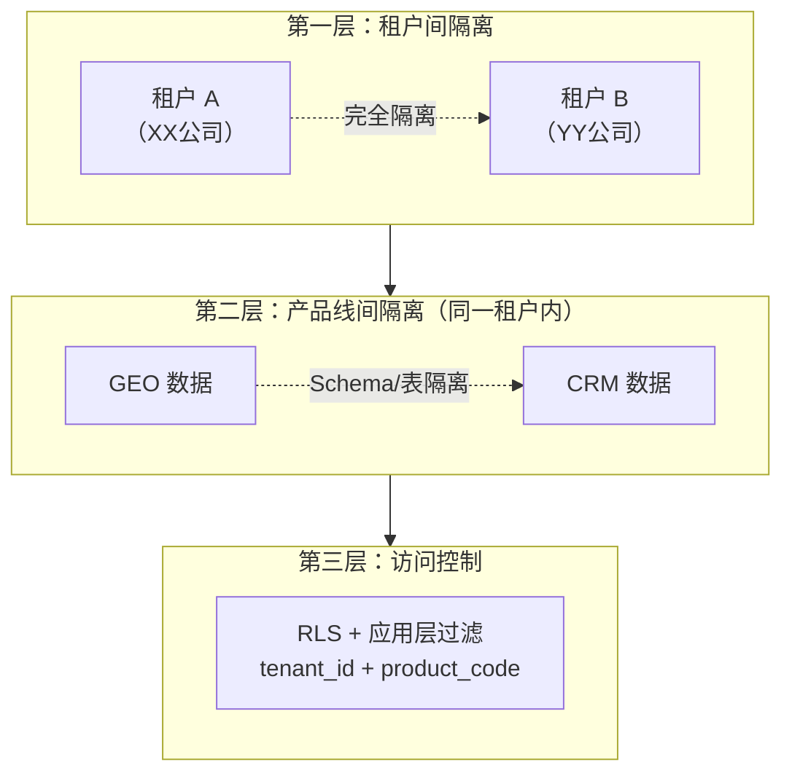

# 05 · 核心数据模型

> 平台底座的核心实体关系和数据隔离策略。
> 本文档定义的是平台级通用数据模型，各产品线有自己的业务数据模型。

---

## 一、核心 ER 图（平台级）



---

## 二、核心实体定义

### 2.1 租户与用户

```
TENANT（租户）
  租户是平台中客户企业的唯一标识。
  一个租户可以开通多个产品线。
  
  核心字段：
    tenant_id    租户唯一标识
    name         企业名称
    slug         URL 标识（唯一）
    status       试用中 | 活跃 | 暂停 | 已删除
    plan         订阅方案（Free/Starter/Pro/Enterprise）← 默认方案，可被产品线覆盖
    quotas       配额 JSONB（全局默认）
    settings     配置 JSONB

USER（用户）
  平台中所有角色的统一用户模型。
  
  核心字段：
    user_id      用户唯一标识
    user_type    平台人员 | 代理 | 业务员 | 客户成员
    phone        手机号（登录凭证）
    password_hash 密码（加密存储）
    name         姓名
    
    tenant_id    所属租户（仅 customer 类型有值）
    tenant_role  租户角色（owner/admin/editor/viewer）
    
    agent_id     所属代理（仅 salesperson+agent 类型有值）
    platform_role 平台角色（仅 platform 类型有值）

TENANT_USER（租户成员关联）
    tenant_id    租户
    user_id      用户
    role         角色
    joined_at    加入时间
```

### 2.2 代理与业务员

```
AGENT（代理）
  核心字段：
    agent_id     代理唯一标识
    agent_type   独家 | 非独家
    company_name 企业名称
    region       负责区域
    status       申请中 | 审核中 | 运营中 | 已关闭
    deposit      保证金额
    deposit_status 已缴 | 已退 | 部分扣押

AGENT_PRODUCT（代理产品授权）
    agent_id     代理
    product_code 被授权产品编码
    authorized_at 授权时间

SALESPERSON（业务员）
  核心字段：
    salesperson_id 业务员唯一标识
    agent_id       所属代理
    user_id        关联的用户账号
    status         在职 | 停用 | 离职
    commission_rate 提成比例（代理自定义）

CUSTOMER_ASSIGNMENT（客户分配关系）
    salesperson_id 业务员
    tenant_id      客户租户
    status         active | transferred
    assigned_at    分配时间
    transferred_at 转出时间
```

### 2.3 产品线与订阅

```
PRODUCT_LINE（产品线）
    product_code  产品编码（PK）
    product_name  产品名称
    description   产品描述
    icon          产品图标
    status        启用 | 停用 | 开发中

PRODUCT_PLAN（产品方案）
    plan_id       方案标识
    product_code  所属产品
    plan_name     方案名称
    monthly_price 月付价格
    yearly_price  年付价格
    sort_order    排序

PRODUCT_QUOTA（产品配额维度）
    quota_id      配额标识
    product_code  所属产品
    plan_id       所属方案
    dimension     配额维度名（如 article_count）
    limit_value   配额值（如 30）
    overage_policy 超额策略（soft/hard）
    overage_unit_price 超额单价

SUBSCRIPTION（客户订阅）
    subscription_id 订阅标识
    tenant_id       客户租户
    product_code    产品
    plan_id         方案
    cycle           月付 | 年付
    start_date      开始日期
    end_date        到期日期
    status          生效中 | 已过期 | 已取消
    base_price      基础价格

QUOTA_USAGE（用量记录）
    usage_id       记录标识
    subscription_id 订阅
    dimension      配额维度
    used           已用量
    limit_amount   限额
    period         计费周期（如 2026-07）
```

### 2.4 账单与佣金

```
BILL（账单）
    bill_id        账单标识
    tenant_id      客户租户
    period         账期
    product_code   产品线
    base_charge    基础费用
    overage_charge 超额费用
    total          合计
    status         待付 | 已付 | 逾期

COMMISSION_RECORD（佣金记录）
    commission_id  佣金记录标识
    bill_id        关联账单
    agent_id       代理
    salesperson_id 业务员
    product_code   产品线
    commission_type 首单 | 续费
    bill_amount    账单金额
    agent_rate     代理佣金比例
    agent_commission 代理佣金金额
    salesperson_rate 业务员提成比例
    salesperson_commission 业务员提成金额
    period         结算周期
    status         待结算 | 已结算
```

### 2.5 权限

```
ROLE（角色）
    role_id        角色标识
    role_name      角色名称
    role_type      平台角色 | 代理角色 | 业务员角色 | 租户角色
    product_code   所属产品（租户角色需关联产品线）

PERMISSION（权限点）
    permission_key 权限标识（如 geo:article:create）
    permission_name 权限名称
    product_code   所属产品

ROLE_PERMISSION（角色-权限关联）
    role_id        角色
    permission_key 权限

USER_ROLE（用户-角色关联）
    user_id        用户
    role_id        角色
    scope_type     数据范围（仅本租户 | 名下客户 | 全部）
    scope_value    范围值（如 agent_id）
```

---

## 三、数据隔离策略

### 3.1 三层隔离模型



### 3.2 隔离规则

| 场景 | 隔离方式 |
|------|---------|
| 不同租户的数据 | 强制隔离——每个查询必须带 tenant_id |
| 同一租户不同产品 | 隔离——产品A不能直接读产品B的表 |
| 业务员查看客户数据 | 只能看分配给自己的客户 |
| 代理查看客户数据 | 可以看名下所有客户 |
| 平台人员查看数据 | 可查看所有（审计日志记录） |

---

## 四、关键枚举与常量

| 枚举 | 可选值 |
|------|--------|
| **user_type** | platform / agent / salesperson / customer |
| **tenant_status** | trial / active / suspended / deleted |
| **agent_type** | exclusive / non_exclusive |
| **agent_status** | applying / reviewing / operating / closed |
| **subscription_status** | active / expired / cancelled |
| **bill_status** | pending / paid / overdue |
| **commission_type** | first_purchase / renewal |
| **commission_status** | pending / settled |
| **overage_policy** | soft / hard |
| **subscription_cycle** | monthly / yearly |
