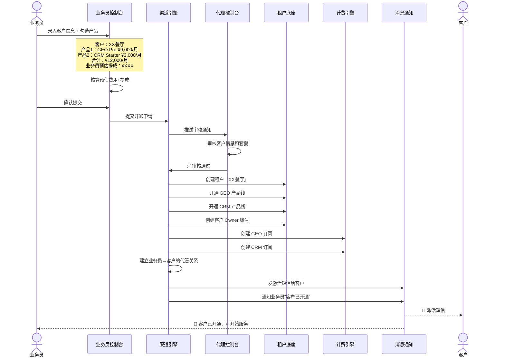
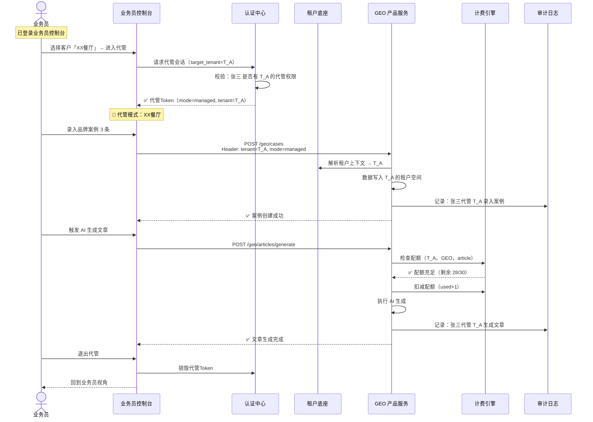
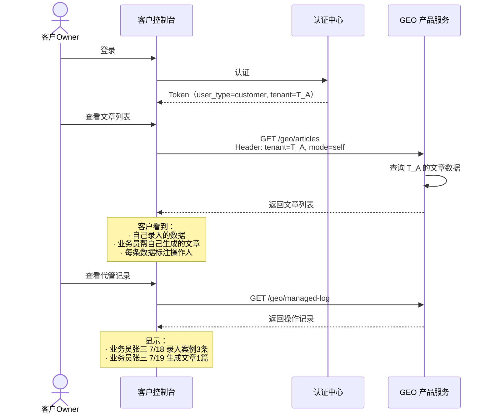
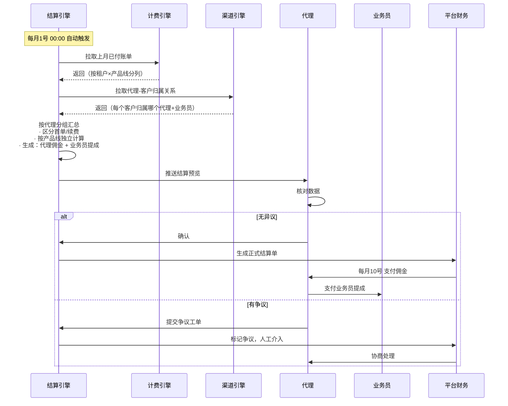
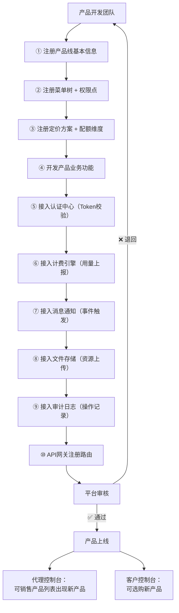
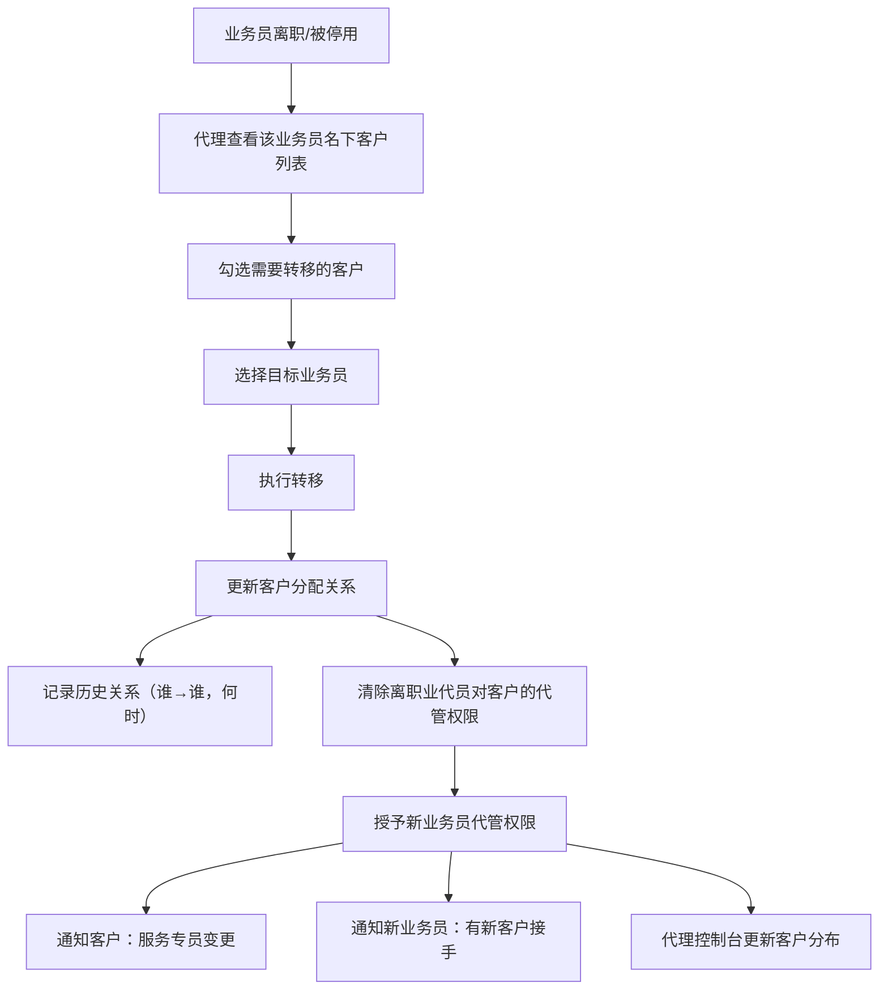
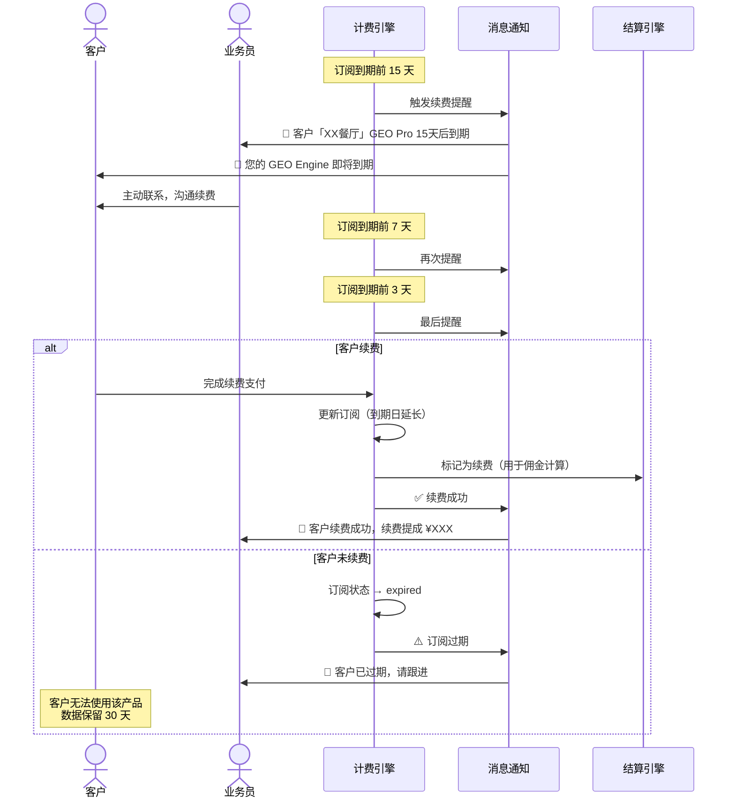

# 06 · 核心业务流程

> 系统最关键的业务流程设计，含时序图和泳道图。

---

## 一、客户开通多产品流程

### 1.1 泳道图

### 1.2 异常处理

| 异常 | 处理 |
|------|------|
| 代理审核拒绝 | 退回业务员，附原因。客户信息保留，业务员可修改后重新提交 |
| 租户创建失败 | 回滚已创建的资源，返回错误。业务员可重试 |
| 产品线开通部分失败 | 已开通的保留，失败的标记 pending，后台异步重试 |
| 计费创建失败 | 租户已创建但订阅未生效——后台异步补偿 |

---

## 二、代客管理操作流程

### 2.1 业务员代管客户生成文章

### 2.2 客户自管查看文章

---

## 三、佣金结算流程

### 3.1 月度结算泳道图

---

## 四、新产品线接入流程

---

## 五、业务员离职交接流程

---

## 六、客户续费流程

