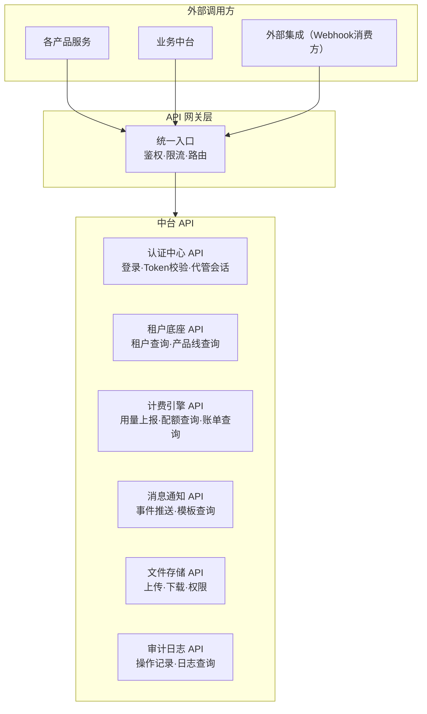

# 07 · API 边界与通信契约

> 中台对外暴露的 API 清单，以及产品调用中台的规范。
> 这是平台底座与产品线之间的"合同"。

---

## 一、API 分层



---

## 二、认证中心 API

### 2.1 接口清单

| 方法 | 路径 | 说明 | 调用方 |
|------|------|------|--------|
| POST | `/api/auth/login` | 用户登录 | 所有客户端 |
| POST | `/api/auth/logout` | 退出登录 | 所有客户端 |
| POST | `/api/auth/refresh` | 刷新 Token | 所有客户端 |
| GET | `/api/auth/verify` | 校验 Token 有效性 | API网关（内部） |
| POST | `/api/auth/impersonate` | 创建代管会话 | 业务员控制台 |
| DELETE | `/api/auth/impersonate` | 销毁代管会话 | 业务员控制台 |
| GET | `/api/auth/permissions` | 查询用户权限列表 | 客户端（菜单渲染） |

### 2.2 代管会话接口

```
POST /api/auth/impersonate
  请求：
    Authorization: Bearer {业务员Token}
    Body: { target_tenant: "T_A" }
  
  响应 200：
    { 
      token: "{代管Token}",
      mode: "managed",
      target_tenant: "T_A",
      operator: { user_id, user_type: "salesperson" },
      expires_at: "2026-07-19T16:30:00Z"
    }
  
  错误：
    403 - 该业务员没有该客户的代管权限
    409 - 已有活跃的代管会话

DELETE /api/auth/impersonate
  请求：
    Authorization: Bearer {代管Token}
  
  响应 200：
    { message: "代管会话已终止" }
```

---

## 三、租户底座 API

| 方法 | 路径 | 说明 | 调用方 |
|------|------|------|--------|
| POST | `/api/tenants` | 创建租户 | 业务中台（客户开通） |
| GET | `/api/tenants/{tenant_id}` | 查询租户信息 | 所有服务 |
| PUT | `/api/tenants/{tenant_id}` | 更新租户信息 | 业务中台 |
| GET | `/api/tenants/{tenant_id}/products` | 查询租户已开通产品线 | 产品服务（菜单渲染） |
| POST | `/api/tenants/{tenant_id}/products` | 开通产品线 | 业务中台 |
| PUT | `/api/tenants/{tenant_id}/products/{product_code}` | 修改产品线状态 | 业务中台 |

---

## 四、计费引擎 API

### 4.1 接口清单

| 方法 | 路径 | 说明 | 调用方 |
|------|------|------|--------|
| POST | `/api/billing/subscriptions` | 创建订阅 | 业务中台（客户开通） |
| GET | `/api/billing/subscriptions/{id}` | 查询订阅 | 产品服务/客户端 |
| PUT | `/api/billing/subscriptions/{id}` | 修改订阅（升级/降级） | 业务中台 |
| POST | `/api/billing/usage/report` | 上报用量 | **产品服务** |
| GET | `/api/billing/usage/check` | 检查配额余量 | **产品服务** |
| GET | `/api/billing/bills` | 查询账单列表 | 客户端/代理 |
| GET | `/api/billing/bills/{id}` | 查询账单详情 | 客户端/代理 |

### 4.2 用量上报接口（产品服务最常用的接口）

```
POST /api/billing/usage/report
  请求：
    Header: X-Tenant-Id: T_A
    Body: {
      product_code: "GEO",
      dimension: "article_count",
      amount: 1,
      action: "increment"       // increment（扣减）| check（仅查询）
    }
  
  响应 200：
    {
      allowed: true,
      quota: {
        dimension: "article_count",
        used: 29,
        limit: 30,
        remaining: 1,
        usage_percent: 96.7,
        warning: "配额即将耗尽"
      }
    }
  
  响应 200（超额-软限制）：
    {
      allowed: true,            // 仍允许操作
      quota: { ... },
      overage: {
        overage_count: 2,
        overage_unit_price: 120,
        estimated_charge: 240
      },
      warning: "已超出配额，将产生超额费用"
    }
  
  响应 403（超额-硬限制）：
    {
      allowed: false,
      reason: "配额已耗尽，请充值",
      action_required: "recharge"
    }
```

---

## 五、消息通知 API

| 方法 | 路径 | 说明 | 调用方 |
|------|------|------|--------|
| POST | `/api/notify/events` | 推送事件 | 所有服务 |
| GET | `/api/notify/templates` | 查询通知模板 | 产品服务 |
| PUT | `/api/notify/preferences` | 配置通知偏好 | 客户端 |

```
POST /api/notify/events
  请求：
    Body: {
      event_type: "quota.warning",
      tenant_id: "T_A",
      recipients: [{ user_id, channel: "sms" }],
      payload: {
        product_name: "GEO Engine",
        quota_dimension: "文章数",
        used: 29,
        limit: 30
      }
    }
  
  说明：
    消息通知中心根据 event_type 匹配模板，按 recipients 指定的渠道发送。
    发送结果写入通知日志（成功/失败/重试）。
```

---

## 六、文件存储 API

| 方法 | 路径 | 说明 |
|------|------|------|
| POST | `/api/storage/upload` | 上传文件 |
| GET | `/api/storage/{file_id}` | 获取文件（含权限校验） |
| DELETE | `/api/storage/{file_id}` | 删除文件 |
| POST | `/api/storage/upload-url` | 获取预签名上传 URL（大文件） |

```
POST /api/storage/upload
  请求：
    Header: X-Tenant-Id: T_A
    Body: FormData { file, resource_type: "brand_image", product_code: "GEO" }
  
  响应 200：
    {
      file_id: "f_xxx",
      url: "https://cdn.ark-engine.com/T_A/geo/images/logo.png",
      size: 102400,
      mime_type: "image/png"
    }
```

---

## 七、审计日志 API

| 方法 | 路径 | 说明 | 调用方 |
|------|------|------|--------|
| POST | `/api/audit/log` | 写入审计日志 | 所有服务 |
| GET | `/api/audit/logs` | 查询审计日志 | 平台运营/客户 |

```
POST /api/audit/log
  请求：
    Body: {
      action: "article.create",
      operator: { user_id, user_type, mode: "managed" },
      target: { tenant_id: "T_A", resource_type: "article", resource_id: "142" },
      detail: "生成文章「行为量化管理：从KPI到动态行为积分」",
      timestamp: "2026-07-19T14:30:00Z"
    }
```

---

## 八、网关请求头规范

所有通过网关的请求，下游服务可信任以下 Header：

| Header | 说明 | 示例 |
|--------|------|------|
| `X-Tenant-Id` | 当前请求的租户上下文 | `T_A` |
| `X-User-Id` | 当前请求的用户 | `U_001` |
| `X-User-Type` | 用户类型 | `salesperson` |
| `X-Mode` | 操作模式 | `self` / `managed` |
| `X-Operator-Id` | 实际操作人（代管模式时） | `U_SALES_001` |
| `X-Request-Id` | 请求追踪 ID | `req_xxx` |

**产品服务只需信任这些 Header，无需自行解析 Token。**

---

## 九、错误码规范

| 状态码 | 错误码 | 说明 |
|:------:|--------|------|
| 401 | `UNAUTHORIZED` | Token 无效或过期 |
| 403 | `FORBIDDEN` | 无权限 |
| 403 | `TENANT_SUSPENDED` | 租户已暂停 |
| 403 | `QUOTA_EXCEEDED` | 配额耗尽（硬限制） |
| 404 | `NOT_FOUND` | 资源不存在 |
| 409 | `CONFLICT` | 资源冲突（如重复创建） |
| 429 | `RATE_LIMITED` | 触发限流 |

所有错误响应格式统一：

```json
{
  "error": {
    "code": "QUOTA_EXCEEDED",
    "message": "文章配额已耗尽，请充值或升级套餐",
    "detail": {
      "product_code": "GEO",
      "dimension": "article_count",
      "used": 30,
      "limit": 30
    }
  }
}
```
