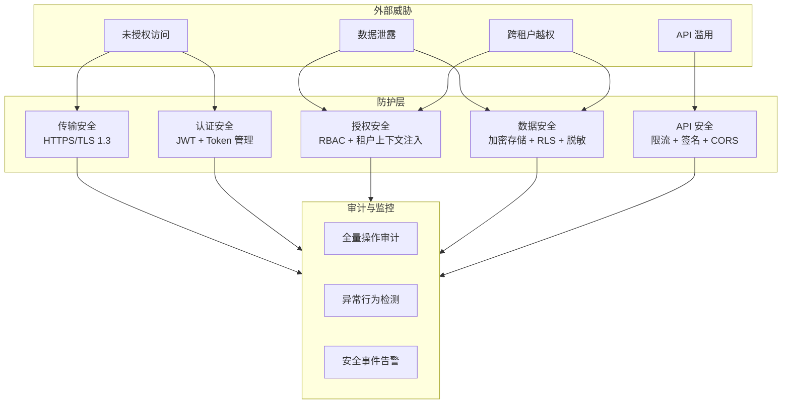
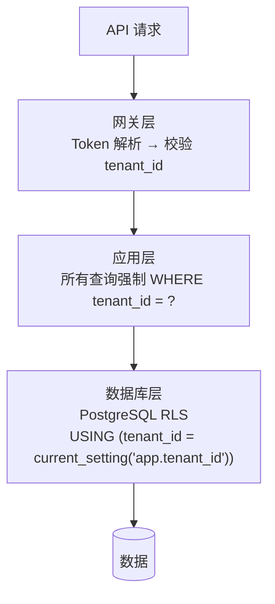
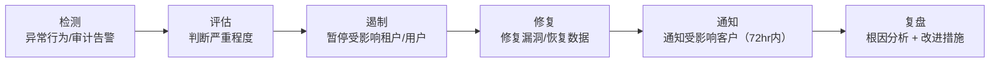

# 08 · 安全架构设计

> 平台底座的认证安全、数据安全、API 安全和租户隔离的完整安全策略。

---

## 一、安全架构全景



---

## 二、认证安全

### 2.1 Token 策略

| 策略 | 配置 |
|------|------|
| Token 类型 | JWT（Access Token + Refresh Token） |
| Access Token 有效期 | 2 小时 |
| Refresh Token 有效期 | 30 天 |
| 签名算法 | RS256（非对称加密） |
| Token 存储 | 客户端存储，服务端不存储 Access Token |

### 2.2 登录安全

| 策略 | 说明 |
|------|------|
| 密码加密 | bcrypt（cost factor ≥ 12），不可逆 |
| 登录失败锁定 | 连续 5 次失败 → 锁定 15 分钟 |
| 短信验证码 | 6 位数字，有效期 5 分钟，同一手机号每分钟限发 1 次 |
| 多设备登录 | v1 不限制，v2+ 异常设备检测 |

### 2.3 代管会话安全

```
业务员代管客户时的安全约束：

  ① 代管 Token 有效期 2 小时（短于普通 Token）
  ② 代管 Token 绑定目标租户，不可切换
  ③ 所有代管操作标记 mode=managed，审计可区分
  ④ 敏感操作在代管模式下被拦截：
     - 修改客户登录密码
     - 修改套餐和支付信息
     - 删除客户租户
     - 导出客户完整数据
  ⑤ 客户可随时在控制台查看代管操作记录
  ⑥ 客户可一键终止代管，使所有代管 Token 立即失效
```

---

## 三、授权安全

### 3.1 租户数据隔离的保障层次



**防御深度**：即使应用层漏写了 tenant_id 过滤，数据库 RLS 会兜底。即使 RLS 被绕过，网关层会拒绝没有 tenant context 的请求。

### 3.2 跨租户访问控制

| 场景 | 控制策略 |
|------|---------|
| 客户访问自己的数据 | tenant_id = 自己的租户 → 允许 |
| 业务员代管客户 | 需有效代管 Token + 校验代管授权关系 → 允许 |
| 代理查看名下客户 | 需校验代理→客户的归属关系 → 允许 |
| 平台人员查看任意租户 | 需 platform_role = super_admin 或 platform_admin → 允许 + 全量审计 |
| 客户 A 访问客户 B 的数据 | 拒绝（403） |

---

## 四、数据安全

### 4.1 数据分级

| 级别 | 数据类别 | 加密要求 | 示例 |
|:----:|---------|---------|------|
| 🔴 极高敏感 | 密码、API Key、支付信息 | 加密存储 + 传输加密 + 禁止日志输出 | 密码哈希、LLM API Key |
| 🟡 敏感 | 客户品牌数据、文章内容、案例 | 传输加密 + 访问控制 | 企业名称、品牌知识库 |
| 🟢 普通 | 菜单配置、产品信息、公开元数据 | 访问控制 | 套餐名称、功能菜单 |

### 4.2 加密策略

| 场景 | 策略 |
|------|------|
| 密码存储 | bcrypt 单向哈希（不可解密） |
| API Key 存储 | AES-256-GCM 加密存储，使用时解密 |
| 数据传输 | 全站 HTTPS（TLS 1.3），HSTS 强制 |
| 数据库备份 | 加密备份，密钥与数据库分离存储 |
| 日志脱敏 | 手机号中间 4 位打码、密码/Token 不记入日志 |

### 4.3 数据删除与保留

| 场景 | 策略 |
|------|------|
| 客户主动删除文章 | 软删除，标记 deleted_at，30 天后物理清除 |
| 租户销户 | 软删除租户，30 天后物理清除所有数据 |
| 合规要求（如用户要求删除个人数据） | 平台运营在 7 个工作日内处理 |
| 审计日志 | 保留 1 年，到期可归档导出后清理 |
| 数据库备份 | 每日备份保留 7 天，每周备份保留 1 个月 |

---

## 五、API 安全

### 5.1 防护措施

| 威胁 | 防护 |
|------|------|
| SQL 注入 | ORM 参数化查询，禁止拼接 SQL |
| XSS | 输出编码，CSP Header |
| CSRF | SameSite Cookie + CSRF Token（Web 场景） |
| API 滥用 | 按租户/用户/IP 分级限流 |
| 暴力破解 | 登录频率限制 + 账户锁定 |
| 重放攻击 | 请求级 Nonce（高安全场景） |

### 5.2 限流策略

| 级别 | 限制 | 适用 |
|------|------|------|
| 全局 | 10,000 req/min | 整个平台 |
| 租户级 | 1,000 req/min | 单个租户 |
| 用户级 | 300 req/min | 单个用户 |
| 登录接口 | 5 req/min/IP | 防暴力破解 |
| LLM 调用 | 30 req/min/租户 | 防止滥用 AI 生成 |

触发限流后返回 `429 Too Many Requests`。

---

## 六、运维安全

| 策略 | 说明 |
|------|------|
| 最小权限原则 | 生产环境数据库只有应用服务能访问，开发人员通过审计跳板机访问 |
| 密钥轮换 | API Key、JWT 签名密钥定期轮换 |
| 依赖安全 | 定期扫描第三方依赖漏洞 |
| 安全补丁 | 操作系统和中间件的安全补丁在 7 天内评估并应用 |
| 访问控制 | SSH 密钥登录（禁用密码），跳板机 + 审计 |

---

## 七、安全事件响应



| 严重程度 | 响应时间 | 通知义务 |
|:---:|:---:|------|
| 🔴 严重（数据泄露） | 1 小时内响应 | 72 小时内通知受影响客户 |
| 🟡 高（权限漏洞） | 4 小时内响应 | 修复后通知 |
| 🟢 中（配置问题） | 24 小时内响应 | 内部通报 |
