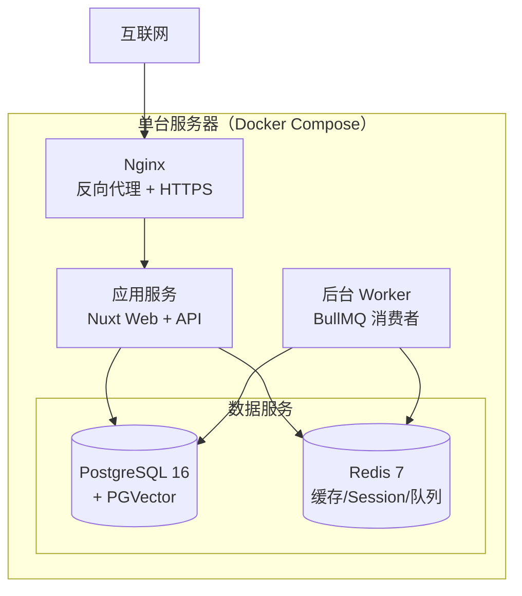
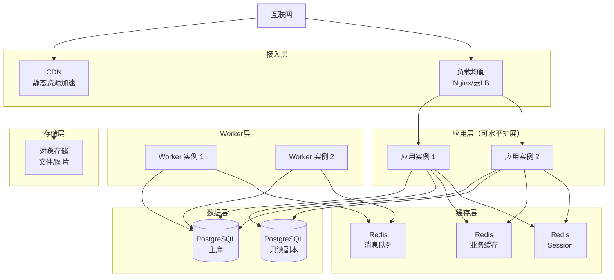
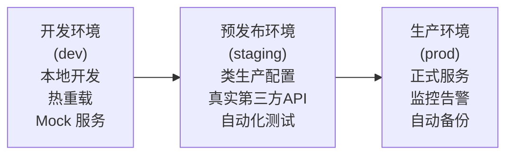
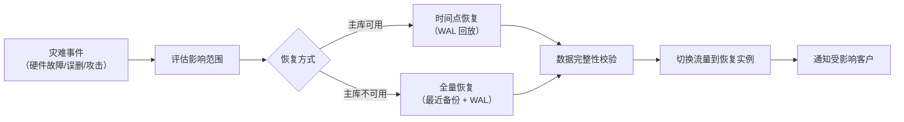

# 09 · 非功能需求与部署架构

> 性能指标、可用性、容量规划、部署拓扑、环境管理、监控与告警。

---

## 一、非功能需求指标

### 1.1 性能指标

| 指标 | v1 目标 | v2+ 目标 | 说明 |
|------|:------:|:------:|------|
| API 平均响应时间（不含 LLM 调用） | < 200ms | < 100ms | 登录、查询列表、CRUD 等常规操作 |
| API P99 响应时间（不含 LLM 调用） | < 1s | < 500ms | 极端情况下 |
| LLM 生成请求超时 | 120s | 120s | AI 调用本身耗时长 |
| 并发租户数 | 50 | 500 | 同时活跃的租户 |
| 并发用户数 | 200 | 2,000 | 同时在线用户 |
| 单租户最大数据量 | 10 万条记录 | 100 万条记录 | 文章+知识库 |
| 文件上传大小限制 | 10 MB | 50 MB | 图片和附件 |

### 1.2 可用性指标

| 指标 | v1 目标 | v2+ 目标 |
|------|:------:|:------:|
| 系统可用性（SLA） | 99.5%（月宕机 < 3.6 小时） | 99.9%（月宕机 < 43 分钟） |
| 计划内维护窗口 | 每周日凌晨 2:00-4:00 | 每月 1 次，提前 7 天通知 |
| RTO（恢复时间目标） | 4 小时 | 1 小时 |
| RPO（恢复点目标） | 24 小时（每日备份） | 1 小时（实时同步） |

### 1.3 容量规划（v1 单机部署）

| 资源 | 规格 | 支撑能力 |
|------|------|---------|
| CPU | 4 核 | 支撑 50 并发请求 |
| 内存 | 8 GB | 应用 + 缓存 |
| 磁盘 | 100 GB SSD | 数据库 + 文件存储（可扩展 OSS） |
| 带宽 | 10 Mbps | API 请求 + 文件传输 |

**扩展触发条件**：
- CPU 持续 > 70% → 升级规格
- 磁盘使用 > 80% → 扩容或迁移到 OSS
- API 平均响应时间 > 500ms → 增加缓存或读写分离

---

## 二、部署架构

### 2.1 单机部署拓扑（v1）

### 2.2 扩展部署拓扑（v2+）

---

## 三、环境管理

| 环境 | 用途 | 数据库 | 第三方 API | 监控 |
|------|------|:---:|:---:|:---:|
| dev | 日常开发 | 本地 PostgreSQL | Mock/Sandbox | ❌ |
| staging | 集成测试、UAT | 独立实例，脱敏数据 | Sandbox | 基础 |
| prod | 正式服务 | 生产实例，主备 | 正式 API | 全量 |

---

## 四、健康检查

| 端点 | 用途 | 检查内容 |
|------|------|---------|
| `GET /api/health` | 负载均衡健康探测 | 进程存活 |
| `GET /api/health/ready` | 就绪检查 | 数据库连通 + Redis 连通 |
| `GET /api/health/deep` | 深度检查 | 数据库查询 + LLM API 连通性 |

---

## 五、监控与告警

### 5.1 监控维度

| 维度 | 指标 | 告警阈值 |
|------|------|:---:|
| 应用健康 | 错误率 | > 1% |
| 应用健康 | API 响应时间 P95 | > 2s |
| 基础设施 | CPU 使用率 | > 80% |
| 基础设施 | 内存使用率 | > 85% |
| 基础设施 | 磁盘使用率 | > 80% |
| 业务 | LLM 调用失败率 | > 5% |
| 业务 | 客户开通成功率 | < 95% |
| 安全 | 登录失败率异常 | 5 分钟内 > 20 次 |

### 5.2 日志分级

| 级别 | 用途 | 保留 |
|:----:|------|:----:|
| ERROR | 系统错误、异常堆栈 | 90 天 |
| WARN | 配额预警、降级处理 | 30 天 |
| INFO | 关键业务操作（开通/续费/结算） | 30 天 |
| DEBUG | 调试信息（仅 dev/staging） | 7 天 |
| AUDIT | 操作审计日志 | 1 年 |

---

## 六、灾备与数据保护

| 策略 | 说明 |
|------|------|
| 数据库备份 | 每日全量备份 + 持续 WAL 归档 |
| 备份保留 | 每日备份保留 7 天，每周备份保留 1 个月 |
| 备份验证 | 每周自动恢复测试（恢复到临时实例） |
| 异地备份 | v2+ 备份副本存储到不同地域 |
| 文件备份 | 对象存储自带多副本（OSS/COS/MinIO） |

### 灾难恢复流程

---

## 七、与架构总览的关联

本文档是 [01 · 系统架构总览](./01-system-overview.md) 的非功能补充。在架构决策记录中新增：

| 编号 | 决策 | 内容 |
|------|------|------|
| **ADR-007** | v1 单机部署，v2 扩展拆分 | 不提前优化，按实际负载扩展 |
| **ADR-008** | 每日全量备份 + WAL 归档 | 保障 RPO ≤ 24h（v1），RPO ≤ 1h（v2） |
| **ADR-009** | 审计日志与业务日志分离 | 审计日志独立存储，保留 1 年 |
| **ADR-010** | 第三方 API Key 加密存储 | AES-256-GCM，与代码和配置分离 |
