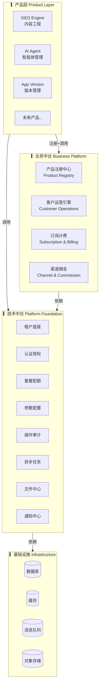
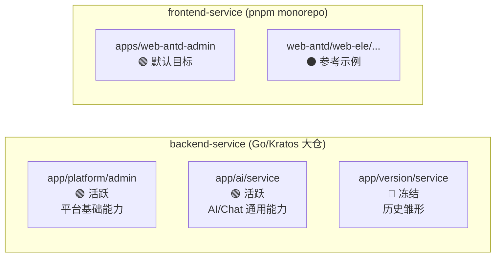
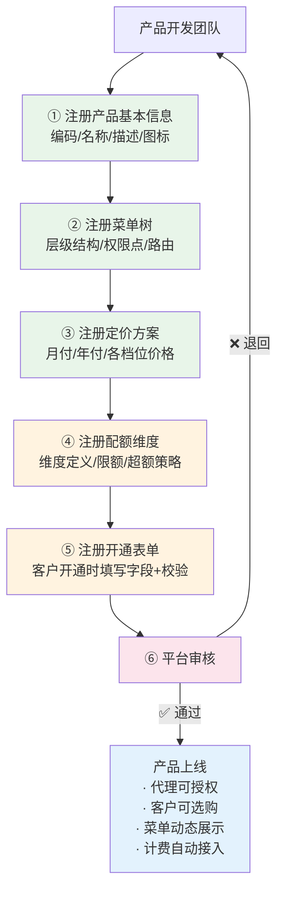
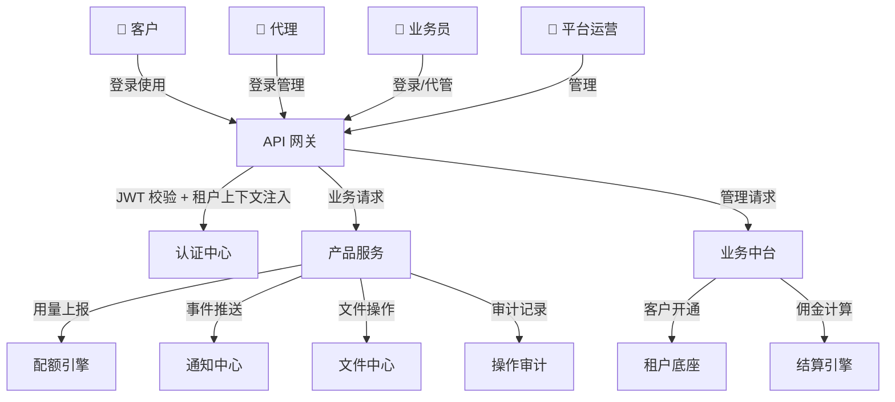

# Ark Tech Platform 架构总览

日期：2026-07-22
状态：生效
本文档是 Ark Tech Platform 的当前架构第一入口，合并了 Ark Engine 目标架构设计和当前工程实践。

---

## 一、项目定位

**Ark Tech Platform** 是面向多产品 SaaS 的技术平台与业务承载底座。

```
Ark Tech Platform
├── Ark Platform Foundation    ← 技术底座（多租户/认证/权限/配额/审计/任务/文件/通知）
├── Ark Business Platform      ← 商业平台（产品注册/客户运营/订阅计费/渠道/佣金）
└── Ark Product Services       ← 产品服务（GEO Engine / AI Agent / App Version Management）
```

GEO Engine、AI Agent Management、App Version Management 是平台之上的 **Ark Product Services**，不是平台本身。

---

## 二、四层架构全景



### 各层职责

| 层 | 所有权 | 核心职责 | 变更频率 |
|---|--------|---------|:---:|
| **产品层** | 各产品团队 | 业务功能、领域逻辑、产品特有 UI | 高 |
| **业务中台** | 平台团队 | 跨产品商业化能力（注册/运营/计费/渠道） | 中 |
| **技术中台** | 平台团队 | 通用技术能力（租户/认证/审计/任务等） | 低 |
| **基础设施** | 平台/SRE | 数据库、缓存、存储、网络 | 极低 |

### 核心规则

- **中台不包含业务逻辑** — 技术中台只提供通用能力，业务中台只提供跨产品运营能力
- **产品间数据隔离** — 产品 A 不能直接访问产品 B 的数据库表，跨产品数据交换走 API
- **租户数据强隔离** — 不同租户的数据在应用层和存储层双重隔离
- **产品线注册制** — 新产品接入走配置注册，不改中台代码

---

## 三、当前工程基线

当前代码基线保持稳定，不做一次性重写：

| 层级 | 技术选型 |
|------|---------|
| 后端语言 | Go 1.24.6 |
| 后端框架 | go-kratos v2（大仓 + 模块化服务边界） |
| API 契约 | Protobuf + gRPC + HTTP annotations + Buf |
| ORM | Ent v0.14.5 |
| DI | Wire v0.7.0 |
| 数据库 | MySQL / PostgreSQL |
| 缓存 | Redis |
| 认证 | JWT + Casbin |
| 前端框架 | Vue 3 + TypeScript |
| 管理后台 | Vben Admin 5.0 + Ant Design Vue |
| 构建 | Vite + pnpm workspace |
| 状态管理 | Pinia |

### 活跃服务



---

## 四、模块全景地图

技术中台 14 个能力模块，分 4 个阶段交付：

| # | 模块 | 阶段 | 当前状态 | 核心职责 |
|:---:|------|:---:|:---:|---------|
| 1 | 统一租户底座 | 🟢 P0 | ✅ 已验证 | 多租户 + 多产品叠加、生命周期、数据隔离 |
| 2 | 统一认证与权限 | 🟢 P0 | ✅ 已验证 | JWT/会话、RBAC、Casbin、平台/租户身份分离 |
| 3 | 套餐与配额 | 🟢 P0 | ✅ 已验证 | 套餐版本化、菜单权限组、资源额度 |
| 4 | 操作审计 | 🟢 P0 | ✅ 已验证 | 全量操作记录、append-only、变更对比 |
| 5 | 参数配置中心 | 🟢 P0 | ✅ 已验证 | 平台定义 + 租户覆盖、类型约束、版本缓存 |
| 6 | 异步任务中心 | 🟢 P0 | ✅ 已验证 | 持久化任务、租约抢占、幂等入队、重试退避 |
| 7 | 文件中心 | 🟢 P0 | ✅ 已验证 | 多存储渠道、额度检查、S3/本地、访问日志 |
| 8 | 通知中心 | 🟢 P0 | ✅ 已验证 | 站内信模板、异步发送、已读/未读 |
| 9 | 数据权限 | 🟢 P1 | ✅ 已实现 | 角色数据范围、部门层级、自定义范围 |
| 10 | 统一审批引擎 | 🔵 P1 | 📋 设计阶段 | 多级审批流、超时策略、审批代理 |
| 11 | Webhook 与事件中心 | 🟠 P2 | 📋 设计阶段 | 事件订阅、签名投递、失败重试、死信重放 |
| 12 | 统一搜索服务 | 🟠 P2 | 📋 预留 | 全文检索、租户隔离、中文分词 |
| 13 | 统一可观测性 | 🟠 P2 | 📋 预留 | 链路追踪、集中日志、告警规则 |
| 14 | 统一开发者平台 | 🟠 P2 | 📋 预留 | SDK 生成、API 文档门户、沙箱环境 |

---

## 五、产品注册模型

新产品接入平台的核心流程：



前三步是 **纯配置注册**，立即生效；后三步需 **开发接入**，完成后方可上线。

---

## 六、数据流全景



---

## 七、架构决策记录

| ADR | 决策 | 理由 |
|:---:|------|------|
| **ADR-001** | `platform/admin` 为平台基础服务，产品业务不入此服务 | 防止基础服务被业务逻辑污染 |
| **ADR-002** | 套餐优先：菜单通过套餐→租户→角色传递 | 保证权限路径可追溯 |
| **ADR-003** | 缓存非授权事实来源，数据库和 authorizer 才是 | 缓存失效优先正确性 |
| **ADR-004** | 前端 API 类型手写，Proto 为契约来源 | 不再依赖旧的代码生成 |
| **ADR-005** | 测试基线先提交再扩展 | 质量可持续 |
| **ADR-006** | 初期单机部署，大仓模块化 | 不提前做微服务拆分 |

---

## 八、核心设计约束

| 约束 | 说明 |
|------|------|
| **产品间数据隔离** | 产品 A 不能直接访问产品 B 的数据库表，跨产品数据交换走 API |
| **中台不包含业务逻辑** | 中台只提供通用能力，不包含任何产品特有的业务规则 |
| **租户数据强隔离** | 不同租户的数据在应用层（tenant_id 强制）和存储层双重隔离 |
| **审计全覆盖** | 所有数据变更操作记录审计日志（谁、何时、操作、结果） |
| **权限后端兜底** | 前端隐藏按钮不能替代后端权限校验 |
| **契约优先** | 所有 API 变更先更新 Proto，再生成代码 |
| **生成代码不手改** | API、Ent gen、OpenAPI、Swagger UI bundle 只由源文件生成 |

---

## 九、阅读顺序

| 场景 | 推荐阅读路径 |
|------|------------|
| **首次了解平台** | 00 → 01 → 02 → 43 |
| **开发平台基础能力** | 00 → 02 → 10 系列（按需） |
| **接入新产品** | 00 → 01 → 21 → 30 → 41 |
| **了解安全架构** | 00 → 11 → 32 |
| **部署上线前** | 00 → 32 → 33 |
| **继续中断的开发** | 00 → 43 → 对应专题文档 |

---

## 十、文档体系说明

```
docs/architecture/
├── 00-02  总览层           ← 架构全景、分层定义、技术栈
├── 10-18  技术中台            ← 已实现能力的详细设计
├── 20-24  业务中台            ← 商业化能力设计（标注路线图优先级）
├── 30-33  跨领域设计          ← API 契约、数据模型、安全、NFR
├── 40-44  工程治理            ← 生产化优化、接入规范、ADR、路线图、整合记录
```

每篇文档头部标注 **状态**（设计阶段 / 已实现 / 已验证 / 生效）和 **优先级**（P0/P1/P2/P3），防止"设计文档"被当成"实现要求"。
