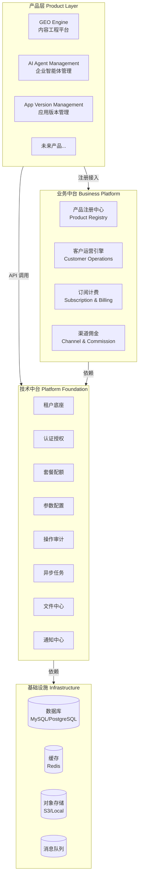
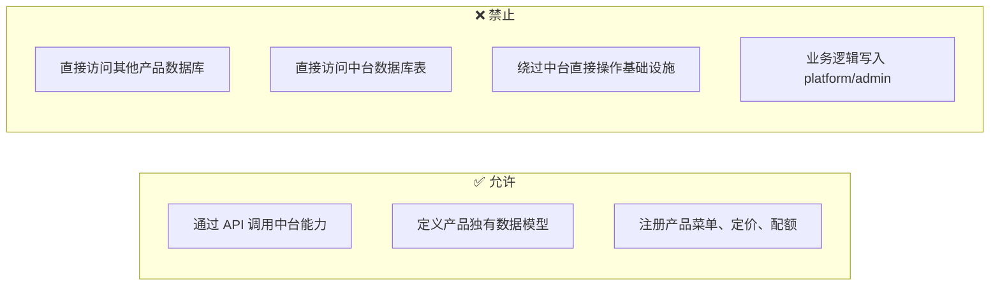
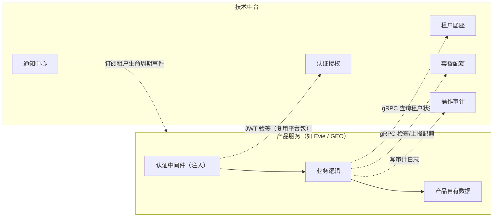
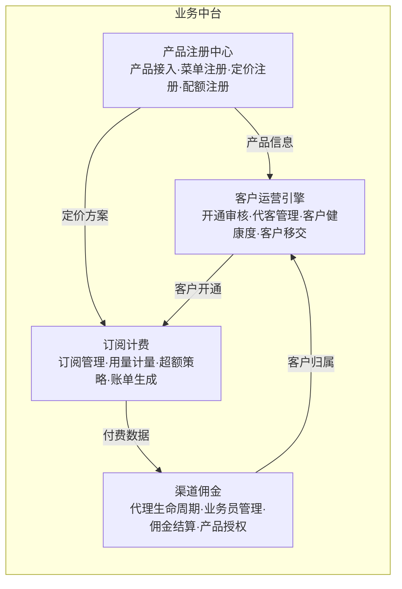
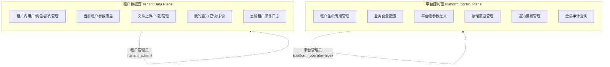
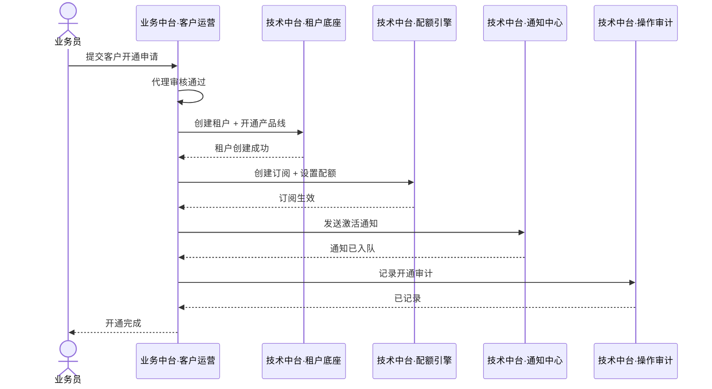
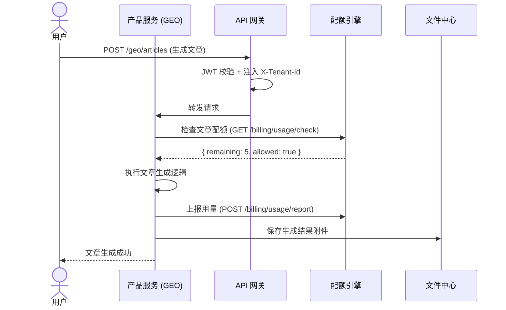
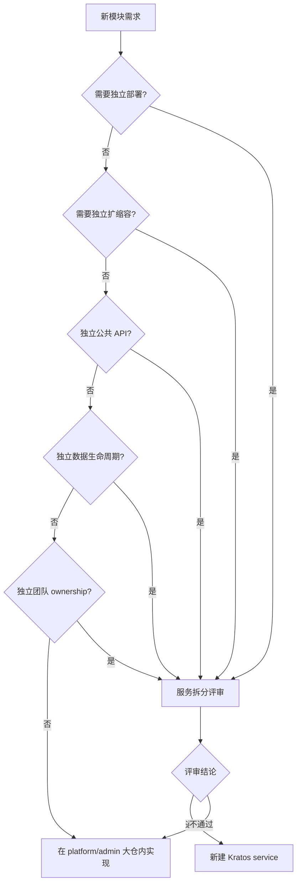

# 平台分层设计

日期：2026-07-22
状态：生效
范围：Ark Tech Platform 整体架构

---

## 一、分层总览

Ark Tech Platform 采用四层架构，从上到下依次为产品层、业务中台、技术中台、基础设施。

---

## 二、产品层

### 职责

- 实现产品特有的业务逻辑和领域模型
- 定义产品自己的数据模型和 API
- 构建产品专属的前端界面和交互
- 通过 API 调用中台能力，不直接访问中台数据库

### 当前产品服务

| 产品 | 状态 | 定位 | 后端落点 |
|------|:---:|------|---------|
| GEO Engine | 📋 规划中 | 内容工程、知识库、AI 生成、后处理、发布、追踪 | `docs/services/geo-content-engine` |
| AI Agent Management | 📋 规划中 | 企业智能体、语音接入、工具调用、知识问答 | `docs/services/ai-agent-management` |
| App Version Management | 📦 历史参考 | 版本发布、灰度、下载、反馈、协议 | `docs/services/app-version-management` |

### 产品层约束

### 产品服务与中台协作模式

产品服务不自行管理租户、用户、认证、会话等横向能力，全部通过 RPC + 中间件注入复用技术中台。

**协作规则（强制）：**

| 规则 | 说明 |
|------|------|
| 认证复用 | 产品服务注入平台 JWT 中间件验签，不自建登录、不自己签发 token |
| 租户上下文 | `tenant_id` 从 JWT claims 提取，不接受客户端传入，不自己建 tenant 表 |
| 用户上下文 | `user_id` 从 JWT claims 提取，不自己建 user 表、不管理 session |
| 租户状态 | 需要实时租户状态时通过 gRPC 调租户底座，不在本地缓存 |
| 配额管控 | 通过配额 API 检查和上报，不自建计量逻辑 |
| 审计日志 | 写操作通过操作审计 API 记录，不自建审计表 |
| 生命周期事件 | 通过通知中心/Webhook 订阅租户暂停、注销等事件，做数据清理 |
| 模块边界 | `tenant_id` 只作为数据隔离键，不作为外键关联中台表 |

> 后续新增产品服务自动继承此协作模式，无需单独讨论。接入检查清单见 [4-1-产品服务模块接入规范](./4-1-治理-产品服务模块接入规范.md)。

---

## 三、业务中台

### 职责

- 跨产品的商业化运营能力，所有产品共用的"管生意"能力
- 管理产品线注册、客户关系、订阅计费、渠道代理和佣金结算
- 不包含任何具体产品的业务逻辑

### 模块总览

### 模块优先级

| # | 模块 | 优先级 | 状态 | 说明 |
|:---:|------|:---:|:---:|------|
| 1 | 产品注册中心 | 🟢 P1 | 📋 设计阶段 | 统一产品接入入口，先建设 |
| 2 | 订阅计费 | 🟡 P2 | 📋 设计阶段 | 依赖产品注册和配额模型成熟 |
| 3 | 客户运营引擎 | 🟡 P2 | 📋 设计阶段 | 依赖租户底座和多产品开通成熟 |
| 4 | 渠道佣金 | 🟠 P3 | 📋 设计阶段 | 有明确渠道业务需求时启动 |

---

## 四、技术中台

### 职责

- 所有产品共用的技术底座，一次建设、多次复用
- 不包含任何业务逻辑，只提供通用技术能力
- 平台控制面和租户数据面分离

### 交付阶段

```mermaid
graph LR
    subgraph P0["🟢 P0 · MVP (已完成)"]
        P0_1["租户底座"]
        P0_2["认证授权"]
        P0_3["套餐配额"]
        P0_4["操作审计"]
        P0_5["参数配置"]
        P0_6["异步任务"]
        P0_7["文件中心"]
        P0_8["通知中心"]
    end

    subgraph P1["🔵 P1 · 完整中台"]
        P1_1["数据权限"]
        P1_2["审批引擎"]
        P1_3["Webhook"]
        P1_4["安全增强"]
    end

    subgraph P2["🟠 P2 · 规模化"]
        P2_1["搜索服务"]
        P2_2["可观测性"]
        P2_3["开发者平台"]
        P2_4["国际化"]
    end

    P0 --> P1 --> P2
```

### 平台控制面 vs 租户数据面

**关键安全规则：**

- 平台控制面操作需要 `is_platform=true` + JWT `platform_operator=true` + Casbin 平台策略 + 中间件四重校验
- 租户数据面 API 从 auth context 提取 `tenant_id`，不接受客户端传入
- `super_admin` 是租户级角色，不是平台级角色

---

## 五、层间协作模式

### 典型流程：客户开通

### 产品调用中台

---

## 六、微服务拆分条件

当前阶段采用 **大仓 + 模块化服务边界优先** 策略。不因新增模块默认创建新的 Kratos service。

只有满足以下条件之一，才进入服务拆分评审：

| 条件 | 示例 |
|------|------|
| 需要独立部署 | 独立的发版节奏、独立的灰度策略 |
| 需要独立扩缩容 | 某模块 QPS 远高于其他模块 |
| 独立公共 API 或外部接入 | 对外提供 SDK 或第三方可调用的独立 API |
| 独立数据生命周期或合规边界 | 数据需要独立存储、独立备份、独立合规审计 |
| 清晰业务域和团队 ownership | 有独立团队全权负责该模块 |

