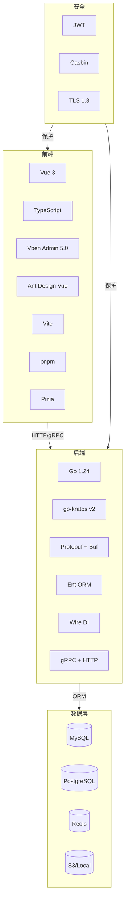
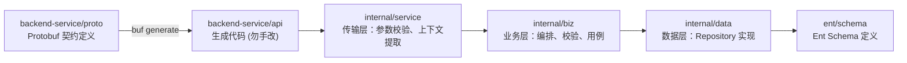
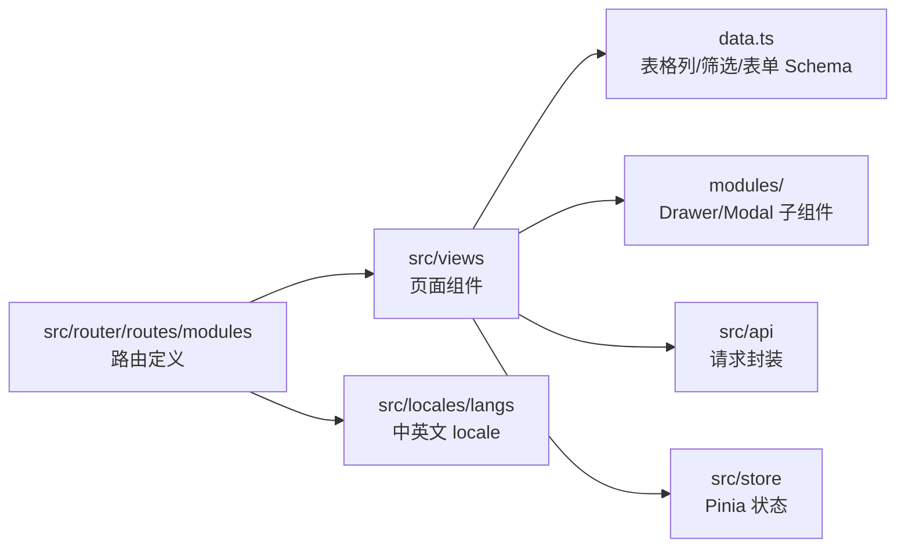
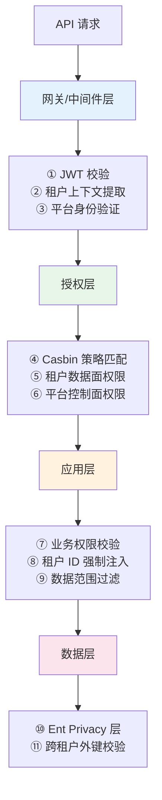

# 技术栈与工程基线

日期：2026-07-22
状态：生效
范围：Ark Tech Platform 全栈

---

## 一、技术选型总览



| 层级 | 技术 | 版本 | 用途 |
|------|------|:---:|------|
| **后端语言** | Go | 1.24.6 | 高性能、强类型、并发原生支持 |
| **后端框架** | go-kratos | v2 | DDD/清洁架构、gRPC+HTTP 双协议、中间件生态 |
| **API 契约** | Protobuf | proto3 | 强类型契约、跨语言、Buf 工具链 |
| **API 生成** | Buf | latest | Proto lint、breaking change check、代码生成 |
| **ORM** | Ent | v0.14.5 | 类型安全、Schema-first、Privacy 层、迁移 |
| **DI** | Wire | v0.7.0 | 编译期依赖注入、零运行时开销 |
| **前端框架** | Vue 3 | 3.x | Composition API、响应式、TypeScript 支持 |
| **管理后台** | Vben Admin | 5.0 | 企业级中后台模板、权限路由、国际化 |
| **UI 组件** | Ant Design Vue | 4.x | 企业级设计体系 |
| **构建** | Vite + pnpm | latest | 快速 HMR、monorepo workspace |
| **状态管理** | Pinia | latest | Vue 3 官方推荐、类型友好 |
| **数据库** | MySQL | 8.0+ | 主数据库 |
| **数据库(可选)** | PostgreSQL | 15+ | RLS 数据隔离增强 |
| **缓存** | Redis | 7+ | Session、权限缓存、分布式锁 |
| **认证** | JWT + Casbin | — | Access/Refresh Token + RBAC 策略 |
| **对象存储** | S3-compatible / Local | — | 文件存储多 Provider |

---

## 二、后端架构流程



### 分层职责

| 层 | 目录 | 职责 | 禁止 |
|---|------|------|------|
| Proto | `backend-service/proto/` | API 契约唯一事实来源 | — |
| API(生成) | `backend-service/api/` | gRPC/HTTP 服务端+客户端代码 | ❌ 手改 |
| Service | `app/*/internal/service/` | 请求参数校验、认证上下文传递、响应组装 | ❌ 业务逻辑 |
| Biz | `app/*/internal/biz/` | 业务编排、权限校验、事务管理 | ❌ 直接操作数据库 |
| Data | `app/*/internal/data/` | Repository 实现、Ent Client 封装、缓存操作 | ❌ 业务判断 |
| Ent | `internal/data/ent/schema/` | 数据库结构定义 | — |

### 执行守门规则

新增或修改后端行为必须按以下顺序执行：

1. `backend-service/proto` — 定义/更新 Protobuf 契约
2. `buf generate` — 生成 API 代码
3. `internal/service` — 实现传输层
4. `internal/biz` — 实现业务编排
5. `internal/data` — 实现持久化
6. `internal/data/ent/schema` — 更新数据库结构
7. Wire provider set — 更新依赖注入
8. Tests — 编写测试

---

## 三、前端架构流程



### 标准管理页模式

```text
Page (list.vue)
  + useVbenVxeGrid       ← 表格、工具栏、行操作
  + useVbenDrawer         ← 创建/编辑表单抽屉
  + useVbenForm           ← 表单组件
  + ant-design-vue message/Modal  ← 消息提示/确认弹窗
```

### 文件组织

| 文件 | 职责 |
|------|------|
| `src/router/routes/modules/xxx.ts` | 路由定义、菜单元信息、权限码 |
| `src/views/xxx/list.vue` | 页面壳、表格、工具栏、行操作按钮 |
| `src/views/xxx/data.ts` | 表格列定义、筛选 Schema、表单 Schema |
| `src/views/xxx/modules/form-drawer.vue` | 创建/编辑抽屉表单 |
| `src/views/xxx/modules/detail.vue` | 详情面板 |
| `src/api/xxx.ts` | 请求函数封装 |
| `src/locales/langs/zh-CN/xxx.json` | 中文 locale |
| `src/locales/langs/en-US/xxx.json` | English locale |

---

## 四、安全架构基线



**防御深度：** 每一层独立校验租户隔离，单层失效不影响整体安全。

### 关键安全约束

| 约束 | 实施层 |
|------|--------|
| 权限控制必须在后端执行 | Service + Biz |
| 租户级资源必须验证边界 | Biz + Data |
| 认证失败、无权限、资源不存在返回可区分错误 | Service |
| 平台控制面需要四重校验 | 中间件 + Casbin + JWT + DB |
| 敏感字段不入日志 | 全栈 |

---

## 五、默认开发目标

| 类型 | 默认落点 | 说明 |
|------|---------|------|
| 后端基础能力 | `backend-service/app/platform/admin` | 平台管理后台基础服务 |
| 后端 AI 能力 | `backend-service/app/ai/service` | AI/chat 通用能力 |
| 前端管理后台 | `frontend-service/apps/web-antd-admin` | 管理后台默认应用 |
| 产品服务后端 | 待评审 | 不可进入 `platform/admin` |
| 产品服务前端 | 待评审 | 独立应用或模块 |

### 默认避免修改的区域

- `backend-service-pkg-bakup` — 备份/参考包
- `frontend-service/apps/web-antd` — Vben 示例
- `frontend-service/apps/web-ele` — Vben 示例
- `frontend-service/apps/web-naive` — Vben 示例
- `frontend-service/apps/web-tdesign` — Vben 示例
- `frontend-service/playground` — 演练项目
- `backend-service/api` — 生成代码
- `internal/data/ent/gen` — 生成代码

---

## 六、验证命令

### 后端

```bash
cd backend-service
make check                     # 代码检查
make proto-lint                # Proto 规范检查
buf lint                       # Buf lint
buf breaking                   # 契约兼容性检查
go test ./...                  # 单元测试
```

### 前端

```bash
cd frontend-service
pnpm -F @vben/web-antd-admin run typecheck   # 类型检查
pnpm -F @vben/web-antd-admin run build        # 构建验证
```

### 文档变更检查

```bash
rg "Ark Tech Platform" README.md .agents docs/README.md docs/architecture docs/services docs/product docs/vibe-coding
git diff -- .agents README.md docs
```
