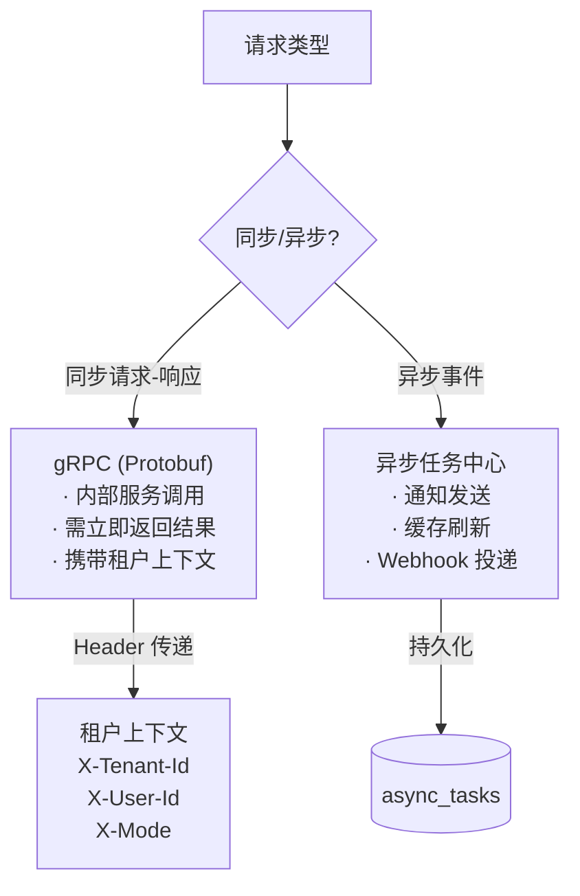
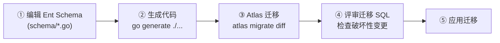

# Ark Tech Platform 后端架构决策

日期：2026-06-16  
状态：生效  
范围：`backend-service`、`docs/services`  、后续产品服务后端模块开发

## 1. 决策摘要

Ark Tech Platform 后端当前采用“go-kratos 大仓 + 模块化服务边界优先”策略。底座管理后台基础服务不承载具体业务，业务产品服务可复用底座认证、权限、项目边界、前后端工程规范和生成链路，但不能和底座混在一起。

结论：

- `backend-service` 保持大仓结构，`app` 下保留未来微服务拆分能力。
- `backend-service/app/platform/admin` 升级为 Ark Tech Platform 管理后台基础服务，负责认证、用户、角色、菜单、权限、中台基础配置和产品服务配置入口。
- `platform/admin` 可以管理产品服务的注册、配置、菜单和权限入口，但不得承接产品服务自身的业务生命周期。
- `backend-service/app/ai/service` 是 Ark Tech Platform AI/chat 能力服务。
- `backend-service/app/version/service` 当前冻结，只保留已存在雏形，不作为新业务落点。
- 业务服务（如版本管理、Release、灰度、下载页、反馈、协议、推送等）不再进入 `backend-service/app/platform/admin`。
- 业务服务需要重新定义后端服务边界；迭代 3 前复审 `version/service` 是删除、迁移、保留，还是升级为正式业务服务。

## 2. 决策背景

当前仓库的目标是开放式 Ark Tech Platform：在基础 SaaS 架构之上扩展多业务场景服务模块。底座基础能力不应与具体业务耦合。

上一阶段曾将业务管理服务和底座管理后台混在一起，这让底座被具体业务污染。当前已经将该服务迁移到 `app/platform/admin`，并升级为底座管理后台基础服务，业务产品服务另行定义。

继续把业务模块写入 `app/platform/admin` 会带来以下问题：

- 底座认证、权限、菜单、中台配置和具体业务发布链路耦合。
- 后续新增其他产品服务时，无法复用纯粹的基础后台。
- 版本、Release、灰度、下载页之间的数据关系尚未稳定，继续放入 admin 会增加后续剥离成本。
- `version/service` 当前只有 Release 雏形，字段和行为还不满足产品需求，不适合作为正式边界。

因此当前优先保证底座基础服务纯粹，再为业务服务定义独立边界。

## 3. 服务边界

### 3.1 当前活跃服务

| 服务 | 当前角色 | 当前状态 | 默认用途 |
| --- | --- | --- | --- |
| `backend-service/app/platform/admin` | 底座管理后台基础服务 | active | 认证、用户、角色、菜单、权限、中台基础配置、产品服务配置入口 |
| `backend-service/app/ai/service` | 底座 AI/chat 能力服务 | active | AI/chat 通用能力，具体业务接入需另行定义 |
| `backend-service/app/version/service` | 版本发布服务雏形 | frozen | 暂不新增功能，迭代 3 复审后决定保留、迁移或升级 |

### 3.2 迭代默认落点

| 模块 | 默认后端落点 | 默认前端落点 | 备注 |
| --- | --- | --- | --- |
| 认证、用户、角色、菜单、部门、岗位 | `app/platform/admin` | `apps/web-antd-admin` | 底座管理后台基础能力 |
| 中台权限菜单分配 | `app/platform/admin` | `apps/web-antd-admin` | 底座管理后台基础能力 |
| 业务中台基础配置 | `app/platform/admin` | `apps/web-antd-admin` | 底座管理后台基础能力 |
| 产品服务注册/配置入口 | `app/platform/admin` | `apps/web-antd-admin` | 底座管理后台基础能力 |
| 版本管理 MVP | 待定义业务服务边界 | 待定义 | 不再进入 `app/platform/admin` |
| Release 管理后台 | 待定义业务服务边界 | 待定义 | 不再进入 `app/platform/admin` |
| 客户端版本检查 API | 迭代 3 复审 | 按需 | 可能成为 `version/service` 或新业务服务 |
| 灰度、下载页、反馈、协议、推送 | 待定义业务服务边界 | 待定义 | 不再进入 `app/platform/admin` |
| AI 通用能力 | `app/ai/service` | 按需 | 业务接入时定义边界 |

## 4. 冻结清单

### 4.1 冻结项

- 不新增 Kratos service 承接普通业务模块。
- 不继续把业务模块写入 `backend-service/app/platform/admin`。
- 不继续扩展 `backend-service/app/version/service` 的 Release 雏形。
- 不把业务服务（版本管理、Release、灰度、下载页、反馈、协议、推送等）落到 `app/platform/admin`。
- 不把产品服务业务页面放入 Vben 示例应用。
- 不以 `backend-service-pkg-bakup` 作为活跃实现依据。

### 4.2 允许项

- 可以在 `app/platform/admin` 内补充底座管理后台基础能力：认证、用户、角色、菜单、权限、部门、岗位、中台基础配置、产品服务配置入口、操作日志。
- 可以继续维护 `app/ai/service` 的通用 AI/chat 能力，但具体业务接入需要独立边界。
- 可以为业务服务定义新的后端落点。
- 可以在迭代 3 做正式服务边界复审。

## 5. 拆分条件

只有满足以下至少一类条件时，才考虑拆出或升级独立服务：

- 需要独立部署、独立扩缩容或独立 SLA。
- 需要公开给客户端或第三方长期调用，并和管理后台生命周期不同。
- 需要独立数据存储、独立缓存策略或独立发布节奏。
- 业务域边界稳定，跨模块依赖已经清晰。
- 单服务内模块化已经无法满足性能、隔离或团队协作需求。

客户端版本检查 API 是当前最可能触发复审的边界，但必须在版本管理、Release 管理和灰度策略模型稳定后再决策。

## 6. 后端执行守门规则

新增或修改后端业务时必须按以下顺序：

1. 从 `backend-service/proto` 定义或修改契约。
2. 生成 `backend-service/api` 和 OpenAPI 输出。
3. 在 `internal/service` 做请求、响应和业务模型转换。
4. 在 `internal/biz` 放业务规则、状态转换、权限校验和 repository interface。
5. 在 `internal/data` 实现 repository、事务、查询、Ent 转换。
6. 在 `internal/data/ent/schema` 定义数据结构，复用 mixin。
7. 更新 Wire provider 和 HTTP/gRPC 注册。
8. 补充相邻测试和验证命令。

禁止手工修改生成目录：`backend-service/api`、`internal/conf`、`internal/data/ent/gen`。

新增模块必须同时满足 `24-产品服务模块接入规范.md` 的接入清单。缺少租户边界、权限码、Mock 数据或测试的模块，不允许作为默认迭代进入 `platform/admin`。

## 7. 服务间通信约定

### 通信模式选型



### 规则

| 场景 | 通信方式 | 要求 |
|------|---------|------|
| 内部服务同步调用 | gRPC (Protobuf) | 携带完整租户上下文 Header |
| 异步批量处理 | AsyncTask 入队 | 幂等键、租户隔离、租约抢占 |
| 跨产品数据交换 | REST API (通过网关) | 不直连数据库，走 API 契约 |
| 文件上传 | 客户端直传 S3/Local | 服务端签发 Presigned URL |
| 配置/字典读取 | gRPC 调用 + Redis 缓存 | 缓存降级到 DB 直读 |

### 禁止

- ❌ 服务间直连数据库（跳过 API 层）
- ❌ 同步调用链超过 3 层（无超时和重试保护）
- ❌ 异步任务中执行同步 HTTP 调用超过 30s
- ❌ 租户上下文通过 URL 参数传递（必须走 Header）

## 8. 数据库结构变更策略

> 从 `internal/data/ent/schema/` 和 mixins 实际代码提炼。

### Schema 定义

```text
backend-service/app/platform/admin/internal/data/ent/
├── schema/           ← 手写 Ent schema（事实来源）
│   ├── tenant.go
│   ├── user.go
│   └── ...
├── mixins/           ← 可复用 mixin
│   ├── base.go       ← ID + CreatedAt + UpdatedAt + Status + TenantID
│   ├── tenant_id.go  ← 租户隔离 Privacy 层
│   └── deleted_at.go ← 软删除
└── gen/              ← 生成代码（勿手改）
```

### 通用 Mixin 体系

| Mixin | 来源 | 字段 | 用途 |
|-------|------|------|------|
| `pkgMixin.ID` | `backend-service/pkg/entgo/mixin` | `id` (uint32, 自增) | 主键 |
| `pkgMixin.CreatedAt` | pkg | `created_at` | 创建时间 |
| `pkgMixin.UpdatedAt` | pkg | `updated_at` | 更新时间 |
| `pkgMixin.Status` | pkg | `status` (int) | 通用状态 |
| `TenantID` | local mixins | `tenant_id` + Privacy | 租户隔离 |
| `DeletedAt` | local mixins | `deleted_at` | 软删除 |

### 变更流程



### 破坏性变更规则

| 变更类型 | 策略 |
|---------|------|
| 新增字段（含默认值） | ✅ 安全，直接迁移 |
| 新增字段（NOT NULL 无默认值） | ❌ 先加 DEFAULT，数据回填后去 DEFAULT |
| 删除字段 | ❌ 先标记废弃一个大版本，再物理删除 |
| 修改字段类型 | ❌ 新增字段 → 数据迁移 → 切换代码 → 删除旧字段 |
| 重命名字段 | ❌ 同上：新增 + 迁移 + 切换 + 删除 |

### 生成代码

```bash
cd backend-service
make generate       # go generate ./... (Ent + Wire + Proto)
make proto-lint     # Buf lint
make contract-check # Proto lint + 生成物未提交检查
```

禁止手工编辑 `internal/data/ent/gen/` 下的文件。

## 9. 下一次复审点

复审时间：迭代 3 开始前。

复审问题：

- `app/platform/admin` 改名后的 Go import、proto 生成、Wire、配置和 CI 链路是否全部同步。
- 业务服务后端落点是新服务、`version/service` 升级，还是其他路径。
- 客户端版本检查是否需要独立部署或独立 SLA。
- 灰度策略是否已经形成独立生命周期。
- `version/service` 是删除、迁移、保留，还是升级为正式服务。
