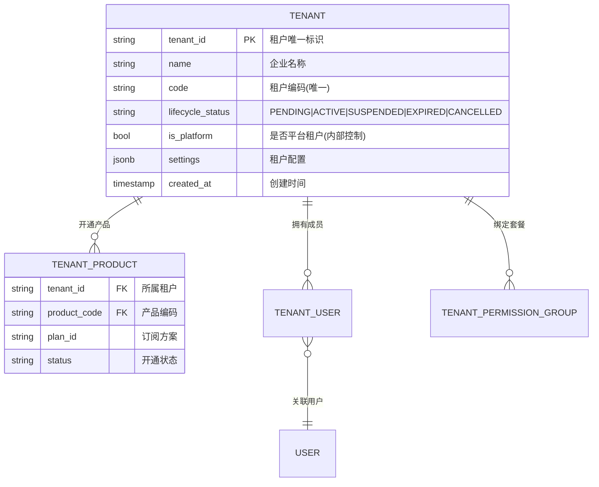
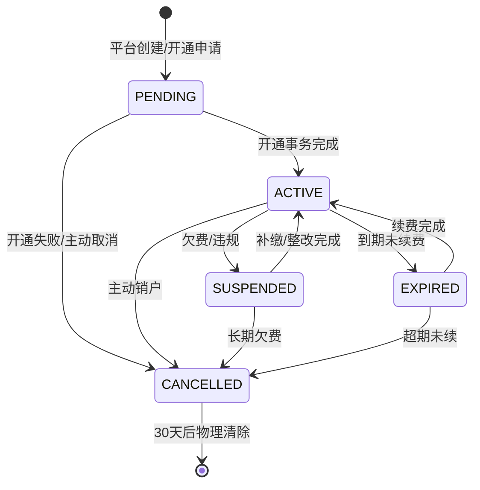
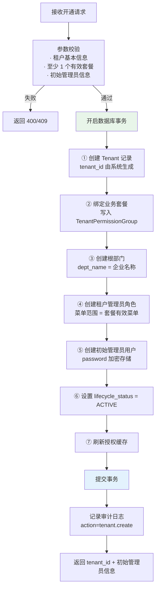
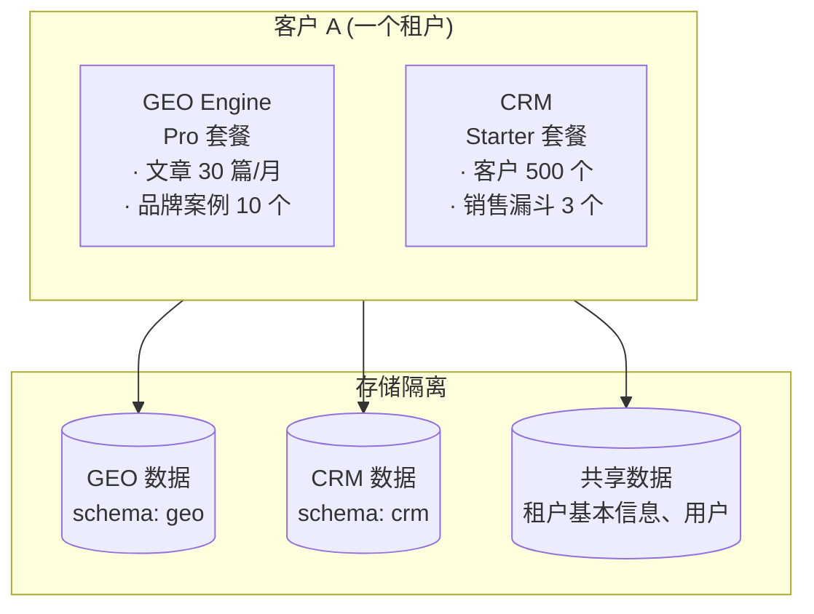
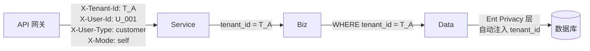

# 租户底座设计

日期：2026-07-22
状态：已验证（详见实施文档）
范围：`backend-service/app/platform/admin`

---

## 一、租户模型

### 核心实体

### 核心规则

- **一个租户 = 一个客户企业**，可开通多个产品线
- **租户 ID 由系统生成**，不接受客户端指定
- **产品线间数据在租户内隔离** — GEO 数据和 CRM 数据互不可见
- **租户状态变更影响所有产品线** — 暂停/注销对全部产品生效

---

## 二、租户生命周期

### 状态转换规则

| 当前状态 | 可转换到 | 触发条件 | 影响 |
|---------|:---:|------|------|
| PENDING | ACTIVE | 原子开通事务完成 | 租户可正常使用 |
| PENDING | CANCELLED | 开通失败或主动取消 | 清理预分配资源 |
| ACTIVE | SUSPENDED | 欠费/违规 | 所有产品暂停访问 |
| ACTIVE | EXPIRED | 到期未续费 | 限制功能但不删数据 |
| ACTIVE | CANCELLED | 主动销户 | 30天后物理清除 |
| SUSPENDED | ACTIVE | 补缴/整改 | 恢复访问 |
| EXPIRED | ACTIVE | 续费 | 恢复完整功能 |
| CANCELLED | — | 终态 | 不可逆 |

### 重新激活安全要求

- Token 有效期不能超过租户到期时间
- 离开 ACTIVE 状态必须吊销该租户所有会话
- 平台控制面操作，不接受客户端指定 target tenant_id

---

## 三、原子开通事务

租户开通是一个不可分割的平台控制面操作：

**安全约束：**

- 整个流程在一个数据库事务内完成
- 管理员角色只能获取套餐有效菜单，永不获取平台控制面菜单
- 明文密码不出现于日志、审计、响应
- `tenant_id` 由事务内部生成，不接受客户端传入

---

## 四、多产品叠加

- 产品线各自数据库 Schema 隔离
- 产品 A 无法直接查询产品 B 的数据
- 租户基础信息（名称、状态、用户）共享

---

## 五、租户上下文传递

所有下游服务信任网关注入的 Header，无需自行解析 Token。租户隔离在每一层独立校验。

---

## 六、增强规划

| 能力 | 阶段 | 说明 |
|------|:---:|------|
| 租户白标（自定义域名/Logo/主题色） | 🔵 P1 | 企业客户强需求 |
| 租户组织架构（部门/团队树） | 🔵 P1 | 中大型客户按部门隔离数据 |
| 租户健康度评分 | 🔵 P1 | 为客户运营引擎提供输入 |
| 租户数据迁移（试用→正式、合并、导出） | ⚪ P3 | 有明确企业需求时启动 |
| 租户初始化行业模板 | ⚪ P3 | 按行业预设配置 |

---

## 七、相关实施文档

- `docs/architecture/01-多租户菜单权限组实施计划.md` — 套餐与权限实施细节
- `docs/architecture/04-多租户生命周期与开通编排.md` — 生命周期状态机详设
- `docs/architecture/06-平台身份与租户身份安全边界.md` — 平台/租户身份分离
