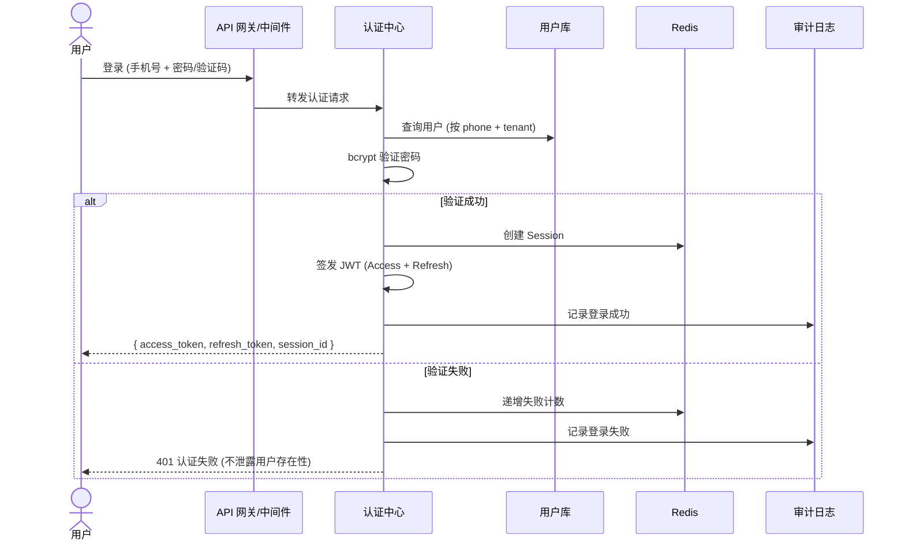
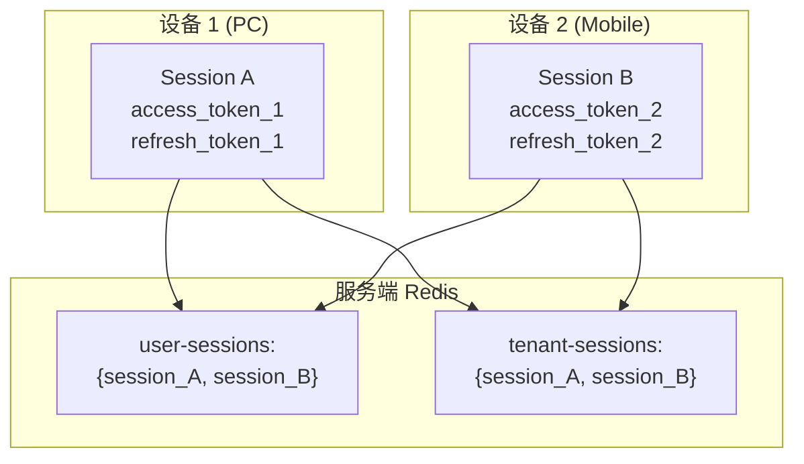
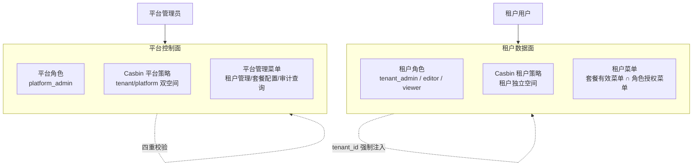
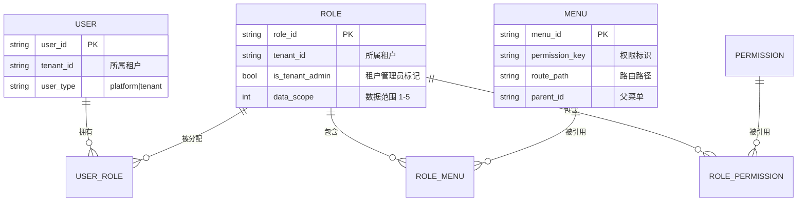
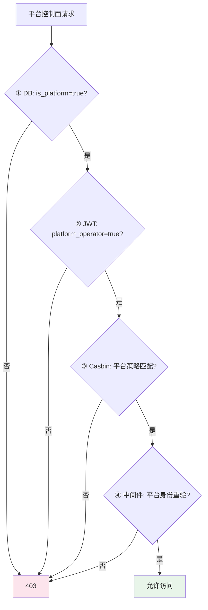
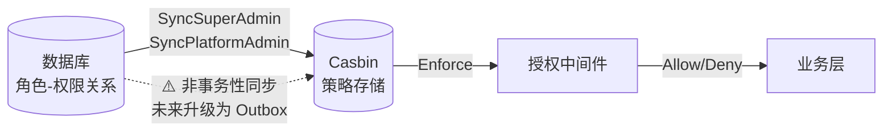

# 认证与授权安全设计

日期：2026-07-22
状态：已实现
范围：`backend-service/app/platform/admin` 认证、会话、权限

---

## 一、认证架构



### Token 策略

| 策略 | 配置 |
|------|------|
| Token 类型 | JWT Access Token + Refresh Token |
| Access Token 有效期 | 2 小时 |
| Refresh Token 有效期 | 30 天 |
| 签名算法 | 对称签名 (服务端密钥) |
| Session 管理 | Redis 存储，session_id 桥接 Access 和 Refresh |

### Redis Session 键结构

```text
auth:session:<session_id>              ← Session 元数据
auth:session:<session_id>:access       ← Access Token 状态
auth:session:<session_id>:refresh      ← Refresh Token 状态
auth:user-sessions:<tenant_id>:<user_id>   ← 用户所有 Session 索引
auth:tenant-sessions:<tenant_id>       ← 租户所有 Session 索引
```

---

## 二、多设备会话模型



- 每台设备独立 Session
- Refresh Token 轮换携带 nonce 区分新旧
- 单设备强制下线不影响其他设备
- 租户暂停/注销吊销该租户所有 Session

---

## 三、登录安全策略

| 策略 | 实现 |
|------|------|
| 密码加密 | bcrypt (cost factor ≥ 12)，不可逆 |
| 登录失败锁定 | 连续 5 次失败 → 锁定 15 分钟 |
| 登录日志 | `LoginLog` 表，记录租户/用户/IP/UA/结果/失败原因 |
| 敏感信息保护 | 日志不入密码、Token、验证码；未知账号也记录但响应不区分 |
| 多设备支持 | 每设备独立 session，互不干扰 |

---

## 四、权限模型

### 双域权限体系



### RBAC 模型



### 数据权限范围

| 范围码 | 含义 | 适用场景 |
|:---:|------|------|
| 1 | 全部数据 | 租户管理员 |
| 2 | 仅本人 | 普通成员 |
| 3 | 本部门 | 部门主管 |
| 4 | 本部门及下级 | 部门总监 |
| 5 | 自定义部门 | 跨部门协作 |

租户隔离始终先于数据权限执行 — 数据范围不能跨越 `tenant_id` 边界。

---

## 五、平台身份安全

### 四重校验机制



- `is_platform` — 数据库内部控制标记，不对外暴露
- `platform_operator` — JWT claim，从 DB 读取而非客户端传入
- Casbin 平台策略 — 独立于租户策略的空间
- 中间件二次验证 — 即使 Casbin 误允许，中间件拦截

### 租户管理员保护

- `super_admin` 是租户级角色，不是平台级
- 管理员角色标记 `is_tenant_admin`，不可改名、不可编辑、不可删除
- 移除最后一个管理员前检查：同一事务内 COUNT 其他启用管理员 → 409 LAST_TENANT_ADMIN_REQUIRED

---

## 六、Cross-Tenant 访问控制

| 场景 | 策略 |
|------|------|
| 客户访问自己的数据 | `tenant_id = 自己的租户` → 允许 |
| 业务员代管客户 | 有效代管 Token + 代管授权关系 → 允许 + 审计标记 |
| 代理查看名下客户 | 校验代理→客户归属 → 允许 |
| 平台人员查看任意租户 | `platform_admin` + 平台控制面权限 → 允许 + 全量审计 |
| 客户 A 访问客户 B 数据 | 拒绝 (403 FORBIDDEN)，错误不区分"无权限"和"不存在" |

### 跨租户外键约束

- Ent Privacy 层在存储层为所有租户数据注入 `tenant_id` 过滤
- 跨租户外键（如部门→字典类型）在存储层校验 `tenant_id` 匹配
- 不匹配返回 NotFound（不泄露其他租户的存在性）

---

## 七、Casbin 策略管理



- 策略同步采用先删后写
- 同步失败时 Session 吊销作为安全兜底
- 未来升级方向：Outbox 模式保证事务一致性

---

## 八、相关实施文档

- `docs/architecture/03-多租户认证与会话安全设计.md` — Session 模型和实施记录
- `docs/architecture/06-平台身份与租户身份安全边界.md` — 双域权限详设
- `docs/architecture/09-租户内数据权限设计.md` — 数据权限详设
