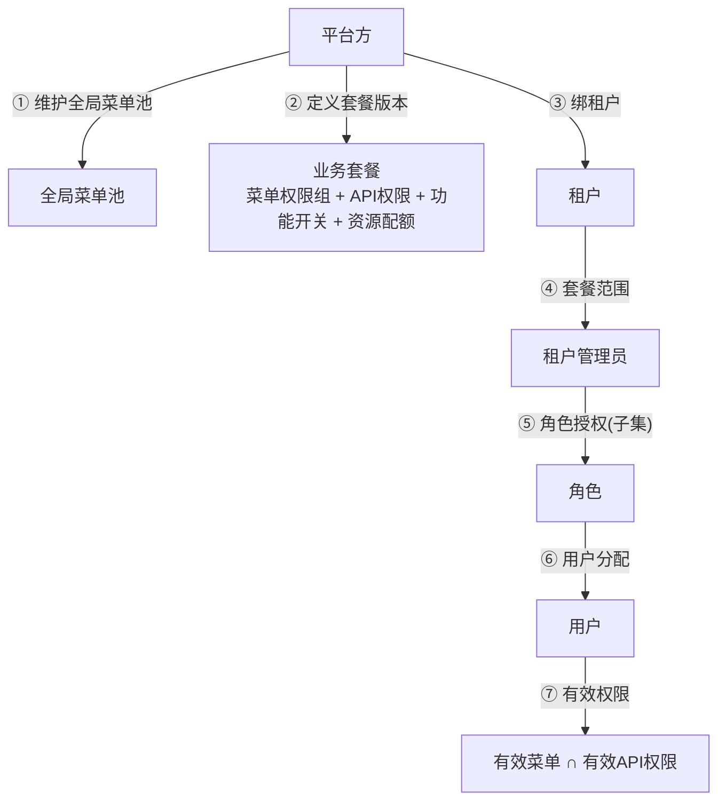
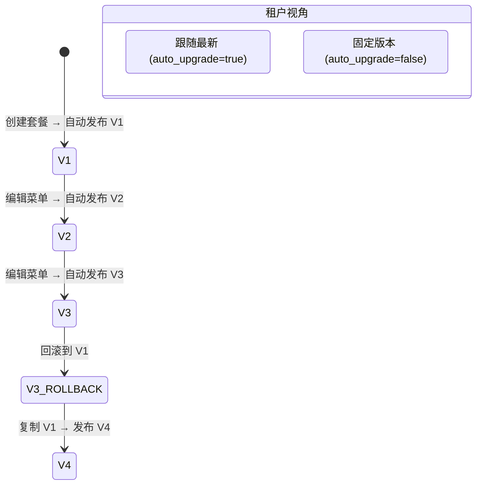
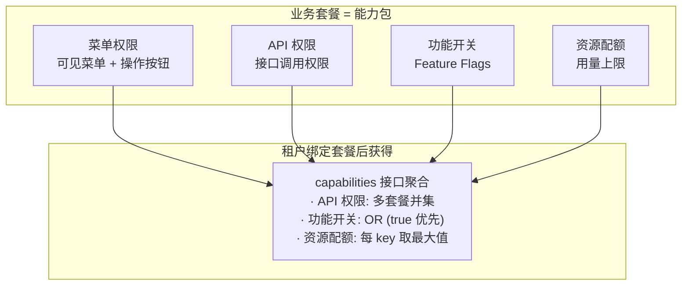
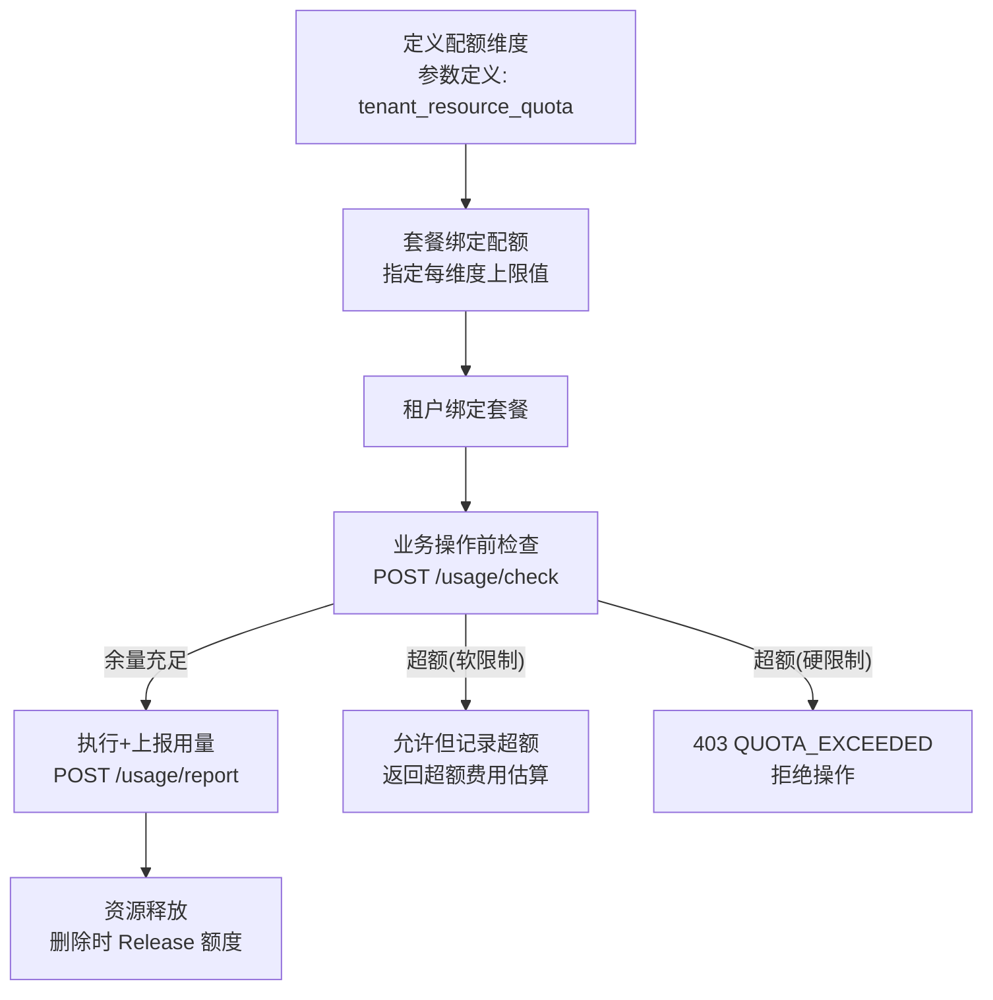
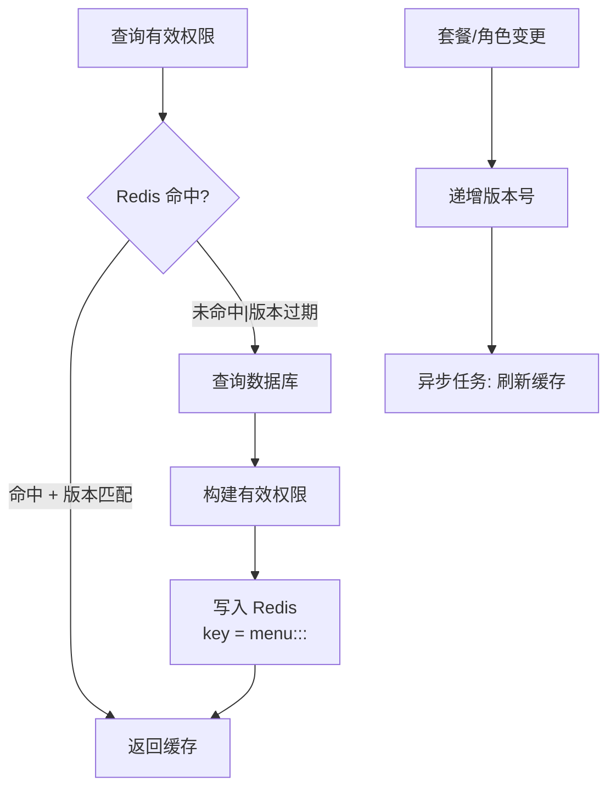
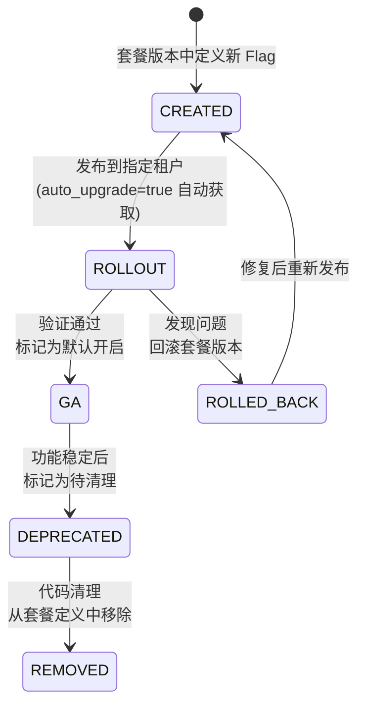

# 套餐与配额设计

日期：2026-07-22
状态：已验证
范围：平台套餐、权限组、资源配额

---

## 一、套餐优先模型



**有效权限公式：**

```
用户最终权限 = 全局菜单(启用) ∩ 租户套餐菜单 ∩ 用户角色授权菜单
              ∩ 租户状态(ACTIVE) ∩ 用户状态(启用) ∩ 角色状态(启用)
```

---

## 二、套餐版本化



### 版本规则

- 每个套餐版本是**不可变的菜单+权限快照**
- 编辑套餐菜单 → 自动发布新版本号
- 编辑元数据（名称/描述）→ 不产生新版本
- 回滚 = 复制历史版本 + 更高版本号发布（保留审计链）
- 租户可固定版本或跟随最新

---

## 三、能力包结构



---

## 四、资源配额模型



### 配额操作幂等

```
QuotaOperation {
    idempotency_key  "业务幂等键 (scope+key+fingerprint)"
    action           "consume|release"
    amount           "操作数量"
}
```

- 同一幂等键重复请求 → 返回首次结果（不重复扣减）
- 上传确认后 occupy，删除后 release
- 所有配额操作有独立日志

---

## 五、缓存策略



**核心原则：缓存是优化而非授权事实来源。缓存不可用时降级到数据库查询。**

---

## 六、Feature Flag 生命周期

> 从前端 `FeatureGate` / `usePlatformCapability` / `platformCapabilityStore` 实际实现提炼。

### 能力获取

```text
GET /admin/v1/current-tenant/capabilities
→ {
    apiPermissions: ["tenant.user.create", ...],
    featureFlags: { "new_dashboard": true, "export_excel": false },
    resourceQuotas: { "files": 100, "storage.bytes": 1073741824 }
  }
```

聚合规则：API 权限并集、功能开关 OR（true 优先）、资源配额每 key 取最大值。

### 前端消费

```typescript
// usePlatformCapability 模式
const { hasFeature, matchFeatureFlags, hasApiPermission } = usePlatformCapability()

// FeatureGate 组件
<FeatureGate feature="new_dashboard">
  <NewDashboard />
</FeatureGate>

// 多条件 (all=全部满足 any=任一满足)
matchFeatureFlags(['export_excel', 'admin_mode'], 'any')
```

### 四阶段生命周期



### 操作规则

| 阶段 | 操作 | 约束 |
|------|------|------|
| **创建** | 在 `MenuPermissionGroupVersion` 的 `feature_flags` 中新增 key | key 命名: `snake_case`，如 `new_dashboard` |
| **灰度** | 发布新套餐版本，租户 `auto_upgrade=true` 自动获取 | 不在代码中硬编码租户白名单 |
| **全量** | 默认值设为 `true`，所有新建租户默认开启 | 不影响已绑定固定版本的租户 |
| **废弃** | 代码中标记 `@deprecated`，前端移除 FeatureGate | 保留至少一个大版本周期在定义中 |
| **清理** | 从套餐版本定义的 `feature_flags` 中删除 | 确认所有租户已迁移到新版本 |

### 代码约定

- Feature Flag **不能替代权限校验** — 它是 UI 层开关，后端必须独立授权
- Flag key 不包含租户特定信息 — 不是 `tenant_123_feature_x`
- 同一 Flag 不在多处硬编码判断 — 统一通过 `hasFeature()` 消费

---

## 七、相关实施文档

- `docs/archive/implementation-records/` — 套餐权限和版本化实施细节
- `docs/architecture/23-平台底座生产化优化.md` — 能力包扩展
