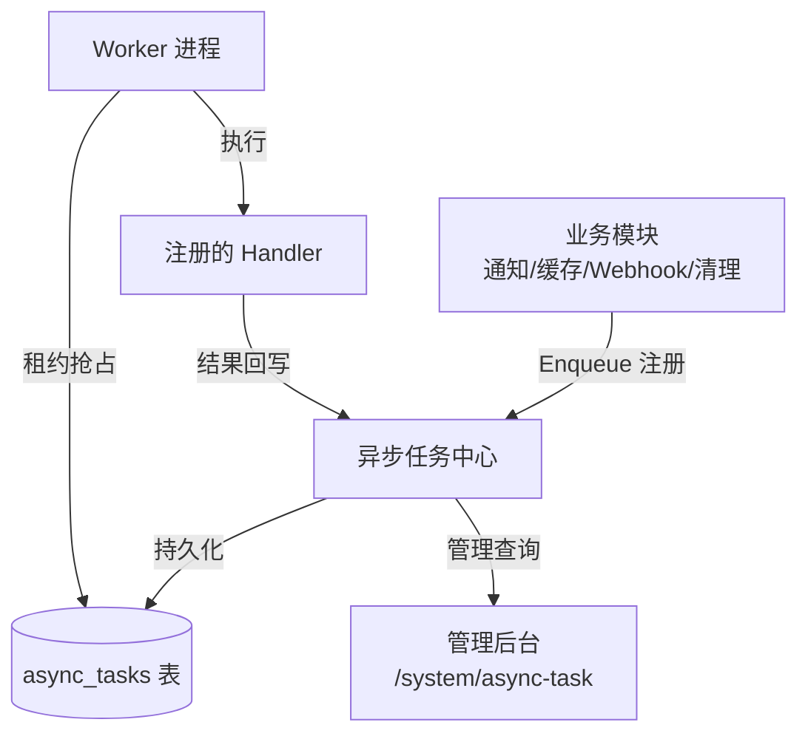
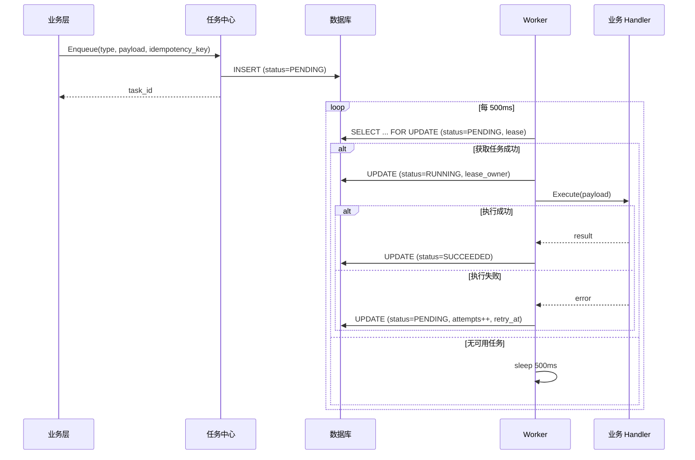
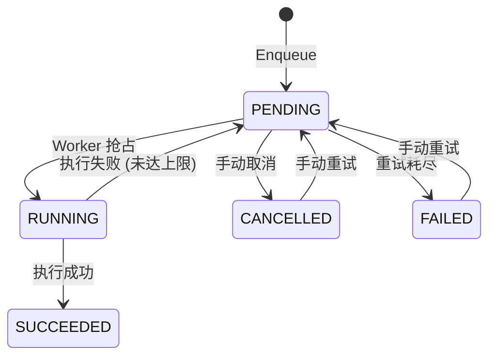

# 异步任务中心设计

日期：2026-07-22
状态：已验证（首期实施并通过真实环境验证）
范围：`backend-service/app/platform/admin`

---

## 一、设计目标

为平台提供统一的后台任务执行能力，所有需要异步执行的操作（通知发送、缓存刷新、数据清理、Webhook 投递等）统一接入任务中心。



---

## 二、核心架构



---

## 三、任务状态机



### 重试策略

| 参数 | 默认值 |
|------|:---:|
| 最大重试次数 | 10 |
| 首次重试延迟 | 10s |
| 退避策略 | 指数退避 (10s → 20s → 40s... → 1800s 上限) |
| 租约时长 | 2 分钟 |
| Worker 轮询间隔 | 500ms |
| 每批获取上限 | 10 |

---

## 四、关键工程特性

### 租约抢占

```text
UPDATE async_tasks
SET status = 'RUNNING',
    lease_owner = '<worker_id>',
    lease_expires_at = NOW() + INTERVAL '2 minutes'
WHERE id IN (
    SELECT id FROM async_tasks
    WHERE status = 'PENDING'
      AND (lease_expires_at IS NULL OR lease_expires_at < NOW())
    ORDER BY priority DESC, created_at ASC
    LIMIT 10
    FOR UPDATE SKIP LOCKED
)
RETURNING *
```

- 多实例 Worker 通过数据库条件 UPDATE 竞争
- `SKIP LOCKED` 防止 Worker 互相等待
- 过期租约自动释放，其他 Worker 可接管

### 幂等入队

```text
idempotency_key = scope:key:fingerprint
```

- 同一幂等键重复入队 → 返回已存在的 task_id
- `scope` = `platform` 或真实 `tenant_id`（不同租户同业务键安全）

### 反注入设计

- `Enqueue` 只接受已注册的 Handler 类型
- 不接受任意 `task_type` 字符串或原始 JSON
- 防止通过管理 API 注入恶意 payload

### Handler 隔离

- 每个 Handler 有独立 panic recovery
- Handler panic 不崩溃 Worker 进程
- 异常进入失败重试流

---

## 五、内置任务

| 任务类型 | 触发 | 说明 |
|---------|------|------|
| `system.task_retention_cleanup` | 每天 | 清理 30 天前已完成/已取消任务 |
| `system.permission_cache_invalidate` | 事件触发 | 套餐/角色变更后刷新缓存 |
| `notification.in_app.send` | 事件触发 | 站内信异步生成和发送 |

---

## 六、健康监控

```text
GET /admin/v1/async-tasks:stats

{
  pending_overdue: 3,           // PENDING 且已超过预定时间
  running_lease_expired: 1,     // RUNNING 但租约已过期
  retry_pressure: 12,           // 近 5 分钟重试次数
  health_status: "warning"      // healthy | warning | critical
}
```

### 告警阈值 (环境变量配置)

| 指标 | Warning | Critical |
|------|:---:|:---:|
| pending_overdue | > 10 | > 50 |
| running_lease_expired | > 2 | > 10 |
| retry_pressure | > 20 | > 100 |

---

## 七、未来增强

| 能力 | 优先级 | 说明 |
|------|:---:|------|
| 租约心跳续期 | P1 | 支持超过 2 分钟的长时间任务 |
| Cron 表达式 | P1 | 定时任务支持 |
| DAG 任务编排 | P2 | 多步依赖任务链 |
| 死信队列 | P2 | 失败任务隔离和人工处理 |
| 任务执行看板 | P2 | 管理后台可视化 |

---

## 八、相关实施文档

- `docs/architecture/08-统一异步任务中心设计.md` — 详设和真实环境验证记录
