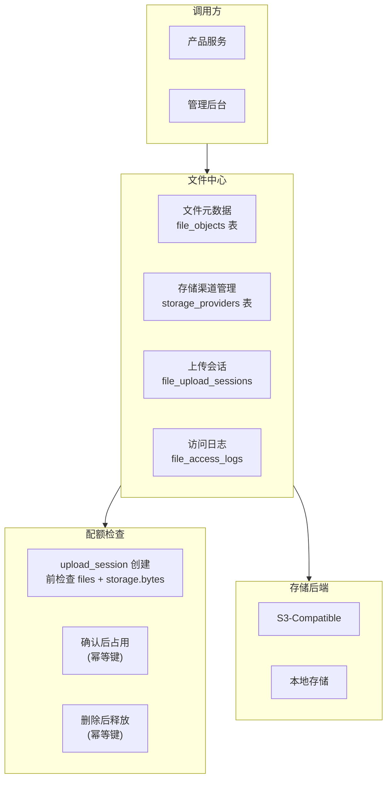
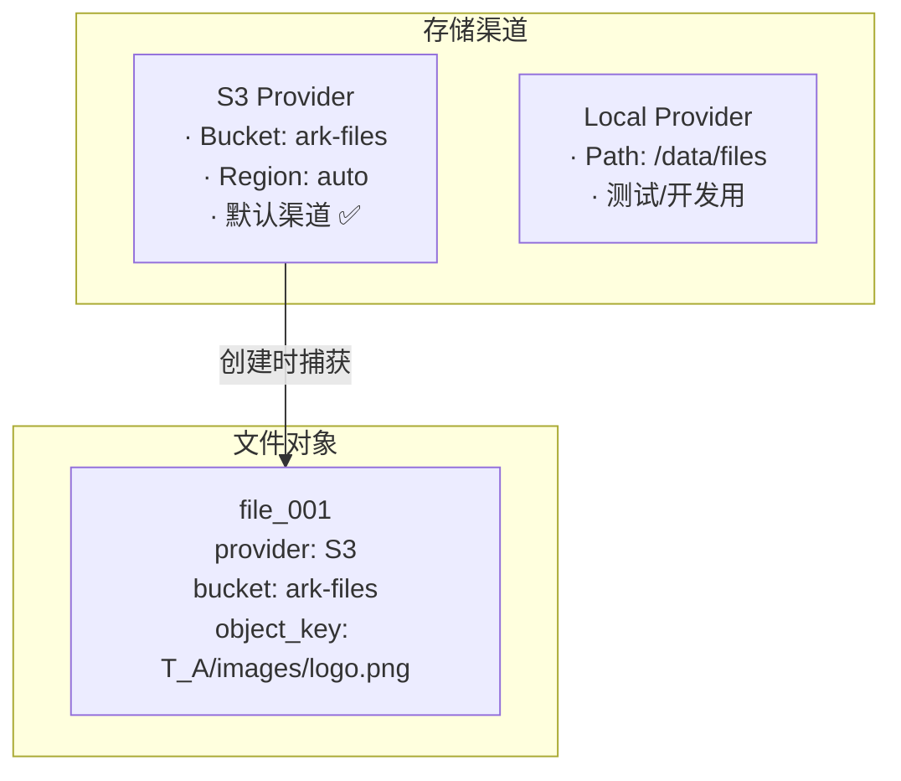
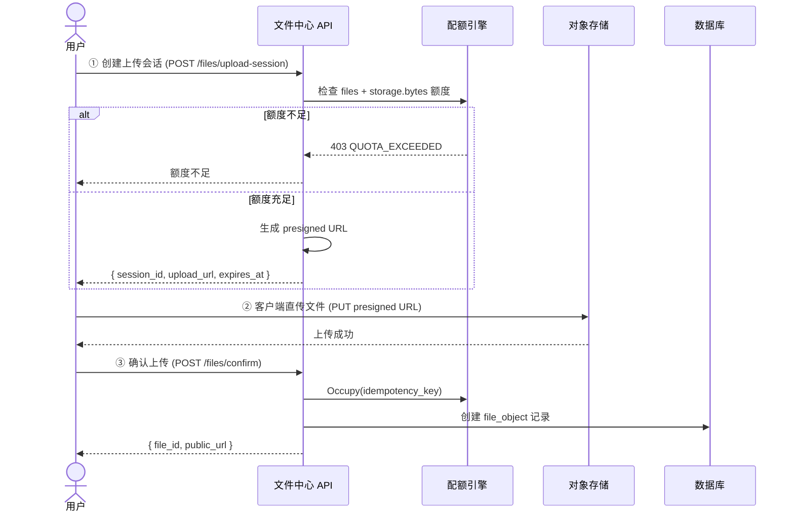

# 文件中心设计

日期：2026-07-22
状态：已验证（闭环验证通过）
范围：`backend-service/app/platform/admin` + `backend-service/pkg/objectstorage`

---

## 一、架构概览



---

## 二、多存储 Provider 模型



- 支持多个存储 Provider 共存
- 任一时刻只有一个默认 Provider
- 文件对象记录创建时的 Provider 快照
- 切换默认 Provider 不影响历史文件

---

## 三、文件上传流程



---

## 四、存储目录隔离

```text
/{tenant_id}/{product_code}/{resource_type}/{filename}
```

| 租户 | 产品 | 示例路径 |
|------|------|---------|
| T_A | GEO | `T_A/geo/images/article_hero.png` |
| T_A | CRM | `T_A/crm/attachments/contract.pdf` |
| T_B | GEO | `T_B/geo/images/logo.png` |

不同租户和产品的文件物理隔离，无法通过猜测 URL 跨租户访问。

---

## 五、当前能力矩阵

| 能力 | 状态 | 说明 |
|------|:---:|------|
| 文件元数据管理 | ✅ 已实现 | 名称、大小、类型、业务绑定 |
| S3-Compatible 存储 | ✅ 已实现 | 默认 Provider |
| 本地存储 | ✅ 已实现 | 测试/开发环境 |
| 存储渠道管理后台 | ✅ 已实现 | Provider CRUD + 默认切换 |
| 上传前额度检查 | ✅ 已实现 | files + storage.bytes 两维度 |
| 确认后额度占用 | ✅ 已实现 | 幂等键防重 |
| 删除后额度释放 | ✅ 已实现 | 幂等键防重 |
| 文件访问日志 | ✅ 已实现 | 下载/预览/删除审计 |
| 文件详情和访问记录后台 | ✅ 已实现 | 管理后台文件中心页面 |

### 待建设

| 能力 | 优先级 | 说明 |
|------|:---:|------|
| Multipart Upload | P1 | 大文件分片上传 |
| CDN 私有签名 | P1 | 私有文件下载代理 |
| 病毒扫描 | P2 | 上传后安全扫描 |
| 生命周期策略 | P2 | 过期清理、归档、回收站 |
| 图片处理管道 | P2 | 缩略图、格式转换 |

---

## 六、相关实施文档

- `docs/architecture/11-P3通用底座能力设计.md` — 文件中心详设和实施记录
- `docs/architecture/10-平台底座生产化优化实施计划.md` — 文件中心闭环验证记录
