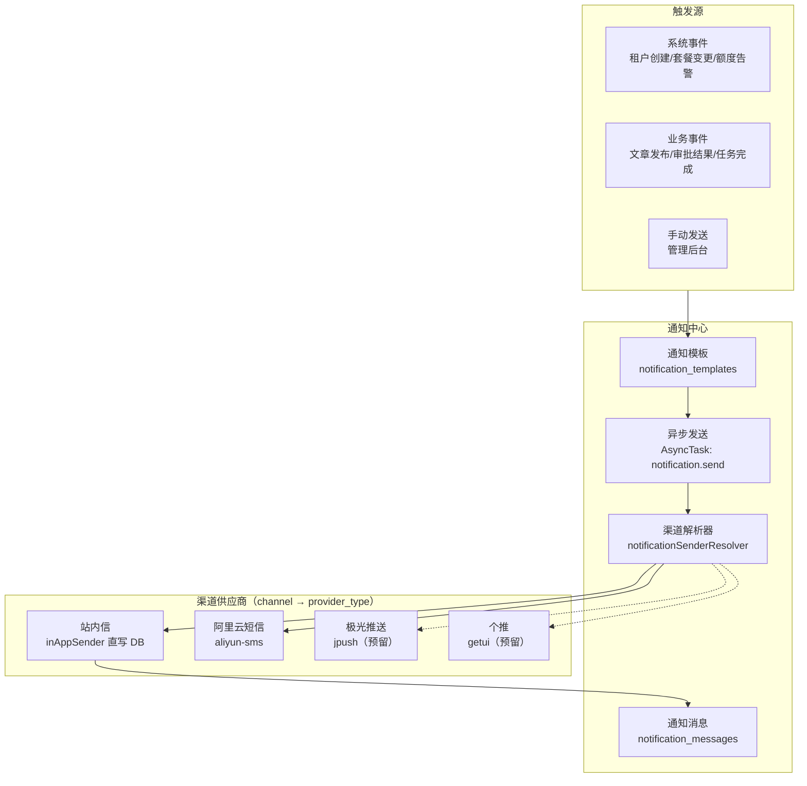
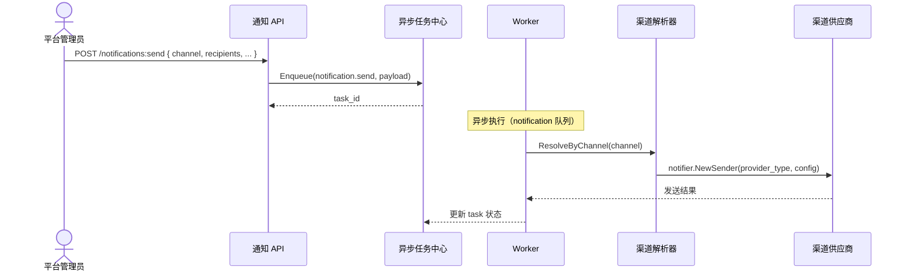
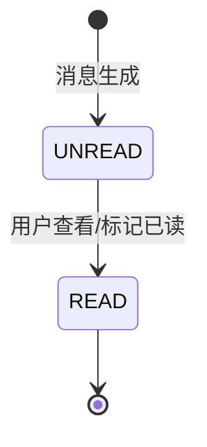

# 通知中心设计

日期：2026-08-14
状态：已实现（站内信 + 短信供应商模式，设备管理基础设施就绪）
范围：`backend-service/app/platform/admin`

---

## 一、架构概览



---

## 二、通知模板

```text
notification_template {
    code             "模板编码 (如 tenant.created)"
    name             "模板名称"
    channel          "in_app | email | sms | webhook | push"
    title            "标题 (支持变量 {{var}})"
    content          "内容 (支持变量)"
    variable_schema  "变量定义 JSON Schema"
    locale           "zh-CN | en-US"
    status           "enabled | disabled"
}
```

---

## 三、渠道供应商模式（核心设计）

### 3.1 两层维度分离

通知渠道采用**「渠道（channel）+ 提供商（provider_type）」两层结构**，与文件中心的 `objectstorage` 供应商模式同构：

| 维度 | 作用 | 取值 |
|------|------|------|
| **channel（渠道）** | 业务维度，通知模板选渠道 | `in-app` / `sms` / `push` / `email` / `webhook` |
| **provider_type（提供商）** | 技术维度，具体服务商实现 | `aliyun-sms` / `yunpian` / `jpush` / `getui` |

一个渠道下可有多个提供商（如短信：阿里云/腾讯云/云片；推送：极光/个推），通过 `provider_type` 区分。

### 3.2 统一接口层

全局唯一 `Sender` 接口（`pkg/notifier`），**不在渠道下再定义独立接口**；渠道目录（`sms/`、`push/`）仅用于组织提供商和承载渠道专属辅助类型。渠道差异通过 `Message` 扩展字段承载：

```go
// pkg/notifier/notifier.go
type Sender interface {
    Channel() string
    Send(context.Context, Message) (Result, error)
}

type Message struct {
    Channel    string
    TenantID   uint32
    Title      string
    Content    string
    Recipients []Recipient   // UserID / Phone / Email / DeviceToken
    Variables  map[string]string
    Extra      map[string]string  // 渠道专属：跳转/通知栏/短信签名等
}

// 工厂按 provider_type 注册（不是 channel）
func Register(providerType string, factory Factory)
func NewSender(providerType string, config json.RawMessage) (Sender, error)
```

### 3.3 目录结构

```
pkg/notifier/
├── notifier.go          ← 全局统一接口层（Sender + Message + 工厂）
├── sms/
│   └── aliyun/          ← provider_type="aliyun-sms"
│       └── aliyun.go
├── push/                ← 预留：jpush/、getui/
└── email/               ← 预留
```

### 3.4 平台级配置（NotificationProvider）

平台管理员在「通知中心 → 通知渠道配置」统一管理渠道提供商（**当前仅在技术中台配置，暂不下沉租户**）：

```
notification_provider {
    code            "渠道配置编码"
    name            "名称"
    channel         "渠道：in-app / sms / push / email / webhook"
    provider_type   "提供商：aliyun-sms / yunpian / jpush / getui"
    endpoint        "服务商 endpoint"
    access_key_id   "访问密钥 ID"
    access_key_secret "访问密钥（脱敏返回）"
    sign_name       "短信签名"
    template_code   "短信模板代码"
    is_default      "是否该渠道默认配置"
    status          "启用/禁用"
}
```

- 站内信作为**内置渠道**，预置配置（`channel=in-app`，无 provider_type，无外部密钥），通过配置控制启停。
- 短信/推送等外部渠道**必须指定 provider_type**。
- 密钥脱敏：列表/详情只返回 `secret_configured`，不回传明文。

### 3.5 渠道解析器（resolver）

```go
// 发送时按 channel 解析 sender
func ResolveByChannel(channel) (Sender, error) {
    switch channel {
    case "in-app":
        return inAppSender{repo}, nil   // 直写 DB，校验配置启停
    default:
        provider := ResolveChannel(channel)  // 查默认启用配置
        return notifier.NewSender(provider.provider_type, provider.configJSON)
    }
}
```

---

## 四、发送流程



- 通用发送接口 `POST /admin/v1/notifications:send`（channel + recipient_user_ids + phones + 模板变量）
- 站内信兼容入口 `POST /admin/v1/notifications:send-in-app`
- 异步任务类型 `notification.send`，队列 `notification`

---

## 五、设备管理（APP 推送前置）

APP 推送（极光/个推）的接收对象是**设备**，需要「用户 → 设备 token」映射。已建设设备管理基础设施：

```
system_devices {
    user_id        "用户ID"
    device_token   "设备令牌（极光 registration id / 个推 cid）"
    platform       "android / ios"
    app_key        "应用标识（支持多 APP）"
    device_name    "设备名"
    app_version    "APP 版本"
    last_active_at "最后活跃时间"
}
```

| 接口 | 路径 | 用途 |
|------|------|------|
| `RegisterDevice` | `POST /my/devices` | APP 登录后上报 device token |
| `UnregisterDevice` | `DELETE /my/devices/{token}` | 登出/切换账号解绑 |
| `ListMyDevices` | `GET /my/devices` | 用户自己的设备 |
| `ListUserDevices` | `GET /users/{id}/devices` | 推送时按用户查设备 token |

- 幂等注册：`device_token` 租户内唯一，重复注册更新绑定用户 + 刷新活跃时间。
- 推送链路：`user_id → ListUserDevices → device tokens → 极光/个推 sender.Send`。

---

## 六、已读状态模型



- 单条已读和批量已读幂等
- 未读数实时查询当前用户和租户

---

## 七、能力矩阵

| 能力 | 状态 |
|------|:---:|
| 通知模板 CRUD | ✅ |
| 站内信异步发送 | ✅ |
| 通知消息记录查询 / 已读 | ✅ |
| **渠道供应商抽象（notifier.Sender + 工厂）** | ✅ |
| **短信渠道（阿里云短信，RPC 签名）** | ✅ |
| **平台级渠道配置（NotificationProvider + 脱敏 + 测试连通）** | ✅ |
| **通用发送接口（channel + phones + 模板变量）** | ✅ |
| **设备管理（注册/解绑/查询，APP 推送前置）** | ✅ |

### 待建设

| 能力 | 优先级 | 说明 |
|------|:---:|------|
| 短信更多提供商 | P1 | 腾讯云/云片（实现 Sender + 注册工厂） |
| APP 推送提供商 | P1 | 极光/个推（依赖设备管理，已就绪） |
| 邮件渠道 | P1 | SMTP 集成 |
| Webhook 渠道 | P1 | 外部系统回调 |
| 用户通知偏好 | P2 | 渠道选择、频率控制 |
| 租户通知配置 | P2 | 租户级渠道覆盖（`override ?? 平台默认`，三级状态 + 显式禁用） |
| 通知聚合摘要 | P2 | 每日/每周汇总 |

---

## 八、相关实施文档

- `docs/architecture/4-7-治理-代码功能清单.md` — 代码落点
- 文件中心供应商模式参照：`docs/architecture/1-4-技术中台-文件中心设计.md`
