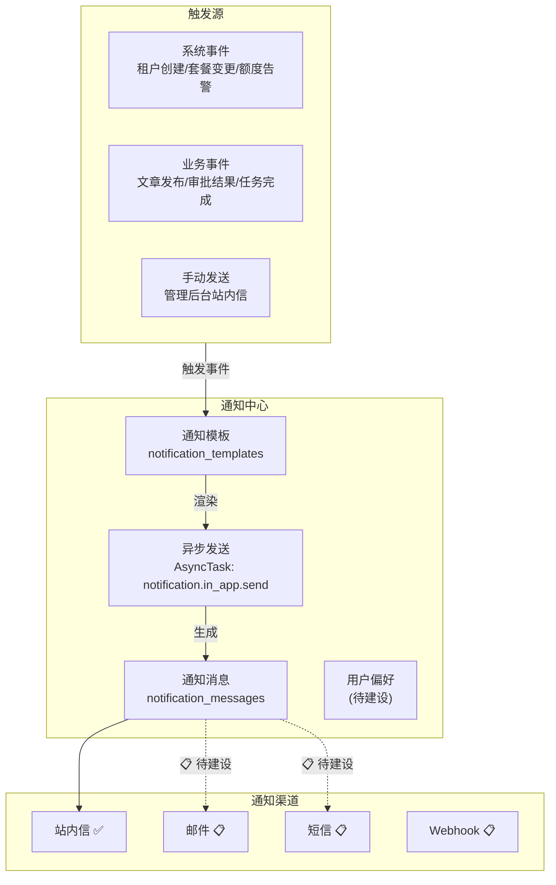
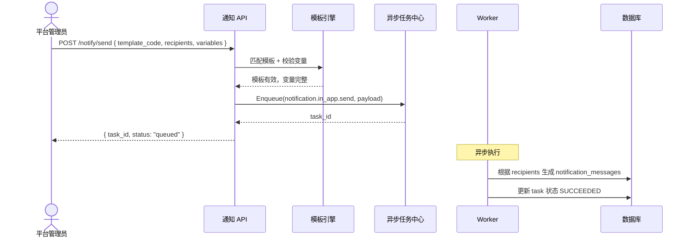
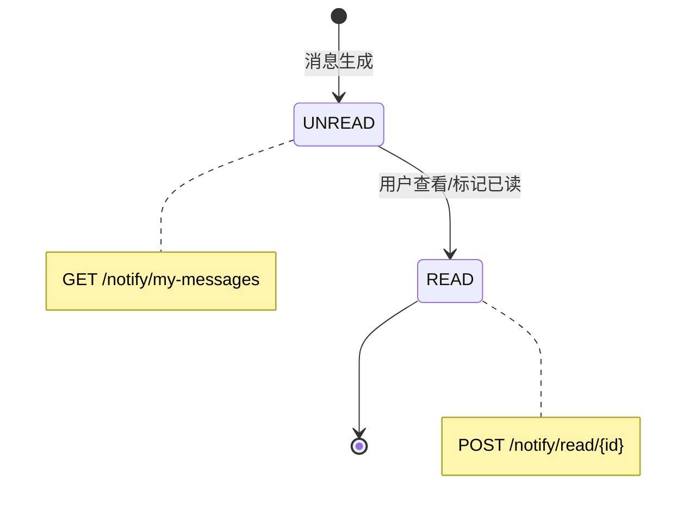

# 通知中心设计

日期：2026-07-22
状态：已验证（站内信 MVP 验证通过）
范围：`backend-service/app/platform/admin`

---

## 一、架构概览



---

## 二、通知模板

```text
notification_template {
    code             "模板编码 (如 tenant.created)"
    name             "模板名称"
    channel          "in_app | email | sms"
    title_template   "标题模板 (支持变量 {{.var}})"
    content_template "内容模板 (支持变量)"
    variable_schema  "变量定义 JSON Schema"
    locale           "zh-CN | en-US"
    status           "enabled | disabled"
}
```

### 变量替换示例

```text
模板: "您的 {{.product_name}} 套餐 {{.dimension}} 已使用 {{.used}}/{{.limit}}"

渲染: "您的 GEO Engine 套餐 文章数 已使用 29/30"
```

---

## 三、发送流程



---

## 四、已读状态模型



- 单条已读和批量已读幂等
- 未读数实时查询当前用户和租户
- 消息按创建时间倒序

---

## 五、当前能力矩阵

| 能力 | 状态 |
|------|:---:|
| 站内信通知模板 CRUD | ✅ 已实现 |
| 站内信异步发送 (AsyncTask) | ✅ 已实现 |
| 通知消息记录查询 | ✅ 已实现 |
| 当前用户通知列表 | ✅ 已实现 |
| 未读数查询 | ✅ 已实现 |
| 单条已读 / 批量已读 | ✅ 已实现 |
| 管理后台通知模板和记录页面 | ✅ 已实现 |
| Mock 数据和菜单权限 | ✅ 已实现 |

### 待建设

| 能力 | 优先级 | 说明 |
|------|:---:|------|
| 邮件渠道 | P1 | SMTP 集成 |
| 短信渠道 | P1 | 短信服务商集成 |
| Webhook 渠道 | P1 | 外部系统回调 |
| 用户通知偏好 | P2 | 渠道选择、频率控制 |
| 租户通知配置 | P2 | 租户级通知开关 |
| 通知聚合摘要 | P2 | 每日/每周汇总 |
| 送达/已读追踪 | P2 | 各渠道送达状态 |

---

## 六、相关实施文档

- `docs/architecture/11-P3通用底座能力设计.md` — 通知中心详设和实施记录
