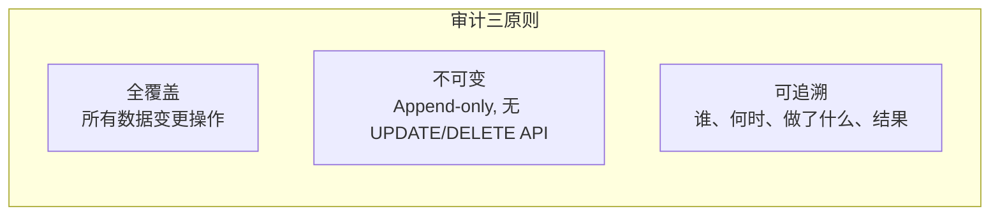
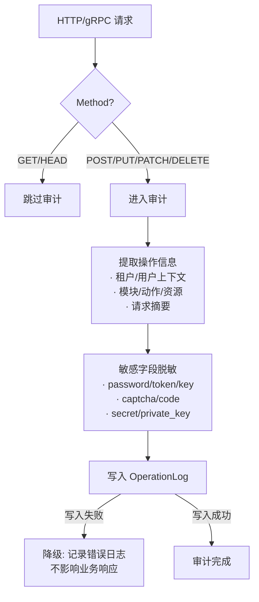

# 操作审计设计

日期：2026-07-22
状态：已验证
范围：`backend-service/app/platform/admin`

---

## 一、审计原则



---

## 二、审计日志模型

```text
OperationLog {
    id               "自增主键"
    tenant_id        "租户 ID (平台操作为空)"
    operator_id      "操作者用户 ID"
    operator_name    "操作者姓名快照"
    module           "模块 (tenant/user/role/menu/package/config/...)"
    action           "动作 (create/update/delete/publish/rollback/...)"
    resource_type    "资源类型"
    resource_id      "资源 ID"
    http_method      "HTTP 方法"
    http_path        "请求路径"
    request_summary  "请求摘要 (去敏感)"
    before_snapshot  "变更前快照 JSON"
    after_snapshot   "变更后快照 JSON"
    ip_address       "操作者 IP"
    user_agent       "User-Agent"
    trace_id         "分布式追踪 ID"
    result           "SUCCESS | FAILURE"
    error_message    "错误信息 (失败时)"
    duration_ms      "执行耗时"
    created_at       "操作时间"
}
```

---

## 三、审计采集策略



- **自动采集** — 中间件拦截所有非 GET 请求
- **敏感脱敏** — 密码、Token、密钥、验证码自动打码
- **降级策略** — 审计写入失败不阻塞业务（记录 Error 日志）

---

## 四、热温冷分层

```text
热数据 (近 7 天)   → 主表，实时查询
温数据 (8-30 天)   → 主表，按需查询
冷数据 (31 天-1 年) → 归档表，离线查询
过期 (> 1 年)       → 可配置清理或导出
```

---

## 五、审计查询

| 查询维度 | 权限要求 |
|---------|---------|
| 当前租户操作日志 | 租户管理员 (数据面) |
| 平台全局操作日志 | 平台管理员 (控制面) |
| 按模块/动作/操作者筛选 | 对应权限 |
| 变更前后对比 (Diff) | 平台管理员 |

---

## 六、相关实施文档

- `docs/architecture/02-多租户底座治理能力开发计划.md` — 审计模块实施记录
