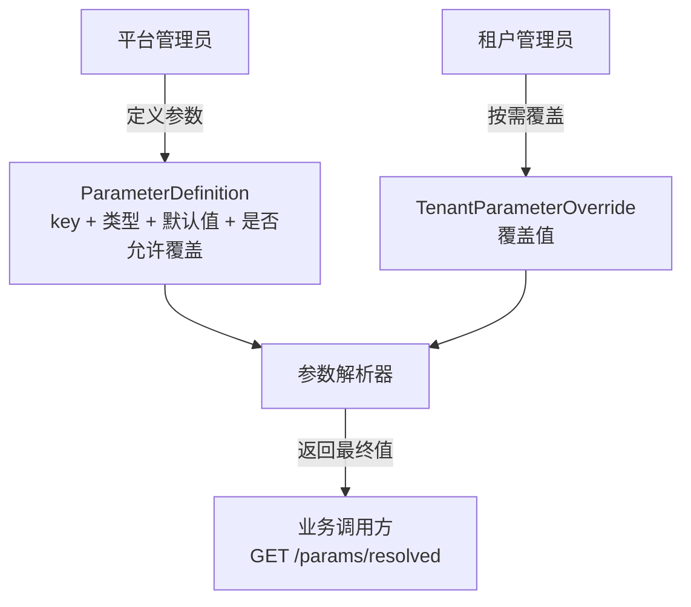
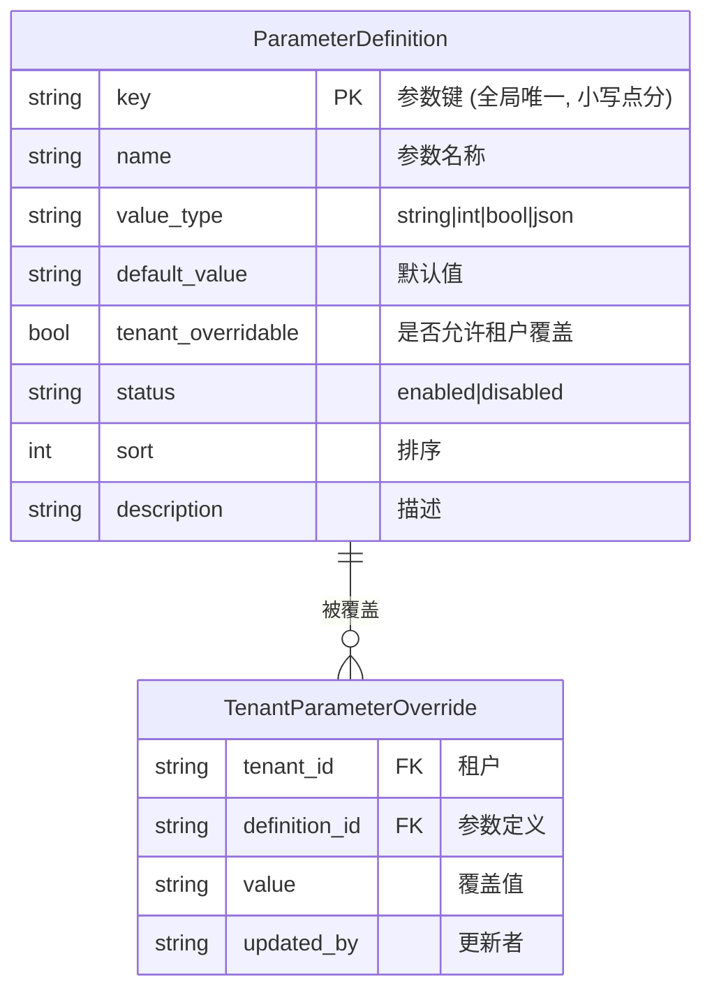
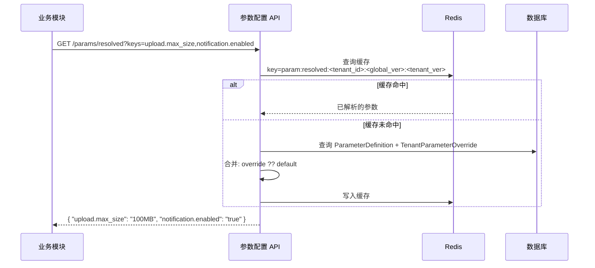
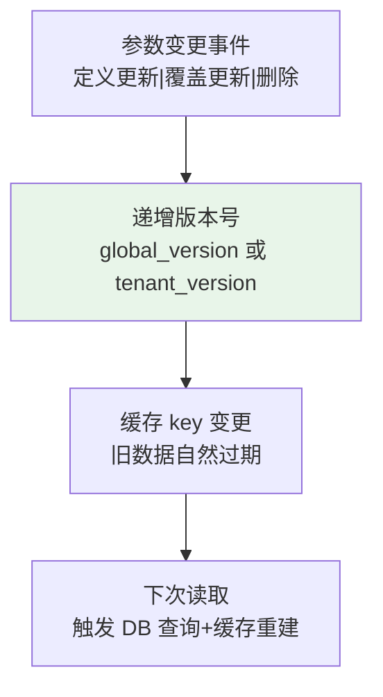
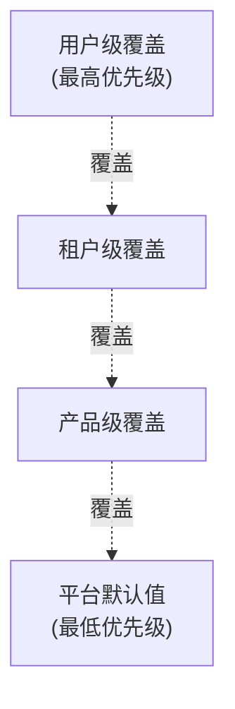

# 参数配置中心设计

日期：2026-07-22
状态：已验证
范围：`backend-service/app/platform/service`

---

## 一、设计目标

平台统一管理参数定义和默认值，租户可按需覆盖。调用方获取"最终解析值"，无需自行合并。

---

## 二、核心实体

---

## 三、参数读取

---

## 四、安全约束

| 规则 | 说明 |
|------|------|
| **类型锁定** | 参数定义创建后 `value_type` 不可变更 |
| **覆盖保护** | 存在覆盖值时，不允许修改参数类型 |
| **删除保护** | 存在覆盖值的定义不允许删除 |
| **覆盖权限** | `tenant_overridable=false` 时设置覆盖返回 403 |
| **敏感键拒绝** | key 含 `.password` `.secret` `.api_key` `.private_key` 后缀拒绝创建 |
| **平台隔离** | ParameterDefinition 无 `tenant_id`（平台控制面资源） |

---

## 五、缓存一致性

- `global_version` 变更 → 所有租户缓存失效
- `tenant_version` 变更 → 仅该租户缓存失效
- 缓存 TTL 30 分钟 + 版本 key 双重过期保护
- Redis 不可用时降级为数据库直读

---

## 六、配置优先级继承（未来增强）

同一模型未来可应用于 Feature Flags 和国际化配置。

---

## 七、相关实施文档

- `docs/architecture/07-多租户参数配置中心设计.md` — 参数配置详设
