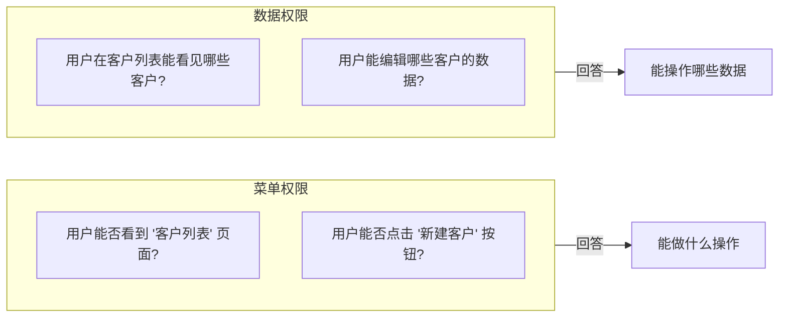
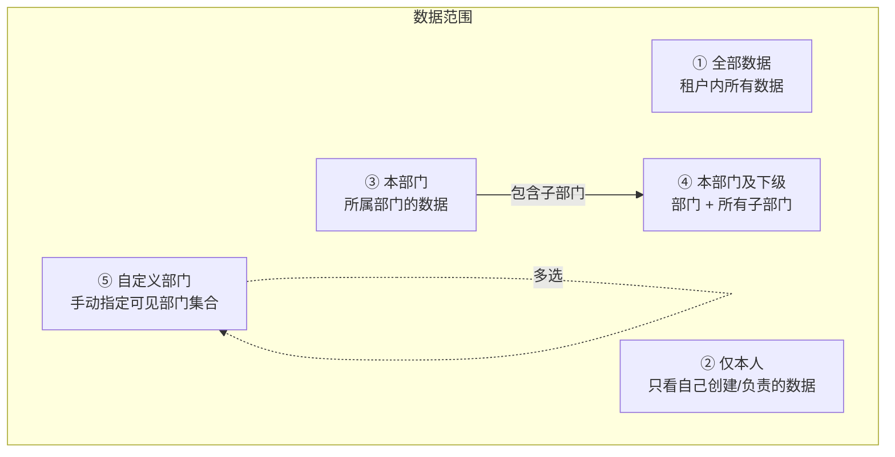
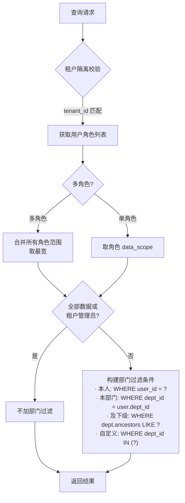
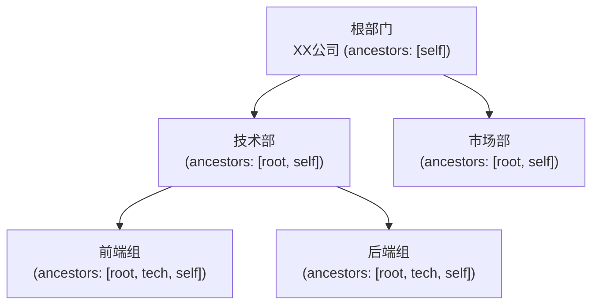

# 数据权限设计

日期：2026-07-22
状态：已实现
范围：`backend-service/app/platform/service`

---

## 一、菜单权限 vs 数据权限



**数据权限 = 在租户隔离基础上，控制租户内部不同角色能访问的数据范围。**

---

## 二、五级数据范围



| 范围码 | 含义 | 典型角色 |
|:---:|------|------|
| 1 | 全部数据 | 租户管理员 |
| 2 | 仅本人 | 普通成员 |
| 3 | 本部门 | 部门主管 |
| 4 | 本部门及下级 | 部门总监 |
| 5 | 自定义部门 | 跨部门协作角色 |

---

## 三、权限计算流程



---

## 四、部门层级模型



- `ancestors` 字段存储完整祖先链
- 部门移动时事务内重写子树所有节点的 ancestors
- 移动前检测循环依赖（目标不能是自身的子孙）

---

## 五、资源分类

| 资源类型 | 权限模型 | 示例 |
|---------|---------|------|
| **自有资源** | 受数据范围控制 | 用户列表、部门、项目 |
| **共享配置** | 仅租户隔离 + 操作授权 | 字典、参数配置 |
| **审计资源** | 平台控制面 / 租户数据面 | 操作日志 |

共享配置资源不由部门数据范围约束，仅受 `tenant_id` 隔离保护。

---

## 六、接入新资源

新增业务资源接入数据权限时：

1. Repository 层调用 `DataScopeResolver` 构建过滤条件
2. 服务层声明资源分类（自有/共享/审计）
3. 测试覆盖跨租户和跨部门隔离

```text
// 典型调用模式
predicates := s.dataScopeResolver.Resolve(ctx, user)
users, err := s.userRepo.List(ctx, append(basePredicates, predicates...)...)
```

---

## 七、相关实施文档

- `docs/architecture/09-租户内数据权限设计.md` — 数据权限详设和实施记录
