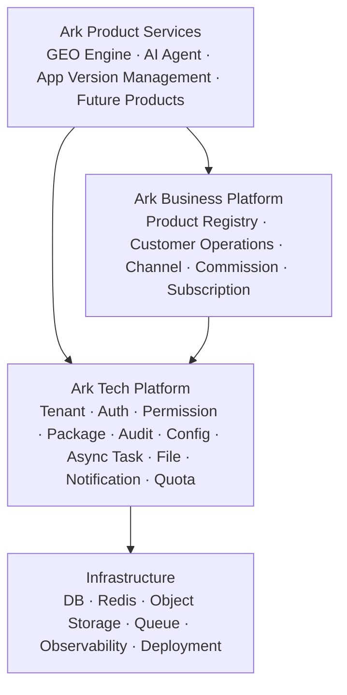

# Ark Engine 合并共创方案

本文档用于合并当前“项目开发底座”与 `docs/architecture-ark` 中的 **Ark Engine（方舟引擎）** 设计方案。当前结论是：最终命名可以统一为 **Ark Engine**，但合并方式不应是直接替换现有底座，而应采用“Ark Engine 作为目标平台蓝图，当前 Go/Kratos 底座作为可运行工程基线”的渐进方案。

## 资料阅读范围

本次合并评估已覆盖以下资料：

- `docs/architecture-ark/README.md`
- `docs/architecture-ark/01-system-overview.md`
- `docs/architecture-ark/02-tech-platform-design.md`
- `docs/architecture-ark/03-business-platform-design.md`
- `docs/architecture-ark/04-product-layer-spec.md`
- `docs/architecture-ark/05-core-data-model.md`
- `docs/architecture-ark/06-key-flows.md`
- `docs/architecture-ark/07-api-boundary.md`
- `docs/architecture-ark/08-security-design.md`
- `docs/architecture-ark/09-nfr-and-deployment.md`
- `docs/architecture/README.md`
- `docs/architecture/00-后端底座架构决策.md`
- `docs/architecture/01-多租户菜单权限组实施计划.md`
- `docs/architecture/02-多租户底座治理能力开发计划.md`
- `docs/architecture/03-多租户认证与会话安全设计.md`
- `docs/architecture/04-多租户生命周期与开通编排.md`
- `docs/architecture/05-业务套餐版本化设计.md`
- `docs/architecture/06-平台身份与租户身份安全边界.md`
- `docs/architecture/07-多租户参数配置中心设计.md`
- `docs/architecture/08-统一异步任务中心设计.md`
- `docs/architecture/09-租户内数据权限设计.md`
- `docs/architecture/10-平台底座生产化优化实施计划.md`
- `docs/architecture/11-P3通用底座能力设计.md`
- `docs/architecture/11-项目服务模块接入规范.md`
- `docs/architecture/12-架构决策记录索引.md`
- `docs/architecture/13-SaaS技术中台能力路线图.md`
- `docs/services/README.md`
- `docs/services/app-version-management/README.md`
- `docs/services/geo-content-engine/README.md`
- `docs/services/geo-content-engine/01-product-overview.md`
- `docs/services/geo-content-engine/07-release-plan.md`
- `docs/services/ai-agent-management/企业 AI 智能体平台-技术架构方案.md`
- `docs/services/ai-agent-management/企业 AI 智能体平台-业务接入实施方案.md`
- `docs/services/ai-agent-management/企业 AI 智能体平台-身份认证与多租户设计.md`

## 两套方案定位

### 当前项目开发底座

当前底座更偏工程落地，已经围绕 Go/Kratos 大仓、模块化服务边界、多租户、权限、套餐、会话安全、参数中心、异步任务、数据权限、文件中心、通知中心、测试与生产门禁形成了较完整的实施规则。

它的优势是：

- 已经有真实代码、验证记录和工程约束。
- 服务边界清晰：`backend-service/app/platform/admin` 是底座管理后台基础服务，不继续承接具体业务。
- 契约优先：后端按 `proto -> generated api -> service -> biz -> data -> Ent schema -> Wire/registration` 推进。
- 适合当前阶段快速迭代：大仓模式下先模块化，达到拆分条件后再拆 Kratos service。
- 文档已经区分 `docs/architecture`、`docs/services`、`docs/product`、`docs/archive`。

它的不足是：

- 商业化平台能力仍偏工程底座，渠道、客户运营、订阅计费、佣金结算、产品注册中心还没有形成完整业务平台。
- “项目开发底座”命名偏内部工程视角，不利于长期产品化表达。
- 现有产品服务文档分散，GEO Engine、AI Agent、App Version Management 尚未统一纳入一个平台产品层模型。

### Ark Engine 方案

`docs/architecture-ark` 更偏目标平台蓝图，按产品层、业务平台层、技术平台层、基础设施层建立 SaaS 多产品平台模型。

它的优势是：

- 平台产品表达清晰，适合作为最终品牌和产品架构：Ark Engine。
- 明确提出产品注册中心、产品开通、产品权限、产品菜单、订阅计费、渠道代理、客户运营、佣金结算。
- 对安全、租户隔离、托管代运营、API 边界、关键流程、NFR 和部署演进有完整设计。
- 能把 GEO、CRM、ERP、AI Agent、App Version Management 等产品服务纳入统一平台。

它的不足是：

- P0 能力范围偏大，如果一次性照搬会影响稳定可运行。
- 部分技术建议与当前工程基线不一致，例如 PostgreSQL/RLS、BullMQ、Kong/APISIX 等不能直接替代当前 Go/Kratos/Ent/Redis/Vben 约定。
- 文档是目标设计，缺少当前底座已有验证记录和代码约束。

## 合并总原则

1. 最终平台名统一为 **Ark Engine**。
2. 当前可运行底座不推倒重来，升级为 **Ark Engine Tech Platform**。
3. Ark 文档中的业务平台能力作为中长期目标引入，不把渠道、客户运营、佣金、订阅计费一次性塞进当前迭代。
4. 当前 `platform/admin` 继续保持底座管理后台基础服务，不承接具体产品业务。
5. 产品服务统一进入 `docs/services` 管理，后续可命名为 Ark Product Services。
6. 技术栈以当前工程为准：Go、Kratos、Ent、Proto、Buf、Wire、Redis、Vben、Vue 3、Ant Design Vue、pnpm。
7. Ark 文档中的 PostgreSQL/RLS、API Gateway、独立搜索、独立观测平台等作为演进方向，不作为立即迁移要求。
8. 所有新增后端能力继续遵循契约优先和模块接入清单。

## 合并后的目标分层



### Ark Product Services

产品服务承载具体业务，不直接污染技术底座。

当前可纳入的产品服务：

- GEO Engine：内容工程、知识库、AI 生成、后处理、发布、效果追踪。
- AI Agent Management：企业智能体、语音接入、身份映射、工具调用、知识问答、任务编排。
- App Version Management：应用版本管理中心，当前作为历史参考，未来如恢复开发应重新定义正式服务边界。
- Future Products：CRM、ERP、行业系统等后续产品。

### Ark Business Platform

业务平台承接多产品商业化与运营协同能力。

建议分阶段引入：

- Product Registry：产品注册、菜单注册、权限注册、套餐注册、配额注册、开通表单注册。
- Customer Operations：客户开通、客户健康度、代运营模式、客户移交。
- Subscription & Billing：订阅、账单、用量、配额扣减。
- Channel & Commission：渠道代理、销售归属、佣金结算。

### Ark Tech Platform

技术平台继续以当前底座为基础：

- 租户、用户、部门、角色、菜单、权限。
- 平台控制面与租户数据面。
- 多租户套餐、套餐版本、功能开关、资源配额。
- 登录安全、会话、Token 轮换、强制下线。
- 参数中心、操作审计、登录日志。
- 异步任务、文件中心、通知中心。
- 模块接入规范、测试门禁、Mock 数据、生产配置门禁。

## 名称与概念映射

| 当前名称 | 合并后建议名称 | 处理方式 |
| --- | --- | --- |
| 项目开发底座 | Ark Engine / Ark Tech Platform | 总品牌改为 Ark Engine，工程底座保留为技术平台层 |
| SaaS 技术中台 | Ark Tech Platform | 保留能力内涵，调整产品化命名 |
| 项目服务 | Ark Product Services | 继续放在 `docs/services`，后续可逐步改名 |
| 项目服务模块接入规范 | Product Onboarding / Module Onboarding | 与 Ark Product Registry 合并 |
| 租户业务套餐 | Capability Package / Tenant Package | 保留当前实现，增强产品开通和配额 |
| AVMC | App Version Management product service | 不再作为平台总名 |
| GEO Engine | Ark Product Service: GEO Engine | 作为 Ark 产品层服务 |
| AI Agent Management | Ark Product Service: AI Agent | 作为 Ark 产品层服务 |
| `docs/architecture-ark` | Ark 目标蓝图输入 | 合并完成前保留，不作为当前唯一事实来源 |

## 文档合并方案

### 阶段 0：冻结合并口径

目标：避免文档和代码口径同时变化导致代理误读。

动作：

- 保留 `docs/architecture-ark`，标记为 Ark Engine 目标蓝图输入。
- 新增本合并方案作为当前评审入口。
- 暂不重命名代码包、数据库表、Proto package、前端 app package。
- 暂不移动现有 `docs/architecture` 文档。

验收：

- Codex 或开发者可以判断：Ark 是最终目标名，当前实现仍以 `docs/architecture` 为准。
- 不出现“直接把 Ark P0 全部作为当前迭代”的误读。

### 阶段 1：建立 Ark Engine 总览

目标：把当前底座和 Ark 蓝图合成一份新的总览。

建议新增：

- `docs/architecture/00-Ark-Engine-架构总览.md`

内容应包括：

- Ark Engine 四层架构。
- 当前已实现能力。
- 当前冻结边界。
- 当前不做的能力。
- 产品服务接入总流程。
- 大仓模块化优先、达到条件再拆服务的策略。

验收：

- `docs/architecture/README.md` 将 Ark Engine 总览列为第一阅读文档。
- 原 `00-后端底座架构决策.md` 保留工程执行细节。

### 阶段 2：合并产品注册与模块接入规范

目标：把 Ark 的 Product Registry 与当前模块接入规范打通。

建议调整：

- 在 `docs/architecture/11-项目服务模块接入规范.md` 中增加产品注册字段。
- 后续可新增 `docs/architecture/15-Ark-Product-Registry-设计.md`。

最小注册信息：

- product_code
- product_name
- product_status
- menu_tree
- permission_keys
- feature_flags
- quota_keys
- pricing_plan_refs
- opening_form_schema
- backend_service_boundary
- frontend_app_boundary
- api_namespace

验收：

- GEO Engine、AI Agent、App Version Management 都能按同一模板登记。
- 产品注册只定义接入元数据，不替代产品自己的业务模型。

### 阶段 3：重建业务平台规划

目标：从 Ark 方案吸收渠道、客户、订阅、佣金等业务平台能力。

建议新增目录：

```text
docs/business-platform/
├── README.md
├── product-registry.md
├── customer-operations.md
├── subscription-billing.md
└── channel-commission.md
```

执行顺序：

1. Product Registry
2. Customer Operations
3. Subscription & Quota Usage
4. Billing
5. Channel & Commission

验收：

- 业务平台能力独立于 `platform/admin` 的底座基础 CRUD。
- 每个业务平台模块都有产品边界、数据边界、权限边界和验收标准。

### 阶段 4：统一产品服务文档

目标：让所有产品服务能按统一方式纳入 Ark Engine。

建议调整：

- `docs/services/README.md` 改为 Ark Product Services 目录。
- 为 GEO Engine 增加服务定义页，区分产品需求与工程落点。
- 为 AI Agent Management 增加 README，明确它是 Ark 产品层服务，不是底座身份系统替代品。
- AVMC 继续保留 historical 状态，恢复开发前必须重新评审服务边界。

验收：

- 每个产品服务都有服务定位、依赖的技术平台能力、是否依赖业务平台能力、后端边界、前端边界、产品资料入口。

### 阶段 5：执行品牌与目录命名迁移

目标：在文档口径稳定后，再做命名迁移。

可调整：

- `docs/README.md`：从“项目开发底座文档中心”改为 “Ark Engine 文档中心”。
- `.codex/AGENTS.md`、`.codex/RULES.md`、`.codex/DESIGN.md`：同步 Ark Engine 命名和读取顺序。
- `README.md`：同步项目定位。

暂不建议调整：

- Go package 名。
- Proto package 名。
- 数据库表名。
- 前端 package name。
- Git submodule 名。

这些属于代码级迁移，必须单独立项。

## 技术合并建议

### 后端

推荐继续采用当前策略：

- Go/Kratos 大仓模式。
- `app` 下按服务边界拆分。
- 前期以模块化单服务优先，避免过早微服务化。
- 达到独立部署、独立扩缩容、独立公共 API、独立数据生命周期、清晰团队边界后，再拆独立 Kratos service。
- Proto 和 Buf 继续作为后端契约入口。

Ark 文档中以下能力可以吸收为目标，但不立即替换当前实现：

- API Gateway：先保留服务端中间件和上下文校验，后续再引入 Kong/APISIX/Nginx 网关策略。
- PostgreSQL/RLS：当前不强制迁移；现阶段继续使用应用层租户过滤、Ent privacy、repo scope 和测试门禁。
- 独立搜索服务：等 GEO Engine 或 AI Agent 产生真实搜索需求后再立项。
- OpenTelemetry/Prometheus/Grafana：可进入生产化路线图，但不阻塞当前产品服务开发。

### 前端

推荐继续采用当前策略：

- Vben Admin、Vue 3、Ant Design Vue、Pinia、Vue Router、pnpm。
- 底座后台承载 Ark Tech Platform 管理能力。
- 产品服务页面按服务独立组织，避免把所有产品业务塞进同一个底座菜单域。
- 管理后台保持工具型风格：表格、筛选、抽屉表单、状态开关、权限控制、国际化文案。

### 产品服务

GEO Engine 和 AI Agent 的产品文档质量较高，但它们的技术设想不能直接覆盖当前底座。合并后应采用：

- 产品模块、用户故事、业务流程可以继承。
- 技术栈、部署方式、认证方式、租户边界必须回到 Ark Tech Platform 当前规范。
- 涉及 AI 调用、知识库、工具调用、内容发布的高风险操作必须保留人工确认和审计。

## 评分方案

评分维度采用 10 分制，并按当前阶段权重计算：

| 维度 | 权重 | 说明 |
| --- | ---: | --- |
| 正确与安全 | 30% | 租户隔离、权限边界、审计、数据安全、误操作防护 |
| 稳定可运行 | 25% | 是否贴近当前代码、能否分阶段交付、是否避免大规模重写 |
| 可规模化 | 15% | 是否支持租户、产品、数据量、团队规模增长 |
| 可扩展与平台化 | 15% | 是否能沉淀通用平台能力，支持多产品接入 |
| 长期可演进 | 15% | 是否避免锁死架构，是否保留服务拆分和技术升级路径 |

### 方案 A：直接用 Ark Engine 文档替换当前底座

| 维度 | 分数 | 说明 |
| --- | ---: | --- |
| 正确与安全 | 7.2 | 安全设计完整，但未充分贴合当前已实现的权限、会话、租户边界 |
| 稳定可运行 | 5.8 | P0 范围过大，且部分技术栈与当前工程不一致 |
| 可规模化 | 8.5 | 多产品、多租户、业务平台模型完整 |
| 可扩展与平台化 | 9.0 | 产品注册、计费、渠道、佣金等平台化思路清晰 |
| 长期可演进 | 8.2 | 目标架构完整，但直接替换会牺牲当前演进连续性 |

加权总分：**7.47 / 10**

结论：不推荐。适合作为目标蓝图，不适合作为立即替换方案。

### 方案 B：只保留当前底座并改名为 Ark Engine

| 维度 | 分数 | 说明 |
| --- | ---: | --- |
| 正确与安全 | 8.7 | 当前底座安全边界和验证记录更扎实 |
| 稳定可运行 | 9.0 | 最贴近当前代码和开发节奏 |
| 可规模化 | 7.5 | 支持多租户和模块化，但商业平台层不足 |
| 可扩展与平台化 | 7.8 | 技术平台能力强，产品注册、计费、渠道能力不足 |
| 长期可演进 | 8.3 | 服务拆分策略清晰，但品牌和业务平台目标不够完整 |

加权总分：**8.40 / 10**

结论：短期稳，但会浪费 Ark 方案中更完整的平台产品设计。

### 方案 C：Ark Engine 目标蓝图 + 当前底座工程基线

| 维度 | 分数 | 说明 |
| --- | ---: | --- |
| 正确与安全 | 9.0 | 保留当前已验证安全边界，同时吸收 Ark 的托管操作、API 边界和高风险确认设计 |
| 稳定可运行 | 8.8 | 不重写当前底座，按阶段引入 Ark 能力 |
| 可规模化 | 8.6 | 当前模块化服务策略可支撑前期，后续有明确微服务拆分路径 |
| 可扩展与平台化 | 9.2 | 产品注册、套餐、配额、通知、文件、异步任务、业务平台可以形成统一平台能力 |
| 长期可演进 | 9.2 | 命名、文档、服务边界、技术升级路径都能渐进迁移 |

加权总分：**8.96 / 10**

结论：推荐采用。它同时保留当前项目的稳定性和 Ark Engine 的平台化上限。

## 推荐执行顺序

1. 先确认本合并方案。
2. 新增 `docs/architecture/00-Ark-Engine-架构总览.md`，作为新的第一阅读入口。
3. 更新 `docs/README.md` 和 `.codex` 读取规则，把项目名称逐步切到 Ark Engine。
4. 改造 `docs/services/README.md`，建立 Ark Product Services 视角。
5. 为 GEO Engine 和 AI Agent Management 补齐标准服务定义。
6. 新增 Product Registry 设计，不直接改业务代码。
7. 等产品注册文档稳定后，再选择第一个真正开发迭代。

## 风险控制

- 不在本阶段改 Go package、Proto package、数据库表、前端 package 名。
- 不把 Ark 文档里的技术栈建议直接覆盖当前工程约定。
- 不把业务平台能力塞进 `backend-service/app/platform/admin`。
- 不恢复 AVMC 业务开发，除非重新评审服务边界。
- 不把 PostgreSQL/RLS 作为当前安全正确性的前置条件。
- 不一次性实现 Billing、Channel、Commission、Product Registry 全部能力。
- 使用 Buf 生成代码前，必须确认本地环境和生成策略；涉及远程插件时评估契约外发风险。

## 当前结论

推荐将项目最终命名为 **Ark Engine**，并采用以下架构口径：

- **Ark Engine** 是平台总名。
- **Ark Tech Platform** 是当前 Go/Kratos 多租户技术底座。
- **Ark Business Platform** 是后续商业化与多产品运营平台。
- **Ark Product Services** 承载 GEO Engine、AI Agent、App Version Management 等具体产品服务。

后续开发应先完成文档口径迁移和 Product Registry 设计，再进入业务代码开发。
