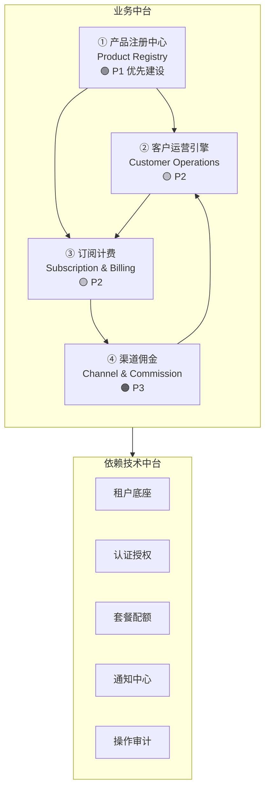
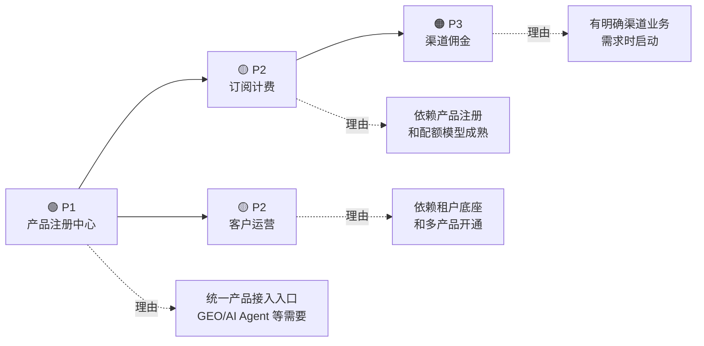
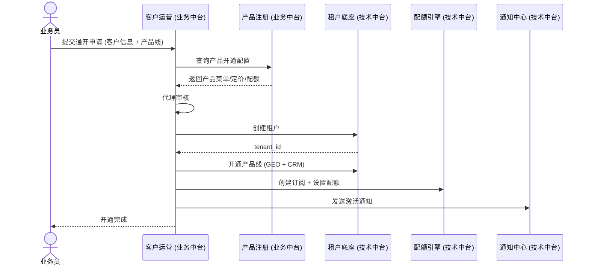
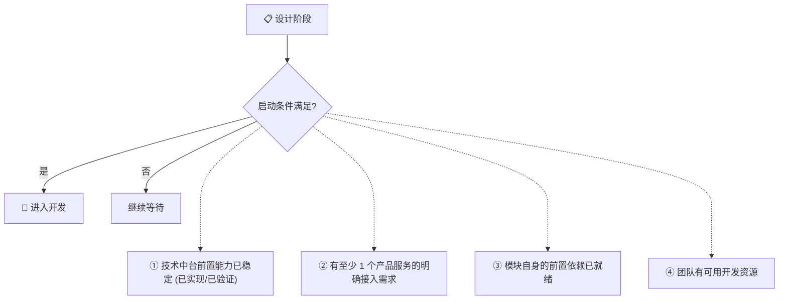

# 业务中台总览

日期：2026-07-22
状态：📋 设计阶段
优先级：P2+（产品注册中心 P1 优先启动）

---

## 一、定位

业务中台是跨产品的商业化运营能力层。所有产品共用的"管生意"能力——渠道管理、客户运营、订阅计费、佣金结算——在此沉淀。

> **说明：** 业务中台当前是目标架构设计，不是当前代码实现。每篇文档标注优先级和状态，防止误当成 P0 开发任务。

---

## 二、为什么需要业务中台

| 问题 | 没有业务中台 | 有业务中台 |
|------|------------|----------|
| 新产品接入 | 每次手工配置菜单/定价/权限 | 产品注册中心统一注册 |
| 客户开通 | 各产品各自实现开通流程 | 统一开通编排（租户+产品+套餐+通知） |
| 代客管理 | 无法统一追踪业务员-客户关系 | 客户运营引擎管理代管关系 |
| 计费结算 | 无统一计量和账单 | 订阅计费引擎统一处理 |
| 渠道分佣 | 无法支持代理/业务员模式 | 渠道佣金引擎独立计算 |

---

## 三、建设顺序

---

## 四、与技术中台的关系

| 维度 | 技术中台 | 业务中台 |
|------|---------|---------|
| **是什么** | 通用技术能力 | 跨产品运营能力 |
| **包含** | 租户/认证/审计/任务/文件/通知 | 产品注册/客户运营/计费/渠道 |
| **业务逻辑** | ❌ 不含 | ✅ 含运营逻辑 |
| **产品感知** | 产品无感（基础设施级） | 产品必须接入 |
| **示例** | "验证这个 Token 有效" | "这个客户属于哪个代理" |

---

## 五、典型场景：客户开通

---

## 七、启动条件

各模块从"设计阶段"进入"开发阶段"需要满足的条件：

| 模块 | 优先级 | 前置依赖 | 启动信号 | 预估规模 |
|------|:---:|------|------|:---:|
| 产品注册中心 | 🟢 P1 | 租户底座、套餐配额 (稳定) | GEO/AI Agent 需要菜单+定价注册 | M |
| 订阅计费 | 🟡 P2 | 产品注册中心、配额引擎 | 多个产品有独立定价和用量计费需求 | L |
| 客户运营引擎 | 🟡 P2 | 租户底座、产品注册中心 | 出现代理/业务员代管客户场景 | L |
| 渠道佣金 | 🟠 P3 | 订阅计费、客户运营 | 正式渠道合作伙伴计划启动 | XL |

