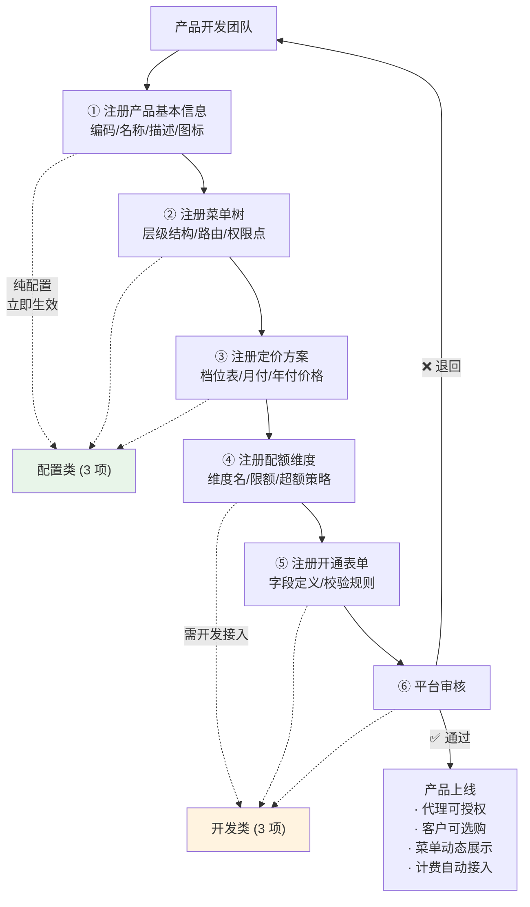
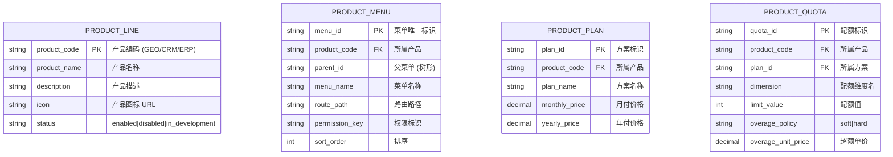
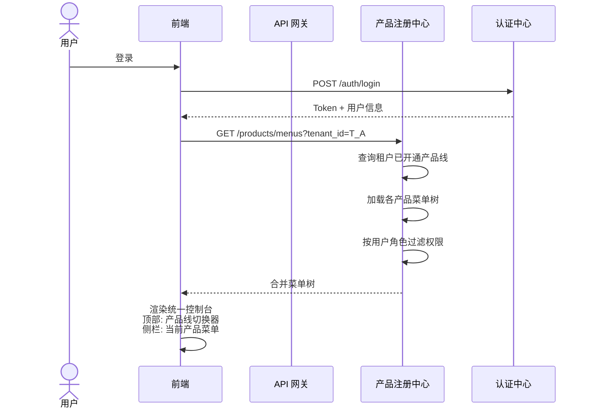

# 产品注册中心设计

日期：2026-07-22
状态：📋 设计阶段
优先级：🟢 P1（业务中台最先建设）

---

## 一、设计目标

新产品上线只需在注册中心配置，不改中台代码。产品开发团队按 6 步流程完成接入。

---

## 二、注册数据契约

---

## 三、菜单动态拼装

---

## 四、产品接入检查清单

产品团队接入平台需完成：

| # | 项目 | 类型 | 说明 |
|:---:|------|:---:|------|
| 1 | 产品基本信息注册 | 配置 | product_code/name/icon/description |
| 2 | 菜单树注册 | 配置 | 层级结构 + 权限点 + 路由 |
| 3 | 定价方案注册 | 配置 | 档位 + 月付/年付价格 |
| 4 | 配额维度注册 | 开发 | 维度定义 + 档位限额 + 超额策略 |
| 5 | 开通表单注册 | 开发 | 客户开通时字段和校验 |
| 6 | 认证接入 | 开发 | 调用认证中心验证 Token |
| 7 | 用量上报接入 | 开发 | 调用计费引擎上报用量 |
| 8 | 通知事件接入 | 开发 | 调用通知中心推送事件 |
| 9 | 文件存储接入 | 开发 | 调用文件中心上传/下载 |
| 10 | 审计日志接入 | 开发 | 调用审计中心记录操作 |

---

## 五、与当前接入规范的关系

本文档是"目标设计"，定义产品注册的理想形态。当前已生效的实现级规范见 `41-product-service-integration.md`。

目标演进路径：
1. 当前：手工 Checklist 接入（`41-产品服务模块接入规范`）
2. P1：产品注册中心后台 → 配置化注册
3. P2：SDK 自动生成 + API 文档门户
