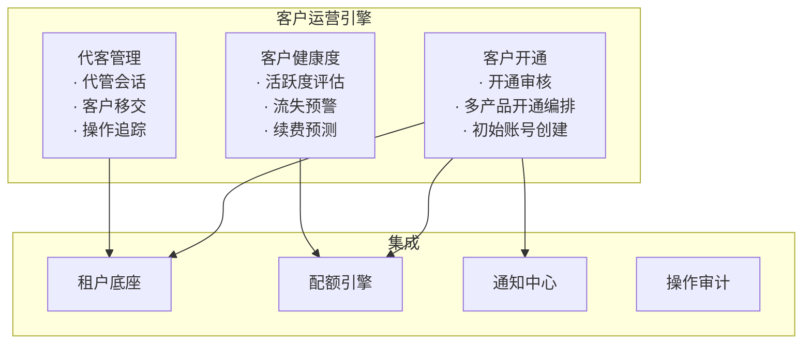
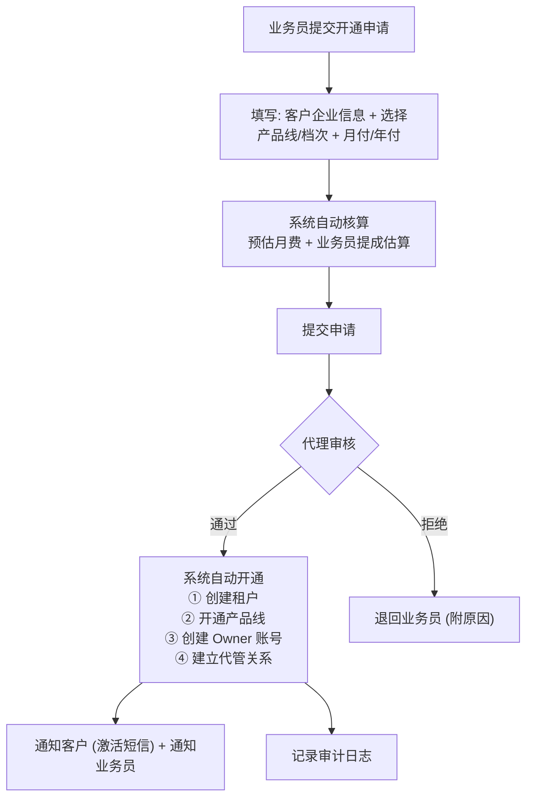
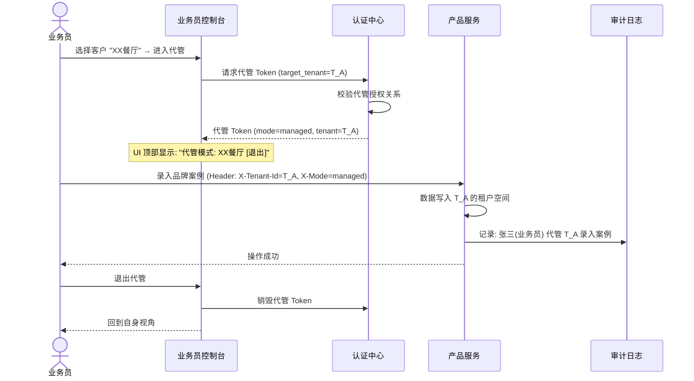
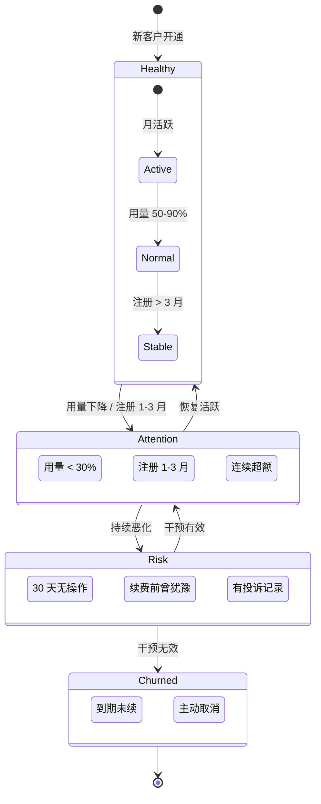
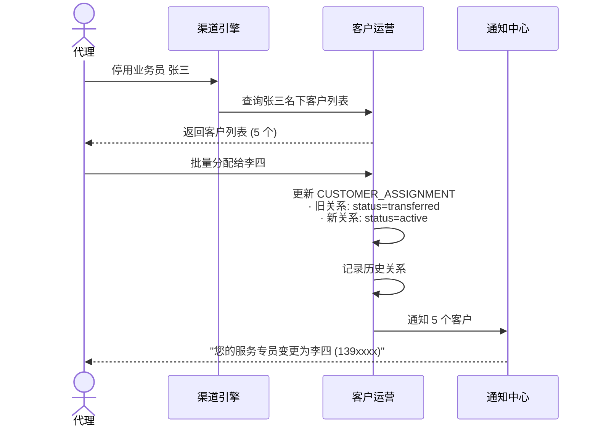

# 客户运营引擎设计

日期：2026-07-22
状态：📋 设计阶段
优先级：🟡 P2

---

## 一、核心能力

---

## 二、客户开通审核流程

---

## 三、代客管理会话

### 代管安全约束

| # | 约束 |
|:---:|------|
| ① | 代管 Token 有效期 2 小时（短于普通 Token） |
| ② | 代管 Token 绑定目标租户，不可切换 |
| ③ | 所有操作标记 `mode=managed`，审计可区分 |
| ④ | 敏感操作在代管模式下拦截（修改密码/套餐/销户/导出） |
| ⑤ | 客户可随时查看代管操作记录 |
| ⑥ | 客户可一键终止所有代管 Token |

---

## 四、客户健康度分层

---

## 五、业务员离职交接

