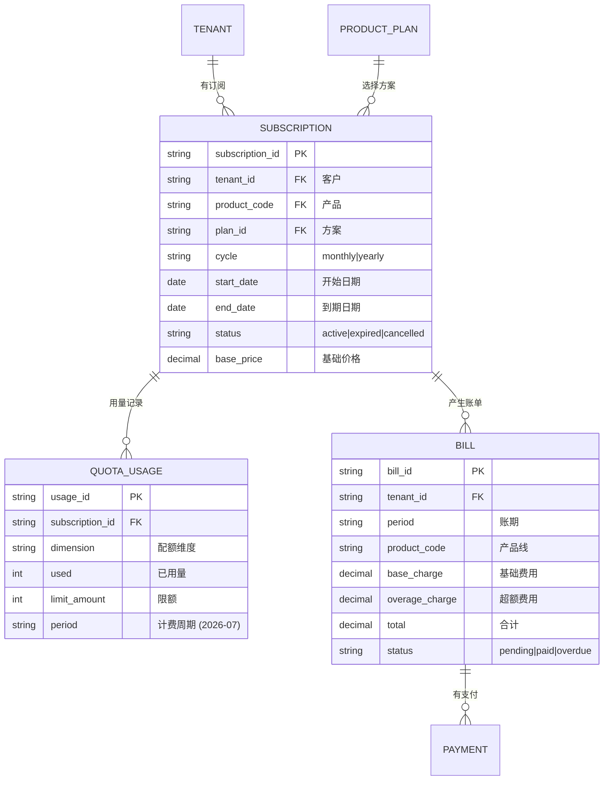
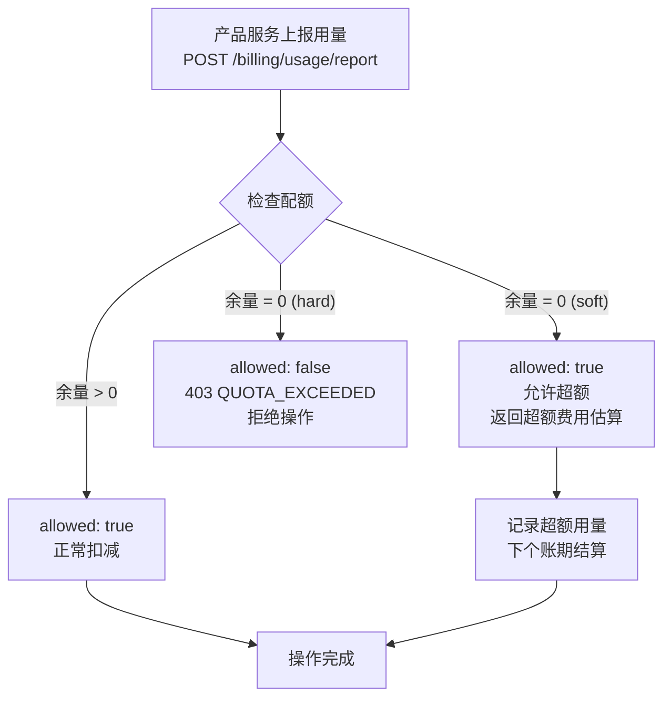
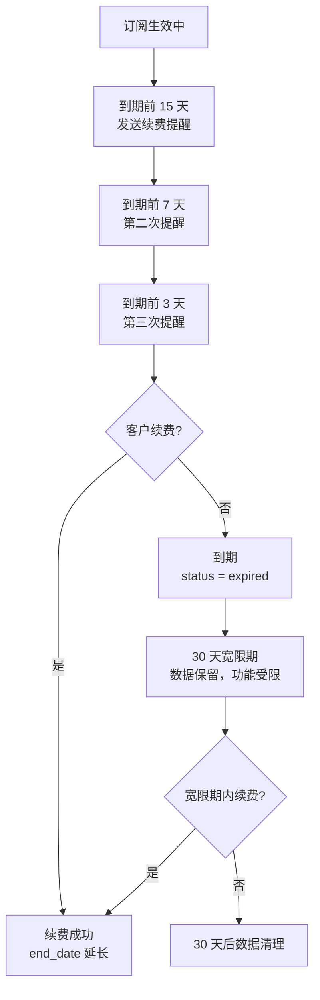

# 订阅计费设计

日期：2026-07-22
状态：📋 设计阶段
优先级：🟡 P2

---

## 一、计费模型



---

## 二、配额模型详解

### 软限制 vs 硬限制



### 配额维度示例

```text
GEO Engine Pro 套餐:
  · article_count:  30 篇/月  (hard, 超额单价 ¥120/篇)
  · brand_case:     10 个/月  (soft)
  · storage_gb:     50 GB     (soft)

CRM Starter 套餐:
  · customer_count: 500 个    (soft)
  · pipeline_count: 3 个      (hard, 超额单价 ¥50/个)
  · user_seat:      10 个     (hard)
```

**计费引擎不关心 "article_count" 是什么** — 它只处理维度码、限额、超额策略和单价。这是产品线与计费引擎的解耦方式。

---

## 三、用量上报接口

```text
POST /api/billing/usage/report
  Header: X-Tenant-Id: T_A
  Body: {
    product_code: "GEO",
    dimension: "article_count",
    amount: 1,
    action: "increment"
  }

  响应 200 (有余量):
  {
    allowed: true,
    quota: {
      dimension: "article_count",
      used: 29, limit: 30,
      remaining: 1,
      usage_percent: 96.7,
      warning: "配额即将耗尽"
    }
  }

  响应 200 (超额-软限制):
  {
    allowed: true,
    quota: { ... },
    overage: {
      overage_count: 2,
      overage_unit_price: 120,
      estimated_charge: 240
    },
    warning: "已超出配额，将产生超额费用"
  }

  响应 403 (超额-硬限制):
  {
    allowed: false,
    reason: "配额已耗尽，请充值",
    action_required: "recharge"
  }
```

---

## 四、续费流程



---

## 五、当前工程基线 vs 目标

| 能力 | 当前状态 | P2 目标 |
|------|---------|---------|
| 套餐版本化 | ✅ 已实现 | 关联产品定价 |
| 资源配额框架 | ✅ 已实现 | 关联订阅周期 |
| 用量上报 | ❌ | API 标准化 |
| 账单生成 | ❌ | 月度自动生成 |
| 支付集成 | ❌ | 微信/支付宝 |
| 续费管理 | ❌ | 自动提醒+宽限 |
| 发票管理 | ❌ | 电子发票 |
| 优惠/折扣 | ❌ | 优惠券引擎 |
