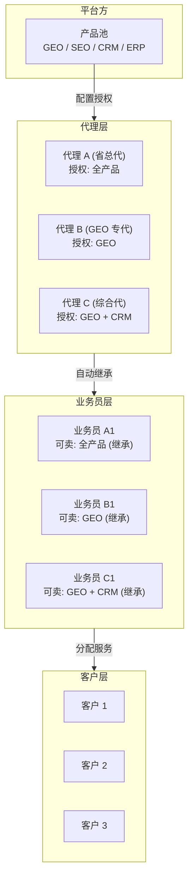
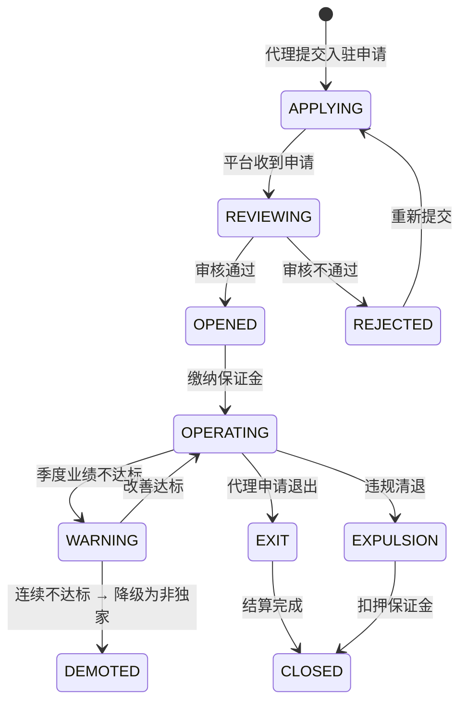
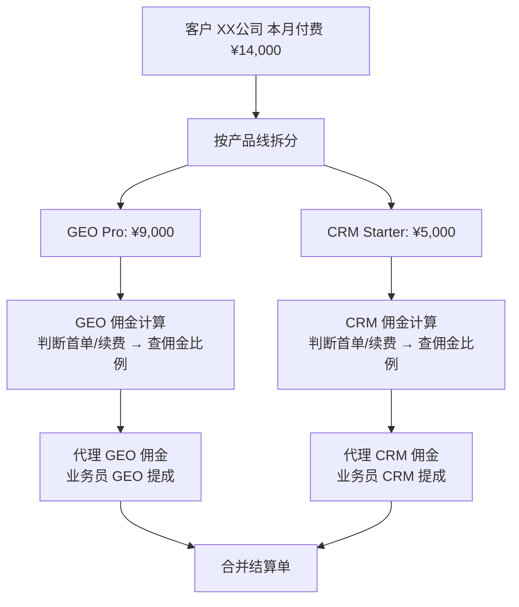
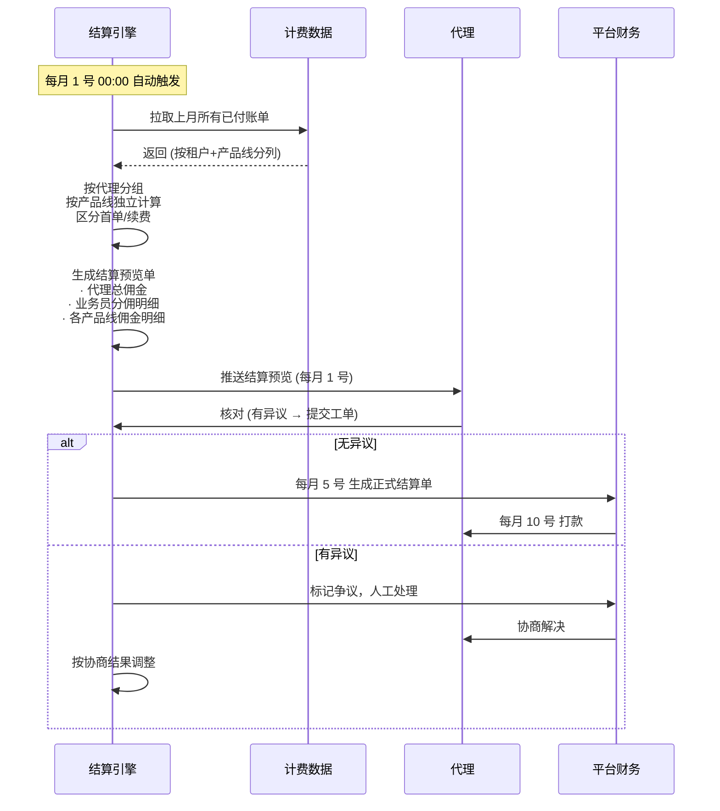

# 渠道与佣金设计

日期：2026-07-22
状态：📋 设计阶段
优先级：🟠 P3（有明确渠道业务需求时启动）

---

## 一、渠道模型

- **代理** → 平台授权产品线
- **业务员** → 自动继承所属代理的产品授权
- **客户** → 分配给业务员服务

---

## 二、代理生命周期

---

## 三、佣金结算引擎

### 多产品分佣模型

### 佣金比例配置

| 产品线 | 代理类型 | 首单佣金 | 续费佣金 | 业务员建议提成 |
|--------|:------:|:------:|:------:|:------------:|
| GEO | 独家 | 50% | 20% | 佣金的 50-70% |
| GEO | 非独家 | 40% | 15% | 佣金的 50-70% |
| SEO | 通用 | 40% | 15% | 佣金的 50% |
| CRM | 通用 | 60% | 25% | 佣金的 60% |
| ERP | 通用 | 30% | 10% | 佣金的 50% |

> CRM 佣金最高 — 作为新推产品以高佣金激励渠道推广。佣金比例是业务杠杆，应可配置。

---

## 四、月度结算流程

---

## 五、当前状态

渠道和佣金模块当前不实现。当前工程基线中的租户和权限能力已可支持基础的客户管理场景。

当出现以下信号时启动 P3：
- 有明确的代理/渠道业务模式
- 需要按产品线分佣结算
- 业务员代客管理的需求超过简单的手工分配
