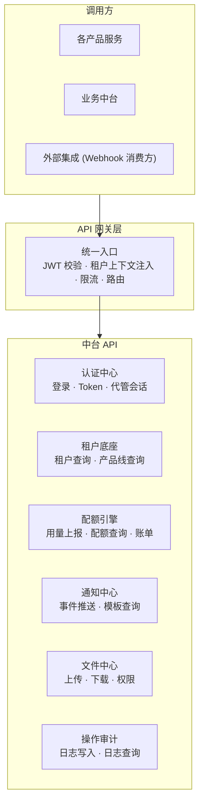
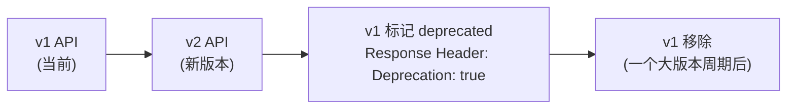

# API 边界与通信契约

日期：2026-07-22
状态：📋 目标参考（当前 gRPC+HTTP 规范为实际生效）

---

## 一、API 分层



---

## 二、网关请求头规范

所有通过网关的请求，下游服务可信任以下 Header：

| Header | 说明 | 示例 |
|--------|------|------|
| `X-Tenant-Id` | 当前请求的租户上下文 | `T_A` |
| `X-User-Id` | 当前请求的用户 | `U_001` |
| `X-User-Type` | 用户类型 | `platform` / `agent` / `salesperson` / `customer` |
| `X-Mode` | 操作模式 | `self` / `managed` |
| `X-Operator-Id` | 实际操作人 (代管模式时) | `U_SALES_001` |
| `X-Request-Id` | 请求追踪 ID | `req_xxx` |

**产品服务只需信任这些 Header，无需自行解析 Token。**

---

## 三、认证中心 API

| 方法 | 路径 | 说明 | 调用方 |
|------|------|------|--------|
| POST | `/api/auth/login` | 用户登录 | 所有客户端 |
| POST | `/api/auth/logout` | 退出登录 | 所有客户端 |
| POST | `/api/auth/refresh` | 刷新 Token | 所有客户端 |
| GET | `/api/auth/verify` | 校验 Token | API 网关 (内部) |
| POST | `/api/auth/impersonate` | 创建代管会话 | 业务员控制台 |
| DELETE | `/api/auth/impersonate` | 销毁代管会话 | 业务员控制台 |
| GET | `/api/auth/permissions` | 查询权限列表 | 客户端 (菜单渲染) |

---

## 四、租户底座 API

| 方法 | 路径 | 说明 | 调用方 |
|------|------|------|--------|
| POST | `/api/tenants` | 创建租户 | 业务中台 |
| GET | `/api/tenants/{id}` | 查询租户信息 | 所有服务 |
| PUT | `/api/tenants/{id}` | 更新租户信息 | 业务中台 |
| GET | `/api/tenants/{id}/products` | 查询已开通产品线 | 产品服务 |
| POST | `/api/tenants/{id}/products` | 开通产品线 | 业务中台 |
| PUT | `/api/tenants/{id}/products/{code}` | 修改产品线状态 | 业务中台 |

---

## 五、配额引擎 API

| 方法 | 路径 | 说明 | 调用方 |
|------|------|------|--------|
| POST | `/api/billing/subscriptions` | 创建订阅 | 业务中台 |
| GET | `/api/billing/subscriptions/{id}` | 查询订阅 | 产品服务/客户端 |
| PUT | `/api/billing/subscriptions/{id}` | 修改订阅 (升级/降级) | 业务中台 |
| POST | `/api/billing/usage/report` | 上报用量 | **产品服务** |
| GET | `/api/billing/usage/check` | 检查配额余量 | **产品服务** |
| GET | `/api/billing/bills` | 查询账单列表 | 客户端/代理 |

---

## 六、通知中心 API

| 方法 | 路径 | 说明 | 调用方 |
|------|------|------|--------|
| POST | `/api/notify/events` | 推送事件 | 所有服务 |
| GET | `/api/notify/templates` | 查询通知模板 | 产品服务 |
| PUT | `/api/notify/preferences` | 配置通知偏好 | 客户端 |

---

## 七、文件中心 API

| 方法 | 路径 | 说明 |
|------|------|------|
| POST | `/api/storage/upload-session` | 创建上传会话 |
| POST | `/api/storage/confirm` | 确认上传 |
| GET | `/api/storage/{file_id}` | 获取文件 (含权限校验) |
| DELETE | `/api/storage/{file_id}` | 删除文件 |

---

## 八、审计日志 API

| 方法 | 路径 | 说明 | 调用方 |
|------|------|------|--------|
| POST | `/api/audit/log` | 写入审计日志 | 所有服务 (中间件自动) |
| GET | `/api/audit/logs` | 查询审计日志 | 平台运营/客户 |

```text
POST /api/audit/log
  Body: {
    action: "article.create",
    operator: { user_id, user_type, mode: "managed" },
    target: { tenant_id: "T_A", resource_type: "article", resource_id: "142" },
    detail: "生成文章「行为量化管理」",
    timestamp: "2026-07-19T14:30:00Z"
  }
```

---

## 九、统一错误码

```text
{
  "error": {
    "code": "QUOTA_EXCEEDED",
    "message": "文章配额已耗尽，请充值或升级套餐",
    "detail": {
      "product_code": "GEO",
      "dimension": "article_count",
      "used": 30,
      "limit": 30
    }
  }
}
```

| HTTP 码 | 错误码 | 说明 |
|:---:|--------|------|
| 401 | `UNAUTHORIZED` | Token 无效或过期 |
| 403 | `FORBIDDEN` | 无权限 |
| 403 | `TENANT_SUSPENDED` | 租户已暂停 |
| 403 | `QUOTA_EXCEEDED` | 配额耗尽 (硬限制) |
| 404 | `NOT_FOUND` | 资源不存在 |
| 409 | `CONFLICT` | 资源冲突 |
| 409 | `LAST_TENANT_ADMIN_REQUIRED` | 不能移除最后管理员 |
| 429 | `RATE_LIMITED` | 触发限流 |

---

## 十、API 版本化策略



```
- 破坏性变更必须发新版本
- 旧版本保留至少一个大版本周期
- 废弃 API 在 Response Header 中标记 `Deprecation: true`

---

## 十一、API 设计规范（当前生效）

> 以下规则从 `backend-service/proto/` 和 `internal/biz/` 实际代码中提炼。

### RPC 命名

| 操作 | 命名 | 示例 |
|------|------|------|
| 列表查询 | `List{Resource}` | `ListParameterDefinitions` |
| 获取详情 | `Get{Resource}` | `GetParameterDefinition` |
| 创建 | `Create{Resource}` | `CreateParameterDefinition` |
| 更新 | `Update{Resource}` | `UpdateParameterDefinition` |
| 删除 | `Delete{Resource}` | `DeleteParameterDefinition` |
| 租户数据面列表 | `ListCurrentTenant{Resource}` | `ListCurrentTenantParameters` |
| 租户数据面设置 | `SetCurrentTenant{Resource}` | `SetCurrentTenantParameter` |

### HTTP 路径规范

> 完整规范见 [3-4-跨领域-HTTP-API设计规范](./3-4-跨领域-HTTP-API设计规范.md)（AIP 对齐）。此处为速查版。

```
服务前缀:      /{service}/{version}          # /admin/v1, /evie/v1, /ai/v1
平台控制面:    /admin/v1/{resource}         # List/Get/Create/Update/Delete
用户级数据面:  /admin/v1/my/{resource}      # 当前登录用户：我的设备、我的通知、我的会话
租户级数据面:  /admin/v1/current-tenant/{resource}  # 当前租户：参数、有效菜单
自定义操作:    /admin/v1/{resource}/{id}:{action}    # 冒号分隔，禁止斜杠

示例:
  GET    /admin/v1/parameters                          # List（控制面）
  POST   /admin/v1/parameters                          # Create（控制面）
  GET    /admin/v1/my/notifications                    # List（用户级数据面）
  GET    /admin/v1/current-tenant/parameters           # List（租户级数据面）
  POST   /admin/v1/async-tasks/{id}:cancel             # 自定义操作（冒号）
  POST   /admin/v1/resource-quotas/{key}:consume       # 自定义操作（冒号）
```

**关键规则：**
- 自定义动作用 `:` 分隔（AIP-136），禁止 `/{id}/{verb}` 斜杠形式
- 子资源（有独立 ID/生命周期）才用 `/` 分隔（AIP-122）
- `my/*`（当前用户）与 `current-tenant/*`（当前租户）语义不同，不可混用

### 分页

全部列表接口使用 `pagination.PagingRequest` / `pagination.PagingResponse`：

```proto
// 请求（pagination.proto）
message PagingRequest {
  int32 page_size = 1;       // default: 20
  string page_token = 2;     // 当前页码
  int32 skip = 3;            // 跳过行数
  optional string filter = 4; // AIP-160 标准筛选
  optional string order_by = 5; // "create_time desc"
  optional bool no_paging = 6;  // 不分页
}

// 响应
message PagingResponse {
  int32 total = 1;
  repeated google.protobuf.Any items = 2;
  string next_page_token = 3;
}
```

### 错误码规范（当前实际使用）

```go
// kratos errors 模式（从 internal/biz/ 提取）
errors.BadRequest("ERROR_CODE", "中文描述")       // 400
errors.Forbidden("ERROR_CODE", "中文描述")         // 403
errors.NotFound("ERROR_CODE", "中文描述")          // 404
errors.Conflict("ERROR_CODE", "中文描述")          // 409

// 错误码命名：UPPER_SNAKE_CASE
// 示例: PARAMETER_KEY_INVALID, TENANT_CONTEXT_REQUIRED, SENSITIVE_PARAMETER_NOT_ALLOWED
```

### 枚举规范

```proto
// 每个枚举值的第一个值必须是 *_UNSPECIFIED = 0（Proto3 要求）
enum Status {
  STATUS_UNSPECIFIED = 0;
  STATUS_ENABLED = 1;
  STATUS_DISABLED = 2;
}

// 包路径: proto/common/enum/enum.proto
// Go package: backend-service/api/common/enum;enum
```

### Proto 文件组织

```
proto/
├── common/                  # 公共消息
│   ├── common.proto
│   ├── pagination/          # 分页
│   └── enum/                # 枚举
├── core/service/v1/         # 核心服务 v1（消息定义+错误码）
│   ├── tenant.proto
│   ├── user.proto
│   ├── error_reason.proto
│   └── ...
└── platform/admin/v1/       # 平台管理 v1（RPC 服务定义）
    ├── i_parameter.proto    # i_ = interface (gRPC service)
    ├── i_tenant.proto
    └── ...
```

### 契约检查

```bash
buf lint                # Proto 规范检查
buf breaking            # 向后兼容检查
make contract-check     # proto-lint + generate-check
```
