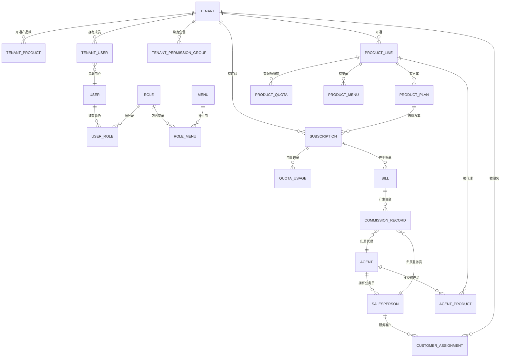
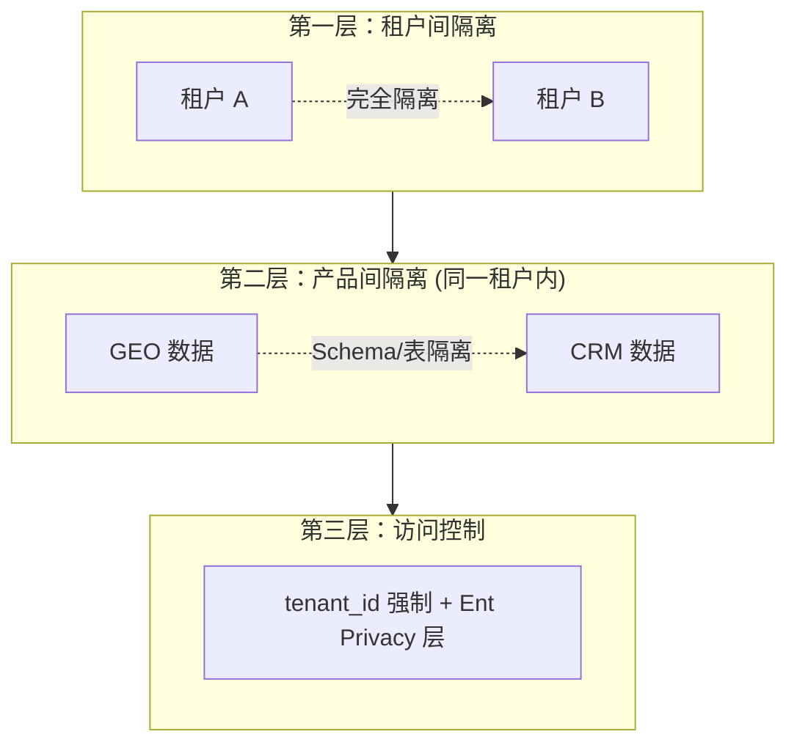

# 核心数据模型

日期：2026-07-22
状态：概念层参考（当前 Ent Schema 为实现事实来源）

---

## 一、平台级 ER 图

---

## 二、核心实体目录

### 租户与用户域

| 实体 | 核心字段 | 说明 |
|------|---------|------|
| `TENANT` | tenant_id, name, code, lifecycle_status, is_platform | 平台客户企业 |
| `USER` | user_id, user_type, phone, tenant_id(可选), agent_id(可选) | 统一用户模型 |
| `TENANT_USER` | tenant_id, user_id, role | 租户成员关联 |
| `TENANT_PRODUCT` | tenant_id, product_code, plan_id, status | 租户产品订阅 |

### 权限域

| 实体 | 核心字段 | 说明 |
|------|---------|------|
| `ROLE` | role_id, tenant_id, is_tenant_admin, data_scope | 角色定义 |
| `MENU` | menu_id, permission_key, route_path, parent_id | 菜单树 |
| `USER_ROLE` | user_id, role_id | 用户-角色 |
| `ROLE_MENU` | role_id, menu_id | 角色-菜单 |

### 套餐与配额域

| 实体 | 核心字段 | 说明 |
|------|---------|------|
| `MENU_PERMISSION_GROUP` | id, name, code, status | 业务套餐 |
| `MENU_PERMISSION_GROUP_VERSION` | group_id, version_number, menu_ids | 套餐不可变版本 |
| `TENANT_PERMISSION_GROUP` | tenant_id, group_id, version_id, auto_upgrade | 租户绑定 |
| `TENANT_RESOURCE_QUOTA_USAGE` | tenant_id, resource_key, used | 配额用量 |

### 产品域 (📋 设计阶段)

| 实体 | 核心字段 | 说明 |
|------|---------|------|
| `PRODUCT_LINE` | product_code, product_name, status | 产品线注册 |
| `PRODUCT_PLAN` | plan_id, product_code, monthly_price, yearly_price | 定价方案 |
| `PRODUCT_QUOTA` | quota_id, product_code, dimension, limit_value, overage_policy | 配额维度 |

### 业务域 (📋 设计阶段)

| 实体 | 核心字段 | 说明 |
|------|---------|------|
| `AGENT` | agent_id, agent_type, region, status, deposit | 代理 |
| `AGENT_PRODUCT` | agent_id, product_code | 代理产品授权 |
| `SALESPERSON` | salesperson_id, agent_id, user_id, status | 业务员 |
| `CUSTOMER_ASSIGNMENT` | salesperson_id, tenant_id, status | 客户分配 |
| `SUBSCRIPTION` | subscription_id, tenant_id, product_code, plan_id, cycle | 订阅 |
| `BILL` | bill_id, tenant_id, period, product_code, total, status | 账单 |
| `COMMISSION_RECORD` | commission_id, bill_id, agent_id, salesperson_id, commission_type, amounts | 佣金 |

---

## 三、数据隔离策略

### 实现方式

| 层 | 机制 | 说明 |
|:---:|------|------|
| 网关 | JWT 解析 → 注入 `X-Tenant-Id` | 拒绝无租户上下文的请求 |
| 应用 | 所有查询 `WHERE tenant_id = ?` | 业务代码必须带租户过滤 |
| ORM | Ent Privacy 层自动注入 | 即使应用漏写，Privacy 层兜底 |
| 数据库 | 外键跨租户校验 | 拒绝跨租户引用 |

**防御深度：即使某一层失效，后续层仍然拦截。**

---

## 四、关键枚举

| 枚举 | 可选值 |
|------|--------|
| `lifecycle_status` | PENDING / ACTIVE / SUSPENDED / EXPIRED / CANCELLED |
| `user_type` | platform / agent / salesperson / customer |
| `data_scope` | 1(全部) / 2(本人) / 3(本部门) / 4(本部门及下级) / 5(自定义) |
| `product_status` | enabled / disabled / in_development |
| `agent_type` | exclusive / non_exclusive |
| `agent_status` | applying / reviewing / operating / closed |
| `subscription_status` | active / expired / cancelled |
| `bill_status` | pending / paid / overdue |
| `overage_policy` | soft / hard |

---

## 五、与代码的映射

本文档是概念层模型。当前代码中的 Ent Schema 是实现事实来源，位于：

- `backend-service/app/platform/service/internal/data/ent/schema/`

概念模型与实际 Schema 的差异应在实现文档中记录。
