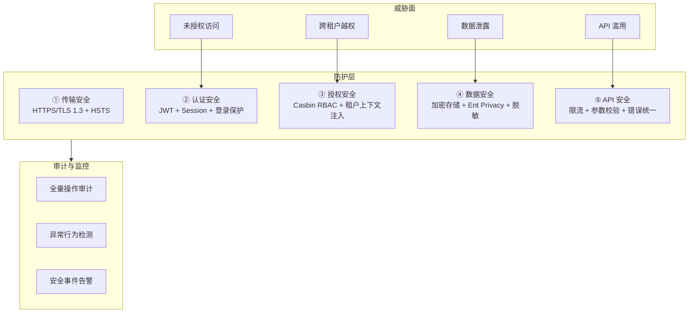
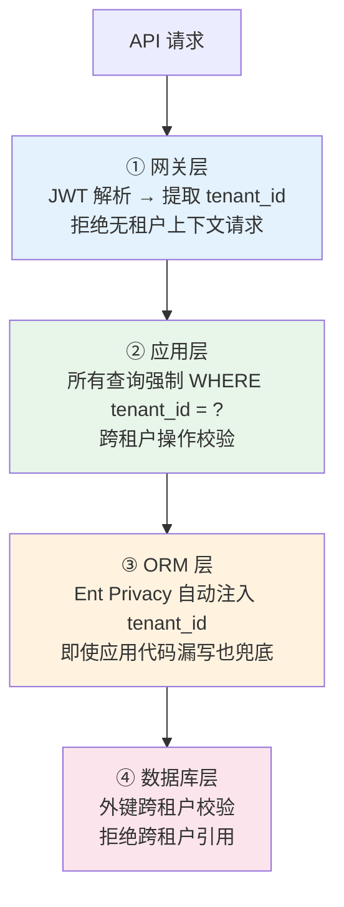
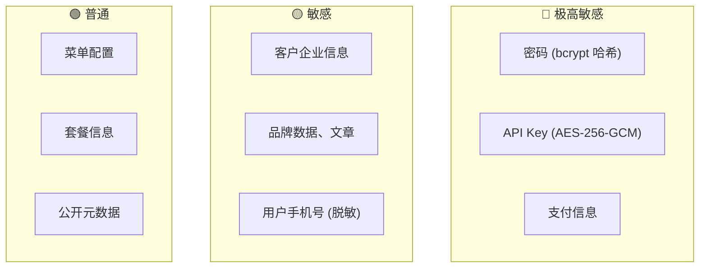
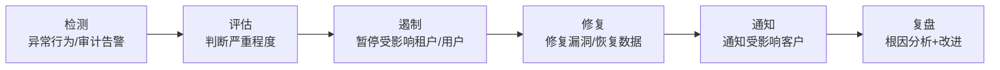

# 安全架构设计

日期：2026-07-22
状态：部分已实现（防御深度、租户隔离、代管安全已实现；限流、MFA 待建设）

---

## 一、安全架构全景



---

## 二、防御深度：租户隔离



---

## 三、数据安全

### 数据分级



### 加密策略

| 场景 | 策略 |
|------|------|
| 密码存储 | bcrypt 单向哈希 (cost ≥ 12)，不可逆 |
| API Key 存储 | AES-256-GCM 加密，使用时解密 |
| 数据传输 | 全站 HTTPS (TLS 1.3)，HSTS 强制 |
| 日志脱敏 | 手机号中间 4 位打码；密码/Token/Key 不入日志 |
| 数据库备份 | 加密备份，密钥与数据库分离 |

### 数据删除

| 场景 | 策略 |
|------|------|
| 软删除 | 标记 deleted_at，30 天后物理清除 |
| 租户销户 | 软删除租户 → 30 天后清除所有数据 |
| 审计日志 | 保留 1 年，可归档导出后清理 |
| 数据库备份 | 每日备份保留 7 天，每周备份保留 1 月 |

---

## 四、API 安全

### 限流策略 (📋 待建设)

| 级别 | 限制 | 适用 |
|------|------|------|
| 全局 | 10,000 req/min | 整个平台 |
| 租户级 | 1,000 req/min | 单个租户 |
| 用户级 | 300 req/min | 单个用户 |
| 登录接口 | 5 req/min/IP | 防暴力破解 |

触发限流 → `429 Too Many Requests`

### 防护措施

| 威胁 | 防护 |
|------|------|
| SQL 注入 | ORM 参数化查询 |
| XSS | 输出编码 + CSP Header |
| CSRF | SameSite Cookie |
| 暴力破解 | 登录频率限制 + 账户锁定 (5 次/15 分钟) |
| 信息泄露 | 认证失败、无权限、不存在均返回统一 401/403/404 |

---

## 五、代管会话安全

```text
业务员代管客户时的安全约束：

  ① 代管 Token 有效期 2 小时 (短于普通 Token)
  ② 代管 Token 绑定目标租户，不可切换
  ③ 所有代管操作标记 mode=managed，审计可区分
  ④ 敏感操作在代管模式下拦截:
     - 修改客户登录密码
     - 修改套餐和支付信息
     - 删除客户租户
     - 导出客户完整数据
  ⑤ 客户可随时查看代管操作记录
  ⑥ 客户可一键终止所有代管 Token
```

---

## 六、安全事件响应



| 严重程度 | 响应时间 | 通知义务 |
|:---:|:---:|------|
| 🔴 严重 (数据泄露) | 1 小时内响应 | 72 小时内通知受影响客户 |
| 🟡 高 (权限漏洞) | 4 小时内响应 | 修复后通知 |
| 🟢 中 (配置问题) | 24 小时内响应 | 内部通报 |

---

## 七、当前实现状态

| 能力 | 状态 |
|------|:---:|
| 防御深度四层隔离 | ✅ 已实现 |
| JWT + Session 认证 | ✅ 已实现 |
| Casbin RBAC | ✅ 已实现 |
| 平台/租户双域权限 | ✅ 已实现 |
| 登录安全策略 | ✅ 已实现 |
| 代管会话安全约束 | ✅ 已实现 |
| 操作审计全覆盖 | ✅ 已实现 |
| 数据脱敏 (日志) | ✅ 已实现 |
| 跨租户外键校验 | ✅ 已实现 |
| 全站 HTTPS | 📋 部署层面 |
| API 分级限流 | 📋 待建设 |
| MFA 多因素认证 | 📋 待建设 |
| 密钥轮换机制 | 📋 待建设 |
| 安全事件告警 | 📋 待建设 |
