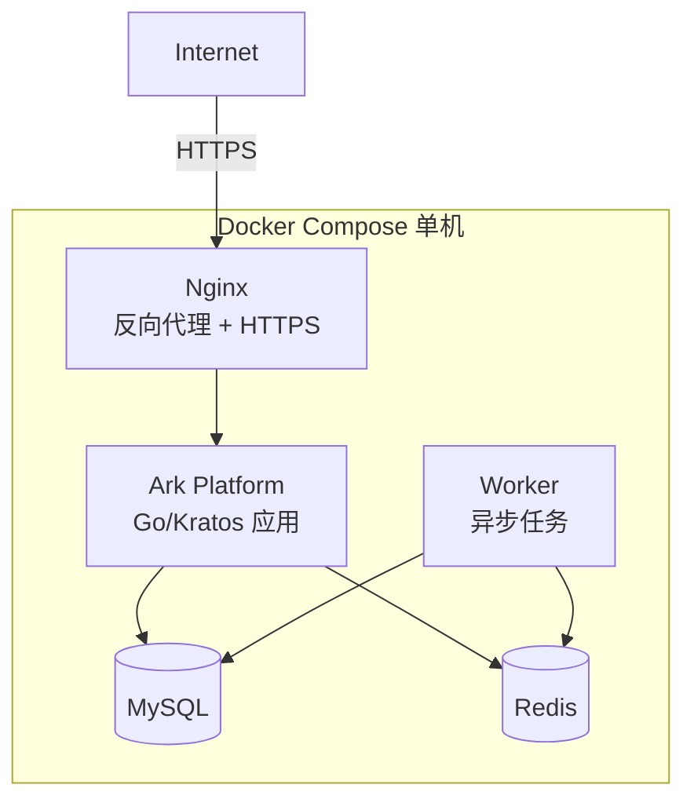
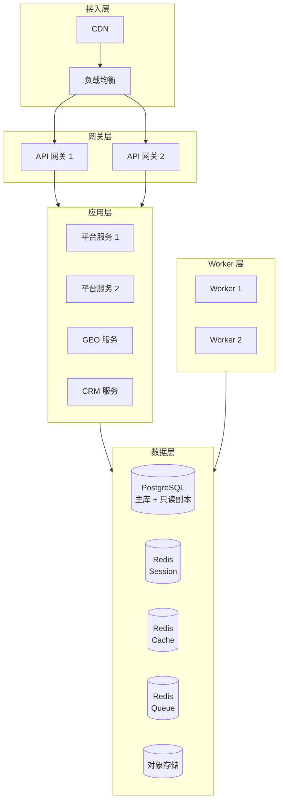
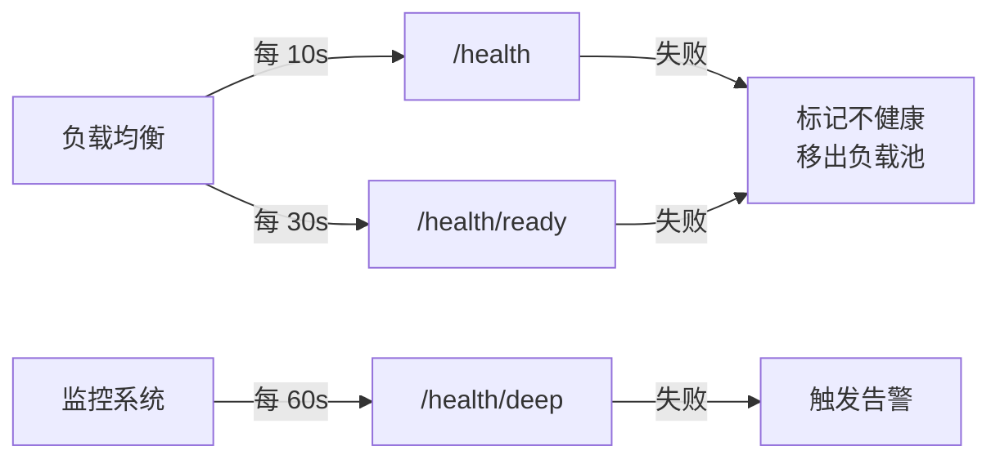
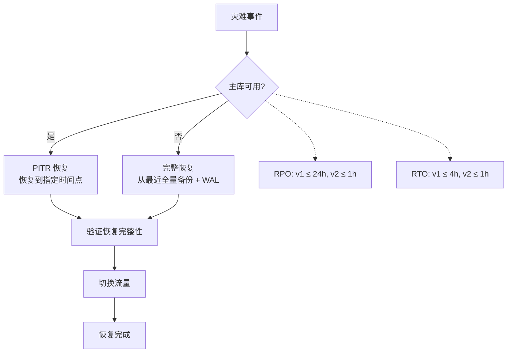
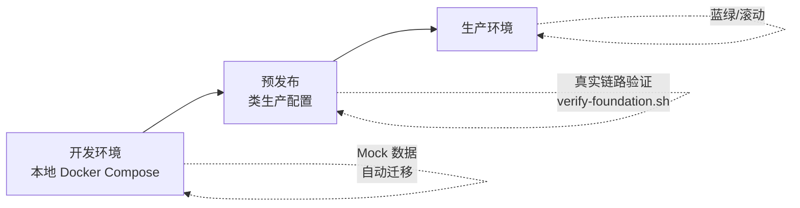
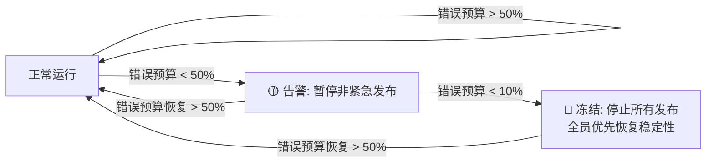
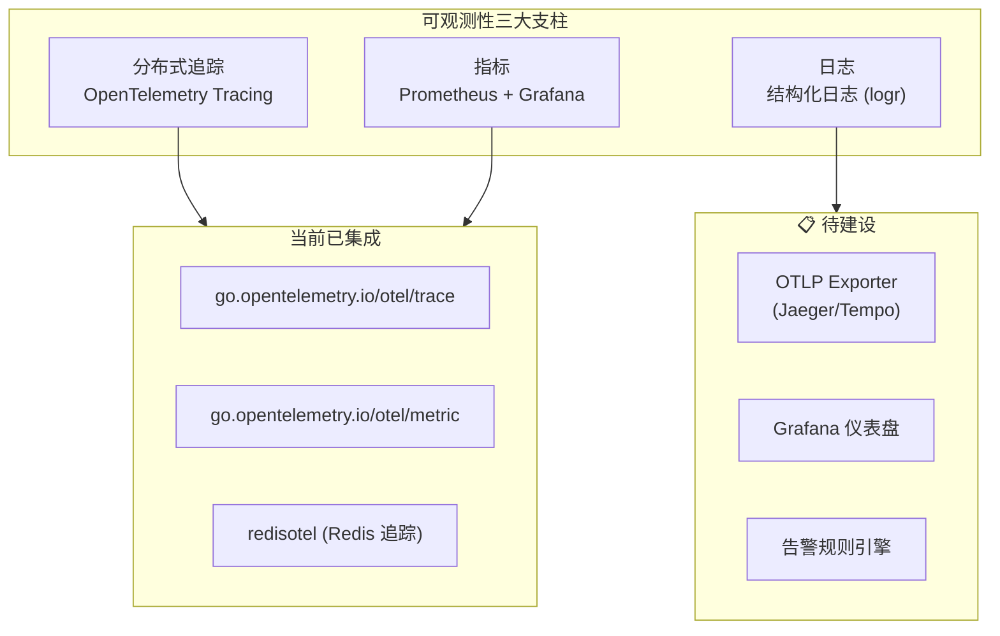

# 非功能需求与部署架构

日期：2026-07-22
状态：📋 目标参考

---

## 一、性能指标

### 目标值

| 指标 | 非 LLM 请求 | LLM 请求 | 说明 |
|------|:---:|:---:|------|
| API 响应时间 (P50) | < 100ms | < 5s | 不含网络延迟 |
| API 响应时间 (P95) | < 500ms | < 30s | 峰值负载 |
| API 响应时间 (P99) | < 1s | < 120s | 超时上限 |
| 并发连接数 | 1,000+ | — | 单实例 |
| 数据库连接池 | 50-100 | — | 单实例 |

### 容量触发

| 触发条件 | 动作 |
|------|------|
| CPU > 70% 持续 5 分钟 | 考虑扩容 |
| 磁盘 > 80% | 清理/扩容 |
| API P95 > 500ms 持续 10 分钟 | 性能排查 |
| 数据库连接池使用 > 80% | 调整连接池或拆读 |

---

## 二、部署拓扑

### v1：单机部署



**适用：** 开发、测试、小规模生产 (≤ 50 租户)

### v2：可扩展部署



**适用：** 生产环境 (50+ 租户，多产品线)

---

## 三、健康检查

```text
三层健康检查:

GET /health           ← 进程存活 (轻量)
GET /health/ready     ← DB + Redis 连通性
GET /health/deep      ← 实际查询 + 缓存读写 (含异步任务状态)
```



---

## 四、备份与灾备

### 备份策略

| 类型 | 频率 | 保留 | 说明 |
|------|:---:|:---:|------|
| 全量备份 | 每日 | 7 天 | 凌晨自动执行 |
| WAL 归档 | 持续 | 1 天 | PostgreSQL 增量恢复 |
| 每周备份 | 每周 | 1 月 | 长期归档 |
| 审计日志导出 | 按需 | 1 年+ | 归档到对象存储 |

### 灾难恢复



---

## 五、环境管理



| 环境 | 数据 | 部署方式 | 用途 |
|------|------|---------|------|
| 开发 | Mock 数据 | Docker Compose | 本地开发和测试 |
| 预发布 | 脱敏生产数据 | 类生产配置 | 集成测试 + 验收 |
| 生产 | 真实数据 | 可扩展部署 | 线上服务 |

---

## 六、监控与告警 (📋 待建设)

### 监控目标

| 层面 | 监控项 | 工具 |
|------|--------|------|
| 基础设施 | CPU/内存/磁盘/网络 | Prometheus + Grafana |
| 应用 | QPS/延迟/错误率 | OpenTelemetry |
| 数据库 | 连接数/慢查询/复制延迟 | 数据库自带 + 导出 |
| 业务 | 租户数/API 调用量/任务队列深度 | 自定义指标 |

### 告警规则

| 告警 | 条件 | 级别 |
|------|------|:---:|
| 服务不可用 | /health 连续 3 次失败 | 🔴 Critical |
| 数据库连接失败 | /health/ready 失败 | 🔴 Critical |
| API 错误率飙升 | 5xx > 5% 持续 5 分钟 | 🟡 Warning |
| 任务队列积压 | pending > 100 持续 10 分钟 | 🟡 Warning |
| 磁盘使用 | > 85% | 🟡 Warning |
| 证书即将过期 | < 30 天 | 🟢 Info |

---

## 八、SLO 与错误预算

### 服务等级目标

| SLI | SLO | 测量窗口 | 测量端点 |
|-----|-----|:---:|------|
| 可用性 | **99.9%** (v1) / **99.95%** (v2) | 30 天滚动 | `/health` 探针成功率 |
| API 延迟 (P95) | < 500ms | 1 小时 | 所有非 LLM API |
| API 成功率 | > 99.5% (非 5xx) | 1 小时 | 所有 API |
| 登录成功率 | > 99.9% | 1 小时 | `/api/auth/login` |
| 任务执行成功率 | > 95% | 24 小时 | 异步任务 SUCCEEDED/(SUCCEEDED+FAILED) |

### 错误预算

```text
月度错误预算 = (1 - SLO) × 月度总请求数

示例 (99.9% 可用性):
  · 月均 1M 请求 → 错误预算 = 1,000 次失败
  · 月均 10M 请求 → 错误预算 = 10,000 次失败
```

### 错误预算耗尽策略



---

## 九、可观测性设计

> 基于当前 `go.mod` 依赖栈和实际代码模式。

### 三大支柱



### 当前技术栈（从 go.mod 提取）

| 组件 | 库 | 版本 | 状态 |
|------|------|:---:|:---:|
| 日志门面 | `go-logr/logr` | v1.4.3 | ✅ 已集成 |
| 日志实现 | `go-logr/stdr` | v1.2.2 | ✅ 已集成 |
| OpenTelemetry API | `go.opentelemetry.io/otel` | v1.37.0 | ✅ 已集成 |
| Otel Trace | `go.opentelemetry.io/otel/trace` | v1.37.0 | ✅ 已集成 |
| Otel Metric | `go.opentelemetry.io/otel/metric` | v1.37.0 | ✅ 已集成 |
| Redis 追踪 | `redisotel/v9` | v9.8.0 | ✅ 已集成 |
| OTLP Exporter | — | — | 📋 待集成 |
| Grafana 仪表盘 | — | — | 📋 待建设 |

### 日志规范

```go
// 当前模式：结构化日志
log.Context(ctx).Info("parameter created",
    "key", param.Key,
    "tenant_id", tenantID,
)
log.Context(ctx).Error(err, "failed to consume quota",
    "resource_key", key,
    "amount", amount,
)
```

- 业务日志带 `tenant_id` 和 `trace_id`
- 敏感字段（密码/Token/Key）不写入日志
- 错误日志包含完整错误链

### 健康检查端点

```text
GET /health          ← 进程存活 (轻量)
GET /health/ready    ← DB + Redis 连通性
GET /health/deep     ← 实际查询 + 缓存读写 + 异步任务状态
```

### 验证脚本生态（当前已实现）

```bash
verify-foundation.sh                # 静态检查
verify-foundation-live-backend.sh   # DB + Redis 连通性
verify-foundation-live.sh           # 完整真实链路
check-platform-coverage.sh          # 测试覆盖率门禁
check-authorization-cache-health.sh # 授权缓存健康
check-resource-quota-health.sh      # 配额操作健康
```

### 待建设路径

1. **OTLP Exporter** → 将 Trace 导出到 Jaeger/Tempo
2. **Prometheus Metrics** → 暴露 `/metrics` 端点，接入 Grafana
3. **告警规则** → 基于 SLI 定义告警阈值
4. **慢查询日志** → API 耗时超过 500ms 自动记录
5. **错误聚合** → 按 error code + tenant 聚合展示

---

## 十、当前状态

| 能力 | 状态 |
|------|:---:|
| 异步任务健康监控 | ✅ 已实现 |
| 授权缓存健康检查 | ✅ 已实现 |
| 资源额度 readiness 指标 | ✅ 已实现 |
| 验证脚本生态 | ✅ 已实现 (verify-foundation.sh 系列) |
| Docker Compose 部署 | ✅ 开发环境可用 |
| 服务健康总览 | 📋 待建设 |
| Redis/MySQL 连接健康 | 📋 待建设 |
| API 慢请求日志 | 📋 待建设 |
| 告警规则引擎 | 📋 待建设 |
| 灾备演练 | 📋 待建设 |
