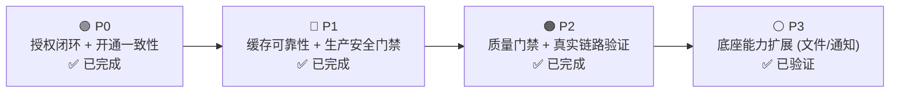

# 平台底座生产化优化

日期：2026-07-22
状态：持续实施

---

## 定位

本计划将平台从"功能可演示"推进到"权限边界可验证、失败可恢复、生产配置可守门、质量可持续"。

### 优先级总览

---

## 核心设计约束

- 前端菜单隐藏不是安全边界 — 所有保护操作必须由后端 authorizer 裁决
- 菜单 `auth_code` 使用生成契约的完整操作名，不用页面路径
- 普通角色权限以数据库关系为准（不用 Casbin 做双写）
- 缓存失效优先正确性：缓存不可用时降级到数据库
- 套餐从菜单扩展为能力包：菜单 + API 权限 + 功能开关 + 资源配额

---

## 验证脚本生态

| 脚本 | 用途 |
|------|------|
| `verify-foundation.sh` | 静态检查 |
| `verify-foundation-live-backend.sh` | DB + Redis 连通性 |
| `verify-foundation-live.sh` | 完整真实链路 |
| `check-platform-coverage.sh` | 测试覆盖率门禁 (≥45%) |
| `check-authorization-cache-health.sh` | 授权缓存健康 (bypass_rate ≤ 5%) |
| `check-resource-quota-health.sh` | 配额操作健康 |

---

## 相关实施文档

详见：`docs/architecture/10-平台底座生产化优化实施计划.md` — 包含 30+ 条带日期的实施记录和验证证据。
