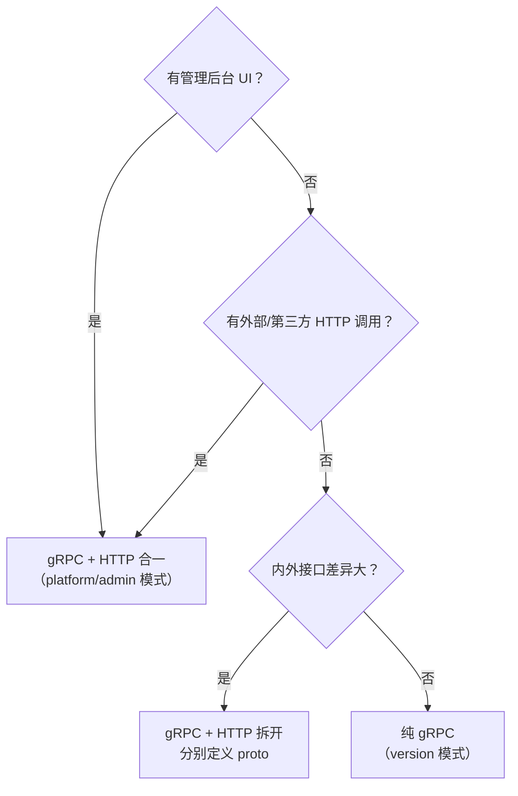

# 产品服务模块接入规范

日期：2026-07-22
状态：生效

---

## 定位

新增平台模块和产品服务接入时必须满足的强制清单。

---

## 中台能力复用（强制）

产品服务不自建横向能力，全部通过 RPC + 中间件注入复用技术中台。以下规则对所有产品服务通用，无需单独讨论。

| # | 规则 | 实现方式 | 禁止行为 |
|:---:|------|---------|---------|
| 1 | 认证复用 | 注入平台 JWT 中间件验签 | ❌ 自建登录接口、自己签发 token |
| 2 | 租户上下文 | `tenant_id` 从 JWT claims 提取 | ❌ 接受客户端传入 `tenant_id`、自己建 tenant 表 |
| 3 | 用户上下文 | `user_id` 从 JWT claims 提取 | ❌ 自己建 user 表、管理 session |
| 4 | 租户状态查询 | 需要实时状态时 gRPC 调租户底座 | ❌ 本地缓存租户状态做授权判断 |
| 5 | 配额管控 | 调用配额 API 检查/上报 | ❌ 自建计量逻辑 |
| 6 | 审计日志 | 调用操作审计 API 记录 | ❌ 自建审计表 |
| 7 | 生命周期事件 | 通过通知中心/Webhook 订阅租户暂停、注销事件，做数据清理 | ❌ 忽略租户生命周期，数据残留 |
| 8 | 数据隔离 | `tenant_id` 作为数据隔离键，DB/缓存/ES/向量库全链路隔离 | ❌ 跨租户查询无 `tenant_id` 过滤 |

---

## Proto 协议模式

产品服务的 Proto 定义采用 **gRPC + HTTP 合一**或**纯 gRPC** 两种模式，按消费方判定。

### 决策矩阵



### 两种模式对比

| | 合一模式 | 纯 gRPC 模式 |
|------|---------|------------|
| Proto 写法 | RPC 方法加 `google.api.http` annotation | 无 HTTP annotation |
| 暴露协议 | gRPC + RESTful（buf 自动生成） | 仅 gRPC |
| 适用场景 | 有管理后台 UI、外部 HTTP 调用 | 纯内部服务间调用 |
| 代表性服务 | `platform/admin`、Evie | `version/service` |
| 维护成本 | 单一 proto，一致性好 | 最低，无 HTTP 开销 |

### 选择规则

| 条件 | 推荐模式 |
|------|:---:|
| 有管理后台 UI 需要展示/操作 | 合一 |
| 有外部系统或第三方 HTTP 集成 | 合一 |
| 仅内部服务间 gRPC 调用，无前端消费 | 纯 gRPC |
| 内外接口字段、权限、SLA 差异大 | 拆开（分别定义） |

> 当前阶段产品服务默认使用 **合一模式**。后续若出现纯内部管道服务，按矩阵判断是否降为纯 gRPC。

---

## 后端分层编码规范（强制）

所有 `service → biz → data` 三层遵循统一的数据传递和转换约束。参考模块：`role`、`post`、`user`。

### 类型流

```
┌──────────┐    ┌──────────┐    ┌──────────┐
│ Service   │───▶│ Biz      │───▶│ Data     │
│          │    │          │    │          │
│ pbCore.Xxx│   │ pbCore.Xxx│   │ ent ←→  │
│          │    │          │    │ pbCore.Xxx│
│ 薄适配层  │    │ 编排+校验 │    │ 转换+持久化│
└──────────┘    └──────────┘    └──────────┘
```

| 规则 | 说明 | ❌ 禁止 |
|:---:|------|------|
| **Proto 类型贯穿** | Service → Biz → Data 的接口签名全部使用 `pbCore.Xxx`（proto 生成的消息类型），不在中间层自定义 struct | ❌ 在 biz 中定义自己的 `XxxConfig` struct 替代 proto 类型 |
| **转换只在 Data 层** | `ent ↔ proto` 的转换函数（如 `entToProto`、`protoToEnt`）仅在 data 包内定义和调用 | ❌ 在 service 或 biz 层做 proto ↔ 自定义 struct 转换 |
| **Service 层是薄适配** | Service 层只做：①从 auth context 提取 tenant_id/user_id ②调用 biz 方法 ③返回 proto response | ❌ 在 service 层写业务逻辑 |
| **Biz 层无 DB 操作** | Biz 层通过 Repo 接口操作，不直接持有 ent Client | ❌ 在 biz 中 import `ent/gen` |

### Listing 分页模式

所有 List 操作统一使用 `pkg/aip/listing` 模式：

```go
// Biz Repo 接口
CountXxxs(context.Context, ...listing.Option) (int32, error)
ListXxxs(context.Context, ...listing.Option) ([]*pbCore.Xxx, error)

// Data 实现
func (r *repo) ListXxxs(ctx context.Context, opts ...listing.Option) ([]*pbCore.Xxx, error) {
    o := listing.Options{Limit: 20}
    for _, opt := range opts {
        opt(&o)
    }
    rows, err := r.DB(ctx).Xxx.Query().
        Where(ents.ApplyFilter(o.Filter)).
        Order(ents.ApplyOrderBy(o.OrderBy)).
        Offset(o.Offset).Limit(o.Limit).
        All(ctx)
    return convert.SliceToAny(rows, r.entToProto), nil
}
```

### listing.Option 使用规范（强制）

`List`/`Count` 方法签名**只能**接收 `opts ...listing.Option`，不得为特定筛选条件额外添加位置参数（如 `fileID uint32`）。所有查询条件统一通过 Option 传递：

| Option | 用途 |
|--------|------|
| `listing.FilterOption(filter)` | 筛选条件（AIP-160 filter 表达式） |
| `listing.OrderByOption(orderBy)` | 排序 |
| `listing.OffsetOption(offset)` / `listing.LimitOption(limit)` | 分页 |

**规则：**

1. 筛选、排序、分页全部通过 `listing.Option` 传递，禁止在 List 方法签名中追加 `xxxID`、`name` 等筛选参数。
2. 请求的独立筛选字段（如 `file_id`）在 **service 层**解析后合并进 `filter` 字符串，再经 `listing.FilterOption` 传给 biz/data 层。参照 role 模块：service 层 `listing.ParseParams(req, filtering.DeclareIdent(...))` 解析 filter，data 层只做 `ents.ApplyFilter(o.Filter)`。
3. 必填筛选条件（如路径参数 `file_id`）在 service 层用 AND 合并进 filter：

```go
// service 层：把路径参数合并进 filter 字符串，保持 List 签名干净
if req.GetFileId() > 0 {
    cond := fmt.Sprintf("file_id = %d", req.GetFileId())
    if req.Filter != nil && strings.TrimSpace(*req.Filter) != "" {
        merged := fmt.Sprintf("(%s) AND %s", strings.TrimSpace(*req.Filter), cond)
        req.Filter = &merged
    } else {
        req.Filter = &cond
    }
}
```

**反例（禁止）：**

```go
// ❌ 在 List 签名中追加 fileID 位置参数，破坏 listing.Option 规范
List(ctx context.Context, fileID uint32, opts ...listing.Option)
```

### buf.validate 校验

所有 proto message 的必填字段必须包含 `buf.validate` 约束：

```protobuf
message CreateXxxRequest {
  string name = 1 [(buf.validate.field).string = { min_len: 1, max_len: 120 }];
  string type = 2 [(buf.validate.field).string = { in: ["a", "b", "c"] }];
}
```

### 目录和命名

| 层级 | 文件 | 命名约定 |
|------|------|---------|
| Proto (core) | `proto/core/service/v1/xxx.proto` | message + gRPC service 定义（租户数据面） |
| Proto (admin) | `proto/platform/admin/v1/i_xxx.proto` | HTTP annotations adapter（thin wrapper） |
| Service | `internal/service/xxx_service.go` | `XxxServiceService` / `NewXxxServiceService` |
| Biz | `internal/biz/xxx_usecase.go` | `XxxRepo` 接口 + `XxxUsecase` |
| Data | `internal/data/xxx_repo.go` | `xxxRepo` 实现 + `entToProto` / `protoToEnt` |

### Proto 文件结构

租户数据面服务（如 Role、Post、User、StorageConfig）：
```protobuf
// core/service/v1/xxx.proto — message + gRPC service
service XxxService {
  rpc CreateXxx(CreateXxxRequest) returns (CreateXxxResponse);
  rpc ListXxxs(ListXxxsRequest) returns (ListXxxsResponse);
}

// platform/admin/v1/i_xxx.proto — HTTP annotations only
service XxxService {
  rpc CreateXxx(...) returns (...) {
    option (google.api.http) = { post: "/admin/v1/xxx" body: "*" };
  }
}
```

平台控制面服务（如 StorageProvider）仅在 `core/service/v1/` 定义 message，RPC 及 HTTP 均在 `platform/admin/v1/i_xxx.proto` 中定义。

### Proto 字段规范

- 所有字段使用 `optional`（proto3 可选语义）
- 必填字段加 `(buf.validate.field)` 约束
- 所有字段加 `(gnostic.openapi.v3.property) = {description: "..."}` 文档注释
- List 请求使用 AIP 标准：`page_size`、`page_token`、`filter`、`order_by`
- 状态字段使用 `common/enum/enum.proto` 中定义的 `Status` 枚举

### 已实现参考

| 模块 | 文件 |
|------|------|
| Role | `role_usecase.go` / `role_repo.go` / `role_service.go` |
| Post | `post_usecase.go` / `post_repo.go` / `post_service.go` |
| User | `user_usecase.go` / `user_repo.go` / `user_service.go` |

---

## 接入检查清单

### 后端 (9 项)

| # | 项目 | 要求 |
|:---:|------|------|
| 1 | Proto 契约 | 定义在 `backend-service/proto/{module}/service/v1/`；按 [Proto 协议模式](#proto-协议模式) 选择合一或纯 gRPC；含 `buf.validate` 校验规则 |
| 2 | API 生成 | `buf generate` 生成到 `backend-service/api`，不手改 |
| 3 | Service 层 | 提取 `tenant_id` 从 auth context，不接受客户端传入 |
| 4 | Biz 层 | 业务编排 + 权限校验 |
| 5 | Data 层 | Repository 实现 + Ent Client |
| 6 | Ent Schema | 数据库结构，复用通用 mixins |
| 7 | Wire | 更新 provider set |
| 8 | Mock 数据 | 至少 2 个租户的测试数据 |
| 9 | 测试 | biz 规则 + 权限 + 租户隔离 |

### 权限声明

每个模块必须明确：

- 平台控制面 or 租户数据面
- 普通租户是否可访问
- 是否读取当前租户上下文
- 平台管理员是否可跨租户操作
- 后端权限码来源
- 数据层租户范围执行方式

### 前端 (10 项)

| # | 项目 | 要求 |
|:---:|------|------|
| 1 | API 文件 | `src/api/xxx.ts`，先定义 namespace 类型和枚举工具函数，再导出纯函数；不混入组件逻辑 |
| 2 | 类型定义 | `src/api/xxx.ts` namespace 内定义，字段名 camelCase 对应 Proto snake_case |
| 3 | 路由 | `src/router/routes/modules/` |
| 4 | 菜单 | 含权限码，使用 i18n key |
| 5 | CRUD 模式 | `Page + useVbenVxeGrid + useVbenDrawer + useVbenForm`；**CRUD 表单用 `useVbenDrawer`，非 CRUD 独立操作用 `useVbenModal`** |
| 6 | data.ts 纯度 | 只包含 schema/columns 等纯数据定义，不接收运行时回调参数；跨组件共享数据用模块级 reactive Map |
| 7 | 组件拆分 | 一个组件只做一件事，超过 300 行即拆分；list.vue 只做组装编排 |
| 8 | 错误/空态 | 统一的加载中、空数据、错误状态处理 |
| 9 | Locale | 中文 + 英文 locale key |
| 10 | 破坏性操作 | 删除、状态变更等操作必须 `Modal.confirm` 二次确认

---

## 相关实施文档

详见：`docs/architecture/11-产品服务模块接入规范.md` — 完整清单和审查标准。
