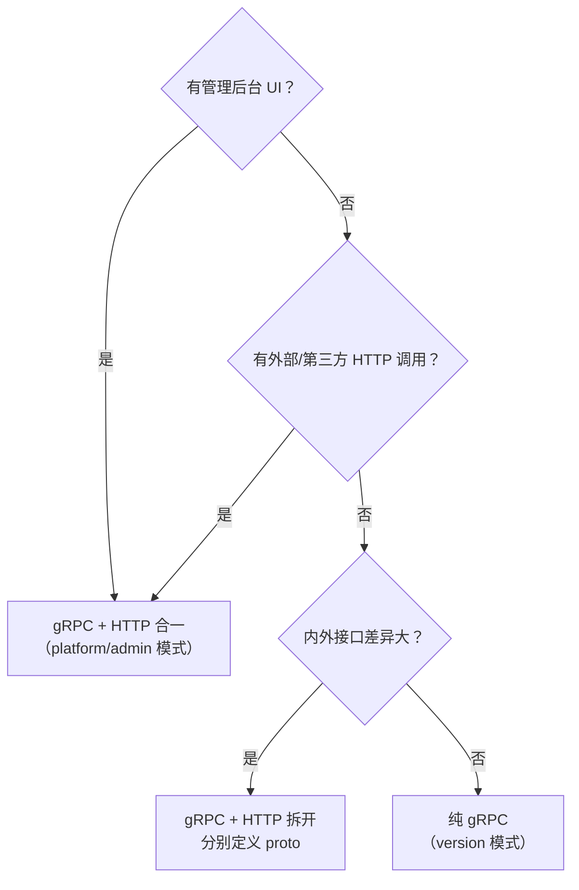

# 产品服务模块接入规范

日期：2026-07-22
状态：生效

---

## 定位

新增平台模块和产品服务接入时必须满足的强制清单。

---

## 中台能力复用（强制）

产品服务不自建横向能力，全部通过 RPC + 中间件注入复用技术中台。以下规则对所有产品服务通用，无需单独讨论。

| # | 规则 | 实现方式 | 禁止行为 |
|:---:|------|---------|---------|
| 1 | 认证复用 | 注入平台 JWT 中间件验签 | ❌ 自建登录接口、自己签发 token |
| 2 | 租户上下文 | `tenant_id` 从 JWT claims 提取 | ❌ 接受客户端传入 `tenant_id`、自己建 tenant 表 |
| 3 | 用户上下文 | `user_id` 从 JWT claims 提取 | ❌ 自己建 user 表、管理 session |
| 4 | 租户状态查询 | 需要实时状态时 gRPC 调租户底座 | ❌ 本地缓存租户状态做授权判断 |
| 5 | 配额管控 | 调用配额 API 检查/上报 | ❌ 自建计量逻辑 |
| 6 | 审计日志 | 调用操作审计 API 记录 | ❌ 自建审计表 |
| 7 | 生命周期事件 | 通过通知中心/Webhook 订阅租户暂停、注销事件，做数据清理 | ❌ 忽略租户生命周期，数据残留 |
| 8 | 数据隔离 | `tenant_id` 作为数据隔离键，DB/缓存/ES/向量库全链路隔离 | ❌ 跨租户查询无 `tenant_id` 过滤 |

---

## Proto 协议模式

产品服务的 Proto 定义采用 **gRPC + HTTP 合一**或**纯 gRPC** 两种模式，按消费方判定。

### 决策矩阵

### 两种模式对比

| | 合一模式 | 纯 gRPC 模式 |
|------|---------|------------|
| Proto 写法 | RPC 方法加 `google.api.http` annotation | 无 HTTP annotation |
| 暴露协议 | gRPC + RESTful（buf 自动生成） | 仅 gRPC |
| 适用场景 | 有管理后台 UI、外部 HTTP 调用 | 纯内部服务间调用 |
| 代表性服务 | `platform/admin`、Evie | `version/service` |
| 维护成本 | 单一 proto，一致性好 | 最低，无 HTTP 开销 |

### 选择规则

| 条件 | 推荐模式 |
|------|:---:|
| 有管理后台 UI 需要展示/操作 | 合一 |
| 有外部系统或第三方 HTTP 集成 | 合一 |
| 仅内部服务间 gRPC 调用，无前端消费 | 纯 gRPC |
| 内外接口字段、权限、SLA 差异大 | 拆开（分别定义） |

> 当前阶段产品服务默认使用 **合一模式**。后续若出现纯内部管道服务，按矩阵判断是否降为纯 gRPC。

---

## 接入检查清单

### 后端 (9 项)

| # | 项目 | 要求 |
|:---:|------|------|
| 1 | Proto 契约 | 定义在 `backend-service/proto/{module}/service/v1/`；按 [Proto 协议模式](#proto-协议模式) 选择合一或纯 gRPC；含 `buf.validate` 校验规则 |
| 2 | API 生成 | `buf generate` 生成到 `backend-service/api`，不手改 |
| 3 | Service 层 | 提取 `tenant_id` 从 auth context，不接受客户端传入 |
| 4 | Biz 层 | 业务编排 + 权限校验 |
| 5 | Data 层 | Repository 实现 + Ent Client |
| 6 | Ent Schema | 数据库结构，复用通用 mixins |
| 7 | Wire | 更新 provider set |
| 8 | Mock 数据 | 至少 2 个租户的测试数据 |
| 9 | 测试 | biz 规则 + 权限 + 租户隔离 |

### 权限声明

每个模块必须明确：

- 平台控制面 or 租户数据面
- 普通租户是否可访问
- 是否读取当前租户上下文
- 平台管理员是否可跨租户操作
- 后端权限码来源
- 数据层租户范围执行方式

### 前端 (7 项)

| # | 项目 | 要求 |
|:---:|------|------|
| 1 | API 文件 | `src/api/xxx.ts`，手写轻量封装 |
| 2 | 类型定义 | `src/api/type/index.ts` |
| 3 | 路由 | `src/router/routes/modules/` |
| 4 | 菜单 | 含权限码，使用 i18n key |
| 5 | CRUD 模式 | `Page + useVbenVxeGrid + useVbenDrawer + useVbenForm` |
| 6 | 错误/空态 | 统一的加载中、空数据、错误状态处理 |
| 7 | Locale | 中文 + 英文 locale key |

---

## 相关实施文档

详见：`docs/architecture/11-产品服务模块接入规范.md` — 完整清单和审查标准。
