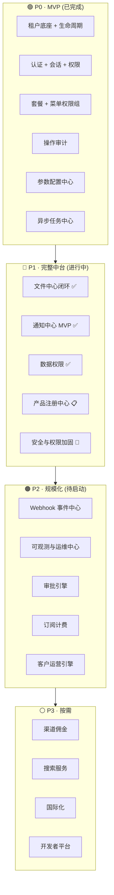
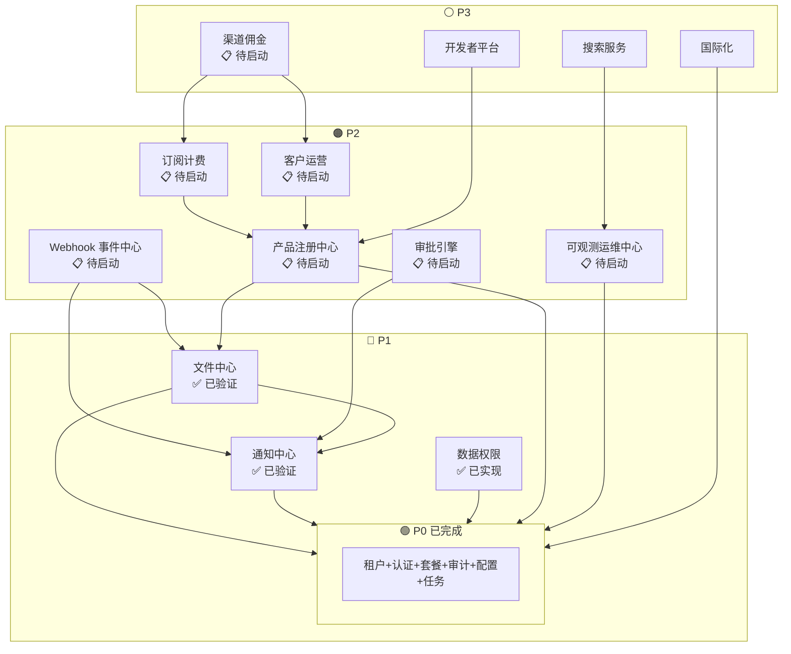

# SaaS 技术中台能力路线图

日期：2026-07-22
状态：持续维护
定位：Ark Tech Platform 中长期能力总控清单

---

## 一、总体原则

- **底座能力优先于业务功能**：通知、文件、Webhook、安全、可观测等横向能力稳定后再承载更多业务模块
- **平台控制面和租户数据面分离**：平台管理员管理全局配置，普通租户使用当前租户能力
- **菜单隐藏不是安全边界**：所有接口必须进入后端授权和租户隔离
- **能力必须可 Mock、可测试、可观测**：缺少 Mock 数据、权限码、测试和验证入口的模块不得视为完成
- **新能力默认落在 `platform/admin`**，只有满足独立拆分条件才评审新 service

---

## 二、能力总控

---

## 三、分域详情

### 3.1 平台控制面

| 能力 | 状态 | 优先级 |
|------|:---:|:---:|
| 租户管理 (CRUD + 生命周期) | ✅ 已验证 | P0 |
| 业务套餐 + 权限组 | ✅ 已验证 | P0 |
| 用户/部门/岗位 | ✅ 已验证 | P0 |
| 菜单权限 + 接口权限 + 角色授权 | ✅ 已验证 | P0 |
| 参数配置 + 字典管理 | ✅ 已验证 | P0 |
| 操作日志 + 登录日志 | ✅ 已验证 | P0 |
| 异步任务管理后台 | ✅ 已验证 | P0 |
| 存储渠道管理 | ✅ 已验证 | P1 |
| 平台级系统设置中心 | 📋 待启动 | P2 |
| 租户开通模板 (一键初始化) | 📋 待启动 | P2 |
| 平台公告 | 📋 待启动 | P2 |

### 3.2 权限与安全中心

| 能力 | 状态 | 优先级 |
|------|:---:|:---:|
| 多租户隔离 (四层防御) | ✅ 已验证 | P0 |
| 平台/租户双域权限 | ✅ 已验证 | P0 |
| 角色授权 + 缓存 + 回显 | ✅ 已验证 | P0 |
| 租户管理员保护 | ✅ 已验证 | P0 |
| 数据权限 (5 级范围) | ✅ 已实现 | P1 |
| 登录安全策略 (锁定/IP/异地) | 📋 待启动 | P1 |
| MFA/二次验证预留 | 📋 待启动 | P2 |
| Session 管理 (在线/强制下线) | ✅ 已验证 | P0 |
| Secret 管理 (密钥统一托管) | 📋 待启动 | P2 |

### 3.3 能力包与计量中心

| 能力 | 状态 | 优先级 |
|------|:---:|:---:|
| 套餐版本化 | ✅ 已验证 | P0 |
| 菜单+API权限+功能开关+资源额度 | ✅ 已验证 | P0 |
| 当前租户资源额度 (查询/检查/占用/释放) | ✅ 已验证 | P1 |
| 项目资源额度接入 | ✅ 已验证 | P1 |
| 租户用量统计 | 📋 待启动 | P2 |
| 额度预警 | 📋 待启动 | P2 |
| 超额策略 (拒绝/软限制/审批) | 📋 待启动 | P2 |
| 计费和订阅模型预留 | 📋 待启动 | P3 |

### 3.4 文件与存储中心

| 能力 | 状态 | 优先级 |
|------|:---:|:---:|
| 文件元数据 + S3/Local 存储 | ✅ 已验证 | P1 |
| 存储渠道管理后台 | ✅ 已验证 | P1 |
| 上传前额度检查 + 确认占用 | ✅ 已验证 | P1 |
| 删除后额度释放 (幂等) | ✅ 已验证 | P1 |
| 文件访问日志 + 后台详情 | ✅ 已验证 | P1 |
| Multipart Upload | 📋 待启动 | P2 |
| CDN 私有签名 | 📋 待启动 | P2 |
| 病毒扫描预留 | 📋 待启动 | P2 |
| 生命周期策略 (过期/归档/回收站) | 📋 待启动 | P2 |

### 3.5 通知中心

| 能力 | 状态 | 优先级 |
|------|:---:|:---:|
| 站内信模板 CRUD | ✅ 已验证 | P1 |
| AsyncTask 异步发送 | ✅ 已验证 | P1 |
| 通知消息 + 已读/未读/批量已读 | ✅ 已验证 | P1 |
| 管理后台通知页面 | ✅ 已验证 | P1 |
| 邮件/短信/Webhook 渠道 | 📋 待启动 | P2 |
| 通知失败重试可视化 | 📋 待启动 | P2 |
| 用户通知偏好 | 📋 待启动 | P2 |
| 通知聚合摘要 (每日/每周) | 📋 待启动 | P2 |

### 3.6 Webhook 与事件中心

| 能力 | 状态 | 优先级 |
|------|:---:|:---:|
| 事件类型注册 | 📋 待启动 | P2 |
| 租户 Webhook 订阅 + 密钥 | 📋 待启动 | P2 |
| 签名投递 + 失败重试 | 📋 待启动 | P2 |
| 死信队列 + 人工重放 | 📋 待启动 | P2 |

首批建议事件：租户创建、套餐变更、用户创建、角色权限变更、文件上传完成、资源额度超限、异步任务失败。

### 3.7 可观测与运维中心

| 能力 | 状态 | 优先级 |
|------|:---:|:---:|
| 异步任务健康 + 授权缓存健康 | ✅ 已验证 | P0 |
| 资源额度 readiness 指标 | ✅ 已验证 | P1 |
| 验证脚本生态 | ✅ 已验证 | P1 |
| 服务健康总览 + Redis/MySQL 健康 | 📋 待启动 | P2 |
| API 慢请求 + 错误日志聚合 | 📋 待启动 | P2 |
| 告警规则 + 管理后台运行状态 | 📋 待启动 | P2 |

### 3.8 开发者与模块接入中心

| 能力 | 状态 | 优先级 |
|------|:---:|:---:|
| 模块接入规范文档 | ✅ 生效 | P1 |
| Proto/Buf 生成流程规范 | ✅ 生效 | P1 |
| 前后端质量门禁 | ✅ 已验证 | P1 |
| 模块注册中心后台 | 📋 待启动 | P2 |
| API 文档入口 | 📋 待启动 | P2 |
| 一键验收脚本执行记录 | 📋 待启动 | P2 |

---

## 四、优先级队列

| 优先级 | 能力 | 状态 | 目标 |
|:---:|------|:---:|------|
| P0 | 安全与权限加固 | 🔄 进行中 | 租户隔离、权限撤销、缓存一致性持续可验证 |
| P1 | 文件中心闭环 | ✅ 已验证 | 额度占用释放、访问日志、审计闭环 |
| P1 | 通知中心 MVP | ✅ 已验证 | 站内信、系统公告、异步通知 |
| P2 | Webhook 与事件中心 MVP | 📋 待启动 | 外部订阅、签名投递、失败重试、死信重放 |
| P2 | 可观测与运维中心 | 📋 待启动 | 部署巡检、告警、问题定位 |
| P3 | 开发者与模块接入中心 | 📋 待启动 | 模块接入效率、一致性 |
| P3 | 产品注册中心 | 📋 设计阶段 | 统一产品接入入口 |

---

## 五、断点续接规则

### 继续任务前

1. 读 `README.md`
2. 读本文档
3. 读当前阶段对应专题文档
4. 查看最近一次提交记录和 git 状态

### 完成任务后

1. 更新本文档的优先级队列状态
2. 更新对应专题设计文档
3. 更新实施记录
4. 必要时更新 `42-adr-index.md`

### 状态枚举

| 状态 | 含义 |
|:---:|------|
| 📋 待启动 | 已定义，未开始编码 |
| 🔄 进行中 | 已开始实现，未完成验收 |
| ✅ 已实现 | 代码完成，未完成真实链路验证 |
| ✅ 已验证 | 自动化测试、Mock 或真实链路验证通过 |
| 🔴 冻结 | 暂不推进 |

---

## 六、能力依赖拓扑

---

## 七、风险矩阵

| 风险 | 概率 | 影响 | 等级 | 缓解措施 |
|------|:---:|:---:|:---:|------|
| Webhook 实现延期导致外部集成受阻 | 中 | 高 | 🟡 | P2 启动前完成事件类型注册 + 最小可用投递 |
| 通知中心渠道缺失影响客户触达 | 高 | 中 | 🟡 | 站内信已覆盖基础场景；邮件渠道作为首批 P2 |
| 文件中心无 Multipart Upload 导致大文件场景受阻 | 中 | 低 | 🟢 | 当前文件大小可接受；明确业务需求后再启动 |
| 可观测缺失导致生产问题定位困难 | 中 | 高 | 🟡 | 验证脚本生态已提供基础诊断；P2 优先健康总览 |
| 过早微服务拆分导致运维成本暴增 | 低 | 高 | 🟢 | ADR-006 五条件守门 + 拆分评审强制执行 |
| 产品注册中心延期导致多产品接入阻塞 | 中 | 高 | 🟡 | 当前手工 Checklist 可支撑 2-3 个产品；P1 目标不变 |
| 缓存不一致导致权限泄露 | 低 | 极高 | 🟢 | ADR-003 三层防护；版本 key + DB 降级已验证 |
| 跨租户越权 | 极低 | 极高 | 🟢 | 四层防御深度 + 自动化测试 + 跨租户外键校验 |

---

## 八、当前断点

**已完成：**
- P0/P1 多租户、权限、缓存、生产门禁核心能力
- P1 文件中心闭环（额度+日志+审计）
- P1 通知中心 MVP（站内信+模板+已读）
- P2 质量门禁和真实链路验证入口
- P3 套餐能力包（菜单+API+Flag+配额）

**下一步：** Webhook 与事件中心 MVP

**当前风险：**
- Webhook 未实现
- 通知中心无邮件/短信/Webhook 渠道
- 文件中心无 Multipart Upload 和生命周期策略
- 可观测和开发者中心以文档规范为主

---

## 九、相关文档

- `docs/architecture/25-架构决策记录索引.md` — 当前生效 ADR
- `docs/archive/implementation-records/` — 原始实施记录（含详细验证证据）
