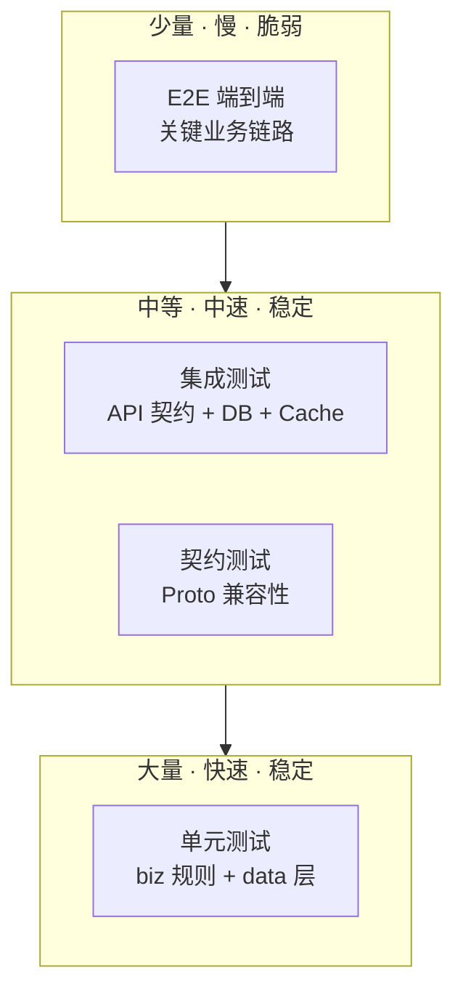
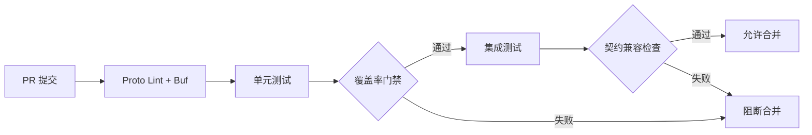

# 测试策略

日期：2026-07-22
状态：生效

---

## 一、测试金字塔



| 层级 | 覆盖目标 | 运行时间 | 失败处理 |
|------|:---:|:---:|------|
| 单元测试 | biz 规则、data 查询、权限校验 | < 1s | 阻断合并 |
| 契约测试 | Proto breaking changes、API 兼容 | < 10s | 阻断合并 |
| 集成测试 | 租户隔离、事务回滚、缓存一致性 | < 60s | 阻断合并 |
| E2E | 关键链路（登录→创建→授权→验证） | < 5min | 告警 |

---

## 二、覆盖率门禁

| 包 | 最低覆盖率 | 说明 |
|------|:---:|------|
| `internal/biz` | 70% | 业务规则是测试重点 |
| `internal/data` | 60% | Repository 实现 |
| `internal/service` | 50% | 传输层 |
| 平台核心包聚合 | 45% | `check-platform-coverage.sh` |

低于门禁的 PR 不得合并。门禁阈值随覆盖率提升逐步上调。

---

## 三、测试分类与要求

### 单元测试

```go
// 标准 table-driven 模式
func TestXxx(t *testing.T) {
    tests := []struct {
        name    string
        input   Input
        want    Output
        wantErr bool
    }{
        {name: "正常路径", ...},
        {name: "边界：空值", ...},
        {name: "错误：无权限", ...},
    }
    for _, tt := range tests {
        t.Run(tt.name, func(t *testing.T) { ... })
    }
}
```

**必须覆盖：**
- Happy path
- 权限拒绝（无租户/无角色/跨租户）
- 输入校验（空/非法/超长）
- 状态冲突（重复创建/非法转换）
- 边界值

### 租户隔离测试

```go
func TestTenantIsolation(t *testing.T) {
    // 租户 A 不能读租户 B 的数据
    // 跨租户外键必须被拒绝
    // 平台管理员可跨租户查询（+审计）
}
```

**每个模块必须包含：**
- 同模块跨租户查询返回空/NotFound
- 跨租户外键创建被 Ent 层拒绝
- 平台控制面操作不受 tenant scope 限制

### 契约测试

```bash
buf breaking --against '.git#branch=main'
```

Proto 变更必须向后兼容。破坏性变更需走 API 版本化流程。

### Mock 验证

```bash
go run ./cmd/mock -conf ./configs -migrate
go run ./cmd/mock -conf ./configs
```

Mock 数据必须覆盖至少 2 个租户，每个租户有不同权限角色的用户。

---

## 四、测试数据管理

| 环境 | 数据来源 | 刷新频率 |
|------|---------|:---:|
| 单元测试 | 测试内构造 / sqlite 内存 | 每次运行 |
| Mock 验证 | `cmd/mock` 种子数据 | 按需 |
| 集成测试 | Mock 数据 + 测试内构造 | 每次运行 |
| E2E | 专用 E2E 租户固定数据 | 按需重置 |

---

## 五、CI 流程



### 本地验证命令

```bash
# 后端
cd backend-service
make check
make proto-lint
go test ./...
./scripts/check-buf-lint-baseline.sh

# 前端
cd frontend-service
pnpm -F @vben/web-antd-admin run typecheck
pnpm -F @vben/web-antd-admin run build
```

---

## 六、Bug 修复规则

生产缺陷修复必须附带回归测试：
1. 先写一个复现 bug 的失败测试
2. 修复代码
3. 验证测试通过
4. 此测试永久留在测试套件中
