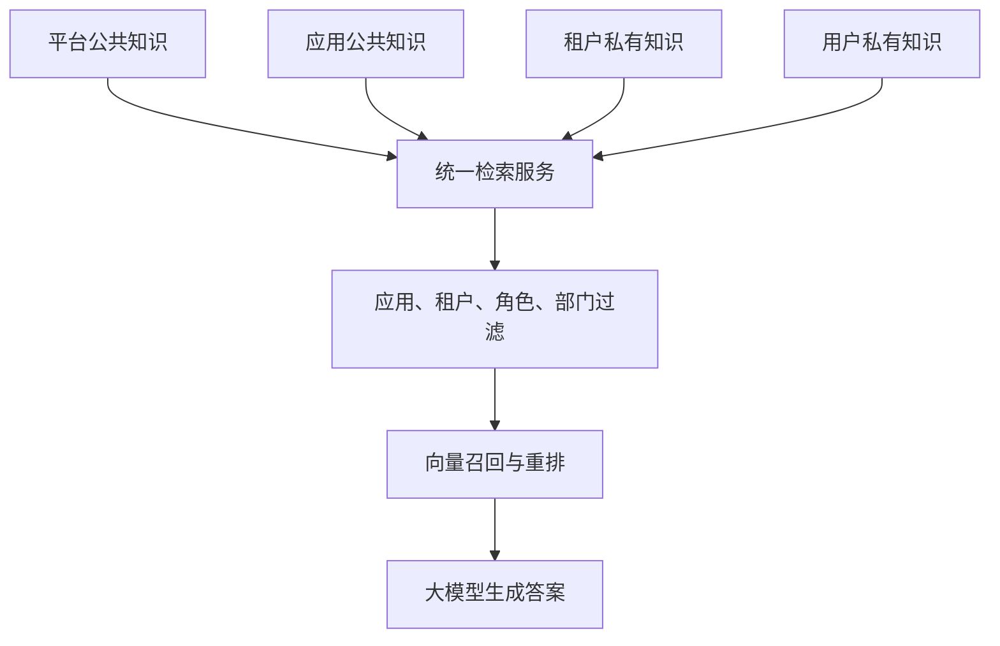
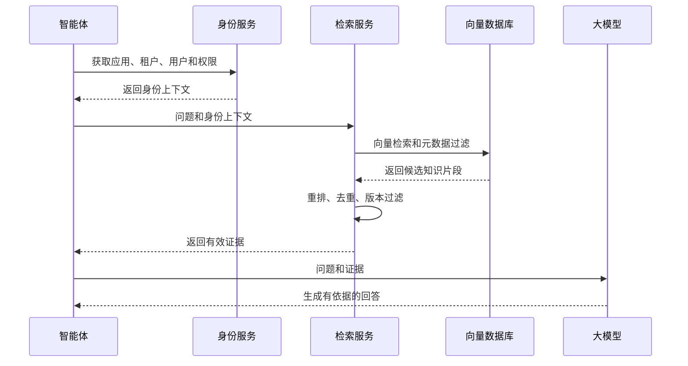
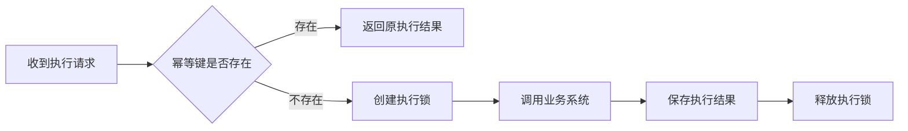
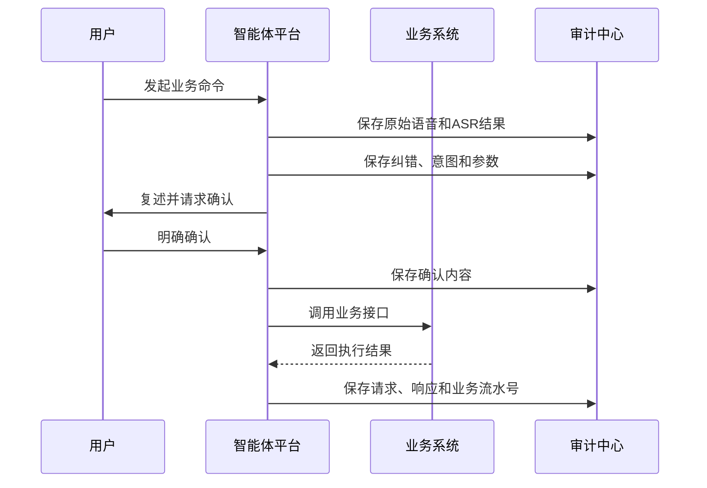
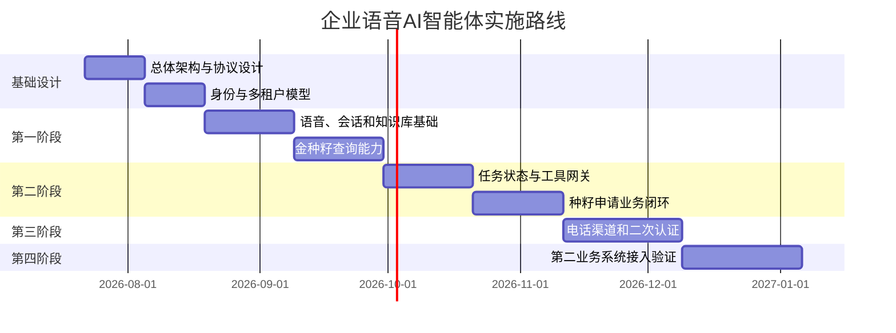

# 企业语音 AI 智能体平台

## 业务接入、知识库、安全审计与实施方案

---

# 第一部分：业务系统接入规范

## 一、业务系统接入条件

一个业务系统接入智能体平台，需要提供：

1. 应用注册信息；
2. 身份令牌或验签机制；
3. 租户和用户上下文接口；
4. 用户权限摘要接口；
5. 企业词典接口；
6. 员工和组织搜索接口；
7. 知识文档同步能力；
8. 实时数据查询接口；
9. 业务写入接口；
10. 幂等与业务审计能力。

---

## 二、应用注册信息

```json
{
  "systemCode": "GOLD_SEED",
  "systemName": "金种籽量化管理系统",
  "apiBaseUrl": "https://api.example.com",
  "authType": "JWT_MTLS",
  "protocolVersion": "v1",
  "publicKey": "PUBLIC_KEY"
}
```

平台需要为每个接入系统分配：

* appId；
* clientId；
* clientSecret或公私钥；
* 工具命名空间；
* 知识空间；
* 模型配置；
* 回调地址。

---

## 三、统一接口路径

建议业务系统为智能体提供独立接口前缀：

```text
/open-api/agent/v1/...
```

---

## 四、统一响应格式

```json
{
  "success": true,
  "code": "OK",
  "message": "success",
  "requestId": "req_001",
  "data": {}
}
```

失败响应示例：

```json
{
  "success": false,
  "code": "PERMISSION_DENIED",
  "message": "当前用户没有为该员工申请种籽的权限",
  "requestId": "req_001",
  "data": null
}
```

---

## 五、身份上下文接口

### 5.1 当前用户上下文

```http
GET /open-api/agent/v1/context/current-user
```

返回：

```json
{
  "tenantId": "1001",
  "userId": "8899",
  "employeeId": "1024",
  "employeeName": "熊龙军",
  "roles": [
    "MANAGER"
  ],
  "departmentId": "D01",
  "status": "ACTIVE"
}
```

### 5.2 权限摘要

```http
GET /open-api/agent/v1/context/permissions
```

返回：

```json
{
  "scopes": [
    "seed:self:query",
    "seed:employee:query",
    "seed:application:create"
  ],
  "limits": {
    "goldSeedMax": 100,
    "blackSeedMax": 30
  }
}
```

权限摘要只用于智能体预判，最终权限仍由具体业务接口校验。

---

## 六、词典接口

### 员工词典

```http
GET /open-api/agent/v1/dictionaries/employees
```

### 部门词典

```http
GET /open-api/agent/v1/dictionaries/departments
```

### 应用术语

```http
GET /open-api/agent/v1/dictionaries/terms
```

### 种籽事件

```http
GET /open-api/agent/v1/dictionaries/seed-events
```

词典接口应支持：

* 分页；
* 增量同步；
* 更新时间；
* 版本号；
* 启停状态；
* 删除标识。

---

## 七、人员搜索接口

```http
POST /open-api/agent/v1/employees/search
```

请求：

```json
{
  "keyword": "田花",
  "pinyin": "tian hua",
  "departmentHint": "销售部",
  "limit": 5
}
```

返回：

```json
{
  "candidates": [
    {
      "employeeId": "1024",
      "name": "田华",
      "departmentName": "销售部",
      "positionName": "经理",
      "matchScore": 0.93
    }
  ]
}
```

业务系统必须自动限定当前租户和用户可见人员范围。

---

## 八、业务工具描述

业务系统需要提供可供智能体注册的工具Schema：

```json
{
  "toolName": "create_seed_application",
  "description": "为指定员工创建种籽申请",
  "method": "POST",
  "path": "/open-api/agent/v1/seeds/applications",
  "riskLevel": "HIGH",
  "confirmationRequired": true,
  "inputSchema": {
    "type": "object",
    "properties": {
      "employeeId": {
        "type": "string"
      },
      "seedType": {
        "type": "string",
        "enum": [
          "GOLD",
          "BLACK"
        ]
      },
      "amount": {
        "type": "integer",
        "minimum": 1
      },
      "reason": {
        "type": "string",
        "minLength": 5
      },
      "eventDate": {
        "type": "string",
        "format": "date"
      }
    },
    "required": [
      "employeeId",
      "seedType",
      "amount",
      "reason",
      "eventDate"
    ]
  }
}
```

---

## 九、写操作调用

```http
POST /open-api/agent/v1/seeds/applications
```

请求头：

```text
Authorization: Bearer <agent-service-token>
X-Agent-Delegation: <delegation-token>
X-Request-Id: req_001
Idempotency-Key: app:tenant:user:task:create_seed
```

请求体：

```json
{
  "employeeId": "1024",
  "seedType": "GOLD",
  "amount": 20,
  "reason": "主动处理客户投诉",
  "eventDate": "2026-07-20"
}
```

---

## 十、数据库连接边界

允许：

* 只读同步；
* 离线数据加工；
* 搜索索引构建；
* 数据仓库同步；
* 知识库加工；
* 报表分析。

禁止：

* 智能体直接写业务数据库；
* 绕过业务接口修改数据；
* 绕过租户条件查询数据；
* 把业务数据库表结构作为长期集成协议。

---

# 第二部分：知识库与数据检索

## 一、知识库层级



---

## 二、四级知识空间

### 平台公共知识

* 智能体使用说明；
* 通用安全说明；
* 通用交互帮助。

### 应用公共知识

* 金种籽量化管理理念；
* 产品说明；
* 系统操作手册；
* 常见问题。

### 租户私有知识

* 企业制度；
* 员工手册；
* 岗位职责；
* 企业年度目标；
* 内部工作流程；
* 会议资料。

### 用户私有知识

* 用户上传文件；
* 个人工作资料；
* 个人任务文档。

---

## 三、知识文档元数据

```json
{
  "appId": "app_gold_seed",
  "tenantId": "1001",
  "userId": null,
  "scope": "TENANT",
  "documentId": "doc_001",
  "version": "v3",
  "effectiveFrom": "2026-07-01",
  "effectiveTo": null,
  "roles": [
    "ALL"
  ],
  "departments": [
    "D01"
  ],
  "status": "ACTIVE"
}
```

---

## 四、知识检索流程



---

## 五、知识问答和实时数据分流

知识库回答：

* 什么是金种籽；
* 黑种籽有什么作用；
* 如何申请种籽；
* 公司请假制度是什么。

业务接口回答：

* 我现在有多少颗金种籽；
* 田华本月迟到几次；
* 本部门当前排名；
* 今天有哪些待审核种籽。

原则：

> **静态制度和说明走知识库，实时业务数据走业务API。**

---

## 六、知识安全要求

* 没有检索证据时明确说明未找到；
* 不允许根据模型记忆编造企业制度；
* 不允许使用知识库回答实时业务数据；
* 权限外文档不得参与召回；
* 失效文档不得参与回答；
* 管理员可以查看答案命中的知识证据。

---

# 第三部分：安全、权限与审计

## 一、业务风险分级

| 风险等级 | 示例             | 执行策略               |
| ---- | -------------- | ------------------ |
| 低风险  | 产品知识、本人公开数据    | 身份校验后执行            |
| 中风险  | 查询他人数据、生成业务草稿  | 权限校验、结果复述          |
| 高风险  | 申请、审核、驳回、修改、删除 | 完整复述、明确确认、业务系统二次校验 |
| 极高风险 | 财务、批量操作、敏感审批   | 二次认证、APP确认或人工审批    |

---

## 二、高风险确认标准

确认内容必须包括：

* 操作对象；
* 所属部门；
* 操作类型；
* 数量；
* 日期；
* 原因；
* 提交后的业务流程。

示例：

> 确认一下：你要为销售部田华申请20颗金种籽，事件日期为2026年7月20日，原因为主动处理客户投诉。提交后将进入业务系统审核流程。是否确认提交？

不能只询问：

> 是否确认？

---

## 三、幂等控制

幂等键建议：

```text
appId + tenantId + userId + taskId + toolName
```



业务接口超时后，不得立即重复写入，应先查询原请求状态。

---

## 四、审计事件

系统至少记录：

* 用户认证；
* 应用和租户切换；
* 原始语音；
* ASR识别结果；
* 文本纠错；
* 人员候选；
* 用户选择结果；
* 意图识别；
* 任务创建；
* 参数变化；
* 用户确认；
* 工具调用；
* 权限拒绝；
* 业务执行结果；
* 模型异常；
* 人工介入。

---

## 五、审计链路



---

## 六、数据安全

* 音频、文档和敏感数据加密存储；
* 服务之间使用TLS或mTLS；
* 密钥进入统一密钥管理系统；
* 生产日志不得保存完整Token；
* 审计日志需要防篡改；
* 数据保留周期可配置；
* 支持用户数据删除和脱敏；
* 工具和知识按应用白名单控制。

---

## 七、Prompt Injection防护

* 用户文本不能修改系统权限；
* 知识文档不能注册或调用工具；
* 模型不能动态访问任意URL；
* 工具参数必须通过JSON Schema；
* 所有工具调用必须经过后端权限校验；
* 业务系统返回内容只能作为数据，不能作为系统指令；
* 工具白名单按应用和租户配置。

---

# 第四部分：实施路线

## 一、实施策略

建议采用：

> **基础平台先行，以金种籽系统进行验证，再接入第二个业务系统验证开放性。**

---

## 二、第一阶段：基础平台与只读能力

建设内容：

* 应用注册中心；
* 多应用、多租户和多用户身份体系；
* SSO Token验证；
* 会话管理；
* 基础任务管理；
* ASR、TTS和LLM接入；
* 应用级和租户级词典；
* 产品知识库；
* 本人种籽查询；
* 员工基础查询；
* 审计日志。

第一阶段原则：

> 以查询为主，不开放高风险写入。

---

## 三、第二阶段：业务命令和多轮任务

建设内容：

* 种籽申请草稿；
* 多轮槽位收集；
* 员工姓名消歧；
* 业务参数校验；
* 操作复述确认；
* 工具网关；
* 用户委托令牌；
* 幂等控制；
* 失败恢复；
* 种籽申请完整闭环。

第一批写入能力建议仅开放：

> 创建种籽申请草稿 → 用户确认 → 提交审核。

---

## 四、第三阶段：电话接入

建设内容：

* 电话呼入；
* 号码身份绑定；
* 多租户选择；
* 短信验证码；
* APP确认；
* 语音打断；
* 流式识别；
* 流式TTS；
* 通话异常恢复。

---

## 五、第四阶段：平台开放化

建设内容：

* 接入第二个业务系统；
* 验证通用身份协议；
* 验证通用词典协议；
* 验证工具注册协议；
* 应用级模型配置；
* 应用级知识空间；
* 开发者接入文档；
* 接入管理后台。

---

## 六、总体实施路线图



---

# 第五部分：项目团队

| 角色       | 主要职责             |
| -------- | ---------------- |
| 项目负责人    | 项目方向、范围、资源和决策    |
| 产品经理     | 场景、流程、原型和验收标准    |
| 系统架构师    | 总体架构、协议、数据边界     |
| 智能体后端工程师 | 会话、任务、工具和平台能力    |
| 业务系统工程师  | 金种籽接口、权限和业务规则    |
| AI工程师    | ASR、纠错、意图、RAG和模型 |
| 前端工程师    | 智能体管理后台和语音交互     |
| 测试工程师    | 功能、权限、租户、安全和异常测试 |
| 运维工程师    | 部署、监控、告警和容量      |
| 数据运营人员   | 词典、错误样本和知识库维护    |

---

# 第六部分：验收指标

## 身份与隔离

| 指标       |   目标 |
| -------- | ---: |
| 应用识别准确率  | 100% |
| 租户上下文准确率 | 100% |
| 跨租户数据泄漏  |    0 |
| 无权限查询成功率 |    0 |

## 语音和纠错

| 指标         |   目标 |
| ---------- | ---: |
| 通用ASR准确率   | ≥95% |
| 应用专有词识别准确率 | ≥98% |
| 员工姓名候选召回率  | ≥99% |
| 高风险错人执行    |    0 |

## 意图和任务

| 指标        |   目标 |
| --------- | ---: |
| 一级意图识别准确率 | ≥95% |
| 参数抽取准确率   | ≥97% |
| 多轮任务恢复成功率 | ≥98% |
| 重复提交率     |    0 |

## 知识库

| 指标        |   目标 |
| --------- | ---: |
| 有依据回答率    | ≥95% |
| 权限外知识返回   |    0 |
| 失效版本错误命中率 |  ＜1% |

## 性能

| 指标       |     目标 |
| -------- | -----: |
| 首次语音反馈   |  ≤1.5秒 |
| 普通查询完整响应 |    ≤3秒 |
| 写操作确认后响应 |    ≤5秒 |
| 核心服务可用性  | ≥99.9% |

---

# 第七部分：重点测试场景

项目上线前必须覆盖：

* 同名员工；
* 同音员工；
* 员工昵称；
* 多租户用户；
* 跨应用用户；
* 用户切换企业；
* 任务中途切换话题；
* 电话身份认证失败；
* 写操作重复提交；
* 业务接口超时；
* 模型输出非法JSON；
* 知识库旧版本；
* 越权查询；
* 用户确认前修改参数；
* 用户在语音播报中打断；
* 用户离职后权限即时失效；
* 业务写入状态不确定。

---

# 第八部分：上线策略

建议按照以下顺序上线：

```text
内部技术人员试用
→ 系统管理员试用
→ 管理层灰度
→ 开放只读查询
→ 写操作只生成草稿
→ 开放单一种籽申请
→ 开放审核等更多工具
→ 电话渠道上线
→ 第二业务系统接入
```

整个系统最重要的上线原则是：

> **先确保身份准确、租户不串、查询可信，再逐步开放写操作。**

平台最终是否具备通用性，应通过第二个完全不同的业务系统接入进行验证，而不是只看金种籽系统内部是否运行成功。
