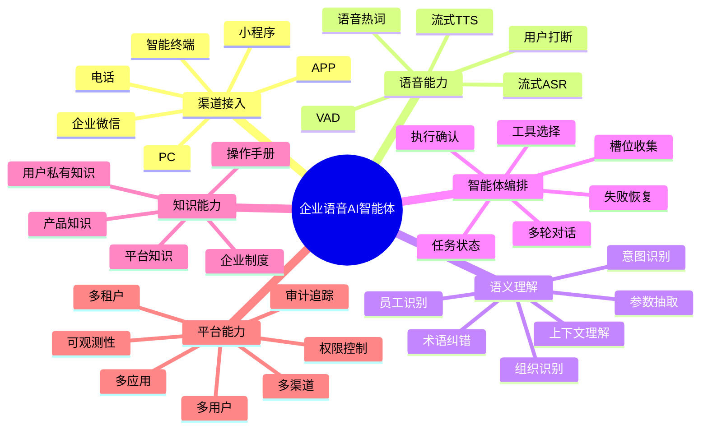
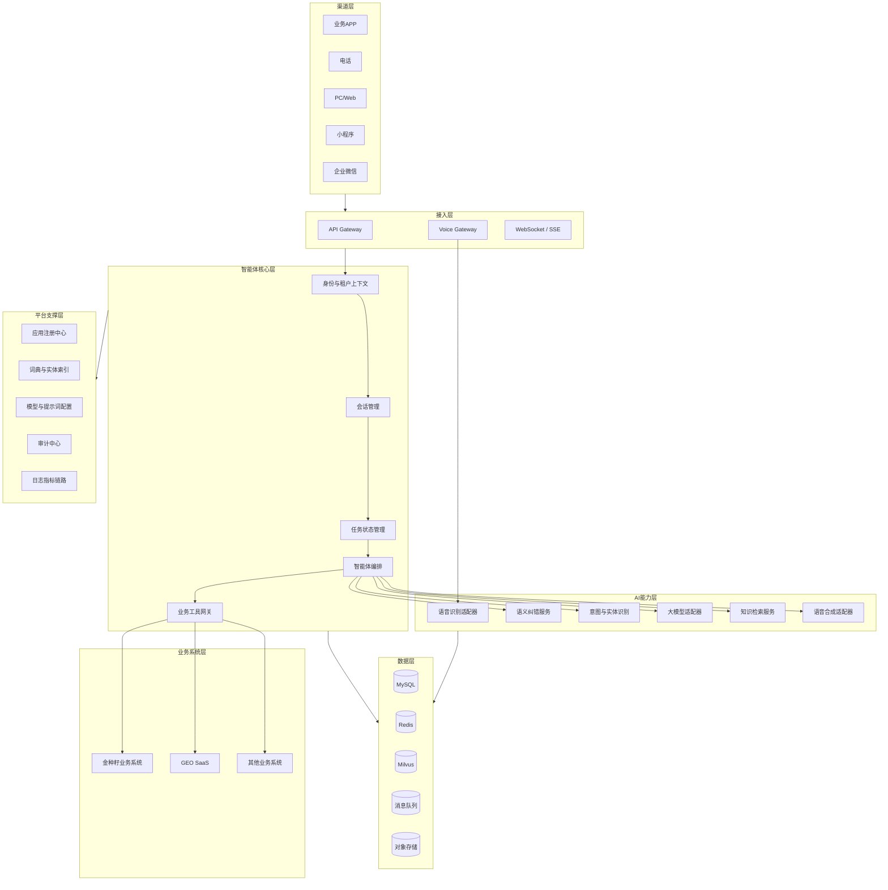
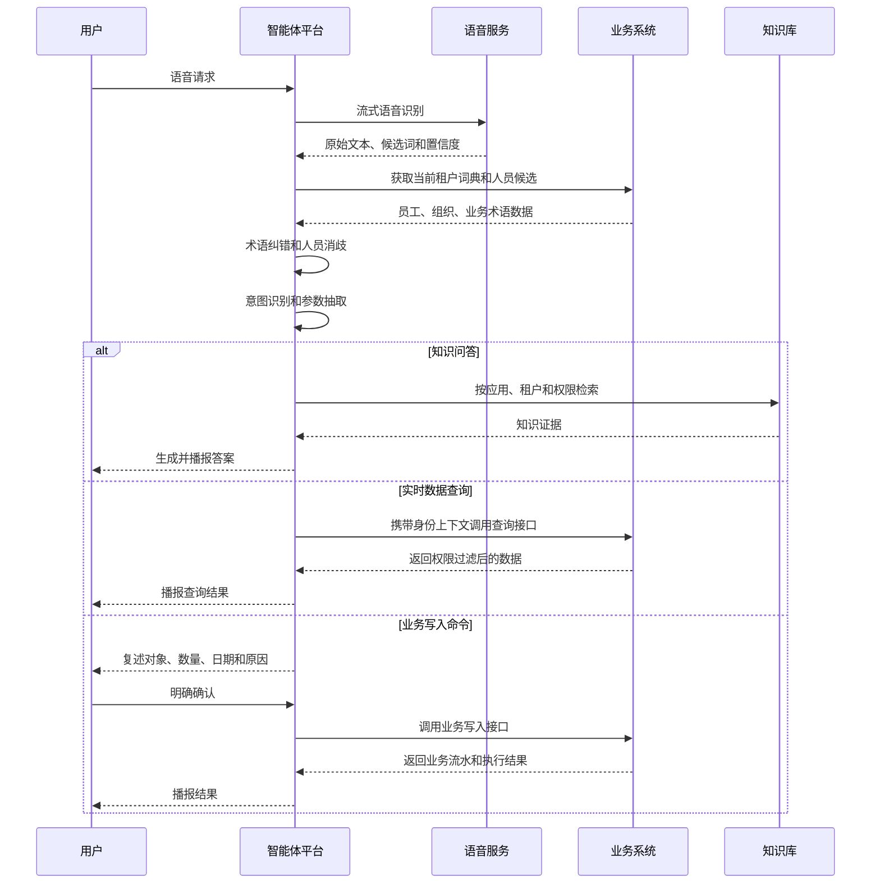

# 企业语音 AI 智能体平台

## 项目总体设计与技术架构方案

**文档版本：** V1.0
**项目负责人：** 熊龙军
**适用阶段：** 项目立项、架构评审、产品设计、技术实施
**核心验证业务：** 金种籽量化管理系统
**平台发展方向：** 多应用、多租户、多渠道企业智能体平台

---

# 一、项目背景

现有企业业务系统通常已经具备用户、租户、组织架构、员工、权限、业务流程和数据接口等基础能力，但用户仍然需要通过菜单、页面和表单完成系统操作。

随着语音识别、大语言模型、知识库检索和工具调用能力逐渐成熟，可以将自然语言和语音作为企业系统的新型交互入口。

用户可以通过语音直接表达业务需求，例如：

* 查询田华本月有多少金种籽；
* 查询本人最近一个月的种籽明细；
* 给销售部田华申请20颗金种籽；
* 查询员工的考勤、日志、任务和排名；
* 了解金种籽量化管理是什么；
* 查询系统功能如何使用；
* 查询企业制度、岗位职责和内部文件。

本项目最初以金种籽量化管理系统为业务验证场景，但平台设计不能绑定单一业务系统。未来只要其他业务系统按照约定提供身份、数据和工具接口，即可接入本智能体平台。

---

# 二、项目定位

本项目建设一套：

> **独立运行、开放接入、支持多应用、多租户、多渠道的企业级语音 AI 智能体平台。**

平台不直接拥有业务事实，也不替代业务系统，而是作为企业系统上层的智能交互和任务编排中枢。

平台主要负责：

* 语音接入；
* 语音转文字；
* 企业专有词纠正；
* 员工姓名和业务实体识别；
* 用户意图理解；
* 多轮对话；
* 任务状态管理；
* 企业知识库问答；
* 业务工具选择；
* 业务命令复述和确认；
* 调用业务系统接口；
* 返回并播报执行结果。

业务系统继续负责：

* 用户和租户；
* 组织架构；
* 员工数据；
* 角色和权限；
* 业务规则；
* 审批流程；
* 实时业务数据；
* 最终业务执行；
* 业务审计。

---

# 三、核心设计原则

## 3.1 业务系统负责业务事实

智能体平台不能直接认定用户身份、业务权限或者业务结果。

人员、部门、种籽、考勤、日志、任务和审批等真实数据，以业务系统返回结果为准。

## 3.2 智能体平台负责交互与编排

智能体负责听懂用户、识别需求、收集参数、维护任务、调用接口和解释结果。

## 3.3 身份由业务系统确认

从业务系统内部进入智能体时，由业务系统提供可信身份令牌。

电话、企业微信等外部入口则通过身份绑定和二次认证确定用户。

## 3.4 权限由业务系统最终裁决

智能体可以提前判断用户可能具有哪些权限，但每一次真实业务调用，业务系统必须再次校验。

## 3.5 所有写操作通过业务接口完成

智能体不得直接连接业务数据库执行写入。

数据库连接仅可用于离线同步、数据分析、词典构建或者知识加工。

## 3.6 关键业务参数不可猜测

以下参数不得由大模型自动补全：

* 操作对象；
* 员工身份；
* 种籽类型；
* 数量；
* 日期；
* 操作原因；
* 审核对象；
* 租户和企业。

## 3.7 高风险操作必须确认

申请、审核、驳回、修改、删除和批量操作等高风险命令，必须向用户完整复述后再执行。

## 3.8 全链路多租户隔离

应用、租户、用户和渠道身份必须贯穿：

* 会话；
* 任务；
* 语音；
* 纠错；
* 词典；
* 知识库；
* 工具；
* 缓存；
* 日志；
* 审计。

---

# 四、系统能力地图



---

# 五、总体系统架构



---

# 六、系统职责划分

## 6.1 接入网关

负责：

* 应用识别；
* 请求签名验证；
* API限流；
* 电话渠道适配；
* WebSocket和SSE连接；
* Trace ID生成；
* 请求日志记录。

## 6.2 身份与租户上下文服务

负责：

* 接入应用识别；
* 外部令牌验签；
* 租户映射；
* 用户映射；
* 渠道身份映射；
* 当前业务上下文；
* 委托令牌签发。

## 6.3 会话服务

负责：

* 会话创建和关闭；
* 对话消息保存；
* 对话上下文窗口；
* 长对话摘要；
* 中断恢复；
* 多渠道会话关联。

## 6.4 任务状态服务

负责：

* 创建业务任务；
* 保存任务参数；
* 状态流转；
* 暂停和恢复；
* 用户确认；
* 任务超时；
* 幂等控制；
* 失败重试。

## 6.5 智能体编排服务

负责：

* 知识问答、数据查询和业务命令分流；
* 意图识别；
* 参数抽取；
* 模型调用；
* 工具选择；
* 业务参数校验；
* 多轮追问；
* 执行结果解释。

## 6.6 工具网关

负责：

* 业务工具注册；
* API Schema管理；
* 服务凭证管理；
* 用户委托身份传递；
* 接口超时；
* 重试和熔断；
* 幂等键；
* 返回结果标准化；
* 工具调用审计。

## 6.7 语音服务

负责：

* 流式ASR；
* VAD语音活动检测；
* 说话结束判断；
* ASR候选结果；
* 企业热词；
* 流式TTS；
* 用户打断处理。

---

# 七、核心业务流程



---

# 八、技术选型建议

| 能力     | 建议技术                                      |
| ------ | ----------------------------------------- |
| 核心开发框架 | 待定                           |
| AI框架   | 待定                                 |
| 工作流    | 第一阶段自定义状态机，后续评估LangGraph4j或独立编排服务         |
| 数据库    | MySQL 8                                   |
| 缓存     | Redis                                     |
| 消息队列   | RocketMQ、RabbitMQ或Kafka                   |
| 向量数据库  | Milvus                                    |
| 对象存储   | MinIO或云OSS                                |
| API网关  | Spring Cloud Gateway或APISIX               |
| 身份协议   | OAuth2、JWT、mTLS                           |
| 接口标准   | OpenAPI 3.1、JSON Schema                   |
| 可观测    | OpenTelemetry、Prometheus、Grafana、Loki或ELK |

---

# 九、系统建设形态建议

第一阶段不建议直接采用大量微服务。

推荐：

> **模块化单体智能体平台 + 独立语音网关 + 独立向量数据库。**

推荐模块：

```text
agent-platform
├── agent-gateway
├── agent-identity
├── agent-conversation
├── agent-task
├── agent-orchestration
├── agent-tool
├── agent-voice
├── agent-knowledge
├── agent-audit
└── agent-admin
```

后续根据负载和团队规模，再拆分语音服务、工具网关、知识库服务和会话服务。

---

# 十、项目成功标准

本项目不以“智能体能聊天”为成功标准，而以以下结果为标准：

1. 能准确识别当前应用、租户和用户；
2. 能在正确租户范围识别员工和业务词汇；
3. 能区分知识问答、数据查询和业务命令；
4. 能在多轮对话中稳定维护任务状态；
5. 能安全调用业务系统；
6. 高风险错误执行率为0；
7. 关键业务操作全部可追踪、可审计、可回放；
8. 第二个业务系统能够按照标准协议完成接入。
