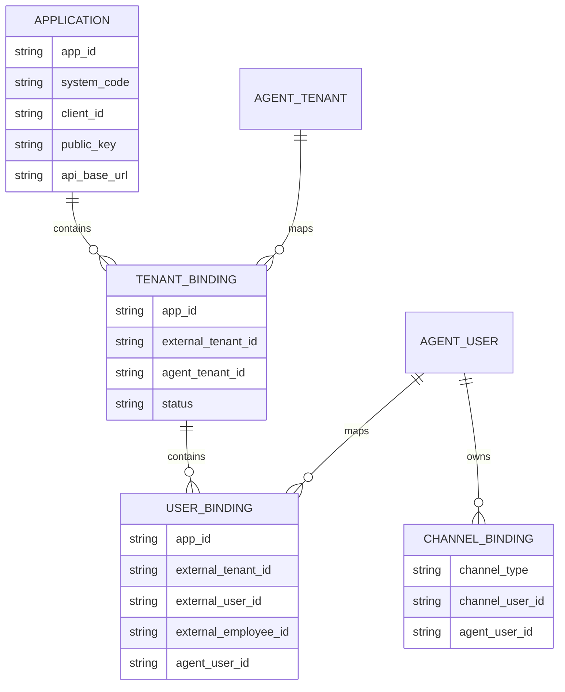
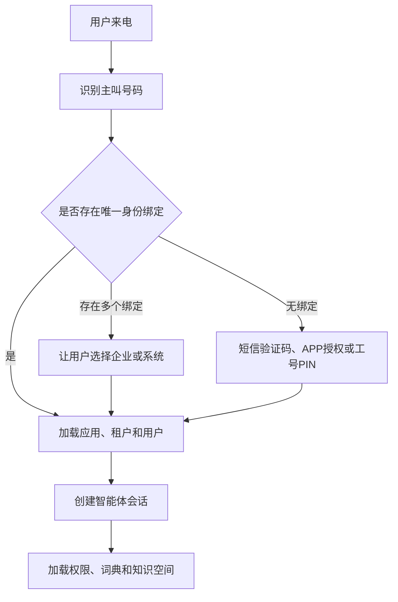
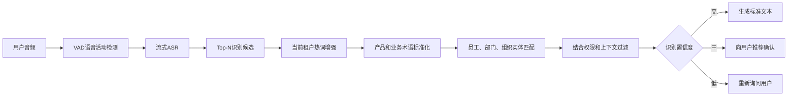
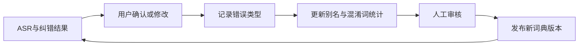
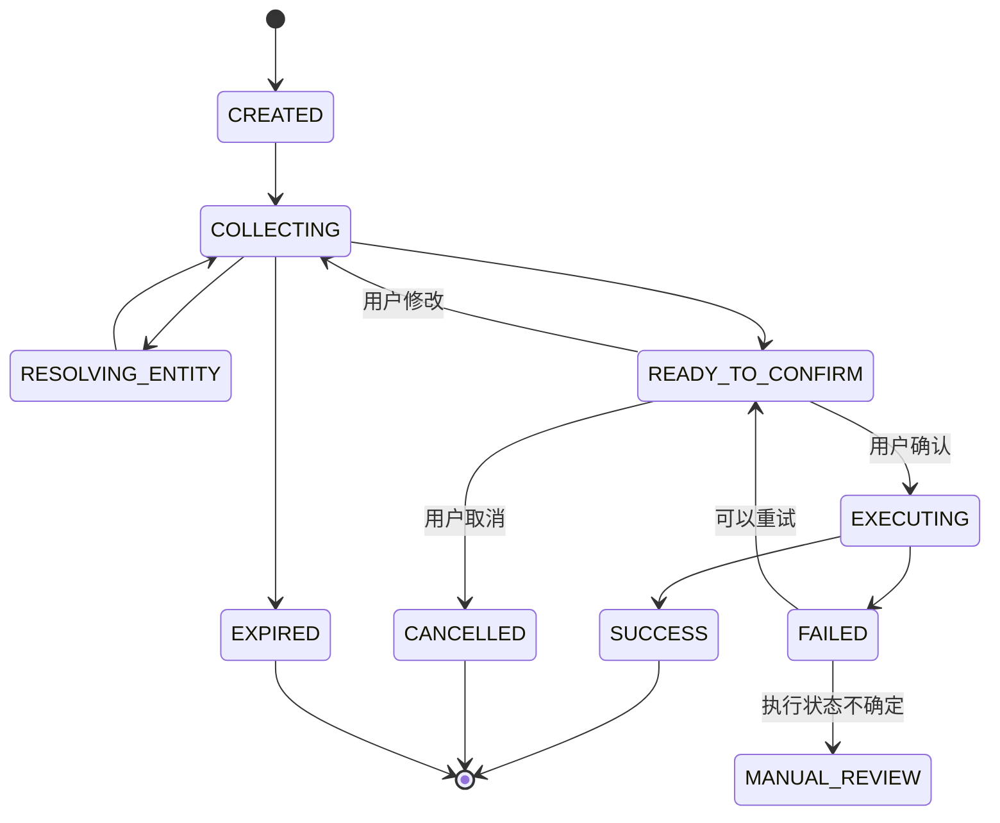
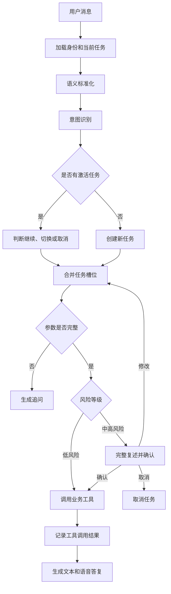

# 企业语音 AI 智能体平台

## 身份、多租户、语音纠错与智能体编排设计

---

# 第一部分：身份认证与多租户设计

## 一、设计目标

智能体平台每一次处理用户请求，都必须明确回答以下问题：

* 用户来自哪个业务系统；
* 用户属于哪个租户；
* 用户在业务系统中的真实用户ID是什么；
* 用户对应哪个员工；
* 用户通过什么渠道进入；
* 当前会话正在操作哪个业务上下文；
* 智能体本次代表谁调用业务接口。

---

## 二、身份模型

平台需要同时识别以下身份：

```text
接入应用 Application
外部租户 External Tenant
外部业务用户 External User
渠道身份 Channel Identity
智能体租户 Agent Tenant
智能体用户 Agent User
```

跨系统唯一身份键不能只使用：

```text
tenantId + userId
```

建议使用：

```text
appId + externalTenantId + externalUserId
```

---

## 三、身份关系模型



---

## 四、业务系统内部接入

当用户从金种籽APP、PC后台或者小程序进入智能体时，业务系统已经完成登录。

业务系统应向智能体平台签发短期令牌：

```json
{
  "iss": "GOLD_SEED",
  "aud": "AI_AGENT_PLATFORM",
  "appId": "app_gold_seed",
  "tenantId": "1001",
  "userId": "8899",
  "employeeId": "1024",
  "sessionId": "biz-session-001",
  "exp": 1784624400,
  "jti": "unique-token-id"
}
```

智能体平台处理流程：

1. 根据appId加载接入应用配置；
2. 使用业务系统公钥验证签名；
3. 校验发行方、接收方和有效期；
4. 映射智能体租户；
5. 映射智能体用户；
6. 创建智能体会话；
7. 加载租户词典；
8. 获取用户权限摘要；
9. 加载当前应用工具。

---

## 五、电话渠道身份认证

电话渠道没有天然登录态，需要通过号码绑定和二次认证识别用户。



安全原则：

* 手机号只能作为身份候选；
* 声纹只能作为辅助；
* 高风险操作需要二次认证；
* 可采用短信验证码、APP推送确认或个人PIN码。

---

## 六、统一身份上下文

智能体平台内部应统一使用以下上下文：

```json
{
  "application": {
    "appId": "app_gold_seed",
    "systemCode": "GOLD_SEED"
  },
  "tenant": {
    "agentTenantId": "agt_88",
    "externalTenantId": "1001"
  },
  "user": {
    "agentUserId": "agu_30001",
    "externalUserId": "8899",
    "externalEmployeeId": "1024"
  },
  "channel": {
    "type": "PHONE",
    "channelUserId": "13800000000"
  },
  "session": {
    "conversationId": "conv_001",
    "taskId": "task_001"
  }
}
```

该上下文需要贯穿：

* ASR；
* 术语纠错；
* 员工搜索；
* 知识检索；
* 意图识别；
* 工具调用；
* TTS；
* 日志和审计。

---

## 七、用户多租户处理

一个用户可能同时属于多个企业。

例如：

```json
{
  "availableContexts": [
    {
      "appId": "app_gold_seed",
      "tenantId": "1001",
      "tenantName": "万康盛鼎广告"
    },
    {
      "appId": "app_gold_seed",
      "tenantId": "1002",
      "tenantName": "真语者管理咨询"
    }
  ]
}
```

切换企业时必须：

* 切换当前租户上下文；
* 重新加载词典；
* 重新获取权限；
* 重新加载租户知识库；
* 暂停原租户未完成任务；
* 写操作重新确认。

---

## 八、委托身份调用

智能体平台调用业务系统时采用两层认证：

### 服务身份

证明请求来自智能体平台。

可使用：

* OAuth2 Client Credentials；
* mTLS；
* JWT服务令牌；
* 请求签名。

### 用户委托身份

证明本次请求代表哪个用户执行。

```json
{
  "iss": "AI_AGENT_PLATFORM",
  "aud": "GOLD_SEED",
  "appId": "app_gold_seed",
  "tenantId": "1001",
  "userId": "8899",
  "employeeId": "1024",
  "conversationId": "conv_001",
  "taskId": "task_001",
  "scopes": [
    "seed:query",
    "seed:application:create"
  ],
  "exp": 1784620800
}
```

业务系统收到请求后必须重新检查：

* 用户是否存在；
* 用户是否在职；
* 用户是否属于当前租户；
* 是否具有操作权限；
* 操作数量是否超过权限上限；
* 当前业务流程是否允许执行。

---

# 第二部分：语音识别与智能纠错

## 一、语音处理链路



---

## 二、语音识别数据

每一次识别需要保留：

* 原始音频文件；
* ASR原始文本；
* Top-N候选文本；
* 词或片段置信度；
* ASR供应商和模型版本；
* 热词版本；
* 标准化文本；
* 纠正记录；
* 用户最终确认结果。

---

## 三、热词层级

### 平台级热词

例如：

* 查询；
* 确认；
* 取消；
* 继续；
* 返回。

### 应用级热词

金种籽系统包括：

* 金种籽；
* 黑种籽；
* 指令官；
* 快乐会议；
* 行为银行；
* AI简报；
* 元宝；
* 产值。

### 租户级热词

包括：

* 企业名称；
* 部门名称；
* 员工姓名；
* 岗位名称；
* 项目名称；
* 企业自定义种籽事件。

### 用户级热词

包括：

* 用户经常查询的员工；
* 员工昵称；
* 用户常用简称；
* 个性化表达习惯。

---

## 四、语音纠错评分

建议综合以下维度：

```text
最终匹配分数 =
ASR置信度
+ 热词权重
+ 拼音相似度
+ 汉字编辑距离
+ 部门岗位匹配度
+ 用户权限范围匹配度
+ 历史使用频率
+ 当前任务上下文
```

---

## 五、员工姓名消歧

候选生成方式：

* 姓名精确匹配；
* 同音字匹配；
* 拼音匹配；
* 拼音首字母匹配；
* 汉字编辑距离；
* 昵称和别名；
* 部门、岗位辅助匹配。

处理规则：

### 查询类操作

唯一高置信度候选可以自动选择，但播报结果时需要明确说明姓名和部门。

### 写入类操作

即使只有一个高置信度候选，也必须在最终确认中复述人员姓名、部门和操作内容。

### 多候选

必须询问用户：

> 你说的是销售部田华，还是工程部田桦？

不得静默选择。

---

## 六、时间与数量标准化

用户可能表达：

* 昨天；
* 上周；
* 这个月；
* 最近一个月；
* 二十来颗；
* 十几颗。

处理原则：

* 查询场景可以把相对时间转换成明确时间范围；
* 写入场景必须在确认时播报绝对日期；
* “二十来颗”等模糊数量不得直接转换成20；
* 关键数量必须重新询问用户。

---

## 七、纠错反馈闭环



---

# 第三部分：智能体编排与任务状态

## 一、一级意图分类

```text
KNOWLEDGE_QA          知识问答
OPERATION_GUIDE       系统操作指引
DATA_QUERY            实时数据查询
BUSINESS_COMMAND      业务写入命令
APPROVAL_COMMAND      审核命令
TASK_COMMAND          任务操作
ANALYSIS_REQUEST      数据分析
UNKNOWN               无法识别
```

---

## 二、业务任务对象

```json
{
  "taskId": "TASK-20260721-001",
  "appId": "app_gold_seed",
  "tenantId": "1001",
  "userId": "8899",
  "intent": "SEED_APPLICATION",
  "status": "COLLECTING",
  "slots": {
    "employeeId": "1024",
    "seedType": "GOLD",
    "amount": null,
    "reason": null,
    "eventDate": null
  },
  "riskLevel": "HIGH",
  "expiresAt": "2026-07-21T18:00:00+09:00"
}
```

---

## 三、任务状态机



---

## 四、智能体编排流程



---

## 五、种籽申请关键参数

| 参数          |    必填 |      是否允许自动推断 |
| ----------- | ----: | ------------: |
| employeeId  |     是 | 只能候选匹配，不可静默猜测 |
| seedType    |     是 |             否 |
| amount      |     是 |             否 |
| reason      |     是 |             否 |
| eventDate   |     是 | 相对日期可转换，但必须确认 |
| eventRuleId |     否 | 可以推荐，业务系统最终校验 |
| approver    | 按业务规则 |      不可绕过业务流程 |

---

## 六、多任务处理

当用户临时切换话题时：

1. 当前任务进入PAUSED；
2. 新请求创建独立任务；
3. 新任务完成后，系统询问是否恢复原任务；
4. 两个写操作任务不得共享参数；
5. 任务不得跨租户恢复；
6. 用户切换企业后原写任务必须重新确认。

---

## 七、模型与状态机的边界

大模型负责：

* 理解表达；
* 识别意图；
* 提取候选参数；
* 生成自然语言。

后端状态机负责：

* 判断参数是否完整；
* 校验参数格式；
* 控制任务状态；
* 确认是否允许执行；
* 调用业务工具；
* 防止重复提交；
* 保存真实执行结果。
