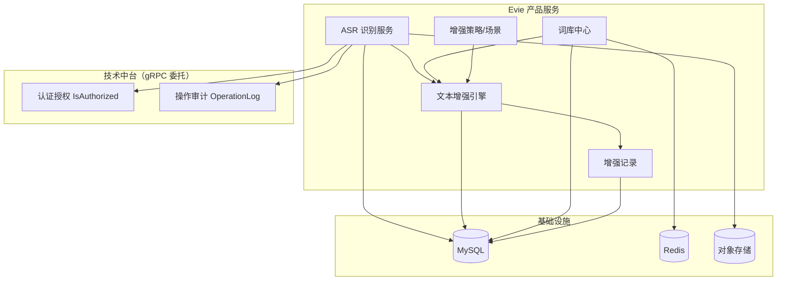
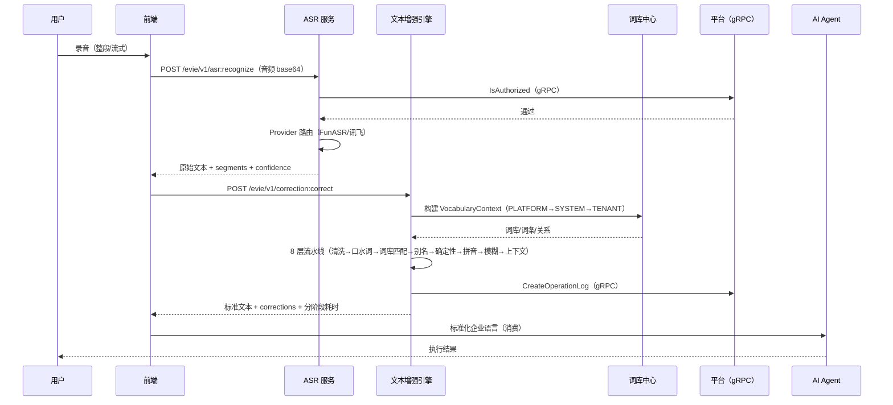

# Evie 企业语音智能引擎 — 架构总览

日期：2026-08-25
状态：✅ 已落地（M0-M11 全部完成）
依赖：[0-1-架构总览-平台分层设计](../../architecture/0-1-架构总览-平台分层设计.md)、[4-1-治理-产品服务模块接入规范](../../architecture/4-1-治理-产品服务模块接入规范.md)
事实来源：[8-词库中心与文本增强引擎开发计划](./8-词库中心与文本增强引擎开发计划.md)

> **概念变更（2026-08-25 M0-M11 重构）**：
> - 「企业知识字典中心」→「**词库中心**」（1 页 → 7 页：词库/词条/关系/分类/版本/冲突/变更记录）
> - 「智能纠错引擎」→「**文本增强引擎**」（5 路编排 → 8 层流水线：清洗/口水词/词库匹配/别名解析/确定性替换/拼音/模糊/上下文）
> - 「热词管理」→ **彻底删除**（融入词条关系 ALIAS）
>
> 旧文档已归档：`docs/archive/services-evie-platform-202508-pre-restructure/`（2-智能纠错引擎.md、3-企业知识字典中心.md、5-API接口契约.md）。

---

## 一、在 Ark Tech Platform 中的定位

Evie 是 Ark Tech Platform **产品层**的一个产品服务，定位为企业 AI 智能体的**语音认知基础设施**：把用户语音转写为标准化的、可被 AI Agent 直接消费的文本。

```
┌──────────────────────────────────────┐
│           产品层 Product Layer        │
│  ┌──────────┐  ┌──────────────────┐  │
│  │ GEO Engine│  │ Evie 语音智能引擎  │  │
│  │ 内容工程  │  │ (本系统)          │  │
│  └──────────┘  └────────┬─────────┘  │
├─────────────────────────┼────────────┤
│         业务中台          │            │
│  ┌──────────┬──────────┬┴──────────┐ │
│  │产品注册中心│客户运营引擎│订阅计费/佣金│ │
│  └──────────┴──────────┴───────────┘ │
├──────────────────────────────────────┤
│         技术中台 Platform Foundation  │
│  租户底座 │ 认证授权 │ 套餐配额 │ 操作审计 │
│  异步任务 │ 文件中心 │ 通知中心 │ 参数配置 │
├──────────────────────────────────────┤
│         基础设施 Infrastructure       │
│  MySQL/PostgreSQL │ Redis │ S3 │ MQ  │
└──────────────────────────────────────┘
```

### 产品层约束（必须遵循）

| ✅ 允许 | ❌ 禁止 |
|--------|--------|
| 通过 API 调用中台能力（租户、认证、配额、审计） | 直接访问其他产品数据库 |
| 定义产品独有数据模型 | 直接访问中台数据库表 |
| 注册产品菜单、定价、配额 | 绕过中台直接操作基础设施 |
| 在产品模块内闭环业务逻辑 | 业务逻辑写入 `app/platform/service` |

---

## 二、系统核心能力

Evie 提供三大核心能力：

### 2.1 词库中心（Vocabulary Center）

企业级知识库的载体，AI 智能体转写文本的事实来源。

| 维度 | 说明 |
|------|------|
| **作用域** | PLATFORM / SYSTEM / TENANT 三级（与平台多租户模型一致） |
| **数据单元** | 词库（dictionary）→ 词条（entry）→ 关系（relation，ALIAS/CORRECTION/HOMOPHONE/PHONETIC_SIMILAR/ABBREVIATION/RELATED） |
| **元数据** | 分类（category，PERSON/ORG/PRODUCT/TERM/LOCATION/INDUSTRY/BRAND/CUSTOM）、版本（version，快照发布）、冲突记录（conflict，跨作用域优先级冲突） |
| **能力** | CRUD + VocabularyContext 合并（TENANT > SYSTEM > PLATFORM）+ 冲突检测 + 版本快照 |
| **入口** | 7 个管理页：词库/词条/关系/分类/版本/冲突/变更记录 |

### 2.2 文本增强引擎（Text Enhancement Engine）

把 ASR 原始识别文本转换为标准化企业语言的中间层。

| 维度 | 说明 |
|------|------|
| **8 层流水线** | 文本清洗 → 口水词处理 → 词库匹配 → 别名解析 → 确定性替换 → 拼音纠错 → 模糊匹配 → 上下文纠错 |
| **决策策略** | 每层打分 + score/threshold 阈值 → REPLACE / SUGGEST / KEEP |
| **锁定机制** | 已确认文本片段锁定，避免后续误改 |
| **可观测** | `evie_enhancement_logs` 表记录每条增强请求的全链路分阶段耗时与决策 |
| **可配置** | Policy（8 开关 + HIGH_PERFORMANCE/STANDARD/HIGH_ACCURACY 模式）+ Profile（场景绑定 Policy） |

### 2.3 ASR 语音识别（Automatic Speech Recognition）

把音频流转换为原始文本的入口层。

| 维度 | 说明 |
|------|------|
| **Provider 抽象** | `pkg/asr/provider.go` 定义 `ASRProvider` 接口，支持多供应商 |
| **当前供应商** | FunASR（整段识别，中文优化）、讯飞实时语音转写（流式识别） |
| **路由策略** | 整段/流式分场景路由：批量上传走 FunASR，实时流式走讯飞 |
| **能力** | Recognize / StreamRecognize / ReRecognize / ListAsrRecords / GetAsrRecord / GetAsrRecordAudio |
| **配置管理** | 可用供应商能力列表 + 租户级 Provider 配置 upsert/查询 |

---

## 三、系统内部四层架构

```
                用户自然语音
                     │
┌────────────────────┼──────────────────────┐
│  语音接入层         │                      │
│  Web 录音 / 实时流式上传 / SDK 接入          │
└────────────────────┼──────────────────────┘
                     │
┌────────────────────┼──────────────────────┐
│  ASR 识别层         │                      │
│  Provider 路由 → 整段/流式识别 → 原始文本     │
│  FunASR / 讯飞（流式）/ 阿里云 / Whisper     │
└────────────────────┼──────────────────────┘
                     │
┌────────────────────┼──────────────────────┐
│  文本增强层（核心）   │                      │
│  8 层流水线：清洗 → 口水词 → 词库匹配 →      │
│  别名解析 → 确定性替换 → 拼音 → 模糊 → 上下文 │
│  VocabularyContext（PLATFORM→SYSTEM→TENANT） │
│  Policy + Profile（场景化策略）             │
│  EnhancementLog（全链路可观测）             │
└────────────────────┼──────────────────────┘
                     │
┌────────────────────┼──────────────────────┐
│  AI Agent 消费层    │                      │
│  标准化企业语言 → 下游 AI Agent 消费        │
└───────────────────────────────────────────┘
```

---

## 四、核心模块分解（实际代码）

```
backend-service/
├── pkg/
│   └── asr/                                ← 🔷 ASR 供应商客户端（公共）
│       ├── provider.go     ASRProvider 接口 + RecognizeOptions + Registry
│       ├── funasr/         FunASR gRPC 客户端（整段识别）
│       ├── xunfei/         讯飞实时语音转写客户端（流式识别）
│       ├── aliyun/         阿里云语音识别客户端
│       ├── whisper/        Whisper 客户端（预留）
│       └── audio/          音频 PCM/WAV 互转工具
│
├── app/evie/
│   ├── service/
│   │   ├── cmd/server/           # 服务入口
│   │   ├── cmd/mock/             # mock 命令（-tags mock）
│   │   ├── internal/
│   │   │   ├── service/          # gRPC/HTTP service 层
│   │   │   │   ├── asr_service.go          # ASR 识别接口
│   │   │   │   ├── asr_stream_service.go   # 流式识别接口
│   │   │   │   ├── correction_service.go   # 文本增强接口（Correct）
│   │   │   │   ├── dictionary_service.go   # 词库中心 CRUD
│   │   │   │   ├── enhancement_service.go  # 文本增强策略/场景/记录
│   │   │   │   └── provider_service.go     # ASR 供应商配置
│   │   │   ├── biz/              # 业务逻辑层
│   │   │   │   ├── asr.go                    # ASR 编排（Provider 路由）
│   │   │   │   ├── provider.go               # Provider 注册/路由
│   │   │   │   ├── dictionary.go             # 词库/词条/关系/分类/版本/冲突 usecase
│   │   │   │   ├── vocabulary.go             # VocabularyContext 构建 + 冲突检测
│   │   │   │   ├── enhancement.go            # 8 层流水线编排（确定性层）
│   │   │   │   ├── enhancement_inference.go  # 推断层（拼音/模糊/上下文）
│   │   │   │   ├── enhancement_policy.go     # Policy + Profile
│   │   │   │   └── enhancement_log.go        # 增强记录 usecase
│   │   │   ├── data/             # 数据访问层
│   │   │   │   ├── dictionary_repo.go        # 词库/词条/分类 repo
│   │   │   │   ├── dictionary_conflict_repo.go
│   │   │   │   ├── enhancement_repo.go       # Policy/Profile repo
│   │   │   │   ├── enhancement_log_repo.go   # 增强记录 repo
│   │   │   │   ├── asr_record_repo.go        # ASR 识别记录 repo
│   │   │   │   ├── provider_config_repo.go   # 供应商配置 repo
│   │   │   │   └── ent/schema/               # Ent Schema 定义
│   │   │   │       ├── dictionary.go              # 7 张词库相关表
│   │   │   │       ├── dictionary_entry.go
│   │   │   │       ├── dictionary_relation.go
│   │   │   │       ├── dictionary_category.go
│   │   │   │       ├── dictionary_version.go
│   │   │   │       ├── dictionary_conflict.go
│   │   │   │       ├── dictionary_change_log.go
│   │   │   │       ├── enhancement_policy.go
│   │   │   │       ├── enhancement_profile.go
│   │   │   │       ├── enhancement_log.go
│   │   │   │       ├── asr_record.go
│   │   │   │       └── asr_provider_config.go
│   │   │   └── server/           # HTTP/gRPC server 注册
│   └── proto/evie/service/v1/
│       ├── asr.proto              # ASR 识别 RPC（Recognize/StreamRecognize/ReRecognize/ListAsrRecords/...）
│       ├── correction.proto       # 文本增强 RPC（Correct）
│       ├── dictionary.proto       # 词库中心 RPC（Dictionaries/Entries/Relations/Categories/Versions/Conflicts）
│       ├── enhancement.proto      # 增强策略/场景/记录 RPC（Policies/Profiles/Logs）
│       ├── provider.proto         # ASR 供应商 RPC（AvailableProviders/Upsert/Get/List）
│       └── error_reason.proto     # 错误码
```

---

## 五、模块依赖关系



---

## 六、技术栈映射

| 组件 | Ark Tech Platform 落地 |
|------|----------------------|
| 后端框架 | go-kratos v2（`service → biz → data`） |
| 语言 | Go 1.24 |
| ORM | Ent v0.14.5 + Atlas 迁移 |
| 缓存 | go-redis v9（VocabularyContext sync.Map + Redis） |
| ASR 引擎 | `pkg/asr/` 公共客户端（FunASR / 讯飞 / 阿里云 / Whisper） |
| 音频转码 | `pkg/asr/audio/` PCM/WAV 互转 |
| 鉴权 | `pkg/auth/authz/grpc/` 通过 gRPC 委托平台 `platform.service.v1.AuthService.IsAuthorized` |
| 审计 | `pkg/audit/grpc/` 通过 gRPC 委托平台 `platform.service.v1.OperationLogService.CreateOperationLog` |
| 前端 | Vue 3 + Vben Admin + Ant Design Vue |
| 路由 | 动态路由：`getAccessMenusApi` + `generateAccessible` + `pageMap` glob（后端菜单驱动） |

---

## 七、数据流总览（ASR → 增强 → 消费）



---

## 八、与现有平台能力的复用

| 能力 | 复用方式 | 备注 |
|------|---------|------|
| 租户隔离 | 调用平台租户底座；`tenant_id` 通过 auth context 传入 | Evie 表全部带 `tenant_id`，PLATFORM scope 时 `tenant_id=0` 全局共享 |
| 认证授权 | 通过 gRPC 委托平台 `AuthService.IsAuthorized` | 见 `pkg/auth/authz/grpc/` |
| 套餐配额 | 通过平台 Quota API 检查用量 | 语音时长/增强次数/词库容量 |
| 操作审计 | 通过 gRPC 委托平台 `OperationLogService.CreateOperationLog` | ASR 调用、增强记录 |
| 文件中心 | 音频文件通过平台文件中心上传/存储 | wav/mp3/pcm |
| 菜单注册 | 通过 `app/platform/service/cmd/mock/seed_evie.go` 声明式注册菜单与按钮 | 与 mock 一起运行，前端动态消费 |
| 动态路由 | 前端 `getAccessMenusApi` + `generateAccessible` | 详见 [4-1-治理-产品服务模块接入规范](../../architecture/4-1-治理-产品服务模块接入规范.md) |

---

## 九、核心设计决策

| 决策 | 结论 | 理由 |
|------|------|------|
| ASR 引擎 | FunASR（整段）+ 讯飞（流式）分场景路由 | 中文优化好、私有化部署、流式能力 |
| 文本增强架构 | 8 层流水线（确定性 + 推断） | 可观测、可降级、可分阶段优化 |
| 词库作用域 | PLATFORM/SYSTEM/TENANT 三级 | 与平台多租户模型一致，避免重复造轮子 |
| 词库关系 | ALIAS/CORRECTION/HOMOPHONE/PHONETIC_SIMILAR/ABBREVIATION/RELATED | 6 类关系覆盖识别后纠错的全部场景 |
| 版本控制 | 发布时打 snapshot，词条变更不直接破坏线上 | 支持灰度与回滚 |
| 冲突检测 | 跨作用域优先级冲突 → 显式记录冲突 + 人工裁决 | 避免自动决策导致的误改 |
| 文本增强策略 | Policy（8 开关 + 3 模式）+ Profile（场景绑定） | 不同场景用不同策略（实时/批量/高精度） |
| 鉴权/审计 | 通过 gRPC 委托平台 | Evie 不维护本地 Casbin 策略 |
| 菜单注册 | 后端声明式 seed_evie.go + 前端动态路由 | 无需前端手写路由文件 |

---

## 十、Proto RPC 总览

| Service | RPC | 用途 |
|---------|-----|------|
| **DictionaryService** | `ListDictionaries` / `GetDictionary` / `CreateDictionary` / `UpdateDictionary` / `DeleteDictionary` | 词库 CRUD |
| | `ListEntries` / `GetEntry` / `CreateEntry` / `UpdateEntry` / `DeleteEntry` | 词条 CRUD |
| | `ListRelations` / `GetRelation` / `CreateRelation` / `UpdateRelation` / `DeleteRelation` | 关系 CRUD |
| | `ListCategories` / `CreateCategory` / `UpdateCategory` / `DeleteCategory` | 分类 CRUD（内置只读） |
| | `ListVersions` / `GetVersion` / `PublishDictionary`（自定义方法 `:{verb}`） | 版本快照 + 发布 |
| | `ListConflicts` | 冲突记录（只读） |
| **EnhancementService** | `ListPolicies` / `GetPolicy` / `CreatePolicy` / `UpdatePolicy` / `DeletePolicy` | 增强策略 CRUD |
| | `ListProfiles` / `GetProfile` / `CreateProfile` / `UpdateProfile` / `DeleteProfile` | 增强场景 CRUD |
| | `ListLogs` / `GetLog` | 增强记录（只读，可观测） |
| **CorrectionService** | `Correct`（自定义方法 `:correct`） | 文本增强入口（接收原文 + 策略 ID，返回标准文本 + corrections） |
| **ASRService** | `Recognize`（自定义方法 `:recognize`） | 整段识别 |
| | `StreamRecognize`（gRPC stream） | 流式识别 |
| | `ReRecognize`（自定义方法 `:re-recognize`） | 用已记录音频重新识别 |
| | `ListAsrRecords` / `GetAsrRecord` / `GetAsrRecordAudio` | 识别记录查询与音频预览 |
| **ProviderService** | `ListAvailableProviders` | 可用供应商能力列表 |
| | `UpsertProviderConfig` / `GetProviderConfig` / `ListProviderConfigs` | 租户级供应商配置 |

所有 HTTP 路径前缀：`/evie/v1/...`（见 [3-0-跨领域-API边界与通信契约](../../architecture/3-0-跨领域-API边界与通信契约.md)）。

---

> 以下各文档按模块展开详细设计：
> - [1-ASR语音识别服务](./1-ASR语音识别服务.md)
> - [4-多租户数据隔离设计](./4-多租户数据隔离设计.md)
> - [6-数据模型设计](./6-数据模型设计.md)
> - [7-开发路线图](./7-开发路线图.md)