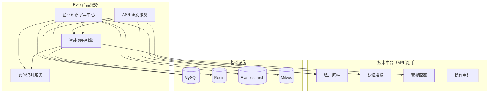
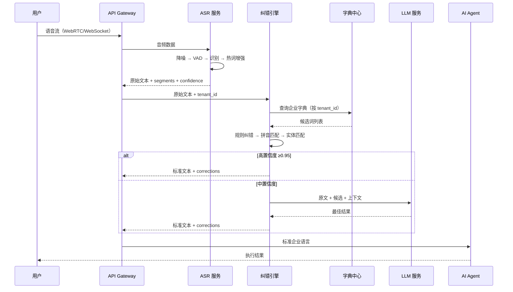

# Evie 企业语音智能引擎 — 架构总览

日期：2026-08-04
状态：草案
依赖：[0-1-架构总览-平台分层设计](../../architecture/0-1-架构总览-平台分层设计.md)、[4-1-治理-产品服务模块接入规范](../../architecture/4-1-治理-产品服务模块接入规范.md)

---

## 一、在 Ark Tech Platform 中的定位

Evie 是 Ark Tech Platform **产品层**的一个产品服务，定位为企业 AI 智能体的**语音认知基础设施**。

```
┌──────────────────────────────────────┐
│           产品层 Product Layer        │
│  ┌──────────┐  ┌──────────────────┐  │
│  │ GEO Engine│  │ Evie 语音智能引擎  │  │
│  │ 内容工程  │  │ (本系统)          │  │
│  └──────────┘  └────────┬─────────┘  │
├─────────────────────────┼────────────┤
│         业务中台          │            │
│  ┌──────────┬──────────┬┴──────────┐ │
│  │产品注册中心│客户运营引擎│订阅计费/佣金│ │
│  └──────────┴──────────┴───────────┘ │
├──────────────────────────────────────┤
│         技术中台 Platform Foundation  │
│  租户底座 │ 认证授权 │ 套餐配额 │ 操作审计 │
│  异步任务 │ 文件中心 │ 通知中心 │ 参数配置 │
├──────────────────────────────────────┤
│         基础设施 Infrastructure       │
│  MySQL/PostgreSQL │ Redis │ S3 │ MQ  │
└──────────────────────────────────────┘
```

### 产品层约束（必须遵循）

| ✅ 允许 | ❌ 禁止 |
|--------|--------|
| 通过 API 调用中台能力（租户、认证、配额） | 直接访问其他产品数据库 |
| 定义产品独有数据模型 | 直接访问中台数据库表 |
| 注册产品菜单、定价、配额 | 绕过中台直接操作基础设施 |
| 在产品模块内闭环业务逻辑 | 业务逻辑写入 `platform/admin` |

---

## 二、系统内部四层架构

```
                用户自然语音
                     │
┌────────────────────┼──────────────────────┐
│  语音接入层         │                      │
│  WebRTC / WebSocket / SDK / 电话流 / 小程序 │
└────────────────────┼──────────────────────┘
                     │
┌────────────────────┼──────────────────────┐
│  ASR 识别层         │                      │
│  音频预处理 → 模型推理 → 热词增强 → 原始文本   │
└────────────────────┼──────────────────────┘
                     │
┌────────────────────┼──────────────────────┐
│  语义增强层（核心）   │                      │
│  文本预处理 → 候选召回 → 多路纠错 → 融合评分  │
│  规则纠错 │ 拼音匹配 │ 实体匹配 │ LLM 判断  │
│                企业知识字典中心               │
│  平台字典 │ 系统字典 │ 企业字典 │ 用户字典    │
└────────────────────┼──────────────────────┘
                     │
┌────────────────────┼──────────────────────┐
│  AI Agent 消费层    │                      │
│  标准化企业语言 → 下游 AI Agent 消费        │
└───────────────────────────────────────────┘
```

---

## 三、核心模块分解

```
backend-service/app/evie/
├── cmd/server/           # 服务入口
├── internal/
│   ├── service/          # gRPC/HTTP service 层
│   │   ├── asr.go        # ASR 识别接口
│   │   ├── correction.go # 纠错接口
│   │   ├── dictionary.go # 字典管理 CRUD
│   │   └── entity.go     # 实体识别接口
│   ├── biz/              # 业务逻辑层
│   │   ├── asr.go        # ASR 编排（采集→预处理→识别）
│   │   ├── correction.go # 纠错引擎（规则→拼音→实体→LLM）
│   │   ├── dictionary.go # 字典匹配、别名生成
│   │   ├── hotword.go    # 热词管理
│   │   └── entity.go     # 实体识别编排
│   ├── data/             # 数据访问层
│   │   ├── dictionary.go # 字典/别名 repo
│   │   ├── asr_log.go    # ASR 识别日志 repo
│   │   ├── correction_log.go # 纠错日志 repo
│   │   ├── hotword.go    # 热词 repo
│   │   └── ent/          # Ent 数据层
│   │       ├── schema/   # Ent Schema 定义
│   │       │   ├── dictionary_word.go
│   │       │   ├── dictionary_alias.go
│   │       │   ├── correction_rule.go
│   │       │   ├── correction_log.go
│   │       │   └── asr_record.go
│   │       └── gen/      # Ent 生成代码
│   ├── conf/             # 配置
│   └── server/           # HTTP/gRPC server 注册
└── configs/              # 配置文件
```

---

## 四、模块依赖关系



---

## 五、技术栈映射

| 组件 | Ark Tech Platform 落地 |
|------|----------------------|
| 后端框架 | go-kratos v2（`service → biz → data`） |
| 语言 | Go 1.24 |
| ORM | Ent + Atlas 迁移 |
| 缓存 | go-redis v9 |
| 全文检索 | go-elasticsearch |
| 向量检索 | milvus-sdk-go |
| 规则引擎 | 自研轻量规则引擎（Go map + 前缀树） |
| LLM 调用 | HTTP Client 调用 Qwen/DeepSeek API |
| WebRTC | Pion（Go WebRTC 库） |
| 音频转码 | exec 调用 FFmpeg |

---

## 六、数据流总览



---

## 七、与现有平台能力的复用

| 能力 | 复用方式 | 备注 |
|------|---------|------|
| 租户隔离 | 调用租户底座 API，不改表 | `tenant_id` 通过 auth context 传入 |
| 认证授权 | 复用 JWT，Service 层提取用户上下文 | 不自己签发 token |
| 套餐配额 | 调用配额 API 检查用量 | 语音时长/纠错次数/字典容量 |
| 操作审计 | 写审计日志到中台 | ASR 调用、纠错记录 |
| 文件中心 | 音频文件上传/存储 | wav/mp3/pcm |
| 通知中心 | 纠错确认推送 | 低置信度二次确认 |
| 参数配置 | 纠错阈值、热词权重等动态配置 | 运营可调 |

---

## 八、核心设计决策

| 决策 | 结论 | 理由 |
|------|------|------|
| ASR 引擎 | FunASR 优先 | 中文优化好、支持热词、支持流式、可私有化部署 |
| 纠错架构 | 规则→算法→LLM 三级 | 成本可控，95% 场景走规则+算法即可 |
| 字典层级 | 平台/系统/租户/个人 四级 | 继承平台多租户模型，优先级递增 |
| 向量检索 | Milvus metadata 隔离 | 统一 Collection + metadata 过滤，适合 SaaS |
| 规则引擎 | 自研 Go 轻量引擎 | 规则量可控，Go 原生实现无额外依赖 |

---

## 九、Proto 模块规划

```
backend-service/proto/evie/service/v1/
├── asr.proto              # ASR 识别 RPC
├── correction.proto       # 纠错 RPC
├── dictionary.proto       # 字典管理 CRUD RPC
├── entity.proto           # 实体识别 RPC
├── hotword.proto          # 热词管理 RPC
├── common.proto           # 公共消息定义
├── error_reason.proto     # 错误码
└── buf.openapi.gen.yaml   # OpenAPI 生成配置
```

---

> 以下各文档按模块展开详细设计。
