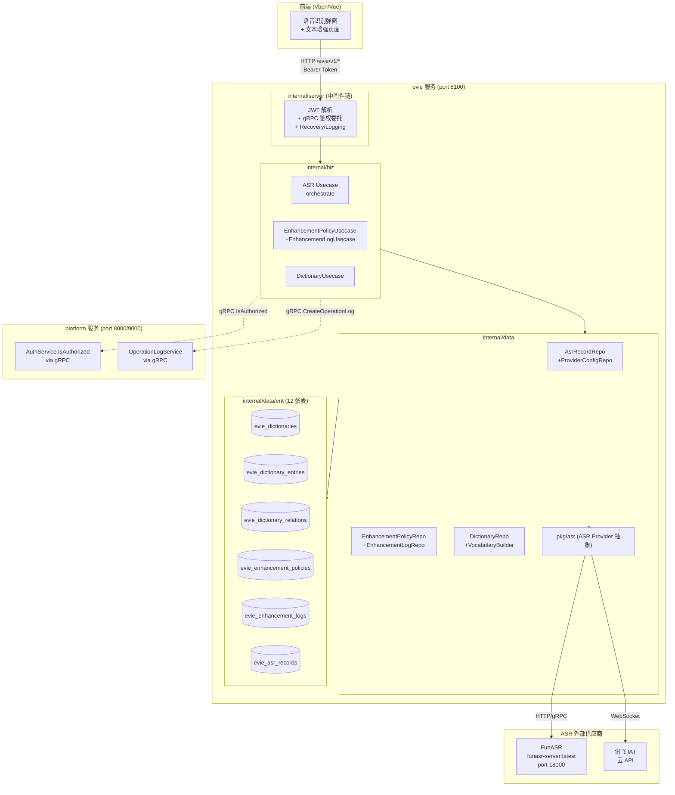
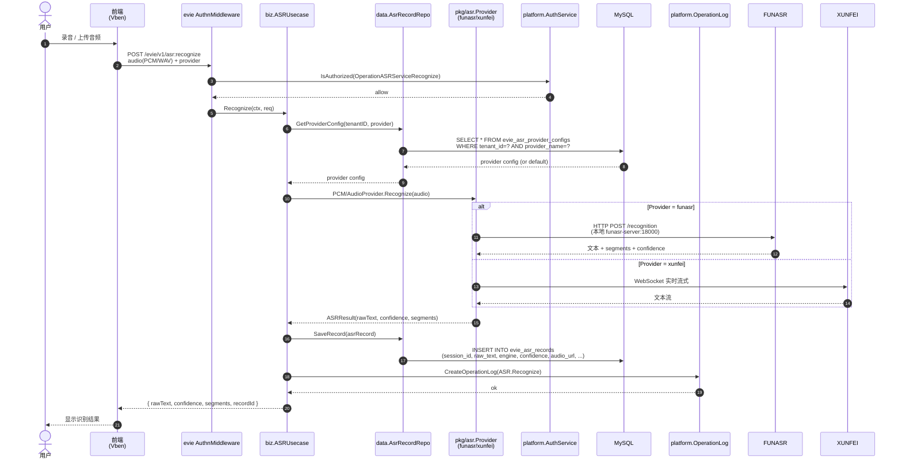
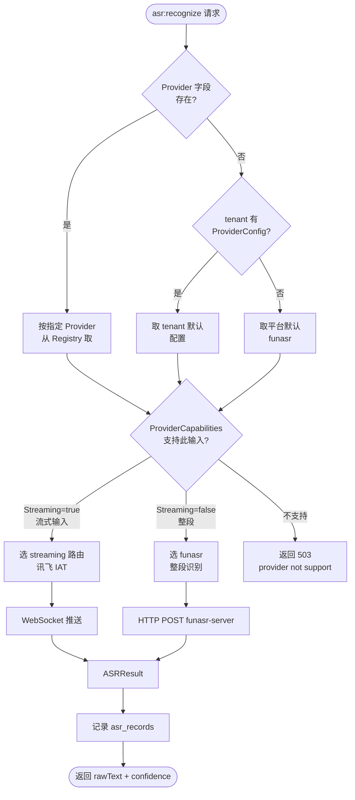
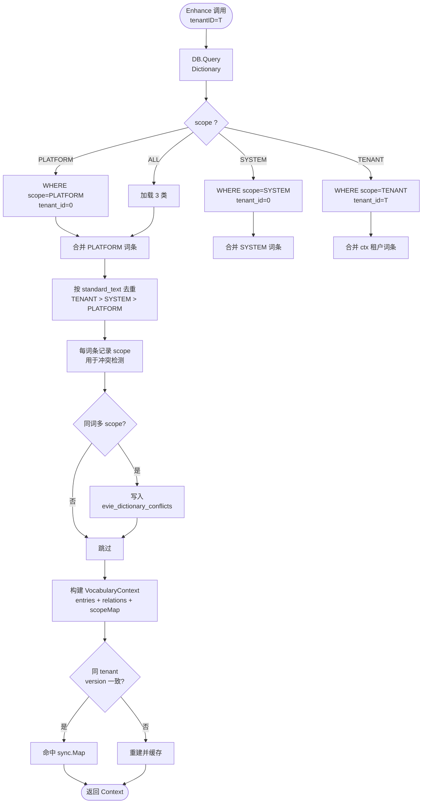
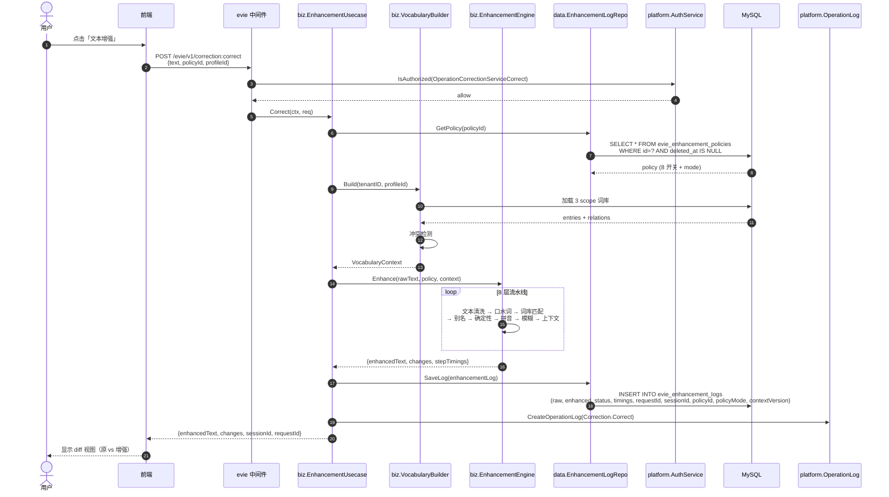
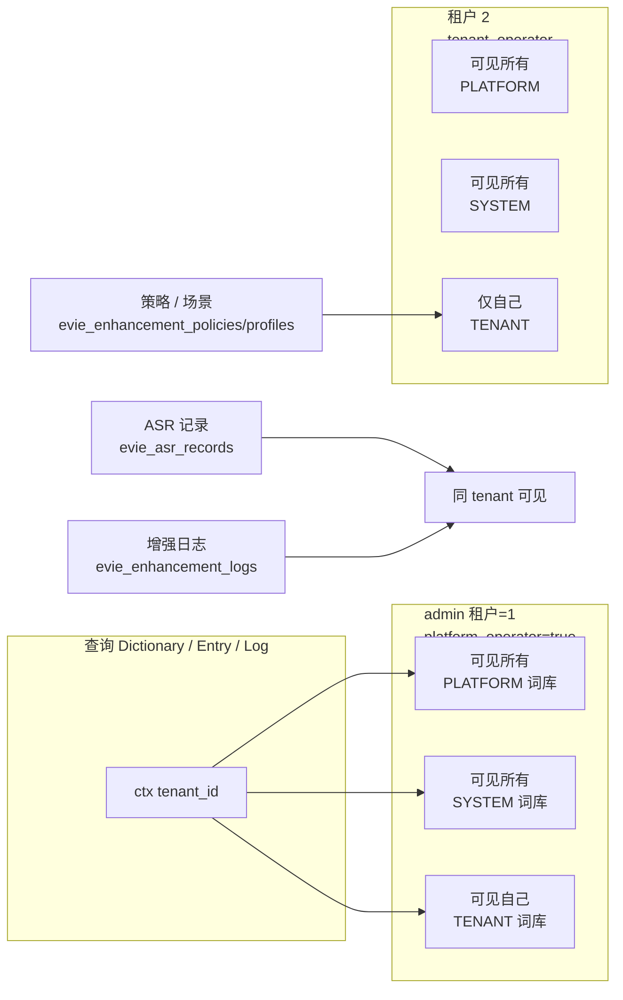

# Evie 服务模块 — ASR 与文本增强执行流程图

日期：2026-08-27
状态：✅ M0-M11 全部完成；ASR+Enhancement 统一入口（2026-08-27 改造）
读者：evie 后续迭代开发者、新成员 onboarding
目的：用 mermaid 可视化「一次用户操作在后端经历了什么」，便于代码定位、瓶颈分析、后续设计决策

> **2026-08-27 关键改造**（影响 §2 §6 §10 等章节）：
> - 端点统一：`ASRService.Recognize` **强制**走 8 层文本增强流水线（不再有独立 `RecognizeAndCorrect` RPC）；`profile_id=0` 按租户默认策略，`profile_id>0` 按场景关联策略
> - 字段重命名：`correction.proto::CorrectionChange` → `enhancement.proto::EnhanceChange`（剥离"纠错"语义，type 含义升级为增强类型 `ALIAS/CLEAN/FILLER/REPLACE/PHONETIC/FUZZY/CONTEXT`）
> - 新增 `EnhanceService.EnhanceText`：纯文本直接走增强引擎（不经 ASR），供前端"纯文本增强"页面调用
> - 策略可插拔（架构预留）：`Enhancer` 接口抽象 8 步为可注册组件；后期 LLM/自定义增强器只需实现接口 + 注册。当前不写实际 LLM 集成
> - Mock 数据增 A/B 场景对比：
>   - **场景 A** 客服对话场景（id=11/13）→ 客服对话策略（`text_cleaning + filler_removal + alias_resolution`）
>   - **场景 B** 专业访谈场景（id=12/14）→ 专业访谈策略（`pinyin_correction + fuzzy_matching + context_correction`）

> **图例约定**：
> - 蓝色 = evie 服务内部模块；绿色 = 平台公共服务（gRPC 委托）；紫色 = ASR 外部供应商；橙色 = 持久化层
> - 箭头方向 = 数据流；虚线 = 控制流（auth/audit/配置加载）

---

## 1. evie 整体架构（模块与依赖）



---

## 2. ASR 端到端时序（一次识别请求）



代码定位：

| 阶段 | 文件 | 关键函数 |
|------|------|---------|
| HTTP 入口 | `app/evie/service/internal/service/asr_service.go` | `Recognize` |
| 中间件 | `app/evie/service/internal/server/server.go` | 鉴权链 |
| 业务编排 | `app/evie/service/internal/biz/asr.go` | `ASRUsecase.Recognize` |
| Provider 路由 | `pkg/asr/registry.go` + `pkg/asr/provider.go` | `ProviderRegistry.Get` + `Provider.Recognize` |
| 数据落库 | `app/evie/service/internal/data/asr_record_repo.go` | `SaveRecord` |
| 鉴权委托 | `pkg/auth/authz/grpc/` | gRPC authorizer |

---

## 3. ASR Provider 选择路由



代码定位：

- Provider 抽象：`pkg/asr/provider.go`（`ASRProvider` 接口）
- 注册中心：`pkg/asr/registry.go`（`ProviderRegistry` 线程安全）
- 路由逻辑：`app/evie/service/internal/biz/asr.go`（`ASRUsecase.routeProvider`）
- 能力声明：`ProviderCapabilities{Streaming, MaxDurationMs, SupportedFormat, SampleRates}`

---

## 4. 文本增强 8 层流水线（核心）

```mermaid
flowchart TD
    Start([rawText + policy + vocabulary]) --> V[VocabularyBuilder.Build<br/>tenant_id]
    V --> V1[加载 scope=PLATFORM 词库<br/>tenant_id=0]
    V1 --> V2[加载 scope=SYSTEM 词库]
    V2 --> V3[加载 ctx 租户 scope=TENANT 词库]
    V3 --> V4[合并 + 冲突检测<br/>TENANT > SYSTEM > PLATFORM]
    V4 --> VC[VocabularyContext<br/>entries + relations + scopeMap]

    VC --> P1[1. 文本清洗<br/>text_cleaning=true?]
    P1 -->|是| P1a[去除 ASCII 标点<br/>合并空白]
    P1 -->|否| P2
    P1a --> P2

    P2[2. 口水词处理<br/>filler_removal=true?] -->|是| P2a[移除常用废话词]
    P2a --> P3
    P2 -->|否| P3

    P3[3. 词库匹配<br/>alias_resolution=true?] -->|是| P3a[用 VocabularyContext<br/>按 scope 优先级匹配]
    P3a --> P4
    P3 -->|否| P4

    P4[4. 别名解析] --> P5[5. 确定性替换]

    P5 --> P6[6. 拼音纠错<br/>pinyin_correction=true?]
    P6 -->|是| P6a[对中文按拼音<br/>回退到标准词]
    P6a --> P7
    P6 -->|否| P7

    P7[7. 模糊匹配<br/>fuzzy_matching=true?] -->|是| P7a[编辑距离<br/>相似度匹配]
    P7a --> P8
    P7 -->|否| P8

    P8[8. 上下文纠错<br/>context_correction=true?]
    P8 -->|是| P8a[同句内多词<br/>相互校验]
    P8a --> END
    P8 -->|否| END

    END[EnhancedText + Changes 变更列表] --> LOG[记录 EnhancementLog<br/>分阶段耗时 + status]
    LOG --> R([返回 Response])
```



代码定位：

| 层 | 文件 | 函数 |
|------|------|------|
| 1 文本清洗 | `app/evie/service/internal/biz/enhancement.go` | `textCleaningStep.Process` |
| 2 口水词 | 同上 | `fillerStep.Process` |
| 3 词库匹配 | 同上 | `vocabMatchStep.Process` |
| 4 别名解析 | 同上 | `aliasStep.Process` |
| 5 确定性替换 | 同上 | `deterministicStep.Process` |
| 6 拼音纠错 | `app/evie/service/internal/biz/enhancement_inference.go` | `PinyinCorrectionStep.Process` |
| 7 模糊匹配 | 同上 | `FuzzyMatchingStep.Process` |
| 8 上下文纠错 | 同上 | `ContextCorrectionStep.Process` |
| 词汇上下文 | `app/evie/service/internal/biz/vocabulary.go` | `VocabularyBuilder.Build` |
| 编排入口 | 同上 | `EnhancementEngine.Enhance` |
| 落库 | `app/evie/service/internal/data/enhancement_log_repo.go` | `Save` |

---

## 5. 词汇上下文构建（多租户 + 冲突检测）



关键点：

- **优先级冲突处理**：同词条出现在多个 scope 时，**记录到 conflicts 表**让用户人工裁决；不自动覆盖（避免高 scope 静默覆盖低 scope）
- **缓存策略**：`VocabularyBuilder.Build` 用进程内 `sync.Map`，按 `(tenantID, contextVersion)` 缓存；写入任一词库/词条/关系时 `bump version` 让下次请求重建
- **scope 隔离**：ctx 租户（scope=TENANT）的 ctx 看不到其他租户词库；scope=PLATFORM/SYSTEM 全租户可见

代码定位：

- Builder：`app/evie/service/internal/biz/vocabulary.go` `VocabularyBuilder.Build` + `buildFromRepo`
- 冲突检测：`app/evie/service/internal/biz/dictionary.go` `detectConflicts` + `scopePriority`
- 缓存失效：`app/evie/service/internal/biz/vocabulary.go` `Invalidate(tenantID)` 在 entry/relation 写入时调用

---

## 6. 文本增强端到端时序（含 EnhancementLog 落库）



降级策略（关键设计）：**任何单阶段失败不阻断主流程**，仅记录 `errorMessage` + 把 status 标为 `DEGRADED`（2）。status 字段：
- 1 = SUCCESS（所有阶段 OK）
- 2 = DEGRADED（部分阶段失败但主流程通过）
- 3 = FAILED（主流程失败，理论上不应发生）

---

## 7. 多租户 scope 可见性（看 ASR / Enhancement 数据时谁能看见什么）



平台 admin（`platform_operator=true` 的用户）**总是能**看到所有数据。
普通租户 admin（`tenant_operator=true`）只能看到：
- 全部 PLATFORM 词库（共享）
- 全部 SYSTEM 词库
- **仅自己**的 TENANT 词库
- **仅自己**的 ASR 记录 / 增强日志
- **仅自己**的增强策略 / 场景

代码定位：

- scope 过滤：`app/evie/service/internal/data/ent/rule/tenant.go`（或类似 privacy 规则）
- 多租户隔离：所有 data 层 List 函数都接受 `tenantID` 参数，加 `WHERE tenant_id=?` 谓词
- 平台 admin 鉴权：通过 `claims.PlatformOperator` 区分（看 `pkg/auth/authn/claims.go`）

---

## 8. 鉴权与审计（所有 evie 接口的统一中间件链）

```mermaid
flowchart LR
    REQ([HTTP /gRPC 请求<br/>+ Bearer Token]) --> A1[JWT 解析<br/>claims = {sub, tenant, platform_operator}]

    A1 --> A2{platform_operator<br/>= true?}
    A2 -->|是| A3[跳过 Casbin<br/>直接放行]
    A2 -->|否| A4[gRPC → platform<br/>AuthService.IsAuthorized<br/>(sub, obj=path, act=method, tenant)]

    A3 --> A5[注入 authn.SecurityUser<br/>到 ctx]
    A4 --> A5

    A5 --> BIZ[业务 usecase]
    BIZ -.->|审计触发点| A6[gRPC → platform<br/>OperationLogService<br/>CreateOperationLog]
    A6 --> A7[platform 审计表<br/>append-only]

    BIZ --> RESP([返回 Response])
```

所有 evie 接口都自动享受：
- JWT 解析 → 注入 SecurityUser 到 ctx
- 普通租户 → gRPC 委托平台 `IsAuthorized` 校验
- 平台 admin（`platform_operator=true`）→ 直接放行
- 业务关键操作 → gRPC 委托平台 `CreateOperationLog` 写审计

代码定位：

- 中间件链：`app/evie/service/internal/server/server.go` `NewHTTPServer` / `NewGRPCServer`
- 鉴权委托：`pkg/auth/authz/grpc/`（`platformclient.NewAuthorizer`）
- 审计委托：`pkg/audit/grpc/`（`platformclient.NewAuditClient`）

---

## 9. 数据落库与可观测性

| 操作 | 落库表 | 关键字段 | 用途 |
|------|--------|---------|------|
| 一次 ASR 识别 | `evie_asr_records` | session_id, raw_text, engine, confidence, audio_url, duration_ms | 识别历史查询、ReRecognize 重识别 |
| 一次文本增强 | `evie_enhancement_logs` | raw_text, enhanced_text, changes_json, status, 8 个 *time_ms, request_id, session_id, policy_id, policy_mode, context_version | 增强历史回溯、性能分析、调优 |
| 词库/词条/关系变更 | `evie_dictionary_change_logs` | entity_type, action, before_snapshot, after_snapshot, operator_id | 审计追踪 |
| 平台审计 | platform.system_operation_logs | operation, actor, target, detail | 合规、安全 |
| 监控指标 | Prometheus | - | QPS/P99/错误率 |

---

## 10. 已知设计与权衡

| 决策 | 理由 | 替代方案 |
|------|------|----------|
| **ASR 路由由 tenant config 控制，不强制 funasr** | 租户可选择自部署或云 ASR；不同企业有合规/成本差异 | 平台统一 funasr |
| **Enhancement 8 层流水线** | 可观测（每层可独立开关 + 计时）+ 渐进增强（按需开启） | 单一 LLM 端到端 |
| **单阶段失败不阻断（降级为 DEGRADED）** | 部分语料下 LLM/拼音模块可能不准，硬失败会导致整体失效 | 任何失败回退原文 |
| **同词多 scope 不自动覆盖，写 conflicts 表** | PLATFORM 是平台共享，被高 scope 静默覆盖会污染公共词库 | 自动覆盖（不推荐）|
| **VocabularyContext 进程内缓存 + version bump** | 避免每次请求重新构建；写操作即时失效 | Redis 分布式缓存（多此一举）|
| **gRPC 委托 platform 鉴权/审计** | Evie 不重复造轮子，鉴权策略统一在平台 | Evie 维护本地 Casbin |
| **前端动态路由 + 后端菜单驱动** | evie 不需要 hardcode 路由表，新增页面只需 seed 菜单 | 静态 routes 数组（evie 旧 design） |

---

## 11. 后续演进方向

1. **健康度 2.0**：补 `DictionaryConflict.dictionary_id` 外键 + `EnhancementLog.dictionary_id`，实现 hit_rate / avg_confidence 真实计算
2. **Policy 阈值开放**：Policy 加 `score_threshold` / `confidence_threshold` 字段，前端可调
3. **Feedback 闭环**：前端增强结果旁加「✓ 采纳 / ✗ 拒绝」按钮，回写到 `user_corrected` + `feedback_text`
4. **批量增强**：增加 `BatchCorrect(texts[], policyId)` RPC，服务端并发调用
5. **LLM 兜底**：新增 8 层之外的"LLM fallback"层，仅低置信度场景触发
6. **多模态**：ASR 视频字幕（faster-whisper-large-v3）+ 语音合并

---

> **变更记录**
> - 2026-08-27：初版（M0-M11 全部完成后）
