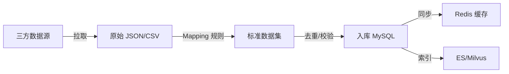

# Evie — 企业知识字典中心

日期：2026-08-04
状态：草案
依赖：[0-架构总览](./0-架构总览-语音智能引擎.md)

---

## 一、模块定位

企业知识字典中心是整个 ASR 智能增强系统的**核心基础服务**。

```
                    AI Agent
                       ▲
              智能纠错引擎（查字典）
                       ▲
              企业知识字典中心
           ┌────┬────┬────┬────┐
          平台   系统   企业   用户
          字典   字典   字典   字典
           └────┴────┴────┴────┘
                       ▲
              企业组织 / 业务数据
```

---

## 二、四级字典模型

### 2.1 层级定义

```
优先级（低 → 高）：

  平台公共字典   —  所有租户共享，平台管理员维护
      ↓ 可覆盖
  系统业务字典   —  业务系统自动提供（如金种籽词库）
      ↓ 可覆盖
  企业租户字典   —  每个租户独立维护（最核心）
      ↓ 可覆盖
  个人用户字典   —  用户个人自定义
```

### 2.2 优先级解决冲突

当同一输入匹配到多个字典中不同结果时：

```
用户个人 > 企业租户 > 系统业务 > 平台公共
```

---

## 三、Go 接口定义

```go
// internal/biz/dictionary.go

type DictionaryCenter interface {
    // ====== 查询接口 ======

    // FindByPinyin 按拼音查找标准词
    FindByPinyin(ctx context.Context, pinyin string) ([]DictionaryEntry, error)

    // FuzzySearch 模糊搜索（编辑距离）
    FuzzySearch(ctx context.Context, text string, maxDist int) ([]DictionaryEntry, error)

    // MatchEntity 实体匹配（先别名后拼音后向量）
    MatchEntity(ctx context.Context, req EntityMatchRequest) (*DictionaryEntry, error)

    // ====== 管理接口 ======

    // UpsertWord 创建/更新标准词
    UpsertWord(ctx context.Context, req UpsertWordRequest) (*DictionaryWord, error)

    // UpsertAlias 创建/更新别名
    UpsertAlias(ctx context.Context, req AliasUpsert) error

    // DeleteWord 删除标准词（级联删除别名）
    DeleteWord(ctx context.Context, id int64) error

    // ====== 同步接口 ======

    // SyncFromOrg 从组织架构同步员工/部门字典
    SyncFromOrg(ctx context.Context, tenantID int64) error

    // AutoGenerateAliases 自动生成别名
    AutoGenerateAliases(ctx context.Context, wordID int64) ([]string, error)
}

type DictionaryEntry struct {
    WordID        int64
    CanonicalName string   // 标准名（如：田华）
    Type          string   // person / org / product / term
    Category      string   // 子分类
    Aliases       []string // 别名列表
    Pinyin        string   // 拼音
    Score         float64  // 匹配置信度
    TenantID      int64    // 0 = 平台/系统级
    Source        string   // platform / system / tenant / user
}

type EntityMatchRequest struct {
    Text     string // 待匹配文本
    Type     string // 限定实体类型，空=不限
    Context  string // 上下文（部门、前后文等辅助信息）
}

type UpsertWordRequest struct {
    TenantID int64
    Word     string
    Type     string
    Category string
    Aliases  []string // 手动指定的别名
    AutoAlias bool    // 是否自动生成别名
}
```

---

## 四、别名自动生成算法

```go
// internal/biz/alias_generator.go

type AliasGenerator struct{}

// GenerateAliases 根据员工信息自动生成别名
func (g *AliasGenerator) GenerateAliases(employee EmployeeInfo) []string {
    aliases := make(map[string]bool)

    surname := string([]rune(employee.Name)[0]) // 姓
    given := string([]rune(employee.Name)[1:])   // 名

    // 规则1: 姓简称 "小田"
    aliases["小"+surname] = true
    aliases["老"+surname] = true
    aliases["阿"+surname] = true

    // 规则2: 职位组合 "田经理" / "田工"
    if employee.Position != "" {
        shortPos := extractShortPosition(employee.Position) // "经理"→"经理", "技术经理"→"经理"
        aliases[surname+shortPos] = true
        if shortPos == "经理" {
            aliases[surname+"总"] = true
        }
        aliases[surname+"工"] = true
    }

    // 规则3: 部门+姓名
    if employee.Department != "" {
        shortDept := extractShortDept(employee.Department) // "技术研发部"→"技术"
        aliases[shortDept+employee.Name] = true
    }

    // 规则4: 拼音索引
    py := toPinyin(employee.Name)
    aliases[py] = true                                // "tianhua"
    aliases[py[:1]+" "+py] = true                     // "t h"
    aliases[strings.ReplaceAll(py, " ", "")[:2]] = true // "th"

    result := make([]string, 0, len(aliases))
    for a := range aliases {
        if a != employee.Name {
            result = append(result, a)
        }
    }
    return result
}

// shortPosition maps: 技术经理→经理, 高级开发工程师→工程师
var positionShortMap = map[string]string{
    "经理": "经理", "主管": "主管", "总监": "总监",
    "工程师": "工", "架构师": "架构师",
}

// shortDept maps: 技术研发部→技术, 市场销售部→市场
var deptShortMap = map[string]string{
    "技术研发部": "技术", "技术部": "技术", "研发部": "研发",
    "市场部": "市场", "产品部": "产品",
}
```

---

## 五、字典匹配流程

```go
// internal/biz/dictionary.go

func (dc *DictionaryCenterImpl) MatchEntity(ctx context.Context, req EntityMatchRequest) (*DictionaryEntry, error) {
    tenantID := auth.TenantIDFromContext(ctx)

    // 1. 别名精确匹配（最快，优先级最高）
    if entry := dc.matchAlias(ctx, tenantID, req.Text, req.Type); entry != nil {
        return entry, nil
    }

    // 2. 姓名直接匹配
    if entry := dc.matchName(ctx, tenantID, req.Text, req.Type); entry != nil {
        return entry, nil
    }

    // 3. 拼音匹配
    pinyin := toPinyin(req.Text)
    if entries := dc.matchPinyin(ctx, tenantID, pinyin, req.Type); len(entries) > 0 {
        return dc.pickBest(entries, req.Context), nil
    }

    // 4. 编辑距离模糊匹配
    if entries := dc.matchFuzzy(ctx, tenantID, req.Text, 2, req.Type); len(entries) > 0 {
        return dc.pickBest(entries, req.Context), nil
    }

    // 5. 向量语义匹配（Milvus）
    if entries := dc.matchVector(ctx, tenantID, req.Text, req.Type); len(entries) > 0 {
        return dc.pickBest(entries, req.Context), nil
    }

    return nil, nil // 未匹配
}

// pickBest 在多候选中选择最佳（基于上下文）
func (dc *DictionaryCenterImpl) pickBest(entries []DictionaryEntry, context string) *DictionaryEntry {
    if len(entries) == 1 {
        return &entries[0]
    }
    // 用上下文（如部门名）辅助判断
    // 例如："技术部小田" → context 含"技术" → 优先匹配技术部的田华
    for i := range entries {
        entries[i].Score = dc.contextScore(entries[i], context)
    }
    sort.Slice(entries, func(i, j int) bool {
        return entries[i].Score > entries[j].Score
    })
    return &entries[0]
}
```

---

## 六、数据模型（Ent Schema）

### 6.1 dictionary_word

```go
// internal/data/ent/schema/dictionary_word.go

type DictionaryWord struct {
    ent.Schema
}

func (DictionaryWord) Fields() []ent.Field {
    return []ent.Field{
        field.Int64("id").Unique(),
        field.Int64("tenant_id"),                 // 0=平台, >0=租户
        field.String("word"),                     // 标准词
        field.String("type"),                     // platform/system/tenant/user
        field.String("category"),                 // person/org/product/term
        field.String("source"),                   // 来源: manual/sync_org/sync_biz/feedback
        field.Int("status").Default(1),           // 1=启用 0=停用
        field.Int("priority").Default(0),         // 同级字典内的优先级
        field.Time("created_at").Default(time.Now),
        field.Time("updated_at").Default(time.Now).UpdateDefault(time.Now),
    }
}

func (DictionaryWord) Edges() []ent.Edge {
    return []ent.Edge{
        edge.To("aliases", DictionaryAlias.Type),
    }
}

func (DictionaryWord) Indexes() []ent.Index {
    return []ent.Index{
        index.Fields("tenant_id", "word").Unique(),
        index.Fields("tenant_id", "type", "category"),
        index.Fields("word"),
    }
}
```

### 6.2 dictionary_alias

```go
// internal/data/ent/schema/dictionary_alias.go

type DictionaryAlias struct {
    ent.Schema
}

func (DictionaryAlias) Fields() []ent.Field {
    return []ent.Field{
        field.Int64("id").Unique(),
        field.Int64("word_id"),                    // FK → dictionary_word
        field.String("alias"),                     // 别名
        field.String("pinyin"),                    // 拼音
        field.Float("weight").Default(1.0),       // 权重
        field.String("source").Default("manual"), // manual/auto/feedback
        field.Time("created_at").Default(time.Now),
    }
}

func (DictionaryAlias) Edges() []ent.Edge {
    return []ent.Edge{
        edge.From("word", DictionaryWord.Type).
            Ref("aliases").
            Field("word_id").
            Unique().
            Required(),
    }
}

func (DictionaryAlias) Indexes() []ent.Index {
    return []ent.Index{
        index.Fields("alias"),
        index.Fields("pinyin"),
        index.Fields("word_id", "alias").Unique(),
    }
}
```

### 6.3 correction_rule

```go
// internal/data/ent/schema/correction_rule.go

type CorrectionRule struct {
    ent.Schema
}

func (CorrectionRule) Fields() []ent.Field {
    return []ent.Field{
        field.Int64("id").Unique(),
        field.Int64("tenant_id"),              // 0=平台级规则
        field.String("source"),                // 源词
        field.String("target"),                // 目标词
        field.String("type"),                  // dictionary/business/system
        field.Int("priority").Default(100),
        field.Int("status").Default(1),        // 1=启用 0=停用
        field.Time("created_at").Default(time.Now),
    }
}
```

### 6.4 correction_log

```go
// internal/data/ent/schema/correction_log.go

type CorrectionLog struct {
    ent.Schema
}

func (CorrectionLog) Fields() []ent.Field {
    return []ent.Field{
        field.Int64("id").Unique(),
        field.Int64("tenant_id"),
        field.Int64("user_id"),
        field.String("session_id"),
        field.String("original_text"),
        field.String("corrected_text"),
        field.Text("changes_json"),            // JSON
        field.Float("confidence"),
        field.Bool("need_confirm"),
        field.Int64("duration_ms"),
        field.Int("rule_hits"),
        field.Int("pinyin_hits"),
        field.Int("entity_hits"),
        field.Int("llm_hits"),
        field.Time("created_at").Default(time.Now),
    }
}
```

---

## 七、缓存设计

```go
// internal/data/cache.go

// Redis Key 规范（多租户隔离）
const (
    // 字典缓存: dict:{tenantID}:word:{word}
    keyDictWord = "dict:%d:word:%s"
    // 别名缓存: dict:{tenantID}:alias:{alias}
    keyDictAlias = "dict:%d:alias:%s"
    // 拼音索引: dict:{tenantID}:pinyin:{pinyin}
    keyDictPinyin = "dict:%d:pinyin:%s"
    // 规则缓存: correction:rule:{tenantID}
    keyCorrectionRule = "correction:rule:%d"
)

type DictCache struct {
    rdb *redis.Client
}

func (c *DictCache) GetByAlias(ctx context.Context, tenantID int64, alias string) (*DictionaryEntry, error) {
    key := fmt.Sprintf(keyDictAlias, tenantID, alias)
    data, err := c.rdb.Get(ctx, key).Bytes()
    if errors.Is(err, redis.Nil) {
        return nil, nil // cache miss
    }
    if err != nil {
        return nil, err
    }
    var entry DictionaryEntry
    json.Unmarshal(data, &entry)
    return &entry, nil
}

func (c *DictCache) SetByAlias(ctx context.Context, tenantID int64, alias string, entry *DictionaryEntry, ttl time.Duration) error {
    key := fmt.Sprintf(keyDictAlias, tenantID, alias)
    data, _ := json.Marshal(entry)
    return c.rdb.Set(ctx, key, data, ttl).Err()
}
```

---

## 八、Elasticsearch 索引设计

```json
// ES 索引映射：evie_dictionary
{
  "mappings": {
    "properties": {
      "tenant_id": { "type": "long" },
      "word_id": { "type": "long" },
      "word": {
        "type": "text",
        "analyzer": "ik_max_word",
        "fields": {
          "keyword": { "type": "keyword" },
          "pinyin": { "type": "text", "analyzer": "pinyin" }
        }
      },
      "alias": {
        "type": "text",
        "analyzer": "ik_max_word",
        "fields": {
          "keyword": { "type": "keyword" },
          "pinyin": { "type": "text", "analyzer": "pinyin" }
        }
      },
      "type": { "type": "keyword" },
      "category": { "type": "keyword" },
      "pinyin": { "type": "text", "analyzer": "pinyin" },
      "weight": { "type": "float" }
    }
  }
}
```

查询示例：

```go
func (r *ESDictRepo) Search(ctx context.Context, tenantID int64, text string, limit int) ([]DictionaryEntry, error) {
    query := elastic.NewBoolQuery().
        Filter(elastic.NewTermQuery("tenant_id", tenantID)).
        Should(elastic.NewMatchQuery("alias.keyword", text).Boost(10)).
        Should(elastic.NewMatchQuery("word.keyword", text).Boost(8)).
        Should(elastic.NewMatchQuery("alias.pinyin", text).Boost(3)).
        Should(elastic.NewMatchQuery("word.pinyin", text).Boost(1))

    result, err := r.client.Search().
        Index("evie_dictionary").
        Query(query).
        Size(limit).
        Do(ctx)
    // ... parse results
}
```

---

## 九、Milvus 向量检索设计

```go
// Collection: evie_dictionary
// metadata 隔离多租户

type MilvusDictRepo struct {
    client milvus.Client
}

func (r *MilvusDictRepo) SearchSemantic(ctx context.Context, tenantID int64, text string, topK int) ([]DictionaryEntry, error) {
    // 1. 将输入文本转为向量（调用 embedding 模型）
    vector, err := r.embed(ctx, text)
    if err != nil {
        return nil, fmt.Errorf("embed: %w", err)
    }

    // 2. Milvus 向量搜索 + metadata 过滤
    results, err := r.client.Search(ctx, milvus.SearchRequest{
        CollectionName: "evie_dictionary",
        Vectors:        [][]float32{vector},
        TopK:           topK,
        Expr:           fmt.Sprintf(`tenant_id == %d`, tenantID),
        OutputFields:   []string{"word_id", "word", "type", "category", "weight"},
    })
    // ... parse to DictionaryEntry
}

func (r *MilvusDictRepo) embed(ctx context.Context, text string) ([]float32, error) {
    // 调用 text-embedding 服务（如 text2vec-base-chinese）
    // 可复用平台已有的 embedding pipeline
}
```

---

## 十、组织架构同步

```go
// 定期或事件触发，从业务系统同步员工/部门数据

type OrgSyncer struct {
    dictCenter DictionaryCenter
    // 调用租户底座 API 获取组织架构
    tenantClient TenantClient
}

func (s *OrgSyncer) SyncOrganization(ctx context.Context, tenantID int64) error {
    // 1. 获取部门列表
    depts, err := s.tenantClient.ListDepartments(ctx, tenantID)
    if err != nil {
        return fmt.Errorf("list departments: %w", err)
    }

    // 2. 获取员工列表
    employees, err := s.tenantClient.ListEmployees(ctx, tenantID)
    if err != nil {
        return fmt.Errorf("list employees: %w", err)
    }

    // 3. 同步部门字典
    for _, d := range depts {
        _, err := s.dictCenter.UpsertWord(ctx, UpsertWordRequest{
            TenantID: tenantID,
            Word:     d.Name,
            Type:     "tenant",
            Category: "org",
            AutoAlias: true,
        })
        if err != nil {
            log.Errorf("sync dept %s: %v", d.Name, err)
            continue
        }
    }

    // 4. 同步员工字典 + 自动生成别名
    for _, emp := range employees {
        word, err := s.dictCenter.UpsertWord(ctx, UpsertWordRequest{
            TenantID:  tenantID,
            Word:      emp.Name,
            Type:      "tenant",
            Category:  "person",
            AutoAlias: true,
        })
        if err != nil {
            log.Errorf("sync employee %s: %v", emp.Name, err)
            continue
        }

        // 自动生成别名
        generator := AliasGenerator{}
        aliases := generator.GenerateAliases(EmployeeInfo{
            Name:       emp.Name,
            Department: emp.DepartmentName,
            Position:   emp.Position,
        })
        for _, alias := range aliases {
            _ = s.dictCenter.UpsertAlias(ctx, AliasUpsert{
                TenantID: tenantID,
                WordID:   word.ID,
                Alias:    alias,
                Source:   "auto",
            })
        }
    }

    return nil
}
```

---

## 十一、字典生命周期管理

```text
创建 → 启用 → 更新 → [停用] → [删除]

停用: 保留数据但查询不返回
删除: 物理删除 + 级联删除别名 + 清缓存
```

```go
// 删除字典词时的副作用处理
func (dc *DictionaryCenterImpl) DeleteWord(ctx context.Context, id int64) error {
    tenantID := auth.TenantIDFromContext(ctx)

    // 1. 获取 word 信息（用于清缓存、ES、Milvus）
    word, err := dc.repo.GetWord(ctx, id)
    if err != nil {
        return err
    }

    // 2. 软删除 or 物理删除
    if err := dc.repo.DeleteWord(ctx, id); err != nil {
        return err
    }

    // 3. 清 Redis 缓存
    dc.cache.InvalidateWord(ctx, tenantID, word.Word)
    for _, alias := range word.Edges.Aliases {
        dc.cache.InvalidateAlias(ctx, tenantID, alias.Alias)
    }

    // 4. 删除 ES 索引
    dc.esRepo.DeleteByWordID(ctx, id)

    // 5. 删除 Milvus 向量
    dc.milvusRepo.DeleteByWordID(ctx, id)

    return nil
}
```

---

## 十二、数据源集成（DataSource Integration）

### 12.1 设计目标

Evie 的核心是纠错引擎，字典和纠错规则是纠错引擎的"燃料"。用户可以通过三种方式维护这些数据：

| 方式 | 适用场景 | 说明 |
|------|---------|------|
| 手动维护 | 少量字典词/规则 | 后台管理页面 CRUD |
| 组织自动同步 | 员工/部门数据 | 调用平台租户底座 API，自动生成别名 |
| **数据源集成** | 外部系统批量数据 | 用户配置数据接口，系统定时拉取并转换 |

数据源集成的核心思路：**Evie 定义标准数据集格式，用户配置三方数据源 → Evie 拉取 → 转换映射 → 入库**。

### 12.2 数据源模型

```go
// internal/biz/data_source.go

// DataSource 外部数据源定义
type DataSource struct {
    ID           int64
    TenantID     int64
    Name         string             // 数据源名称（如"金种籽员工库"）
    SourceType   DataSourceType     // http_api / csv_upload / db_direct / grpc
    TargetType   DictTargetType     // 导入目标：dictionary_word / correction_rule / alias
    ConfigJSON   string             // 连接配置 JSON
    MappingJSON  string             // 字段映射规则 JSON
    SyncSchedule string             // cron 表达式，空=手动触发
    Status       int                // 1=启用 0=停用
}

type DataSourceType string
const (
    DataSourceHTTPAPI   DataSourceType = "http_api"    // HTTP API 拉取
    DataSourceCSVUpload DataSourceType = "csv_upload"   // CSV 文件上传
    DataSourceDBDirect  DataSourceType = "db_direct"    // 直连数据库（高级）
    DataSourceGRPC      DataSourceType = "grpc"         // gRPC 接口调用
)

type DictTargetType string
const (
    TargetDictionaryWord DictTargetType = "dictionary_word"
    TargetCorrectionRule DictTargetType = "correction_rule"
    TargetAlias          DictTargetType = "alias"
)
```

### 12.3 标准转换契约

无论三方数据源是什么格式，最终必须转换为 Evie 的标准数据结构：

```go
// 标准字典词数据集（三方数据转换目标格式）
type StandardDictionaryDataset struct {
    Words []StandardDictionaryWord `json:"words"`
}

type StandardDictionaryWord struct {
    Word     string   `json:"word"`               // 标准词（必填）
    Category string   `json:"category"`           // person/org/product/term
    Aliases  []string `json:"aliases,omitempty"`  // 别名列表
    Extra    string   `json:"extra,omitempty"`    // 扩展字段（JSON）
}

// 标准纠错规则数据集
type StandardCorrectionDataset struct {
    Rules []StandardCorrectionRule `json:"rules"`
}

type StandardCorrectionRule struct {
    Source   string `json:"source"`   // 源词
    Target   string `json:"target"`   // 目标词
    Type     string `json:"type"`     // dictionary/business/system
    Priority int    `json:"priority"`
}
```

### 12.4 字段映射（Mapping）

用户配置三方数据字段到标准字段的映射。例如金种籽系统的员工 API 返回：

```json
// 三方 API 返回格式
{
  "employees": [
    {
      "emp_name": "田华",
      "emp_nickname": "小田",
      "dept_name": "技术研发部",
      "position": "技术经理"
    }
  ]
}
```

用户在 Evie 后台配置映射：

```yaml
# 数据源配置中的 mapping 字段
source_path: "$.employees[*]"
field_mapping:
  word:      "$.emp_name"                           # 标准词 ← 员工姓名
  category:  "\"person\""                            # 固定值
  aliases:                                         # 别名多字段拼装
    - "$.emp_nickname"                             # 小田
    - "concat($.dept_name, $.emp_name)"             # 技术研发部田华
```

### 12.5 转换流程



```go
// internal/biz/data_source.go

// DataSourceSync 数据源同步编排
func (s *DataSourceSync) Sync(ctx context.Context, dsID int64) (*SyncResult, error) {
    // 1. 拉取三方数据
    ds, _ := s.repo.GetDataSource(ctx, dsID)
    rawData, err := s.fetcher.Fetch(ctx, ds)
    if err != nil {
        return nil, fmt.Errorf("fetch data source: %w", err)
    }

    // 2. 根据 mapping 转换为标准数据集
    dataset, err := s.mapper.Transform(ctx, rawData, ds.MappingJSON)
    if err != nil {
        return nil, fmt.Errorf("transform: %w", err)
    }

    // 3. 去重 + 校验
    dataset = s.normalizer.Deduplicate(dataset)
    if errs := s.validator.Validate(dataset); len(errs) > 0 {
        return nil, fmt.Errorf("validation: %v", errs)
    }

    // 4. 入库
    switch ds.TargetType {
    case TargetDictionaryWord:
        return s.upsertWords(ctx, ds.TenantID, dataset.(StandardDictionaryDataset))
    case TargetCorrectionRule:
        return s.upsertRules(ctx, ds.TenantID, dataset.(StandardCorrectionDataset))
    case TargetAlias:
        return s.upsertAliases(ctx, ds.TenantID, dataset)
    }
}
```

### 12.6 数据获取器（Fetcher）

```go
// DataFetcher 三方数据获取抽象
type DataFetcher interface {
    Fetch(ctx context.Context, ds DataSource) ([]byte, error)
}

// HTTPAPIFetcher HTTP API 拉取
func (f *HTTPAPIFetcher) Fetch(ctx context.Context, ds DataSource) ([]byte, error) {
    var cfg HTTPAPIConfig
    json.Unmarshal([]byte(ds.ConfigJSON), &cfg)

    req, _ := http.NewRequestWithContext(ctx, cfg.Method, cfg.URL, nil)
    for k, v := range cfg.Headers {
        req.Header.Set(k, v)
    }
    resp, err := f.client.Do(req)
    // ... return body
}
```

### 12.7 定时同步

```go
// 通过平台异步任务中心注册定时任务
func (s *DataSourceSync) RegisterCronJobs(ctx context.Context) error {
    sources, _ := s.repo.ListEnabled(ctx)
    for _, ds := range sources {
        if ds.SyncSchedule != "" {
            s.taskCenter.Register(ctx, AsyncTask{
                Name:     fmt.Sprintf("evie-ds-sync-%d", ds.ID),
                CronExpr: ds.SyncSchedule,
                Handler: func(ctx context.Context) error {
                    _, err := s.Sync(ctx, ds.ID)
                    return err
                },
            })
        }
    }
    return nil
}
```

### 12.8 配置项

```yaml
dictionary:
  data_source:
    fetch_timeout: 30s
    max_dataset_size: 10000     # 单次最大导入条数
    default_sync_cron: "0 3 * * *"
    fetchers:
      http_api:
        max_redirects: 3
      csv_upload:
        max_file_size: 10MB
```

---

## 十三、配置项（全局）

```yaml
dictionary:
  alias_cache:
    ttl: 1h
    max_entries: 100000
  auto_alias:
    enabled: true
    rules:
      - surname_prefix: true    # 小/老/阿 + 姓
      - position_suffix: true   # 姓 + 经理/工/总
      - dept_prefix: true       # 部门简称 + 姓名
      - pinyin_index: true      # 拼音全拼/首字母
  sync:
    cron: "0 2 * * *"          # 每天凌晨 2 点
    batch_size: 500
  search:
    es_index: evie_dictionary
    milvus_collection: evie_dictionary
    es_timeout: 200ms
    milvus_timeout: 500ms
```

---

> 下一份：[4-多租户数据隔离设计](./4-多租户数据隔离设计.md)
