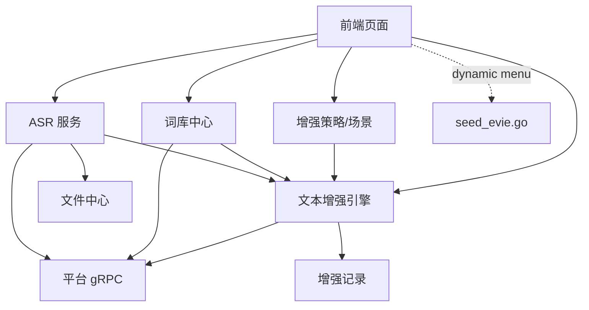

# Evie — 开发路线图

日期：2026-08-25
状态：✅ M0-M11 全部完成；后续演进待启动
依赖：[0-架构总览](./0-架构总览-语音智能引擎.md)、[8-词库中心与文本增强引擎开发计划](./8-词库中心与文本增强引擎开发计划.md)

> **路线变更（2026-08-25 M0-M11 重构）**：
> 原「Phase 1 ASR → Phase 2 纠错 → Phase 3 LLM + ES/Milvus」三阶段路线已被**彻底重构**为「M0-M11 词库中心 + 文本增强 + ASR」路线；
> 原 Phase 2 的「纠错引擎」五路编排被 8 层流水线取代；
> 原 Phase 3 的 LLM 兜底 / ES / Milvus 设计暂未落地（语义检索由文本增强引擎模糊匹配 + 上下文纠错覆盖）。
> 旧版开发计划文档 [8-](./8-词库中心与文本增强引擎开发计划.md) 是当前事实来源。

---

## 一、当前已完成功能（M0-M11）

### 1.1 后端

| 能力 | 模块 | 状态 |
|------|------|:---:|
| 词库中心 CRUD（dictionary/entry/relation/category/version/conflict/change_log） | 词库中心 | ✅ |
| VocabularyContext 构建（PLATFORM→SYSTEM→TENANT 合并）+ sync.Map 缓存 | 词库中心 | ✅ |
| 跨作用域冲突检测 + 写入 DictionaryConflict | 词库中心 | ✅ |
| 文本增强引擎 8 层流水线（清洗/口水词/词库匹配/别名解析/确定性替换/拼音/模糊/上下文） | 文本增强 | ✅ |
| 锁定机制 + score/threshold/REPLACE/SUGGEST/KEEP 决策 | 文本增强 | ✅ |
| 增强策略 Policy（8 开关 + 3 模式）+ 增强场景 Profile 绑定 | 文本增强 | ✅ |
| 增强记录 EnhancementLog（全链路可观测，分阶段耗时 + 降级标记） | 文本增强 | ✅ |
| ASR Provider 抽象 + Registry（pkg/asr） | ASR | ✅ |
| 整段/流式分场景路由（FunASR 整段 + 讯飞 IAT 流式） | ASR | ✅ |
| 音频 PCM/WAV 互转 + 文件中心上传 | ASR | ✅ |
| ASR 记录查询（List/Get/GetAudio） | ASR | ✅ |
| 供应商可用能力列表 + 租户配置 upsert/查询 | ASR | ✅ |
| 跨服务鉴权/审计委托（gRPC 委托平台） | 基础设施 | ✅ |

### 1.2 前端

| 页面 | 路径 | 状态 |
|------|------|:---:|
| 词库管理 | `/evie/dictionary/dictionaries` | ✅ |
| 词条管理 | `/evie/dictionary/entries` | ✅ |
| 关系管理 | `/evie/dictionary/relations` | ✅ |
| 分类管理 | `/evie/dictionary/categories` | ✅ |
| 版本管理 | `/evie/dictionary/versions` | ✅ |
| 冲突记录 | `/evie/dictionary/conflicts` | ✅ |
| 增强策略 | `/evie/enhancement/policies` | ✅ |
| 增强场景 | `/evie/enhancement/profiles` | ✅ |
| 增强记录 | `/evie/enhancement/logs` | ✅ |
| 语音识别 | `/evie/asr` | ✅ |
| 供应商管理 | `/evie/provider` | ✅ |

前端页面通过后端菜单动态路由（`getAccessMenusApi` + `generateAccessible`）自动消费，
无需手写前端路由文件；中英文 locale 完整。

### 1.3 验证状态

| 验证 | 结果 |
|------|------|
| `go test ./...` | ✅ 全过 |
| 端到端 8 个 Case | ✅ 全过（mock 租户 A/B 隔离验收） |
| 前端 `typecheck` | ✅ 通过 |
| 词典上下文缓存失效修复 | ✅ 已修 |

---

## 二、后续演进（待启动）

> 优先级按业务价值与平台一致性双重评估；具体节奏在 [4-6-治理-开发功能清单](../../architecture/4-6-治理-开发功能清单.md) 当前断点中跟踪。

### 2.1 优先级 P1（下一迭代）

| 任务 | 价值 | 工作量 |
|------|------|:---:|
| 变更记录页（change-logs）RPC + 菜单落地 | 词库审计与回溯能力 | 2-3d |
| Policy 阈值开放（前端可调 score/threshold） | 不同租户自定义增强策略 | 1-2d |
| Enhancement Feedback 闭环（用户确认/纠正回写词库） | 用户反馈驱动的自适应 | 3-5d |
| ReRecognize 链路接入文本增强（音频重识别后自动纠错） | 完整体验闭环 | 1d |
| 单元测试覆盖率门禁（biz 层 ≥ 70%） | 代码质量保障 | 持续 |

### 2.2 优先级 P2（再下一迭代）

| 任务 | 价值 | 工作量 |
|------|------|:---:|
| 阿里云 ASR Provider 实现（云 API 二元化） | 灾备与多云 | 1-2d |
| Whisper Provider 落地（隐私敏感场景） | 数据合规 | 2-3d |
| FunASR 流式能力（paraformer-zh-streaming） | 替代讯飞流式（去云依赖） | 3-5d |
| 词典导入向导（CSV/Excel 上传 + 字段映射预览） | 运营效率 | 2-3d |
| 词典导出（按 scope 导出 JSON/CSV） | 数据可移植 | 1d |
| 跨服务 SSE 流式增强（边说边增强） | 实时场景 | 2-3d |

### 2.3 优先级 P3（远期规划）

| 任务 | 价值 | 工作量 |
|------|------|:---:|
| LLM 兜底纠错（仅低置信度触发，可选开关） | 复杂场景提升 | 待评估 |
| 语音端到端 E2E 测试（CI 跑通 + 录音 fixture） | 质量门禁 | 2-3d |
| 多模态接入（视频字幕 + 语音合并） | 新场景 | 待评估 |
| 联邦词典（跨租户匿名词条共享） | 平台级能力 | 待评估 |

---

## 三、关键技术决策（已确认）

| 决策 | 结论 | 理由 |
|------|------|------|
| 词库作用域 | PLATFORM/SYSTEM/TENANT 三级 | 与平台多租户模型一致 |
| 词条关系类型 | 6 类（ALIAS/CORRECTION/HOMOPHONE/PHONETIC_SIMILAR/ABBREVIATION/RELATED） | 覆盖识别后纠错全部场景 |
| 增强策略粒度 | Policy（开关+模式）+ Profile（场景） | 复用性 + 业务可配置 |
| ASR 路由 | 整段 FunASR + 流式讯飞 | 中文优化 + 流式能力 |
| 鉴权方式 | gRPC 委托平台 IsAuthorized | Evie 不维护 Casbin |
| 审计方式 | gRPC 委托平台 OperationLog | 与平台审计体系一致 |
| 路由注册 | 后端 mock seed_evie.go 声明式 + 前端动态消费 | 与平台产品服务模式一致 |
| 缓存策略 | VocabularyContext 进程内 sync.Map + version 失效 | 简单可控 |

---

## 四、依赖关系（已落地）

---

## 五、与平台功能清单的对接

Evie 已纳入 [4-7-治理-代码功能清单](../../architecture/4-7-治理-代码功能清单.md)：

- 4.4 Evie 语音智能引擎页：11 项前端页面 `[x]`
- 八、Evie 服务：7 项后端能力 `[x]`
- 1.2 跨服务鉴权委托 + Evie 菜单权限注册：2 项基础设施 `[x]`

后续演进项会在 [4-6-治理-开发功能清单](../../architecture/4-6-治理-开发功能清单.md) 当前断点中追加并按状态推进。

---

## 六、关键风险与缓解（已识别）

| 风险 | 状态 | 缓解措施 |
|------|:---:|---------|
| 大词库场景 VocabularyContext 内存占用 | 已观察 | sync.Map 分租户 + 可选 Redis 二级缓存 |
| 8 层流水线串行耗时 | 已观察 | 单层失败降级 + 分阶段耗时埋点（已实现） |
| 跨方言/专业领域识别准确率 | 持续 | 用户反馈闭环（演进项）+ 词库 ALIAS 关系补充 |
| 流式讯飞 API 限流 | 已验证 | 120s 接口超时 + 节流参数 |
| 私有化部署 FunASR 运维 | 已验证 | 独立 Python 服务 + Docker/K8s 部署 + 离线模型挂载 |

---

> 相关文档：
> - [0-架构总览-语音智能引擎](./0-架构总览-语音智能引擎.md)
> - [8-词库中心与文本增强引擎开发计划](./8-词库中心与文本增强引擎开发计划.md)（当前事实来源）
> - [4-6-治理-开发功能清单](../../architecture/4-6-治理-开发功能清单.md)（迭代规划）
> - [4-7-治理-代码功能清单](../../architecture/4-7-治理-代码功能清单.md)（代码状态）