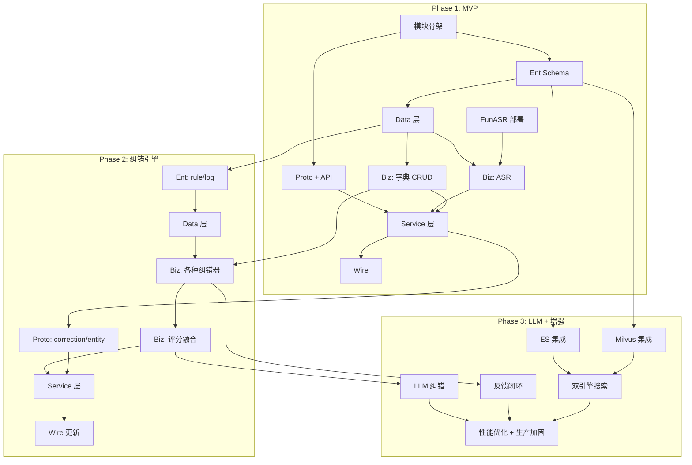

# Evie — 开发路线图

日期：2026-08-04
状态：草案
依赖：[0-架构总览](./0-架构总览-语音智能引擎.md)

---

## 一、总览

Evie 分三期交付，每期 3-4 周。

```
Phase 1 (MVP)          Phase 2 (Core)           Phase 3 (Advanced)
─────────────────     ────────────────────      ─────────────────────
ASR 识别 + 热词        纠错引擎 + 字典中心        LLM 纠错 + 反馈闭环
+ 基础字典              + 实体识别 + 组织同步       + 语义检索 + 性能优化
4 周                   4 周                      3 周
```

---

## 二、Phase 1 — MVP（第 1-4 周）

> **目标**：语音输入 → ASR 识别 → 标准文本输出（端到端跑通）

### 实现进度（截至 2026-08）

ASR 核心链路已完成：

| 状态 | 内容 |
|------|------|
| ✅ | ASR 供应商抽象（pkg/asr 开源包：接口 + 注册中心 + audio 工具） |
| ✅ | FunASR（HTTP 批量 SenseVoice）+ 讯飞 IAT（WebSocket 流式）双引擎接入 |
| ✅ | 整段/流式分场景路由（整段 funasr，流式讯飞） |
| ✅ | 流式识别（WebSocket `/evie/v1/asr/stream` + 前端双入口） |
| ✅ | 音频上传文件中心（WAV）+ 记录保存 + ReRecognize 重试 |
| ✅ | FunASR 服务工程化（`app/funasr/service`，Docker/K8s 部署） |

> 详细差异见 [1-ASR语音识别服务](./1-ASR语音识别服务.md) 第十章「实现现状」。

### 2.1 后端

| # | 任务 | 工作量 | 依赖 |
|---|------|:---:|------|
| 1.1 | 创建 `backend-service/app/evie` 模块骨架 | 0.5d | — |
| 1.2 | Proto 定义：`asr.proto`、`hotword.proto`、`common.proto` | 1d | — |
| 1.3 | `buf generate` → 生成 API 代码 | 0.5d | 1.2 |
| 1.4 | Ent Schema: `dictionary_word`、`dictionary_alias`、`asr_record`、`hotword` | 1d | — |
| 1.5 | Atlas 迁移脚本 + `make migrate` | 0.5d | 1.4 |
| 1.6 | Data 层：字典 repo、ASR record repo、热词 repo | 2d | 1.4 |
| 1.7 | Biz 层：ASR 编排（采集→预处理→路由Provider→识别→热词增强） | 3d | 1.6 |
| 1.8 | Biz 层：字典基本 CRUD | 1d | 1.6 |
| 1.9 | Ent Schema: `asr_provider_config`、`data_source` | 0.5d | 1.4 |
| 1.10 | Biz 层：ASR Provider 路由 + 多引擎适配（FunASR/Whisper/讯飞/阿里云） | 2d | 1.7 |
| 1.11 | Biz 层：数据源集成（Fetcher + Mapper + Sync） | 1.5d | 1.6 |
| 1.12 | Service 层：ASR Recognize、StreamRecognize | 1d | 1.10 |
| 1.13 | Service 层：热词 CRUD + Provider 配置管理 | 1d | 1.8, 1.9 |
| 1.14 | Service 层：数据源管理 + 手动触发同步 | 0.5d | 1.11 |
| 1.15 | Wire 依赖注入组装 | 0.5d | 1.12 |
| 1.16 | FunASR Server 部署 + Go Client 对接 | 2d | 1.10 |
| 1.17 | 音频预处理（降噪/VAD）基本实现 | 1.5d | 1.10 |
| 1.18 | 接入平台认证（JWT 提取 tenant_id） | 1d | 1.12 |
| 1.19 | Mock 数据（2 个租户，各 50+ 字典词 + Provider 配置） | 1d | 1.6 |
| 1.20 | `make api` / `make ent` / `make wire` 集成到 CI | 0.5d | 1.15 |

### 2.2 前端

| # | 任务 | 工作量 |
|---|------|:---:|
| 1.21 | API 文件：`src/api/evie/asr.ts`、`dictionary.ts`、`provider.ts`、`data_source.ts` | 1d |
| 1.22 | 字典管理页：list + 新增/编辑 drawer | 2d |
| 1.23 | 热词管理页：list + 新增/编辑 drawer | 1d |
| 1.24 | ASR 供应商配置页（选择引擎 + 连接参数） | 1d |
| 1.25 | 数据源管理页（配置三方接口 + 映射字段） | 1.5d |
| 1.26 | 数据源预览页（试转换结果） | 1d |
| 1.27 | 语音输入组件（录制/停止/波形） | 2d |
| 1.28 | ASR 结果展示页（原始文本 + 置信度 + Provider 标识） | 1d |
| 1.29 | Locale 中英文 | 0.5d |
| 1.30 | 路由 + 菜单注册 | 0.5d |

### 2.3 验证

| # | 验证项 | 验收标准 |
|---|-------|---------|
| V1 | 端到端 | 语音输入 → 文本输出，延迟 < 3s |
| V2 | 租户隔离 | 租户 A 的 Provider/字典/热词不影响租户 B |
| V3 | Provider 切换 | 切换 ASR 引擎后立即生效 |
| V4 | 基础纠错 | 字典中的固定词能准确替换 |

---

## 三、Phase 2 — 纠错引擎（第 5-8 周）

> **目标**：ASR 文本 → 纠错引擎 → 企业标准语言（规则 + 拼音 + 实体）

### 3.1 后端

| # | 任务 | 工作量 | 依赖 |
|---|------|:---:|------|
| 2.1 | Proto: `correction.proto`、`entity.proto` | 1d | — |
| 2.2 | Ent Schema: `correction_rule`、`correction_log` | 0.5d | — |
| 2.3 | Atlas 迁移 | 0.5d | 2.2 |
| 2.4 | Data 层：规则 repo、日志 repo | 1d | 2.2 |
| 2.5 | Biz 层：规则纠错器（RuleCorrector） | 1d | — |
| 2.6 | Biz 层：拼音纠错器（PinyinCorrector） | 2d | 3-字典中心 |
| 2.7 | Biz 层：编辑距离纠错器（EditDistanceCorrector） | 1d | — |
| 2.8 | Biz 层：企业实体纠错器（EntityCorrector） | 2d | 3-字典中心 |
| 2.9 | Biz 层：分词 + 拼音转换 + 实体检测（预处理管线） | 2d | — |
| 2.10 | Biz 层：评分融合 + 置信度决策 | 1.5d | 2.5-2.8 |
| 2.11 | Biz 层：实体识别服务（NER） | 1.5d | 2.8 |
| 2.12 | Biz 层：别名自动生成算法 | 1d | 3-字典中心 |
| 2.13 | Service 层：CorrectionService + EntityService | 1d | 2.10-2.11 |
| 2.14 | Wire 更新 | 0.5d | 2.13 |
| 2.15 | MySQL 别名索引优化（前缀/拼音查询） | 0.5d | — |
| 2.16 | 组织架构同步（调用租户底座 API） | 1.5d | 1-租户底座 |
| 2.17 | 字典批量导入（CSV/Excel） | 1d | 1.8 |
| 2.18 | 测试：biz 规则 + 权限 + 租户隔离 | 2d | — |

### 3.2 前端

| # | 任务 | 工作量 |
|---|------|:---:|
| 2.19 | API 文件：`correction.ts`、`entity.ts` | 0.5d |
| 2.20 | 纠错规则管理页 | 1.5d |
| 2.21 | 纠错结果展示（原文 vs 修正 + diff 高亮） | 1.5d |
| 2.22 | 字典批量导入页 | 1d |
| 2.23 | 同步组织架构入口 + 结果展示 | 1d |
| 2.24 | Locale 更新 | 0.5d |

### 3.3 验证

| # | 验证项 | 验收标准 |
|---|-------|---------|
| V4 | 规则纠错 | 固定规则 100% 命中 |
| V5 | 拼音纠错 | 同音错误纠正率 > 90% |
| V6 | 实体匹配 | "小田" → "田华" 准确率 > 95% |
| V7 | 组织同步 | 同步后字典自动生成别名 |

---

## 四、Phase 3 — LLM + 智能增强（第 9-11 周）

> **目标**：LLM 辅助纠错 + 反馈闭环 + 向量检索 + 生产优化

### 4.1 后端

| # | 任务 | 工作量 | 依赖 |
|---|------|:---:|------|
| 3.1 | Ent Schema: `correction_feedback`、`dict_sync_log` | 0.5d | — |
| 3.2 | Biz 层：LLM 纠错器（LLMCorrector + Prompt 模板） | 2d | 2.10 |
| 3.3 | LLM Client 封装（Qwen / DeepSeek / 平台模型） | 1.5d | — |
| 3.4 | Biz 层：用户反馈闭环（写入字典/更新权重） | 1d | 2.16 |
| 3.5 | Data 层：Elasticsearch 集成（字典搜索） | 2d | — |
| 3.6 | Data 层：Milvus 集成（向量语义检索） | 2d | — |
| 3.7 | ES + Milvus 双引擎搜索编排 | 1.5d | 3.5, 3.6 |
| 3.8 | 字典生命周期管理（停用→级联失效） | 1d | — |
| 3.9 | 纠错质量指标（准确率/召回率 dashboard 数据） | 1d | — |
| 3.10 | 套餐配额对接（ASR 调用次数/纠错次数/字典容量） | 1d | 1-配额 |
| 3.11 | 操作审计接入 | 0.5d | 1-审计 |
| 3.12 | 性能优化：缓存预热、批量查询、连接池 | 2d | — |
| 3.13 | 测试覆盖 + 压测 | 2d | — |

### 4.2 前端

| # | 任务 | 工作量 |
|---|------|:---:|
| 3.14 | 纠错确认弹窗（低置信度二次确认） | 1.5d |
| 3.15 | 纠错反馈入口（用户标错） | 1d |
| 3.16 | 使用统计仪表盘 | 1.5d |
| 3.17 | Locale 最终更新 | 0.5d |

### 4.3 验证

| # | 验证项 | 验收标准 |
|---|-------|---------|
| V8 | LLM 纠错 | 复杂场景正确率 > 85% |
| V9 | 反馈闭环 | 用户纠正后下次自动纠正 |
| V10 | 向量检索 | "金种子" 语义匹配 "金种籽" |
| V11 | 性能 | 纠错 P99 < 2s（非 LLM 路径 < 200ms） |
| V12 | 租户隔离 | 所有层级（DB/Redis/ES/Milvus） |

---

## 五、依赖关系总览



---

## 六、与平台功能清单的对接

在 `docs/architecture/4-6-治理-开发功能清单.md` 中新增：

```
## N. 产品服务 - Evie 语音智能引擎

### N.1 Phase 1: MVP
| [ ] | P1 | Evie 模块骨架 + Proto + Ent Schema | 0-架构总览 |
| [ ] | P1 | ASR 识别（FunASR Client + 热词增强） | 1-ASR |
| [ ] | P1 | 基础字典 CRUD + 别名自动生成 | 3-字典 |
| [ ] | P1 | 前端：字典管理 + 热词管理 + 语音输入 | — |

### N.2 Phase 2: 纠错引擎
| [ ] | P1 | 五路纠错器 + 评分融合 + 置信度决策 | 2-纠错引擎 |
| [ ] | P1 | 实体识别 + 组织架构同步 | 2、3 |
| [ ] | P1 | 前端：纠错规则管理 + 结果 diff 展示 | — |

### N.3 Phase 3: 增强
| [ ] | P2 | LLM 纠错 + 反馈闭环 | 2 |
| [ ] | P2 | ES + Milvus 双引擎检索 | 3 |
| [ ] | P2 | 配额对接 + 操作审计 + 性能优化 | 4 |
```

---

## 七、关键风险与缓解

| 风险 | 概率 | 影响 | 缓解措施 |
|------|:---:|------|---------|
| FunASR 部署复杂 | 中 | 高 | 提前 docker-compose 验证；备选 Whisper API |
| 拼音纠错准确率不达标 | 中 | 中 | Phase 2 加大测试数据；Phase 3 LLM 兜底 |
| ES/Milvus 运维复杂度 | 低 | 中 | Phase 1-2 先用 MySQL，Phase 3 切 |
| 冷启动无字典数据 | 高 | 中 | 组织架构自动同步 + 系统字典预置 |
| LLM 延迟不可控 | 中 | 低 | 仅低置信度走 LLM（<5% 流量），其他用规则 |

---

> 路线图完。全部 8 份开发文档已拆解完毕。
>
> 文档索引：
> - [0-架构总览-语音智能引擎](./0-架构总览-语音智能引擎.md)
> - [1-ASR语音识别服务](./1-ASR语音识别服务.md)
> - [2-智能纠错引擎](./2-智能纠错引擎.md)
> - [3-企业知识字典中心](./3-企业知识字典中心.md)
> - [4-多租户数据隔离设计](./4-多租户数据隔离设计.md)
> - [5-API接口契约](./5-API接口契约.md)
> - [6-数据模型设计](./6-数据模型设计.md)
> - [7-开发路线图](./7-开发路线图.md)
