<!-- NOTE:2026-08-25
本文档为产品设计说明书（V1.0），于 2026-08-25 M0-M11 重构前编写。
当前产品实现以 [8-词库中心与文本增强引擎开发计划](./development/8-词库中心与文本增强引擎开发计划.md) 为事实来源。
主要差异：
- 「企业知识字典中心」已重构为「词库中心」（7 页：词库/词条/关系/分类/版本/冲突/变更记录）
- 「智能纠错引擎」已重构为「文本增强引擎」（8 层流水线：清洗/口水词/词库匹配/别名解析/确定性替换/拼音/模糊/上下文）
- 热词已彻底删除（融入词条关系 ALIAS）
- 旧字典中心、纠错引擎、API 接口契约文档已归档至 docs/archive/services-evie-platform-202508-pre-restructure/
- 实际服务调用路径为 /evie/v1/...（非本文档示例的 /api/v1/evie/...）
本说明书作为产品业务背景资料保留，适用于了解产品价值与场景；具体技术实现以重构后文档为准。
-->

# 企业语音智能引擎系统说明书

版本：

```
V1.0
```

文档类型：

```
产品设计说明书
```

---

# 第一章 项目概述

## 1.1 项目背景

随着企业数字化和人工智能技术的发展，AI Agent 正逐渐成为企业信息交互和业务执行的重要入口。

传统企业软件：

```
用户
 |
菜单
 |
页面
 |
表单
 |
提交
 |
业务处理
```

正在向：

```
用户
 |
自然语言
 |
AI Agent
 |
业务系统执行
```

转变。

未来企业员工不再需要：

* 查找系统菜单
* 填写复杂表单
* 学习软件操作流程

而是直接通过：

* 文字
* 语音

向 AI 助手描述需求。

例如：

员工：

> 给技术部小田申请200个种籽奖励，因为今天攻克了一个技术难点。

AI Agent需要理解：

```json
{
  "动作": "申请奖励",
  "对象": "田华",
  "部门": "技术部",
  "数量":200,
  "单位":"颗种籽",
  "原因":"攻克技术难点"
}
```

但是现实环境中：

人的语言：

* 口语化
* 方言化
* 简称化
* 同音字
* 企业内部黑话

导致普通 ASR 无法满足企业应用。

例如：

用户：

> 给技术部小田申请200个种子，今天功课了一个技术难点。

ASR输出：

```
给技术部小田申请200个种子，今天功课了一个技术难点
```

问题：

| 原始内容 | 问题      |
| ---- | ------- |
| 小田   | 不知道具体员工 |
| 种子   | 企业术语错误  |
| 个种子  | 量词错误    |
| 功课   | 同音错误    |

企业真正需要：

```
语音
 ↓
ASR识别
 ↓
企业知识增强
 ↓
语义纠错
 ↓
标准业务语言
 ↓
AI Agent
```

因此，需要建设：

> 企业级ASR语音智能识别系统。

---

# 1.2 系统定位

## 1.2.1 产品定位

本系统不是传统语音识别工具。

而是：

> 企业AI智能体的语音认知基础设施。

定位模型：

```
                 企业AI应用层

        ┌─────────────────────┐
        │ AI Agent             │
        │ 智能助手/数字员工      │
        └──────────┬──────────┘


                 ↑

        标准化企业语言


                 ↑


        ┌─────────────────────┐
        │ ASR智能增强平台       │
        │                     │
        │ 语音识别             │
        │ 语义纠错             │
        │ 企业知识增强          │
        │ 实体识别             │
        └──────────┬──────────┘


                 ↑


        用户自然语音

```

---

# 1.3 建设目标

## 目标一：实现自然语言输入

支持：

* Web端
* App
* 小程序
* 企业IM
* 电话语音

输入：

```
语音
```

输出：

```
结构化文本
```

---

## 目标二：解决企业专有名词识别

支持：

### 人员

例如：

```
小田
田经理
田工
```

统一：

```
田华
```

---

### 组织

例如：

```
技术部
技术研发
研发部
```

统一：

```
技术研发部
```

---

### 产品

例如：

```
金种子
金种籽
```

统一：

```
金种籽
```

---

## 目标三：支持多企业 SaaS 模式

系统必须支持：

```
平台

  |
  |
租户A

  |
  |
租户B

  |
  |
租户C

```

不同企业：

* 数据隔离
* 字典隔离
* 权限隔离

---

# 1.4 应用场景

---

## 场景一：企业管理系统

员工：

> 给技术部小田申请200颗种籽

系统：

自动识别：

```
员工:
田华

部门:
技术部

数量:
200

类型:
金种籽申请

```

---

## 场景二：企业知识问答

老板：

> 我们上个月销售冠军是谁？

语音：

↓

ASR

↓

纠错

↓

AI Agent查询

---

## 场景三：企业流程审批

员工：

> 帮我申请三天年假

识别：

```
流程:
请假申请

类型:
年假

天数:
3
```

---

## 场景四：会议记录

会议：

> 张经理负责客户交付问题

系统：

识别：

```
负责人:
张经理

事项:
客户交付

任务:
处理问题

```

---

# 第二章 系统总体架构

# 2.1 总体架构设计

整体采用：

```
端
+
AI识别
+
知识增强
+
智能纠错
+
Agent接口
```

架构：

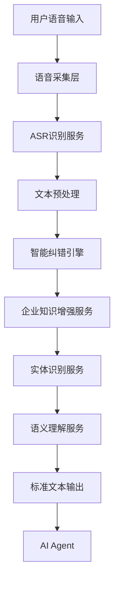

---

# 2.2 系统核心模块

## 1. 语音接入服务

职责：

负责：

* 音频采集
* 上传
* 转码
* 流式传输

支持：

```
wav
mp3
pcm
opus
```

---

## 2. ASR识别服务

职责：

将：

```
声音
```

转换：

```
文本
```

输入：

```
audio.wav
```

输出：

```json
{
"text":
"我要给技术部小田申请200个种子"
}
```

---

## 3. 文本纠错引擎

核心模块。

负责：

* 同音纠错
* 拼音纠错
* 企业词纠错
* 上下文纠错

---

## 4. 企业知识增强服务

负责：

加载：

* 企业员工
* 部门
* 岗位
* 产品
* 制度

---

## 5. 实体识别服务

识别：

```
人
组织
时间
数量
产品
事件
```

---

## 6. AI Agent接口

输出：

标准化信息：

```json
{
"text":
"给技术研发部田华申请200颗金种籽",
"entities":[]
}

```

---

# 2.3 核心数据流

```mermaid
sequenceDiagram

participant U as 用户
participant ASR as ASR服务
participant C as 纠错引擎
participant D as 企业字典
participant AI as AI Agent


U->>ASR:
发送语音

ASR->>C:
原始文本

C->>D:
查询企业知识

D-->>C:
返回候选词

C->>AI:
标准文本

AI-->>U:
执行结果

```

---

（未完）

下一部分继续输出：

# 第三章 ASR语音识别服务详细设计

包含：

1. ASR模型选择
2. 开源方案对比（Whisper/FunASR/SenseVoice）
3. 商业API方案
4. 实时流式识别设计
5. 热词增强
6. 声学模型优化
7. 企业场景适配

然后进入最核心部分：

# 第四章 企业智能纠错引擎设计

包括：

* 纠错算法
* 字典匹配
* 拼音算法
* BM25
* 向量检索
* LLM纠错
* 置信度模型
* 自动确认机制

# 第三章 ASR语音识别服务详细设计

## 3.1 ASR服务定位

ASR（Automatic Speech Recognition，自动语音识别）服务负责完成：

> 将用户自然语音转换为基础文本，是整个语音智能链路的第一层感知能力。

需要明确：

**ASR不是最终理解层。**

企业场景中：

```
声音识别
≠
业务理解
```

因此 ASR 服务输出的是：

> 高准确率、低延迟、可供后续纠错增强的原始文本。

---

# 3.2 ASR处理流程

整体流程：

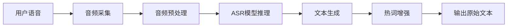

---

# 3.3 音频采集设计

## 3.3.1 输入方式

支持：

| 方式        | 应用场景    |
| --------- | ------- |
| WebRTC    | 网页实时对话  |
| WebSocket | AI助手    |
| APP SDK   | 移动端     |
| 小程序       | 企业微信/微信 |
| 电话流       | 客服场景    |
| 会议设备      | 会议记录    |

---

## 3.3.2 音频格式

推荐统一：

```
PCM
16KHz
16bit
单声道
```

原因：

语音模型训练通常基于：

```
16kHz mono audio
```

---

# 3.4 音频预处理

## 功能

### 1. 降噪

企业环境：

* 办公室
* 会议室
* 工厂

存在：

* 人声干扰
* 空调声
* 机械声

采用：

* RNNoise
* DeepFilterNet

---

### 2. 自动增益

解决：

用户：

```
距离麦克风远
声音小
```

自动调整：

```
volume normalization
```

---

### 3. VAD语音检测

Voice Activity Detection

作用：

判断：

```
有没有人在说话
```

避免：

无效音频进入ASR。

流程：

```
录音

↓

VAD

↓

发现声音

↓

发送ASR

```

---

# 3.5 ASR模型选择

根据企业级应用，推荐：

## 方案一：FunASR

阿里巴巴集团 开源生态。

优势：

* 中文优化好
* 企业场景成熟
* 支持热词
* 支持流式识别

适合：

> 企业内部私有化部署。

---

## 方案二：Whisper

OpenAI Whisper模型。

优势：

* 多语言
* 鲁棒性强
* 开源模型丰富

不足：

中文企业专有词：

需要后处理增强。

---

## 方案三：SenseVoice

优势：

* 中文表现优秀
* 情绪识别
* 多语言

适合：

会议、客服。

---

# 3.6 推荐技术路线

结合你的企业AI平台：

推荐：

```
第一阶段：

FunASR
+
企业热词增强
+
自研纠错


第二阶段：

FunASR
+
Whisper Ensemble


第三阶段：

企业领域ASR微调

```

---

# 3.7 ASR热词增强设计

这是企业场景非常重要的能力。

普通ASR：

输入：

```
金种籽
```

可能：

```
金种子
```

原因：

模型不知道企业词。

解决：

增加：

```
Hotword Dictionary
```

---

## 热词库结构

例如：

```json
{
 "word":"金种籽",
 "weight":10,
 "category":"product"
}
```

---

类别：

```
人员

组织

产品

企业术语

行业术语

```

---

# 3.8 热词动态加载

由于 SaaS 多租户：

不能：

所有企业共享一个热词库。

架构：

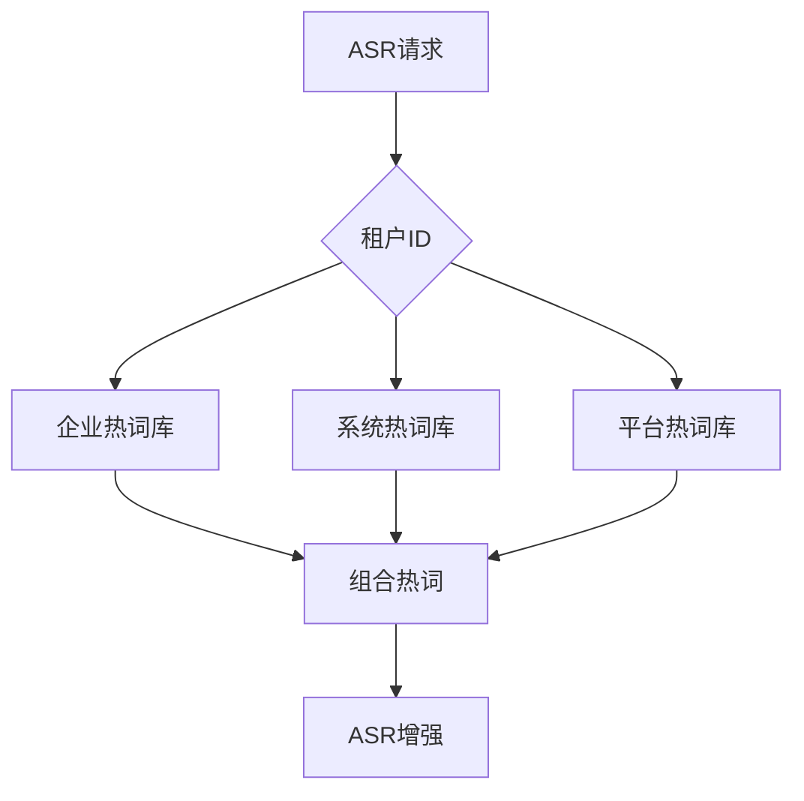

---

# 3.9 ASR输出格式

不要直接输出字符串。

建议：

结构化输出：

```json
{
 "requestId":"xxx",

 "text":
 "我要给技术部小田申请200个种子",

 "segments":[
 {
  "start":0,
  "end":3,
  "text":"我要给技术部小田"
 }
 ],

 "confidence":0.91
}

```

---

# 第四章 企业智能纠错引擎设计（核心）

## 4.1 设计目标

纠错引擎负责：

将：

```
ASR文本

↓

企业标准语言

```

例如：

输入：

```
我要给技术部小田申请200个种子，今天功课了一个技术难点
```

输出：

```
我要给技术部田华申请200颗种籽，今天攻克了一个技术难点
```

---

# 4.2 为什么需要独立纠错引擎

传统方式：

```
ASR
 |
文本
 |
AI Agent
```

问题：

AI Agent收到错误信息。

例如：

```
给小田奖励
```

AI不知道：

小田是谁。

所以增加：

```
ASR

↓

语音智能增强层

↓

AI Agent

```

---

# 4.3 纠错引擎整体架构

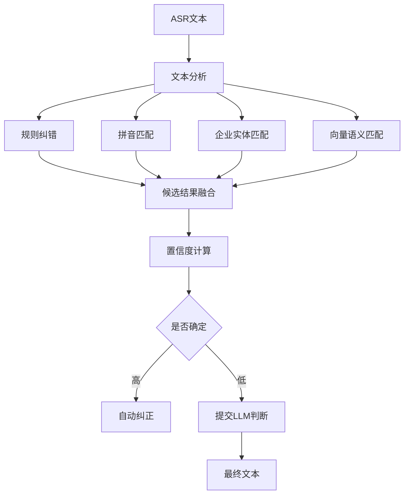

---

# 4.4 纠错层级设计

## 第一层：固定规则纠错

适合：

明确错误。

例如：

```
种子

↓

种籽

```

规则：

```json
{
"种子":
{
"target":"种籽",
"confidence":1
}
}

```

---

应用：

* 产品名称
* 固定术语
* 系统字段

---

# 第二层：拼音纠错

解决：

同音问题。

例如：

```
功课

gong ke

攻克

gong ke

```

算法：

```
ASR文本

↓

拼音转换

↓

候选词查询

↓

上下文评分

```

---

# 第三层：企业实体纠错

这是你的核心。

例如：

用户：

```
小田
```

企业员工：

```
田华

别名:
小田

部门:
技术部

职位:
技术经理

```

匹配：

```
小田

↓

田华

```

---

# 第四层：语义纠错

利用：

LLM。

例如：

输入：

```
今天功课了一个技术难点
```

模型判断：

上下文：

```
技术
难点
完成
```

结果：

```
攻克
```

---

# 4.5 候选词评分模型

综合评分：

```
Score =
0.3*拼音相似度
+
0.3*企业匹配度
+
0.2*上下文匹配度
+
0.2*LLM判断

```

例如：

| 候选 | 评分   |
| -- | ---- |
| 田华 | 0.96 |
| 田涛 | 0.42 |
| 田伟 | 0.31 |

结果：

```
田华
```

---

# 4.6 纠错置信度机制

不能全部自动修改。

设计：

| 置信度     | 处理   |
| ------- | ---- |
| 95%以上   | 自动纠正 |
| 70%-95% | 提示确认 |
| 70%以下   | 保持原文 |

例如：

AI：

> 您说的小田是否是技术部田华？

---

# 4.7 纠错结果输出

标准格式：

```json
{
"original":

"给技术部小田申请200个种子",

"correct":

"给技术部田华申请200颗种籽",

"changes":[

{
"from":"小田",
"to":"田华",
"type":"person"
},

{
"from":"个种子",
"to":"颗种籽",
"type":"dictionary"
}

]

}

```

---

# 第五章 企业知识字典中心设计（核心章节）

## 5.1 企业知识字典中心定位

企业知识字典中心（Enterprise Dictionary Center）是整个 ASR 智能增强系统的核心基础服务。

它负责解决：

> ASR 模型无法理解企业内部专有语言的问题。

普通 ASR：

```
声音
 ↓
文字
```

企业级 ASR：

```
声音
 ↓
文字
 ↓
企业知识映射
 ↓
标准企业语言
```

---

## 5.1.1 为什么需要企业字典中心

企业内部存在大量非公开语言：

例如：

### 人员简称

员工实际姓名：

```
张伟
```

企业内部：

```
老张
张工
伟哥
张经理
```

---

### 产品名称

系统标准：

```
金种籽
```

员工口语：

```
金种子
种子
积分
奖励
```

---

### 部门名称

系统：

```
技术研发中心
```

员工：

```
技术部
研发部
技术团队
开发组
```

---

### 企业黑话

例如：

```
客户池
大单
重点客户
老客户
A类客户
```

这些内容：

通用 ASR 不可能知道。

因此需要：

> 企业知识字典作为 AI Agent 的企业语言认知层。

---

# 5.2 字典体系总体设计

考虑你的 SaaS 多租户模式，采用四级字典体系。

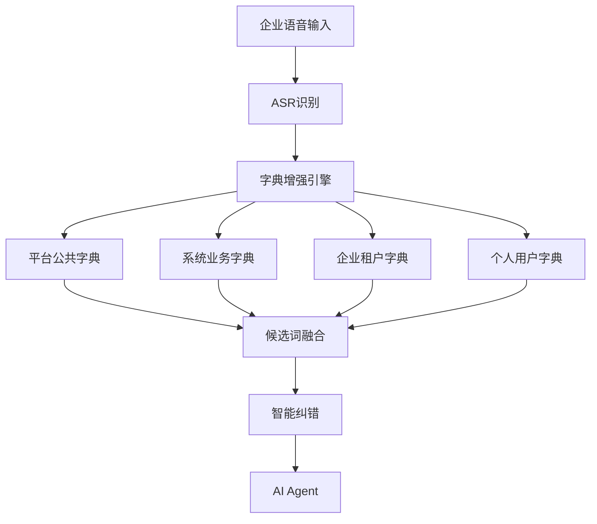

---

# 5.3 四级字典模型

## 5.3.1 平台公共字典（Platform Dictionary）

## 定义

由平台运营方维护。

适用于所有租户。

例如：

```
人工智能
AI智能体
大模型
机器学习
数字员工
```

---

## 特点

| 属性   | 说明    |
| ---- | ----- |
| 归属   | 平台    |
| 共享   | 所有企业  |
| 修改权限 | 平台管理员 |
| 租户可见 | 只读    |

---

## 示例数据

```json
{
"type":"platform",

"word":"人工智能",

"alias":[
"AI",
"智能化"
],

"category":"technology"

}
```

---

# 5.4 系统业务字典（System Dictionary）

## 定义

由具体业务系统维护。

例如：

你的：

“金种籽量化管理系统”

拥有：

```
金种籽
黑种籽
元宝
产值
指令官
福利兑现
```

---

## 特点

```
平台
 |
产品系统
 |
企业租户
```

例如：

企业使用：

金种籽系统

自动获得：

```
金种籽业务词库
```

---

## 示例

```json
{
"type":"system",

"system":"jinzhongzi",

"word":"金种籽",

"aliases":[

"金种子",

"种子积分"

]

}

```

---

# 5.5 企业租户字典（Tenant Dictionary）

这是整个系统最重要部分。

## 定义

每个企业独立维护。

例如：

企业A：

```
重庆倍多客科技有限公司
```

员工：

```
熊龙军
田华
张三
```

组织：

```
技术研发部
产品部
市场部
```

---

企业B：

```
另外一家企业
```

完全不同：

```
王强
李敏
研发中心
```

---

因此：

必须：

```
tenant_id隔离
```

---

# 5.6 企业字典来源设计

企业字典不是全部人工维护。

采用：

## 自动生成 + 人工维护

架构：

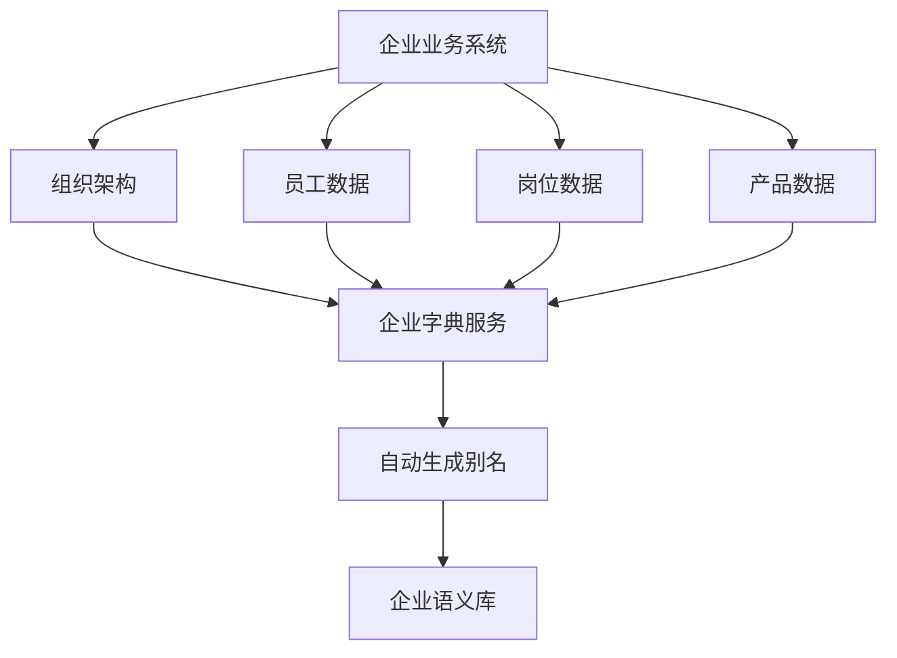

---

# 5.7 企业组织自动同步

## 5.7.1 同步对象

### 部门

例如：

数据库：

```
department

id:
1001

name:
技术研发部

parent:
研发中心

```

自动生成：

```
技术研发部

技术部

研发部

技术团队

研发团队

```

---

### 员工

数据库：

```
employee

name:
田华

department:
技术研发部

position:
技术经理

```

生成：

```
田华

小田

田经理

田工

技术田

```

---

### 岗位

例如：

```
技术负责人

技术经理

开发工程师
```

生成：

```
技术负责人

技术头

技术Leader

```

---

# 5.8 员工别名自动生成算法

## 输入

员工信息：

```json
{
"name":"田华",

"department":"技术研发部",

"position":"技术经理"

}

```

---

## 生成规则

### 规则1：姓名简称

```
田华

↓

小田
```

---

### 规则2：职位组合

```
田华 + 经理

↓

田经理

```

---

### 规则3：部门组合

```
技术研发部 + 田华

↓

技术田华

```

---

### 规则4：拼音索引

生成：

```
tianhua

tian h

th

```

---

最终：

```json
{

"entity":"person",

"name":"田华",

"aliases":[

"小田",

"田经理",

"田工",

"tianhua"

]

}

```

---

# 5.9 企业自定义字典

企业管理员可以维护：

## 企业特殊叫法

例如：

```
客户成功部
```

企业内部：

```
CS团队

客户部

成功团队

```

---

## 自定义规则

例如：

```
老王
=
王强

```

---

## 黑名单词

防止误识别。

例如：

```
测试员工

离职员工

```

禁止匹配。

---

# 5.10 用户个人字典

个人级增强。

例如老板：

```
老李
```

实际：

```
李总
```

销售：

```
王姐
```

实际：

```
王芳
```

---

权限：

```
用户自己维护
```

优先级：

```
个人 > 企业 > 系统 > 平台
```

---

# 5.11 字典优先级设计

当多个字典出现冲突：

例如：

平台：

```
苹果 = Apple公司
```

企业：

```
苹果 = 苹果产品
```

采用优先级：

```
用户个人

    >

企业租户

    >

系统业务

    >

平台公共

```

---

# 5.12 字典匹配流程

```mermaid
sequenceDiagram


participant ASR
participant Engine
participant Personal
participant Tenant
participant System
participant Platform


ASR->>Engine:
原始文本


Engine->>Personal:
查询个人词库


Engine->>Tenant:
查询企业词库


Engine->>System:
查询业务词库


Engine->>Platform:
查询公共词库


Engine->>Engine:
融合评分


Engine->>ASR:
返回标准文本

```

---

# 5.13 字典数据库设计

## dictionary_word

核心词表。

```sql
CREATE TABLE dictionary_word (

id bigint,

tenant_id bigint,

word varchar(128),

type varchar(32),

category varchar(32),

status int,

create_time datetime

);

```

---

字段说明：

| 字段        | 说明   |
| --------- | ---- |
| tenant_id | 租户   |
| word      | 标准词  |
| type      | 字典类型 |
| category  | 分类   |
| status    | 状态   |

---

# dictionary_alias

别名表。

```sql
CREATE TABLE dictionary_alias (

id bigint,

word_id bigint,

alias varchar(128),

pinyin varchar(256),

weight decimal(5,2)

);

```

---

例如：

| alias | 标准 |
| ----- | -- |
| 小田    | 田华 |
| 种子    | 种籽 |

---

# 5.14 搜索索引设计

由于企业词库可能：

百万级。

不能只查 MySQL。

采用：

## Elasticsearch

用于：

关键词匹配。

---

## Milvus

用于：

语义匹配。

例如：

输入：

```
金种子
```

向量搜索：

```
金种籽
```

---

架构：

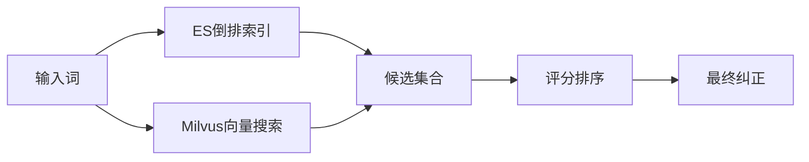

---

# 5.15 多租户隔离设计

## 数据隔离

所有企业数据：

必须包含：

```
tenant_id
```

例如：

```
dictionary_word

tenant_id=10001


dictionary_word

tenant_id=10002

```

查询：

必须：

```
where tenant_id=当前租户
```

---

## 缓存隔离

Redis：

错误：

```
dictionary:user:田华
```

正确：

```
dictionary:{tenantId}:田华
```

---

## 向量库隔离

Milvus：

方案：

### Collection隔离

```
tenant_10001_dictionary

tenant_10002_dictionary

```

适合：

大型企业。

---

### metadata隔离

统一Collection：

```
dictionary

metadata:

{
tenant_id:10001
}

```

适合：

SaaS平台。

推荐：

第二种。

---

# 5.16 本章总结

企业知识字典中心最终形成：

```
              企业AI Agent

                    ↑


          智能纠错引擎


                    ↑


          企业知识字典中心


        ┌──────────────┐

        平台字典

        系统字典

        企业字典

        用户字典

        └──────────────┘


                    ↑


       企业组织/业务数据

```

它是企业 ASR 系统区别于普通语音识别系统的核心竞争能力。

继续输出《企业级ASR语音智能识别系统说明书》。

---

# 第六章 智能纠错引擎详细设计（核心技术章节）

## 6.1 智能纠错引擎定位

智能纠错引擎（AI Correction Engine）是 ASR 系统与企业 AI Agent 之间的关键语义增强层。

它的核心职责：

> 将 ASR 产生的“不准确文本”转换为符合企业业务语境的标准化文本。

---

整体链路：

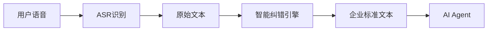

---

# 6.2 为什么需要独立纠错引擎

## 普通语音系统

```text
语音
 ↓
ASR
 ↓
文本
```

问题：

ASR只解决：

> 听到了什么。

不解决：

> 企业真正想表达什么。

---

## 企业智能语音系统

```text
语音

 ↓

ASR

 ↓

纠错引擎

 ↓

企业语义理解

 ↓

AI Agent

```

纠错引擎解决：

* 同音词
* 错别字
* 企业简称
* 人员映射
* 业务术语
* 口语表达

---

# 6.3 智能纠错整体架构

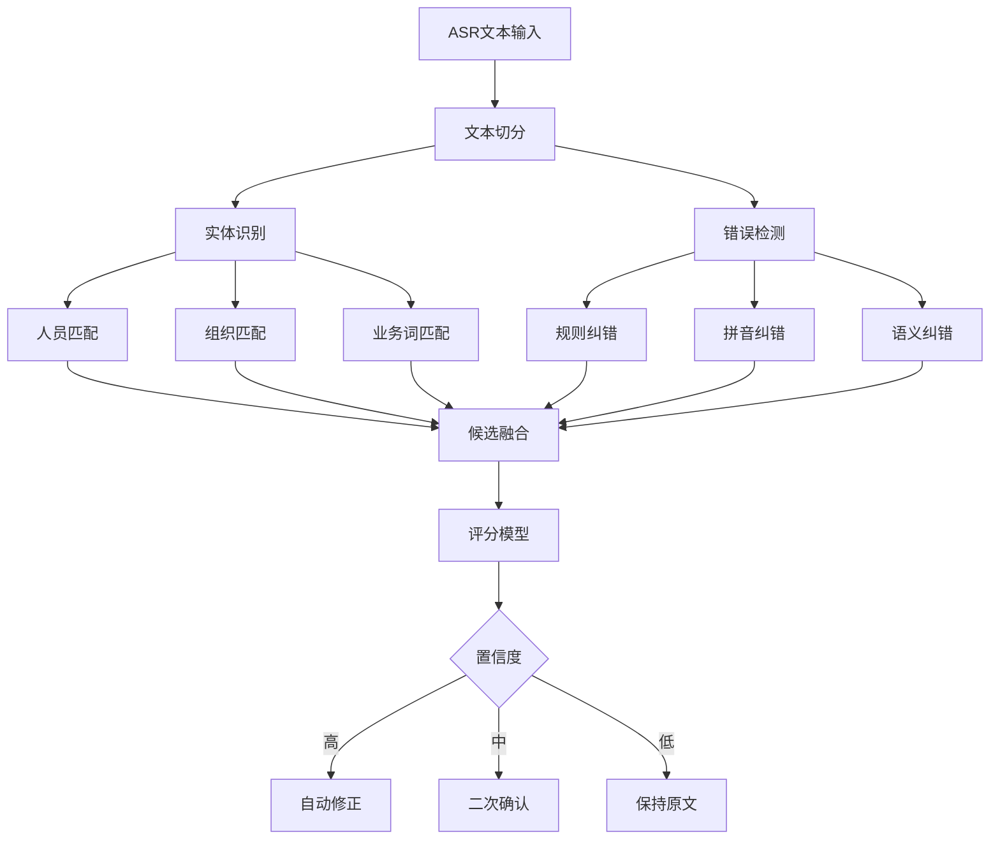

---

# 6.4 纠错处理阶段

系统采用五阶段模型。

---

# 阶段一：文本预处理

输入：

```
我要给技术部小田申请200个种子
```

处理：

## 1. 分词

结果：

```
我要

给

技术部

小田

申请

200

个

种子

```

---

## 2. 拼音转换

例如：

```
种子

↓

zhong zi
```

---

## 3. 实体识别

识别：

```json
{
"技术部":
"组织",

"小田":
"人员",

"200":
"数量",

"种子":
"业务词"
}

```

---

# 阶段二：候选词召回

目标：

找到可能正确答案。

例如：

输入：

```
小田
```

召回：

数据库：

```
田华

田涛

田强

```

---

候选来源：

| 来源     | 说明   |
| ------ | ---- |
| 规则库    | 固定纠错 |
| 企业字典   | 企业实体 |
| ES搜索   | 关键词  |
| Milvus | 语义   |
| LLM    | 智能生成 |

---

# 6.5 规则纠错算法

适合：

确定错误。

例如：

```
种子
```

必须：

```
种籽
```

---

数据结构：

```json
{
"source":"种子",

"target":"种籽",

"type":"business",

"priority":100

}

```

---

执行：

```java
if(dictionary.contains(text)){
 replace()
}

```

---

优点：

* 快
* 稳定
* 可控

缺点：

无法处理复杂语义。

---

# 6.6 编辑距离算法

解决：

文字接近错误。

例如：

```
技术步
技术部
```

计算：

Levenshtein Distance

例如：

```
技术步

技术部

距离=1

```

判断：

相似。

---

公式：

```
distance(a,b)
```

越小：

越可能。

---

应用：

ASR常见错误：

```
倍多客

倍多科

倍多克

```

---

# 6.7 拼音相似匹配算法

中文语音最大问题：

同音。

例如：

```
功课

gong ke

攻克

gong ke

```

流程：

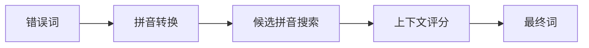

---

示例：

输入：

```
今天功课了一个技术难点
```

候选：

| 词  | 拼音     | 概率   |
| -- | ------ | ---- |
| 功课 | gongke | 0.3  |
| 攻克 | gongke | 0.95 |

上下文：

```
技术难点
+
完成

```

结果：

```
攻克
```

---

# 6.8 企业实体匹配算法（重点）

企业场景最重要。

例如：

用户：

```
给小田申请奖励
```

企业数据库：

员工表：

| 姓名 | 别名 | 部门  |
| -- | -- | --- |
| 田华 | 小田 | 技术部 |
| 田涛 | 小涛 | 销售部 |

---

匹配流程：

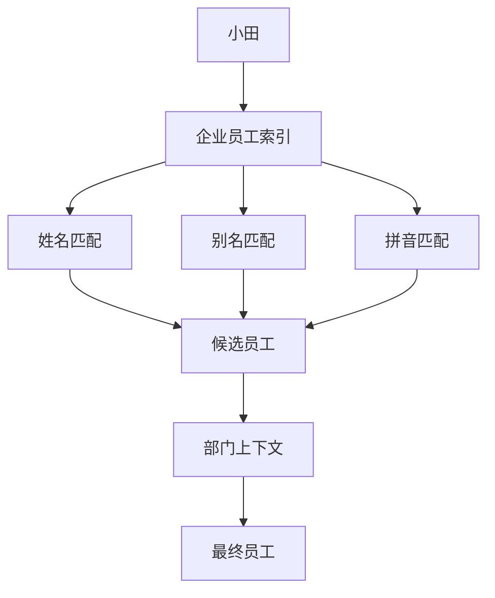

---

评分模型：

```
Score=

0.4*别名匹配

+
0.3*部门匹配

+
0.2*职位匹配

+
0.1*历史习惯

```

---

例如：

上下文：

```
技术部小田
```

候选：

| 员工 | 部门  | 评分   |
| -- | --- | ---- |
| 田华 | 技术部 | 0.96 |
| 田涛 | 销售部 | 0.41 |

输出：

```
田华
```

---

# 6.9 上下文语义纠错

这是传统规则无法解决的问题。

例如：

输入：

```
今天功课一个技术难点
```

如果单词：

```
功课
```

看：

```
学校
课程
考试

```

正确。

但是：

上下文：

```
技术

难点

完成

```

应该：

```
攻克
```

---

因此需要：

上下文模型。

---

# 6.10 LLM辅助纠错设计

## 为什么需要LLM

因为：

企业语言复杂。

规则无法覆盖。

---

LLM职责：

不是替代ASR。

而是：

> 最终语义判断器。

---

流程：

```mermaid
sequenceDiagram


participant C as 纠错引擎
participant L as LLM
participant D as 企业知识库


C->>D:
查询候选词


D-->>C:
返回候选


C->>L:
原文+候选+上下文


L-->>C:
最佳结果


C->>AI:
标准文本

```

---

Prompt设计：

```
你是企业语言纠错助手。

企业:
重庆倍多客科技有限公司

候选词:
小田:
田华

种子:
种籽


原文:
我要给技术部小田申请200个种子


请输出标准文本。
```

---

输出：

```json
{
"text":
"我要给技术部田华申请200颗种籽",

"reason":[

"小田匹配田华",

"种子修正种籽"

]

}

```

---

# 6.11 多模型融合策略

不要全部调用LLM。

成本高。

推荐：

三级策略。

## 一级：规则

命中：

直接返回。

耗时：

<10ms

---

## 二级：算法

包括：

* 拼音
* 编辑距离
* ES
* Milvus

耗时：

20-100ms

---

## 三级：LLM

复杂情况。

耗时：

500ms-2s

---

架构：

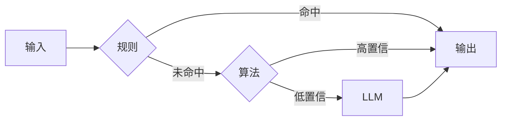

---

# 6.12 置信度体系设计

每次纠错必须输出：

```json
{
"confidence":0.96
}

```

---

等级：

| 范围        | 处理   |
| --------- | ---- |
| 0.95-1    | 自动修改 |
| 0.75-0.95 | 提示确认 |
| <0.75     | 保留原文 |

---

# 6.13 用户反馈闭环

非常重要。

例如：

系统：

```
您说的小田是否为田华？
```

用户：

```
不是，是田涛
```

系统记录：

```json
{
"input":"小田",

"tenant":"xxx",

"correct":"田涛"

}

```

形成：

企业个性化学习。

---

# 6.14 纠错引擎技术组件建议

结合你的技术栈：

| 模块   | 推荐                |
| ---- | ----------------- |
| 规则引擎 | Drools/自研         |
| 全文检索 | Elasticsearch     |
| 向量检索 | Milvus            |
| 缓存   | Redis             |
| 数据库  | MySQL8            |
| LLM  | Qwen/DeepSeek/GPT |
| 服务   | Spring Boot       |

---

# 6.15 本章总结

智能纠错引擎最终能力：

```mermaid
flowchart TD


ASR文本

↓

规则纠错

↓

拼音纠错

↓

企业实体匹配

↓

向量语义匹配

↓

LLM判断

↓

企业标准语言

↓

AI Agent


```

它是整个企业 ASR 产品的核心壁垒。

---

下一章节继续：

# 第七章 企业多租户字典中心与数据隔离设计

重点：

1. SaaS多租户架构
2. Tenant模型设计
3. 数据隔离策略
4. 企业字典权限模型
5. Redis缓存隔离
6. ES索引隔离
7. Milvus向量隔离
8. 企业组织同步机制
9. 字典生命周期管理
10. 安全设计

这一章会结合你目前“金种籽量化管理 SaaS 多租户系统”的实际架构进行设计。
