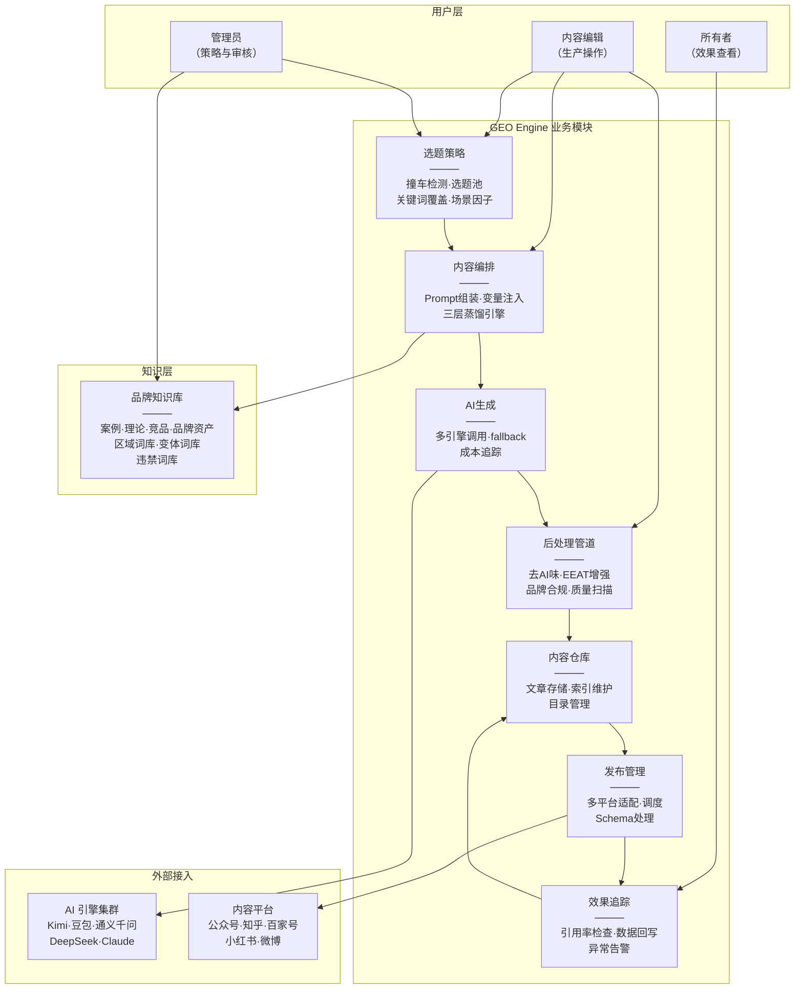
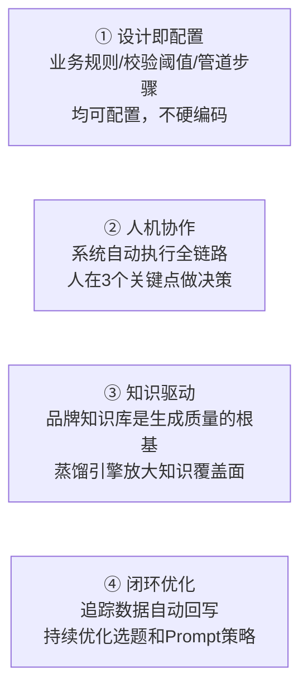

# 01 · 产品概述与系统全景

> GEO Engine 的产品定义、系统模块架构和核心设计原则。

---

## 一、产品愿景

GEO Engine 帮助企业系统化生产面向 AI 搜索引擎的高质量内容。用户建立品牌知识库后，系统自动完成选题规划、Prompt 组装、AI 生成、后处理优化、多平台发布和效果追踪。

### 核心价值

```
投入：品牌知识库（一次性） + 选题决策（人工确认）
  → 系统自动完成：Prompt组装 → AI生成 → 后处理 → 发布 → 追踪
  → 产出：高质量 GEO 内容 + AI 引用率数据
```

---

## 二、系统模块全景



---

## 三、核心用户角色

| 角色 | 核心职责 | 系统使用范围 |
|------|---------|------------|
| **内容编辑（Editor）** | 选题→生成→后处理→发布的日常操作 | 全部业务模块（除知识库管理） |
| **管理员（Admin）** | 品牌知识库维护、内容策略制定、关键审批 | 知识库、选题策略、审批操作 |
| **所有者（Owner）** | 查看 ROI 和效果数据 | 效果追踪、数据看板（只读） |
| **查看者（Viewer）** | 查看文章和数据 | 内容仓库、效果追踪（只读） |

---

## 四、产品架构原则



**① 设计即配置**：违禁词库、质量评分阈值、后处理管道步骤、蒸馏规则——均通过配置管理，新增不需要改代码。

**② 人机协作**：系统自动完成 Prompt 组装→AI 生成→后处理→存储→发布。人工仅在 3 个节点介入——选题确认、内容审阅、发布确认。

**③ 知识驱动**：品牌知识库（案例/理论/品牌资产/变体词库）是生成质量的根基。三层蒸馏引擎（品牌词/关键词/区域词）自动将"大词"拆解为覆盖长尾的"小词"。

**④ 闭环优化**：文章发布后自动追踪 AI 引用率，数据回写到关键词和文章记录，持续优化选题策略和 Prompt 效果。
